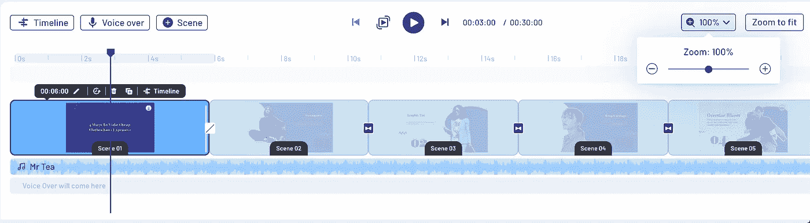

# 如何在浏览器上实现缩放

> 原文：<https://levelup.gitconnected.com/how-to-implement-pinch-to-zoom-on-the-browser-in-angular-6ad56ce54df4>


照片由[西格蒙德](https://unsplash.com/@sigmund?utm_source=medium&utm_medium=referral)在 [Unsplash](https://unsplash.com?utm_source=medium&utm_medium=referral) 上拍摄

在 [Invideo](https://invideo.io/) ，我们一直希望为我们的客户提供最佳的用户体验，让他们能够制作出最好的视频。这其中的一个关键方面是他们围绕时间线的工作流程

对于视频编辑来说，时间线是他们使用的工具中最重要的部分。用户直观地捏他们工作的触摸板或触控板，以查看时间轴缩放是否有效。这是他们创作流程的一个固有部分，肌肉记忆开始发挥作用

然而，在桌面浏览器上缩放缺少内聚支持。这种交互不是任何规范的一部分，这使得它很难实现。然而，有变通办法，所以你可以得到足够好的捏变焦体验

# 问题是

当谈到浏览器及其实现时，触控板作为一个概念是非常奇怪的

```
"Are trackpad events mouse events? Are they touch events? Are they somewhere in between"- Buddha, post enlightenment, getting utterly confused by javascript
```

由于没有新的事件可以对触控板事件进行完全分类，浏览器已经找到了解决方法。2 个手指运动被映射到`scroll`事件。例如，一些操作系统捕获三指触摸，并向浏览器发送右击事件

这与缩放有什么关系？好吧，一些浏览器也采用了关于挤压交互的变通方法。第一个是发送带有设置为真的`ctrlKey`值的`mousewheel`事件。默认行为是缩放整个屏幕，但是通过调用`preventDefault`我们可以覆盖它。底部的参考链接有助于理解这一点

浏览器支持似乎如下:

*   Chrome:从 Chrome M35 开始的✅
*   火狐:火狐 55 以来的✅
*   边缘:✅ [除非你用的是“精密触摸板”](https://developer.microsoft.com/en-us/microsoft-edge/platform/issues/7134034/)
*   Safari 不遵循这一约定，但有另一种解决方法

相反，Safari 使用专有的`GestureEvent`来处理这个问题，当用户进行挤压时，会触发一个`scale`值。更多信息[点击此处](https://developer.mozilla.org/en-US/docs/Web/API/GestureEvent)

# 以角度实现

现在我们已经了解了基础知识，甚至是这种支持的一点历史，让我们深入一些代码。我们如何在 Invideo 中利用这一点，在我们的视频时间轴上实现步进缩放功能。它看起来有点像这样



[变焦 Barabar 变焦](https://en.wikipedia.org/wiki/Jhoom_Barabar_Jhoom)

我们的时间轴是动态的，并且基于 javascript，所以一个指令将是实现我们的缩放逻辑的最佳方式。一个实现应该是这样的。

```
import { Directive, HostListener, Input, OnInit, Output } from '@angular/core';
import { Subject } from 'rxjs';
import { clamp } from 'lodash';@Directive({
  selector: '[appPinchZoom]',
})
export class PinchZoomDirective implements OnInit {
  [@Input](http://twitter.com/Input)() scaleFactor: number = 0.08;
  [@Input](http://twitter.com/Input)() zoomThreshold: number = 9;
  [@Input](http://twitter.com/Input)() initialZoom: number = 5;
  [@Input](http://twitter.com/Input)() debounceTime: number = 100; // in ms
  scale: number;
  [@Output](http://twitter.com/Output)() onPinch$: Subject<number> = new Subject<number>(); constructor() {

  } ngOnInit(): void {
    this.scale = this.initialZoom;
  } @HostListener('wheel', ['$event'])
  onWheel($event: WheelEvent) {
    if (!$event.ctrlKey) return;
    $event.preventDefault();
    let scale = this.scale - $event.deltaY * this.scaleFactor;
    scale = clamp(scale, 1, this.zoomThreshold); this.calculatePinch(scale);
  } calculatePinch(scale: number) {
    this.scale = scale;
    this.onPinch$.next(this.scale));
  }
}
```

该指令计算 Pinch 逻辑，计算标尺何时上升一个步长，并在 pinch 上发送一个输出事件。这里的主要代码在`onWheel`函数中，它接受鼠标滚轮事件，监听 ctrlKey 值，并基于控制灵敏度的比例因子。

使用它非常简单，只需在组件中调用这个指令并设置敏感度因子

```
// timeline.component.html
<div
  class="timeline"
  #timeline
  appPinchZoom
  (onPinch$)="onPinch($event)"
  [scaleFactor]="0.02"
  [zoomThreshold]="9"
  [initialZoom]="5"
>
  <!-- timeline internals go here --></div>// timeline.component.ts
[@Component](http://twitter.com/Component)({
  selector: 'app-timeline-v2',
  templateUrl: './timeline-v2.component.html',
  styleUrls: ['./timeline-v2.component.scss'],
})
export class TimelineComponent{
  constructor(private timelineService: TimelineService) {}
  onPinch(level: number) {
    this.timelineService.updateZoom(level);
  }
}
```

一个敏锐的观察者会发现，我们只为 Chrome、Firefox 和 Edge 实现了这一功能，而它们已经实现了 ctrlKey 修复。那我们去游猎做什么呢？谢谢你，我以为你永远不会问，尽管我一直想告诉你。

```
 @HostListener('gesturestart', ['$event'])
  @HostListener('gesturechange', ['$event'])
  @HostListener('gestureend', ['$event'])
  onGesture($event: any) {
    $event.preventDefault();
    let pinchAmount = $event.scale - 1;
    let scale = this.scale + pinchAmount * this.scaleFactor;
    scale = clamp(scale, 1, this.zoomThreshold + this.thresholdBuffer); this.calculatePinch(scale);
  }
```

你可以走了。是时候通过写博客来吹嘘一下了😉

## 可能的改进

本文涵盖了为浏览器实现收缩缩放的基础知识，但没有太多关于如何最好地使用它的内容。在我们的`onPinch`函数中发生了什么，我们如何在时间轴上渲染我们的元素，这样它就不是 janky 了？我们如何优化性能？请继续关注下一集“维克拉姆探索互联网”，它将很快出现在你附近的一家媒体刊物上

## 参考

[](https://github.com/w3c/uievents/issues/31) [## [建议]增加“缩放”事件问题#31 w3c/uievents

### 此时您不能执行该操作。您已使用另一个标签页或窗口登录。您已在另一个选项卡中注销，或者…

github.com](https://github.com/w3c/uievents/issues/31) [](https://github.com/w3c/pointerevents/issues/206) [## 扩展指针事件以支持原始触控板数据问题#206 w3c/pointerevents

### 从旧的 bug 追踪器:除了鼠标、触控笔和触摸屏之外，我还听说网站需要一个 API 来使用…

github.com](https://github.com/w3c/pointerevents/issues/206) [](https://bugzilla.mozilla.org/show_bug.cgi?id=1052253) [## 1052253 - OS X:缩放手势应该映射到带有控制键的鼠标滚轮，就像 Chrome 一样

### 在核心部件中解决(birunthan ): Cocoa。最后更新于 2020 年 9 月 7 日。

bugzilla.mozilla.org](https://bugzilla.mozilla.org/show_bug.cgi?id=1052253)  [## 手势事件

### 非标准此功能是非标准的，不在标准轨道上。不要在面向的生产现场使用它…

developer.mozilla.org](https://developer.mozilla.org/en-US/docs/Web/API/GestureEvent)