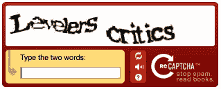

# 如何在 React 应用程序中实现 reCAPTCHA

> 原文：<https://levelup.gitconnected.com/how-to-implement-recaptcha-in-a-react-application-6098c506d750>

## reCAPTCHA 和 React Google reCAPTCHA 库简介


[亚历山大·奈特](https://unsplash.com/@agk42?utm_source=medium&utm_medium=referral)在 [Unsplash](https://unsplash.com?utm_source=medium&utm_medium=referral) 上拍照

验证码*(区分计算机和人类的全自动公共图灵测试)*是一种用于确定用户是人还是机器人的测试。如果您正在处理一个机器人，验证码可以用于以下情况:

*   限制服务注册
*   防止大量购票
*   防止虚假评论

验证码最常见的形式是 reCAPTCHA，这是谷歌的一项服务。我相信你以前在浏览互联网时遇到过这种情况。


在本文中，我们将了解 reCAPTCHA，并学习如何在 React 应用程序中实现它。

# 什么是 reCAPTCHA

> [reCAPTCHA](https://www.google.com/recaptcha/about/) 使用高级风险分析引擎和适应性挑战来阻止恶意软件在您的网站上从事滥用活动。与此同时，合法用户将能够登录、购物、浏览网页或创建账户，而假冒用户将被屏蔽。

最初的 reCAPTCHA v1 挑战发布于 2007 年。它看起来像这样。



[https://developers . Google . com/recaptcha/old/docs/customization](https://developers.google.com/recaptcha/old/docs/customization)

这个版本的 reCAPTCHA 在 2018 年被关闭。

# reCAPTCHA v2 与 reCAPTCHA v3

目前，reCAPTCHA 有两个版本，版本 2 和版本 3。

reCAPTCHA 的最新版本是 2018 年发布的第 3 版。reCAPTCHA v3 根据与机器人交互的可能性为每个请求返回一个分数。根据收到的分数，您可以配置要采取的操作。

虽然 v3 是最新版本，但 reCAPTCHA 更常见的形式是版本 2。这是 2014 年发布的。

reCAPTCHA v2 有两个选项，复选框或不可见。

**复选框** —如下图所示显示一个复选框。


有时，你需要采取额外的步骤来验证你是否是人而不是机器人。这将是一个涉及选择正确图像的挑战。


[https://support.google.com/recaptcha/](https://support.google.com/recaptcha/)

**不可见** —显示徽章，reCAPTCHA 在后台运行。如果它检测到一个机器人，上面的挑战将出现。


[https://www.google.com/recaptcha/about/](https://www.google.com/recaptcha/about/)

# React 应用程序中的实现

现在我们已经了解了什么是 reCAPTCHA，我们将在 React 应用程序中创建一个简单的示例。对于这个例子，我们将使用来自`create-react-app`的样板应用程序。

## 获取谷歌密钥

我们需要的第一件事是从谷歌的 reCAPTCHA 密钥。访问他们的首页[这里](https://www.google.com/recaptcha/about/)，并前往管理控制台。

您将被带到下一页。为您的 reCAPTCHA 键添加标签。然后选择您想要使用的版本。对于我们的例子，我们将使用版本 2 复选框。我们还需要添加我们将使用这个 reCAPTCHA 的任何域名。注册仅限于您在此输入的域，以及任何子域。对于我们的例子，我们将只使用`localhost`在我们的本地环境中进行测试。


创建后，您将收到两个密钥。一个是站点密钥，一个是秘密密钥。客户端需要站点密钥来识别您的注册。密钥将用于在服务器端验证用户的响应。这是一个秘密密钥，不应该在客户端共享。


## 安装 react-google-recaptcha

收到密钥后，我们将把 [react-google-recaptcha](https://www.npmjs.com/package/react-google-recaptcha) 安装到我们的项目中。这是一个可靠的图书馆，每周下载量超过 270，000 次。这个库为我们提供了一个 React 组件，用于 Google reCAPTCHA v2。

`import ReCAPTCHA from ‘react-google-recaptcha’`一经安装。

要渲染组件，您只需要以下道具:

*   **sitekey** —来自 Google 的 API 客户端密钥
*   **onChange** —用户完成验证码时的回调函数

```
import ReCAPTCHA from ‘react-google-recaptcha’const App = () => {
  function onChange(*value*) {
    console.log('Captcha value:', *value*);
  } return (
    <div *className*="App">
      <*ReCAPTCHA
        sitekey*="YOUR-SITE-KEY"
        *onChange*={onChange}
      />
    </div>
  );
};
```

如果我们将上面的代码呈现在屏幕上，我们应该会看到下面的 reCAPTCHA 复选框呈现在我们的应用程序中。


ReCAPTCHA 组件还采用了以下可选属性，以及其他属性:

*   **主题** — ( *亮*或*暗)*改变小工具的主题
*   **大小** —( *紧凑*、*正常*或*不可见)*改变验证码的大小或类型
*   **onErrored** —发生挑战错误时的回调函数
*   **徽章** — ( *右下*、*左下*或*内联)*改变加盖徽章的位置

查看[文档](https://github.com/dozoisch/react-google-recaptcha)以了解更多可选道具。

# 后续步骤

完成验证码挑战后，您将收到一个响应令牌。这个令牌将在两分钟内有效。

有了这个令牌，您将需要向 Google 的服务器发出请求来验证密钥。查看文档[这里](https://developers.google.com/recaptcha/docs/verify)了解更多关于如何做到这一点。

# 结论

感谢阅读！我希望你能够在这篇文章中了解到 CAPTCHA 和 reCAPTCHA。在 React 应用程序中实现它很容易，并且它可以为您的应用程序提供另一层针对僵尸程序的安全性。

要了解如何在 React 应用程序中设置 Google OAuth，请查看下面的文章。

[](https://javascript.plainenglish.io/how-to-set-up-google-oauth-in-react-with-react-google-login-9c6538389fde) [## 如何在 React 中设置 Google OAuth

### 在 React 中创建一个 Google OAuth 登录组件。

javascript.plainenglish.io](https://javascript.plainenglish.io/how-to-set-up-google-oauth-in-react-with-react-google-login-9c6538389fde)