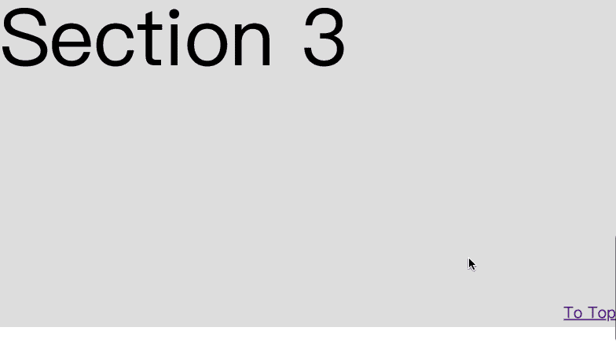

# 如何只用 CSS 实现滚动到顶部

> 原文：<https://levelup.gitconnected.com/how-to-implement-scroll-to-top-with-only-css-ae27cb9d4678>

## 布局使用 sticky，滚动使用标签


# 介绍

当我们的网站有一个很长的页面时，最好提供一个可以滚动回页面顶部的按钮，当用户想回到页面顶部时，这个手势更友好。

更好的实现是当用户向下滚动很长时间时，显示固定在某个位置(右下角)的按钮。

大多数人会使用 JavaScript 来实现这个特性:

1.  创建一个固定在某个位置的按钮，默认隐藏；
2.  监听页面的滚动事件，根据页面的位置显示按钮；
3.  侦听按钮的 click 事件，当它被单击时，将页面滚动到顶部。

实现滚动到页面顶部并不困难。但是我们可以用更简单的方法，只用 CSS。

但是没有 JavaScript，我们如何滚动页面呢？

# 机具滚动到顶部

作为一个前端开发人员，你应该使用过`<a>`标签跳转到其他页面。但是有些人可能不知道`a`标签也可以跳转到同一页面上的一个元素。`<a>`标签的 href 属性支持五种形式的值(来自 [MDN 文档](https://developer.mozilla.org/en-US/docs/Web/HTML/Element/a#attr-href)):

> 1.基于 HTTP 的 URL
> 
> 2.带有片段 URL 的页面部分
> 
> 3.带有媒体片段的媒体文件片段
> 
> 4.带有`tel:`URL 的电话号码
> 
> 5.带有`mailto:`网址的电子邮件地址

[按照 HTML 规范](https://html.spec.whatwg.org/multipage/browsing-the-web.html#scroll-to-the-fragment-identifier)的定义，你可以使用`href="#top"`或者`href="#"`链接到当前页面的顶部。

```
// page will scroll to top, when you click it
<a href="#top"> scroll to top </a>
```

是的，使用 html 的`<a>`标签很容易滚动到顶部。

# 显示滚动到顶部的按钮

如果按钮固定在底部，我们可以使用`position:fixed`来完成。但是这个体验不是很好，页面初始在顶部，不需要这个按钮。那么我们如何让按钮在用户向下滚动很长时间时显示出来呢？

最初，按钮是隐藏的，当用户滚动页面时，按钮会固定在一个右下角的位置。看起来很像`position:sticky`的行为。

当页面加载后，我们需要将这个按钮固定在屏幕底部可以隐藏按钮的地方。当用户滚动页面时，借助`position:sticky`将其固定在右下角。

当用户在页面顶部滚动或第一次加载时，我们可以使用伪元素隐藏按钮。



也可以在 codepen.io 上测试一下:

# 结论

滚动到页面顶部并不困难，我们可以使用 JavaScript 或仅使用 CSS 的 event 来实现。在本文中，我们学习了如何用 CSS 实现滚动到顶部的功能。

# 分级编码

感谢您成为我们社区的一员！更多内容见[级编码出版物](https://levelup.gitconnected.com/)。
跟随:[推特](https://twitter.com/gitconnected)，[领英](https://www.linkedin.com/company/gitconnected)，[通迅](https://newsletter.levelup.dev/)
**升一级正在改造理工大招聘➡️** [**加入我们的人才集体**](https://jobs.levelup.dev/talent/welcome?referral=true)