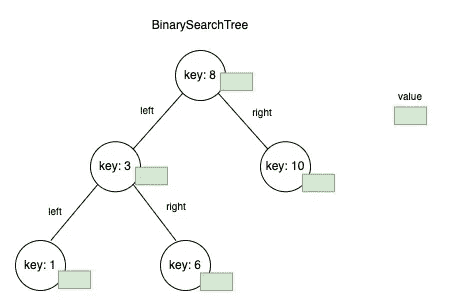

# 如何在 Golang 中实现二叉查找树(BST)数据结构

> 原文：<https://levelup.gitconnected.com/how-to-implement-the-binary-search-tree-bst-data-structure-in-golang-c4f2b598f752>

二叉查找树(BST)是一种数据结构，其内部节点存储的键大于该节点左子树中的所有键，小于其右子树中的所有键。

在本教程中，我们将看到如何使用 Golang 实现 BST。如果你不熟悉它的概念，请在开始本教程之前阅读下面的帖子。

 [## 以下面试的二叉树备忘单

### 二叉树是一种树状数据结构，其中每个节点最多有…

jerryan.medium.com。](https://jerryan.medium.com/binary-tree-cheat-sheet-for-next-interview-7b442a84d70) 

在这篇文章中，我们将看到以下内容

*   TreeNode 和 Tree
*   插入元素&插入树节点
*   有序遍历/前序遍历/后序遍历
*   最小/最大
*   二进位检索
*   移除节点

## *TreeNode & Tree*

我们首先定义两个结构，一个用于 *TreeNode* ，一个用于 *Tree* 。

示例二叉树和树节点

*   *TreeNode* 结构包含键、值和指向其左右 *TreeNode* 的指针。
*   *树*结构包含*根节点*和一个*互斥锁*来锁定树。

## 插入元素&插入树节点

方法`InsertElement`获取一个键和值，然后构造一个新的树节点，然后调用`InsertNode`函数将节点插入到树中。

函数`InsertNode`不是一个树方法，因为它的实现不是特定于树的。

## 有序遍历

方法`InOrderTraverseTree`将一个函数作为参数，并以该函数作为参数调用`inOrderTraverseTree`函数。

示例二叉查找树的导线测量结果如下。

`Value 1 -> Value 3 > Value 6 -> Value 8 -> Value 10`

## 前序遍历

示例二叉查找树的导线测量结果如下。

`Value 8 -> Value 3 > Value 1-> Value 6-> Value 10`

## 后置导线

示例二叉查找树的导线测量结果如下。

`Value 1 -> Value 6 > Value 3 -> Value 10-> Value 8`

## 最小和最大

方法`MinNode/MaxNode`用于查找键(**非值**)为最小值/最大值的节点。

记住，没有必要遍历整个树来寻找最小值/最大值。

因为 BST 的属性确保最小值/最大值总是最左边/最右边的节点。

## 二进位检索

方法`SearchNode`用于搜索树中的一个节点。如果找到了，它将返回节点。如果没有，则返回零。

## 移除节点

方法`RemoveNode`用于根据键从树中删除一个节点。

我希望你喜欢读这篇文章。如果你愿意支持我成为一名作家，考虑成为[一名媒体成员](https://jerryan.medium.com/membership)。你还可以无限制地访问媒体上的每个故事。