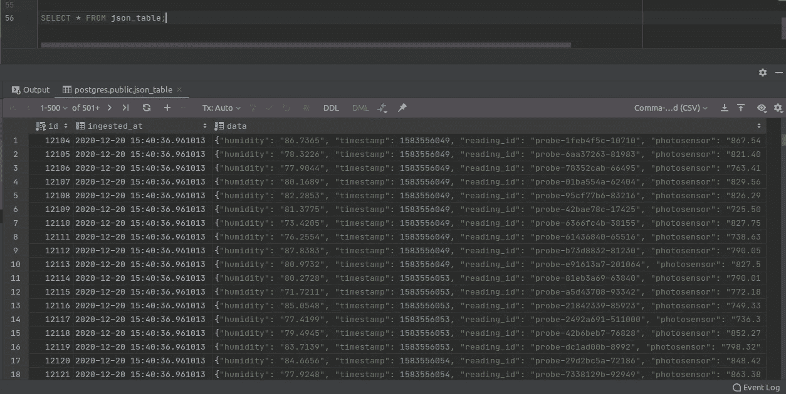

# 如何将 JSON 从亚马逊 S3 导入到 RDS 上的 PostgreSQL

> 原文：<https://levelup.gitconnected.com/how-to-import-json-from-s3-to-postgresql-on-rds-b132357af39e>

## 并包含在事件驱动工作流中


波洛卢山谷，照片由我拍摄

# 介绍

我一直在做一个项目，要求我将亚马逊 S3 桶中的分区 JSON 文件导入到亚马逊 RDS 上的 PostgreSQL 数据库中。我曾在另一个项目中做过类似的事情——将 JSON 与 [Kinesis 数据流](https://aws.amazon.com/kinesis/data-streams/)一起带入 S3，并执行 ETL 以填充亚马逊红移集群中的暂存表——所以我认为在同一云平台上定位不同的存储服务，以及最初作为另一个(红移)的基础的存储技术(PostgreSQL)会相当简单。毕竟，我可以使用同一个数据库适配器连接到 Python 的任何一个存储解决方案，所以也许我可以只替换一些连接字符串参数值并继续移动。呃，没那么快。

# 背景

红移是亚马逊的专有技术，S3 也是，亚马逊经常为他们自己的技术之间的集成和通信提供直接的路径。另一方面，PostgreSQL 是一个开源的关系数据库管理系统，亚马逊将其用于其云平台，并作为一种品牌化的托管服务提供，类似于其他操作系统技术，如 Apache Hadoop、Kafka、Cassandra 等。为了完成前面提到的将 JSON 从 S3 导入到 RDS 上的 PostgreSQL 的任务，我必须做一些研究，同时还要反复试验。在这个过程中，我注意到其他人也想做同样的事情，但我无法在网上找到直接的解决方案，所以我从各种资源中拼凑了一个解决方案，我想我应该分享一下在我的情况下行之有效的方法。

# 战斗支援车

我还需要将 CSV 导入 PostgreSQL，并做了另一个错误的假设——我可以使用 COPY 命令从任一文件类型中移动数据，并相应地更改 FORMAT 参数选项的值。我是说，红移也是这样的，为什么不呢？又错了。这篇文章主要是关于从 S3 引入 JSON 的，但是我也会简单地提到 CSV 需要什么，因为这有助于引出 JSON 的解决方案。

对于 CSV，我们需要在 PostgresSQL 版本 11.1 或更高版本上，并在我们的数据库上安装 [aws_s3 和 aws_commons 扩展](https://docs.aws.amazon.com/AmazonRDS/latest/UserGuide/PostgreSQL.Procedural.Importing.html#USER_PostgreSQL.S3Import.FileFormats)。两者都可以在使用 pgAdmin 或其他 SQL 客户端工具连接到 RDS 上的 PostgreSQL 数据库时执行一个命令来安装。

```
CREATE EXTENSION aws_s3 CASCADE;
```

下面是一个可用于从 S3 导入 CSV 数据的 SQL 示例:

```
SELECT aws_s3.table_import_from_s3(
  'my_table', 
  'optional_column_list', 
  '(FORMAT CSV, HEADER true)', 
  'my_bucket', 
  '/path/my_file.csv', 
  'us-west-2'
);
```

该语句要求数据库表中的列与' optional_column_list '中指定的列相对应。如果为该参数传递一个空字符串，则查询将期望 CSV 文件中的每个分隔值都有一列。

# JSON

对于 JSON，一种方法是将文件转换成 CSV 格式，并使用 aws_s3.table_import_from_s3 函数来执行导入，如上所述。在我的例子中，我决定接受 JSON 的无模式特性，并利用 Postgres 9.4 引入的 JSONB 数据类型。第一步是创建一个带有 JSONB 数据类型字段的表。

```
CREATE TABLE IF NOT EXISTS json_table (
  id int GENERATED BY DEFAULT AS IDENTITY PRIMARY KEY,
  ingested_at timestamp DEFAULT CURRENT_TIMESTAMP,
  data jsonb NOT NULL
);
```

我将从上面提到的[项目](https://github.com/mikeacosta/florasense)中导入 IOT 传感器数据。

下面是将 JSON 从 S3 导入到 RDS 上的 PostgreSQL 的 Python 代码。

代码非常简单明了。我们正在从 S3 下载 JSON 文件并执行 COPY 语句



现在，我们可以利用 PostgreSQL 提供的许多 JSONB [操作符和函数](https://www.postgresql.org/docs/12/functions-json.html#FUNCTIONS-JSON-PROCESSING)。

对于我的用例，我将数据从 S3 导入到 PostgreSQL，作为一个更大的 ETL 工作流的一部分，所以我在 AWS 上的一个 [Lambda 函数](https://aws.amazon.com/lambda/)中实现了导入功能。我还添加了一个 [SNS](https://aws.amazon.com/sns) 通知，它会在每次调用函数时发布，还添加了一个[云形成](https://aws.amazon.com/cloudformation/)模板，用于打包和部署函数以及 AWS 的所有依赖项。完整源代码在 [GitHub](https://github.com/mikeacosta/s3-json-to-postgresql) 上。

[](https://github.com/mikeacosta/s3-json-to-postgresql) [## Mike Costa/S3-JSON-to-PostgreSQL

### AWS Lambda 函数将 JSON 数据导入 RDS 上的 PostgreSQL 数据库，以响应亚马逊 S3 事件…

github.com](https://github.com/mikeacosta/s3-json-to-postgresql) 

# 结论

这是一个如何将 JSON 数据从 S3 导入 RDS 上的 PostgreSQL 的例子。如果您需要数据符合特定的模式，JSONB 提供了一些引人注目的特性来实现这一点。也许我们会在以后的文章中讨论这个问题。感谢阅读！