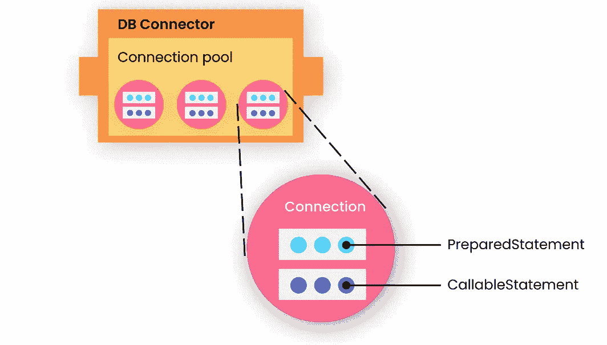

# 如何提高 Java 后端性能——仅仅编写运行的代码是不够的！

> 原文：<https://levelup.gitconnected.com/how-to-improve-java-backend-performance-writing-code-that-just-runs-is-not-enough-d5c29392f62c>

## 查找常见后端瓶颈和解决方案的演练。

由[女星](https://www.freepik.com/starline)在 [Freepick](https://www.freepik.com/free-vector/rocket-launch-cloud-sky-background_13514235.htm#page=1&query=rocket&position=17) 上拍照

在这个故事中，我将讨论 Java 应用程序的性能调优方法。在您构建应用程序之后，由于各种原因，性能可能与您预期的不同。有时你可能找不到它们，即使你在投入生产之前做了负载测试。

我要讨论的主要话题是:

*   寻找瓶颈
*   要应用的常见调整
*   JDBC 相关的代码更改和调整
*   JVM 调优

我必须说，这些是你可以做的一些常见的调整，这完全取决于你的业务逻辑。有些优化对您的用例来说可能是不必要的。好吧，我们开始吧。

# 寻找性能瓶颈

要微调后端，首先，您需要找到应用程序中的瓶颈。在这种情况下，您可以盲目地跟随直觉，或者使用分析器来更好地了解您的应用程序。

## 使用 Java 分析器

如果你打算使用一个分析器， [**JProfiler**](https://www.ej-technologies.com/products/jprofiler/overview.html) **或者**[**Java melody**](https://github.com/javamelody/javamelody/wiki)是一些你可以使用的很棒的工具。在 [DZone](https://dzone.com/articles/top-9-free-java-process-monitoring-tools-amp-how-t) 中找到更多关于免费 java 评测器的信息。特别是 JProfiler 将提供详细的意见时，分析数据库与 JDBC 连接，JPA，以及 NoSQL。因为大多数时候瓶颈发生在数据库层。

## 使用 Java 堆转储分析器

这是第二个选项，可以通过分析 JVM 堆区域来发现后端中的瓶颈。该工具专门用于在生产中发现在测试阶段无法发现的内存问题。

[**【Eclipse 内存分析器(MAT)**](https://www.eclipse.org/mat/) 是你可以使用的最简单的工具之一。 [**jhat**](https://docs.oracle.com/javase/7/docs/technotes/tools/share/jhat.html) 和[**jvvisualvm**](https://visualvm.github.io/)**是一些替代方案。使用 MAT，更容易有效地分析包含数百万个对象的堆转储，并了解谁在阻止垃圾收集器收集对象。它还提供运行报告来自动提取泄漏嫌疑。**

****

**Eclipse 内存分析器-图片来自[eclipse.org](https://www.eclipse.org/mat/about/overview.png)**

# **您可以进行的常见调整**

**可以在代码级、JVM 级和数据库级进行调整。我必须再说一遍，这些完全取决于您的业务需求，解决最大的瓶颈会更容易更快地完成工作。**

# **代码级别的注意事项**

> **前面提到的 DZone 性能监控调查将代码级问题列为应用程序性能问题的首要原因。大多数代码级别的问题是由于代码构造中的错误造成的，比如长时间等待、糟糕的迭代、低效的代码算法、糟糕的数据结构选择等等。
> ——[eginnovations.com](https://www.eginnovations.com/blog/top-10-java-performance-problems/#Java-Code)**

## **使用字符串生成器而不是字符串串联**

**这适用于需要重复修改字符串的情况。如果你只修改一次，几乎是一样的。如你所知，字符串对象是不可变的。所以如果你修改了一个字符串，它实际上不会被修改。实际情况是它将创建一个新的字符串，与创建新的字符串对象相关的开销可能会很大。如果这种情况重复发生，就需要一次又一次地分配新的内存，这不是一个好的做法。**

**如果你有像`String s = "a" + "b" + "c"`这样的单行语句，你可以使用串联，因为编译器会自动使用`StringBuilder`。**

## **尽可能使用原语和堆栈**

**java 堆空间和 Java 堆栈内存是 JVM 中两种主要的内存类型。堆栈内存遵循“后进先出”(LIFO)的内存分配原则，是最快的内存分配和内存访问方式。与堆相比，栈的内存较少，您可以使用`-Xss` JVM 选项来增加栈的大小。堆栈内存存储对象的基本类型和地址。所以如果你使用原语，你会自动使用堆栈内存，它有更快的内存访问。**

****

**堆和栈的关系**

## **额外的精确性——真的需要吗？**

**不要使用`BigInteger`或`BigDecimal`，除非你的数字超出了`long`或`double`的范围。这些类型需要更多的内存空间，并且会显著降低计算速度。**

## **“finalize”不应用于将字段设置为“null”**

**没有必要使用 finalize 将字段设置为 null。垃圾收集器会在需要时自动移除它们。这样做实际上可能会给垃圾收集器带来额外的工作，而且对象的寿命可能会更长一些。**

## **如果可能，使用流对象**

**Java 流对象比读/写对象性能更好，因为它们不必处理字符串到字节的转换。例如，`PrintWriter`可以替换为`OutputStream`。**

## **打破大的请求**

**当请求较大且需要大量时间处理时，这是后端常见的滥用。您可以通过减少冗余请求并将大量请求分解成较小的请求来消除它。**

# **进入 JDBC 和数据库层**

**通常，最大的瓶颈在 JDBC 和数据库层之间。连接池和语句池可用于重用现有的连接/准备好的语句，消除启动新连接和解析 SQL 的成本。**

## **连接池**

**创建 JDBC 连接需要大量资源，尤其是在中间层服务器环境中使用 JDBC API 时，比如在支持 Java 的 web 服务器上使用 JDBC 的 DataDirect Connect 或 JDBC 的 DataDirect SequeLink。因此，实现连接池可以在需要时创建新连接之前节省时间。连接池模块将被创建为任何标准 JDBC 驱动程序产品之上的一个层。当连接被释放时，池中的其他客户机可以使用它。**

**Apache Commons DBCP、HikariCP 是一些可以用于连接池的 JDBC 框架。**

## **语句池**

**与连接池一样，语句池也可以节省大量事务时间。`OraclePreparedStatement`和`OracleCallableStatement`可以缓存在语句池中，JDBC 驱动程序会自动在缓存中搜索匹配的语句并重用它们。**

****

**JDBC 统筹**

## **使用 Infinispan/Redis 等数据存储**

**有很多内存中的开源缓存接口可以与 Java 一起工作。其主要目标是为频繁访问的数据提供快速的内存缓存。 **Ehcache，Hazelcast，Memcached，AWS 的 ElastiCacheare 还有其他一些你可以选择的缓存选项。根据需要，它们可以作为嵌入式或分布式使用。****

# **JVM 调优**

**在进入垃圾收集之前，我将简要介绍一下 java 内存模型。Java 运行时内存分为五个部分。**堆区、方法区、JVM 栈、本地方法栈、PC 寄存器**就是它们。在这个故事中，我将主要讨论堆区域，因为它对应用程序的性能有直接影响。这一部分可能比其他部分长，因为我希望涵盖 Java 内存管理和垃圾收集的一些概念。**

****

**JVM 堆内存**

**Java 堆是 Java 程序的对象所在的地方。如果你得到一个类似`**java.lang.OutOfMemoryError**`的错误，那是因为堆内存已满。它是活对象、死对象和空闲内存的存储库。堆区分为**年轻代和老代，**这是垃圾收集器(GC)的工作区。**

**年轻一代是保存新创建对象的区域。它被进一步分成 **EdenSpace 和两个幸存者空间**。这两个叫做 **FromSpace(S0)和 ToSpace(S1)。**对象的生命周期从初始内存分配开始于 Eden 空间。一旦 Eden 空间被填满，就执行 GC。该迭代将删除所有死对象并将活对象移动到 S0。接下来，将在 Eden 中创建新对象，并再次执行 GC，死对象将被删除，活对象将被移到 S1。所以这是一个重复的任务，JVM 会一直空出一个幸存者空间。这个过程被称为**小 GC。**次要垃圾收集将持续一定次数，这些对象将被移至老代空间。这种情况称为**促销**。该阈值称为**任期年龄**，可以使用`MaxTenuringThreshold`参数进行更改。老一代的 GC 被称为**主要 GC** ，影响应用性能。(老一代中的对象是长寿的，与年轻一代中的 GC 相比，GC 花费的时间更长。)**

**下一个内存空间是永久生成(PermGen)。这包含 JVM 描述应用程序中使用的类和方法所需的元数据，如常量池(内存池)、字段和方法数据以及代码。从 Java 8 开始，PermGen 被 Metaspace 取代，在 Metaspace 中，内存可以自动调整大小，默认情况下无限制。**

**所有的垃圾收集都是“停止世界”事件。当 GC 发生时，应用程序中的所有线程都将停止。对于日志，可以通过指定`**-XX**:+PrintGC **-XX**:+PrintGCDetails **-XX**:+PrintGCTimeStamps **-Xloggc**:<**filename**>`来启用 GC 日志。**

## **JVM 性能目标**

**在开始调优 JVM 性能之前，您可以考虑三个目标。这些目标必须根据您的业务需求来选择。**

*   ****延迟** — **运行 GC 事件所需的**时间量。**
*   ****吞吐量** —虚拟机执行应用所花费的时间与执行垃圾收集所花费的时间的百分比。**
*   ****内存量** —垃圾收集器平稳运行所需的内存量。**

## ****JVM 调优原则****

**JVM 调优不是一件简单的事情，但是，您可以遵循一些原则来简化这项任务。**

*   ****少量垃圾收集** —垃圾收集应该在一次运行中收集尽可能多的死对象，以减少垃圾收集的频率。**
*   ****GC 内存最大化** —它表示 GC 在一个周期内可以访问的内存越多，清理效率越高，收集频率越低。**
*   ****三选二** —您需要从三个绩效目标中选择两个与您的业务需求最相关的目标。例如，高吞吐量和低延迟会导致更高的内存使用率。**

**您可以通过为堆区域和不同的垃圾收集器更改不同的内存大小来遵循试错法。我希望不久能在《垃圾收集者》中增加一个故事。**

# **结论**

**感谢阅读。我相信这篇文章可以帮助您优化 Java 应用程序的性能。要了解更多详情，您也可以访问参考网站。编码快乐！**

## **参考**

*   **[Java 中十大简单的性能优化](https://blog.jooq.org/2015/02/05/top-10-easy-performance-optimisations-in-java/)**
*   **[十大 Java 性能问题及解决方法](https://www.eginnovations.com/blog/top-10-java-performance-problems/#Java-Code)**
*   **[JDBC 连接池](https://www.progress.com/tutorials/jdbc/jdbc-jdbc-connection-pooling)**
*   **[Infinispan 技术概述](https://infinispan.org/docs/stable/titles/overview/overview.html)**
*   **[J2EE 应用性能优化](https://www.infoworld.com/article/2074843/j2ee-application-performance-optimization.html?page=2)**
*   **[如何正确规划 JVM 性能调优](https://dzone.com/articles/how-to-properly-plan-jvm-performance-tuning)**
*   **[调优 Java 运行时系统](https://docs.oracle.com/cd/E26576_01/doc.312/e24936/tuning-java.htm#GSPTG00006)**
*   **[Java 垃圾收集基础知识](https://www.oracle.com/webfolder/technetwork/tutorials/obe/java/gc01/index.html)**
*   **[JVM 调优:如何为性能调优准备您的环境](https://sematext.com/blog/jvm-performance-tuning/)**