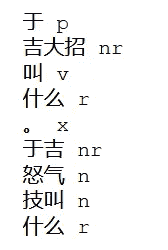
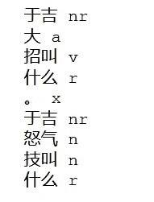
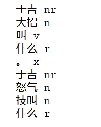

# 如何提高 Python 和 Jieba 中中文文本标记化的性能

> 原文：<https://levelup.gitconnected.com/how-to-improve-the-performance-of-chinese-text-tokenization-in-python-and-jieba-26add53f3756>

在 Python 应用程序中添加自定义单词和动态修改词典


照片由 [Alvan Nee](https://unsplash.com/@alvannee?utm_source=unsplash&utm_medium=referral&utm_content=creditCopyText) 在 [Unsplash](/s/photos/chinese-text?utm_source=unsplash&utm_medium=referral&utm_content=creditCopyText) 上拍摄

通过阅读这篇文章，你将学会在`Jieba`中添加自己的自定义单词，以提高标记化的性能。当处理特定领域的自然语言处理(NLP)任务时，控制标记化过程是至关重要的，因为有相当多的自定义单词被定义为名词。最重要的是，这将是一个非常糟糕的中文，因为它不是一个空间符号化的语言。可能会出现这样的情况，最终结果不是你所期望的。让我们看看下面的例子。

```
于吉大招叫什么
```

从一个正常人的角度来看，这句话应该标记如下:

```
['于吉', '大招', '叫', '什么']
```

然而，当你用 Jieba 对它进行标记时，情况就不一样了，因为你最终会得到下面的结果

```
['于', '吉大招', '叫', '什么']
```

让我们继续下一部分，看看我们如何解决这个问题。

# 履行

## Pip 安装

在继续之前，您需要安装`Jieba`模块。强烈建议在安装此模块时创建一个虚拟环境。打开终端并通过以下命令安装它。

```
pip install jieba
```

## 导入

一旦安装了`Jieba`，创建一个新的 Python 文件并添加以下导入语句。

```
import jieba.posseg as pseg
import jieba
```

## 标记化

接下来，我们将编写令牌化过程的代码。让我们用两个简单的句子来尝试一下。

```
text = "于吉大招叫什么。于吉怒气技叫什么"
words = pseg.cut(text)
for w in words:
    print('%s %s' % (w.word, w.flag))
```

您应该在控制台中获得以下输出。



作者图片

From the image above, we can see that the word `于吉` is tokenized properly in the second statement but not the first one. We are going to use the `add_word` function provided by `Jieba` module to add it as a noun to the existing dictionary. In fact, `Jieba` has another function called `suggest_freq`:

*   `add_word(word, freq=None, tag=None)` —在程序中动态修改字典。
*   `suggest_freq(segment, tune=True)` —调整单个单词的频率，使其可以(或不可以)分段。

## 添加自定义单词

Let’s try it out by adding the following code below it. The tag `nr` represent `人名` under part-of-speech tagging.

```
jieba.add_word('于吉', freq=None, tag='nr')
```

再次运行令牌化，您应该得到以下输出



作者图片

It is clear that Jieba tokenized the word `于吉` correctly this time. However, we still have an issue where `大` is treated as adjective. `大招` should be a noun on its own. Let’s add another word to the dictionary with the following code

```
jieba.add_word('大招', freq=None, tag='n')
```

当您再次运行令牌化时，应该能够获得预期的结果。



作者图片

## 文本文件中的自定义单词列表

话虽如此，在现实生活的用例中，自定义单词的列表要大得多，可能有数千个。因此，手动添加每个单词可能是一项艰巨的任务。强烈建议将其放在文本文件中并动态加载。最好的方法是合并文本文件中的所有单词，用换行符隔开，如下所示:

```
星光绝世
不死火鸟
战盟红包
世界等级
情有独钟
铜质勋章
战盟宴会
```

然后，在标记化过程之前添加以下代码。相应地修改文件的名称。

```
with open('noun_list.txt', 'r', encoding='utf8') as f:
    custom_noun = f.readlines()
    for noun in custom_noun:
        jieba.add_word(noun.replace('\n', ''), freq=None, tag='n')
```

请参考以下[要点](https://gist.github.com/wfng92/2a69134de31ed3913a5a9436aad17374)的完整代码了解更多信息。

# 结论

让我们回顾一下今天所学的内容。

我们首先简单解释了对中文文本进行标记时会遇到的常见问题。

之后，我们继续通过`pip install`安装`Jieba`模块。一旦我们完成了这些，我们就创建了一个新的`Python`文件，并开始实现标记化。

我们利用`add_word`函数来添加我们的自定义单词，以确保`Jieba`将正确地对句子进行分词。此外，我们还测试了通过文本文件动态加载它。

感谢你阅读这篇文章。希望在下一篇文章中再见到你！

# 参考

1.  [Github 中的完整代码](https://gist.github.com/wfng92/2a69134de31ed3913a5a9436aad17374)
2.  [杰霸官方 Github 页面](https://github.com/fxsjy/jieba)