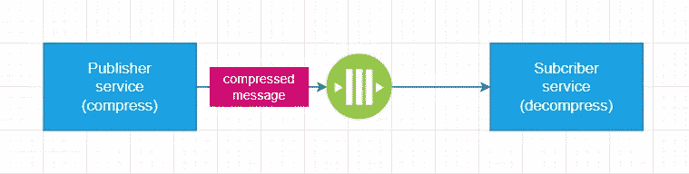

# 如何提高消息传递体系结构的性能

> 原文：<https://levelup.gitconnected.com/how-to-improve-the-performance-of-the-messaging-architecture-e1f31a2e9762>

## 5 种优化技术来扩大你的武器库。

在 [Unsplash](https://unsplash.com?utm_source=medium&utm_medium=referral) 上[给](https://unsplash.com/@laurentmedia?utm_source=medium&utm_medium=referral)拍照

性能问题可能发生在任何应用程序级别:数据库、数据访问层、前端等。消息代理和异步消息传递是导致性能问题的另一层原因。幸运的是，有几种方法可以在需要时使消息传递系统更快。

# 使用消息批处理

对于通过在短时间内交换许多异步消息来进行通信的微服务系统来说，将几条消息作为一批来处理可以大大提高性能并降低成本。

典型的现代消息代理支持发布者和订阅者双方的批处理**。在第一种情况下，发布者收集几个消息，并在一个连接中将它们转发给消息代理，而不是一个接一个地发送。在第二种情况下，订户可以在一次调用中从队列中检索多条消息，在一个循环中处理它们，甚至将它们压缩成一条消息。在这两种情况下，发布者和订阅者通常使用预定义的时间间隔将传入消息添加到批处理中，然后再开始处理它。**

应用程序可以使用其中一种技术，甚至可以将它们结合在一起。

## 真实案例

在我的一个项目中，一个无服务器功能订阅了一个消息队列，每秒需要处理 50 到 200 条消息。处理一条消息会消耗大量 CPU 资源，因此一个函数实例无法快速处理所有消息。这导致分配了多达 8 个额外的函数实例来处理负载。我们遇到了每个新实例的冷启动问题，所以消息处理很慢。此外，客户不得不为额外的计算资源支付更多费用。

然后在订户端配置批处理。该函数不会在第一个传入消息到达后立即开始处理它，而是等待*100 毫秒*消息代理队列中可能的下一个传入消息。

结果真的很酷:函数实例甚至可以同时接收多达 30 条消息，并在一次调用中处理它们。在最坏的情况下，额外提供的功能实例的数量已经从 8 个减少到 2 个。

# 避免冷启动

在消息传递体系结构中，无服务器功能或功能即服务(FaaS)通常充当订户来处理来自消息传递队列的消息。

FaaS 提供了一个降低成本的机会，因为客户只为功能启动和运行的时间付费(情况并不总是如此，这实际上取决于托管计划)。当 message broker 队列中没有要处理的消息时，该函数可以在一段时间不活动后缩减到零个实例。当该功能处于非活动状态时，将不收取费用。

FaaS 的缺点是冷启动问题。当消息到达消息代理的队列，并且没有准备好处理消息的功能实例*(活动功能实例的数量为零或者所有活动实例当前都忙于处理其他消息)*时，可能需要几秒钟来提供新的功能实例。

有几种策略可以缓解冷启动问题，从而提高系统速度:

*   实现一个定期调用该函数的预定触发器，使其始终处于活动状态。
*   切换到允许您配置活动/始终开启/预热功能实例数量的另一个托管计划。
*   将该功能的部署包大小保持在最小。该函数不应引用冗余的第三方包。
*   该函数应该尽可能快地处理单个消息。此外，该功能应该能够同时处理许多消息。这将减少启动附加功能实例的需要，因此它们不会冷启动。
*   确保该函数不执行耗时的逻辑或者在启动时快速执行:填充内存缓存、运行数据库种子等。

# 减少可恢复故障的机会

大多数消息代理支持向订阅者重新传递消息。当订户第一次收到消息，开始处理并失败时，消息将被第二次重新传递。可能还有几次尝试，这通常在配置中指定。如果所有尝试都失败，消息将被发送到死信队列。

在出现可恢复故障的情况下，重新传递消息会很有用。例如，为了成功处理消息，订户可能需要从外部服务(如 Redis 缓存、数据库或其他暂时不可用的微服务缓存)中检索数据。在这种情况下，在下一次重新传递时，外部服务可能会再次变得可用，以便订户可以成功地处理消息。

消息重新传递是一种使系统更加可靠的技术，但另一方面，在某些情况下，它们会变得更慢。想象一下，如果订户处理消息 5 秒钟，然后失败了。即使第二次尝试成功，总的消息处理时间也将是 10 秒。因此，经常遇到的可恢复故障确实会降低系统速度。

可恢复的失败应该尽可能少地发生，所以即使是消息代理再次尝试重新传递消息也很少发生。

接近这一目标的一般建议可能是:

*   通过重新构建系统，最大限度地减少用户的外部依赖性。例如，您可以使用内存缓存代替远程缓存，或者两者结合使用。
*   考虑为微服务实现一个**推送机制**来获取所需的数据，而不是一个**拉取机制**。这意味着微服务可以接收消息负载或 HTTP 请求体中的数据，而不是从数据库中查询这些数据。
*   考虑横向扩展和纵向扩展外部资源。例如，如果一个系统使用单个 Redis 实例，那么它经常会因为来自许多不同微服务的频繁请求而过载。在这种情况下，Redis 实例集群会有所帮助。

# 压缩大邮件

在某些情况下，邮件的大小可以是几兆字节或更多。消息越大，执行以下操作所需的时间就越长:1)发布者将消息传递给消息代理；2)订阅者从消息代理下载消息。

当系统由于需要定期交换大量消息而运行较慢时，长期计划应该是检查消息内容中的冗余、过时片段并删除它们。有时候这能帮上大忙。

但是，当每一段数据都必须保留在消息中时，开发人员可以在将消息发送到消息代理之前对其进行压缩，并在订阅方使用 Gzip、Brotli 或其他算法对其进行解压缩。

压缩可以将邮件大小减少 10 倍，从而加快邮件传输过程。

记住额外的时间将花费在大消息的压缩和解压缩上也是很重要的。因此，在做出最终决定之前，端到端地测量性能是非常重要的。

## 索赔检查模式

[认领核对](https://www.enterpriseintegrationpatterns.com/patterns/messaging/StoreInLibrary.html)消息传递模式有助于将大量消息从发布者传输到订阅者。发布者将大型消息有效负载序列化并存储在数据库、blob 存储或其他地方，并且只将该有效负载的 ID 发送给订阅者。一旦收到 ID，订户就可以从外部存储中检索消息有效负载。

该模式有助于绕过消息代理对消息大小的限制。但是，它引入了影响消息处理性能的额外网络调用和 I/O 操作。因此，在某些情况下，通过压缩和解压缩大消息来替换 Claim-Check 模式是有意义的。

# 为您的消息代理切换到更高的定价方案

有时，简单地将消息代理切换到下一个定价计划/消息传递层就可以解决遇到的限制和问题。

更高的定价方案可以提供可预测的性能、更好的吞吐量、更高的限制以及其他可以加速系统的功能。

感谢阅读。如果你喜欢你所读到的，看看下面这个故事:

 [## 快速数据库—快速应用程序(有用的数据库性能优化技术)

### 了解加速关系数据库的最佳实践。

levelup.gitconnected.com](/fast-database-fast-application-useful-db-performance-optimization-techniques-34b6926d1196) 

还有，考虑成为[中等会员](https://esashamathews.medium.com/membership)。

# 分级编码

感谢您成为我们社区的一员！在你离开之前:

*   👏为故事鼓掌，跟着作者走👉
*   📰更多内容请查看[升级编码刊物](https://levelup.gitconnected.com/?utm_source=pub&utm_medium=post)
*   🔔关注我们:[推特](https://twitter.com/gitconnected) | [LinkedIn](https://www.linkedin.com/company/gitconnected) | [时事通讯](https://newsletter.levelup.dev)

🚀👉 [**加入升级人才集体，找到一份神奇的工作**](https://jobs.levelup.dev/talent/welcome?referral=true)