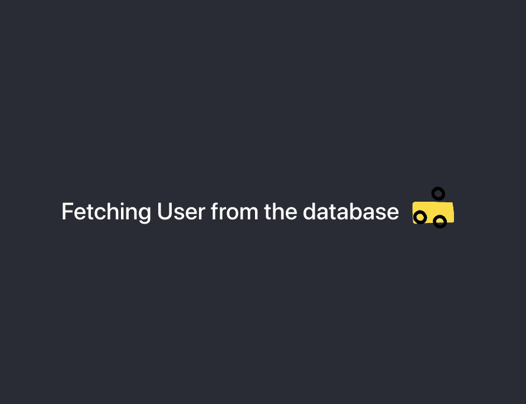
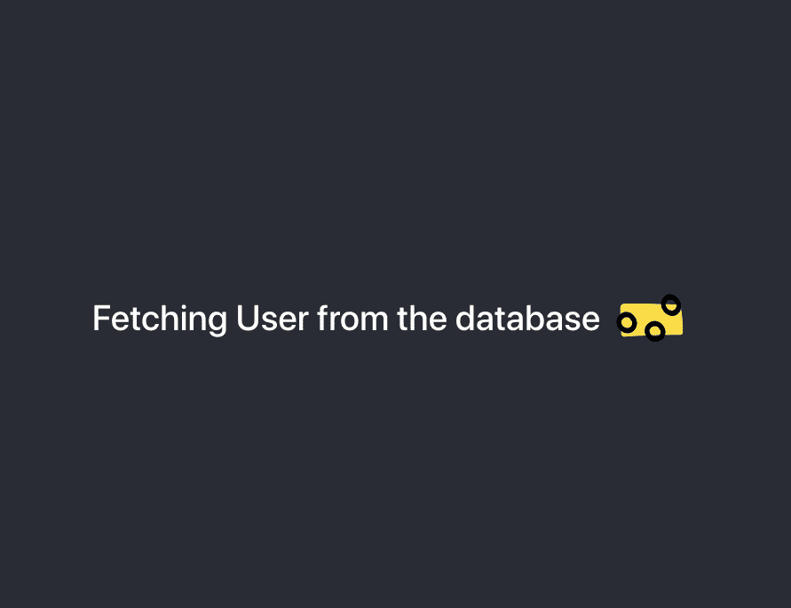

# 如何提高用户体验 React 中最好的加载屏幕 UX 使用钩子

> 原文：<https://levelup.gitconnected.com/how-to-improve-user-experience-the-best-way-to-loading-screen-ux-in-react-ccec73de1d66>

## 加载屏幕的正确指南

> 如果你的应用程序美观且易于理解，用户就更有可能继续使用它。


丹·哈尔佩林

最好的开始方式是一个简单的**加载屏幕**。所以让我们开始构建一个简单的加载屏幕。我们将把这部分分成两半。一种方法是创建典型的加载屏幕，这样就可以让您先了解加载屏幕如何与 react 一起工作。在第二部分，我们将添加**美学和更容易理解的**外观到应用程序中。********

******这里的主要思想是使加载屏幕吸引人的眼睛，并增加它的意义。所以让我们开始吧，我们会一步一步来。首先，⚡️启动你的 VS 代码或者任何你熟悉的应用程序。如果你在中间迷路了，可以到我的 GitHub Repo [这里**这里**这里](https://github.com/itsimranmd/Medium-React-UX)。******

# ******第 1 部分(典型装载屏幕)******

## ****创建反应应用程序🧱****

```
**yarn create react-app loadingscreen**
```

## ****安装软件包📦****

```
**npm i react-loading bootstrap**
```

## ****启动应用程序⚡️****

```
**npm start**
```

## ****让我们构建一个典型的加载屏幕。****

****为此，首先在`src`目录下创建一个`loading.js`文件，它将在加载时显示我们的内容。****

****像这样导入之前安装的包。****

```
**import React from "react";import ReactLoading from "react-loading";import "bootstrap/dist/css/bootstrap.css";**
```

****将该函数命名为“Loading”并将其导出。****

```
**function Loading(){
...
return(
...
)
}
export default Loading;**
```

****现在添加一条简单的消息，如“厌倦了 hello world”🤢在`return ();`内部。****

```
**<div>
<h1> Sick of hello world </h1>
</div>**
```

****接下来，我们将设置我们的状态，使用 *useEffect* 获取 API，然后使用三元运算符使整个流程工作。现在不要担心，所有这些都将在几行中变得有意义。完成后的代码，即`loading.js`应该是这样的:****

****如果你有点迷茫，让我给你分析一下。让我们一行一行地用简单的语言来理解这一点。我们将首先从 react 导入钩子`{useEffect, useState}`。然后我们必须定义**状态**，这基本上意味着“如果我们的应用程序在某一点上被执行了一个特定的动作，它应该是什么样子”。更简单地说，我们有两种状态，在这种情况下，一个是加载屏幕，另一个是内容屏幕，上面写着“讨厌 hello world”。我们已经将 *useState* 定义为 false，用于显示一种状态(记住，这个 false 值将变为其他值，它将不再是 false，一旦它从 API 获得数据，它的值将是我们从 API 获得的值)，如果它的值在程序中的任何地方发生变化，则显示另一种状态。(你也可以用 undefined 代替 false。)****

****然后我们使用 *useEffect* 异步地从 API 获取数据。其中我们设置了 2 秒的超时。所以它在 2 秒内把我们带到第二个状态。****

****然后我们使用三元运算符来显示值。如果值为真，那么它将显示加载部分，否则，内容。****

****就这么简单。****

****现在，转到`src/App.js`，删除`<header></header>`中的所有内容，只替换为`<Loading/>`。现在，你的`App.js`应该是这样的。****

****您的应用程序现在应该看起来像这样:****

********

****老实说，这看起来很无聊****

****最后，让我们跳到有趣的部分。我现在兴奋不已，欣喜若狂💪🏻 😬。****

# ****第二部分(美学和有意义)****

****让我们将这个应用程序向前推进一步。为此，我们将采取以下措施。****

*   ****告诉用户我们正在进行哪个 API 调用。****
*   ****当 API 调用完成时，给出一个确认动画。****
*   ****使用淡入创建平滑过渡。****

****首先，我们需要再安装 2 个包**📦。******

```
**npm i react-lottie react-fade-in**
```

****我们将使用 Lottie Json 作为我们的图标，你可以从 [Lottie 文件](https://lottiefiles.com)中选择一个，如果你懒的话，就在这里[](https://drive.google.com/drive/folders/16_8udpWPnIGTFaNsDzQurp1HCcBmRoyD?usp=sharing)****选择我为这个应用程序选择的文件。为了简单起见，只需复制 JSON 文件并将其粘贴到`src`目录。现在我们已经做好了一切准备，让我们进入代码编辑器，导入我们添加到应用程序中的所有内容。********

****将包和文件导入`loading.js`。****

```
**...import FadeIn from "react-fade-in";import Lottie from "react-lottie";import * as loadData from "./load.json";import * as doneData from "./doneloading.json";import * as instaLogo from "./instagram.json";...**
```

****下一步是用模糊的术语定义另一个图标的状态，就像在我们的第一个状态中合并另一个状态一样。因此，一旦我们的数据被加载，我们必须向用户显示一个成功的图标，清楚地定义了这个过程。****

********

****让我们定义状态，就像上一个一样。将状态设置为 false:****

```
**...
const [loading, setLoading]=useState(false);
...**
```

****接下来，我们需要修改我们的*使用效果如下:*****

```
**//API fetch call using asynchronous function.useEffect(()=>{setTimeout(()=>{const fetcheddata = async() =>{const response = await fetch("https://jsonplaceholder.typicode.com/posts");setLoading(response);setTimeout(()=>{setDone(response);console.log(`${loading} loading `);},2000);console.log(done);}fetcheddata();},3000);},[]);**
```

****然后我们需要修改`return();`中的代码，并定义图标属性。定义图标属性非常简单。为了简单起见，复制代码，我会带你走一遍。这就是我们的**最终代码**的样子:****

****我们使用“反应-淡入”中的*淡入*替换旧的反应加载器到洛蒂文件，并在“加载状态”中运行三元运算符。我们还修改了两个图标的设置时间，这样一个图标正好在另一个图标之后出现。****

****就是这样！你已经做到了👏🏻。轻拍自己的肩膀🏆。您的应用程序应该如下所示。****

********

****决赛成绩🔥****

****有几种方法可以改善用户体验，Instagram、Spotify 和脸书等公司使用占位符图标，这种策略带来了数据已经加载的错觉。其他例子是微交互。这些事情听起来可能太微不足道了，但是相信我，这就是你让你的用户关注这个应用的方式。查看[丹·哈尔佩林](https://medium.com/u/ea1aff802914?source=post_page-----ccec73de1d66--------------------------------)的文章了解更多。在那之前，✌和平🏼。****

****[](https://skilled.dev) [## 编写面试问题

### 一个完整的平台，在这里我会教你找到下一份工作所需的一切，以及…

技术开发](https://skilled.dev)****