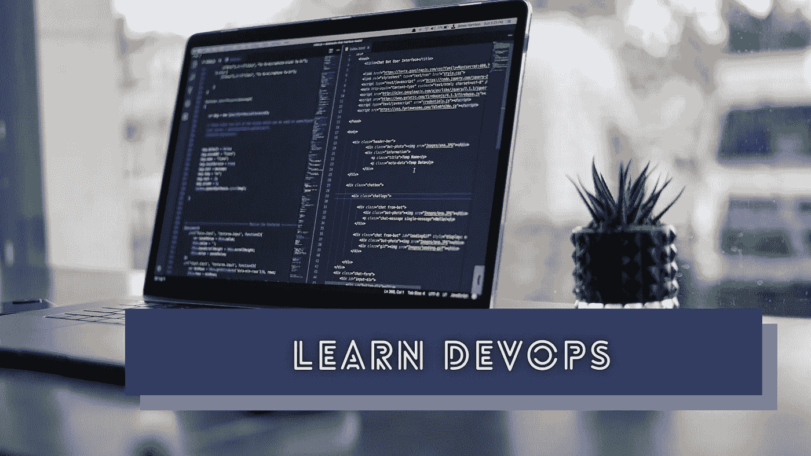

# 如何通过学习 DevOps 来提高自己的编程技能

> 原文：<https://levelup.gitconnected.com/how-to-improve-your-programming-skills-by-learning-devops-73071b9ea507>

## 成为程序员不需要 DevOps 技能，但成为程序员需要 DevOps 技能。

由 [Unsplash](https://unsplash.com/s/photos/programming?utm_source=unsplash&utm_medium=referral&utm_content=creditCopyText) 上的 [James Harrison](https://unsplash.com/@jstrippa?utm_source=unsplash&utm_medium=referral&utm_content=creditCopyText) 拍摄，Canva 编辑。

早先，软件开发过程很简单。开发环境和生产服务器没有维护许多相互关联的实践或工作流——唯一相互关联的工作流是简单的手动部署。系统管理员负责管理物理服务器计算机和支持手动部署。

如今，由于软件市场竞争激烈，软件开发团队不得不快速发布功能、即时部署软件补丁、试验新功能、监控生产系统问题以及处理大量网络流量。 [DevOps](https://en.wikipedia.org/wiki/DevOps) 概念为软件开发团队引入了一套实践和过程来实现这些现代需求的解决方案。此外，DevOps 概念有助于我们构建具有自动化工作流的高质量和稳定的软件系统。

大多数公司会为 DevOps 相关的职位单独聘用工程师。因此，DevOps 技能并不是所有开发者都必须具备的。然而，学习 DevOps 概念可以提高您的编程技能，并帮助您推进您的软件开发事业。在这个故事中，我将解释如何通过学习 DevOps 来进一步提高编程技能。

# 学习使用 DevOps 自动化一切

每个开发人员都努力通过自动化手动任务来节省日常编程时间。自动化手动任务可以提高您的编程效率。因此，自动化无疑是每个软件开发人员的必备技能。持续集成(CI)和持续交付(CD)等流行的 DevOps 概念激励我们编写自动化工作流。例如，大多数软件开发团队在他们的源代码管理实践中使用拉请求模型。此外，一旦开发人员提交一个 pull 请求，一个自动化测试套件就会验证代码的状态。

如今，软件开发团队通过 DevOps 过程自动化他们的发行说明、部署和生产系统故障通知。一旦你学会了 DevOps，你就再也不会做同样的手工耗时任务两次了。

DevOps 教会了我自动化概念，节省了很多时间。早些时候，我用手动输入的发布说明来手动发布 GitHub。现在我构建了一个简单的发布[自动化工具](https://github.com/codezri/releasezri)，我正在通过 GitHub Actions 用鼠标点击自动生成 GitHub 发布。此外，Discord bot 向开发人员社区发布最新的发布信息，如下所示。

用开源项目试验 DevOps 概念，作者截图。

# DevOps 提高你解决问题的技巧

尽管我们有很多预构建的 DevOps 工具，但使用 DevOps 任务确实具有挑战性。如果需要用 GitHub 动作测试一个 Linux 原生 GUI 应用程序怎么办？GitHub Actions Linux 虚拟机没有内置的显示设备——它们只是带有 Github Actions [Runners](https://github.com/actions/runner) 的 Azure 虚拟机。然后你必须使用 X 虚拟帧缓冲工具(又名 [Xvfb](https://en.wikipedia.org/wiki/Xvfb) )来模拟一个显示设备。

此外，您必须在 DevOps 工作流中触发各种脚本和服务，以实现更好的自动化。例如，您可能需要编写脚本来创建测试环境，调用外部 API，并生成发行说明。DevOps 原则给了你一套需要你用解决问题的技巧去解决的问题。

如果您还没有尝试过 DevOps 概念，请尝试为您的项目创建一个 CI/CD 管道，编写一些脚本来构建和测试您的项目，为您的 CLI 程序编写一个集成测试套件，并编写一个脚本来自动部署您的静态网站。你会面临一些挑战性的问题，需要你用解决问题的技巧去解决。学习 DevOps 还可以提高您的技术决策技能，因为您必须为您的自动化场景选择最合适的工具。

# 您可以掌握对开发人员最友好的语言

您可以使用任何编程语言来实现自动化，但是您只能使用两种语言来高效地实现自动化:Python 和 Bash。自动化就是调用其他流程，并在流程之间处理或重定向数据。例如，您可以编写一个脚本来更新 Git repo 中的一些文件并自动提交。Bash 是最简单的自动化脚本语言。另一方面，Python 更适合自动化任务中的数据处理。

学习 Bash 有助于您精通 Unix/Linux 平台。Unix/Linux 技能是每个高产程序员背后的秘密。学习 Python 为新的机会和体验打开了大门。Python 是一种开发人员友好的语言，用于构建 web 服务、桌面应用程序、移动应用程序和 CLI 程序。

DevOps 工程师经常使用 Bash 和 Python 来编写配置脚本、部署步骤、CI/CD 工作流和监控脚本。实践这些 DevOps 概念是精通 Bash 和 Python 的好方法。如今，我们可以在 DevOps 中使用 JavaScript 和 Go 语言，这要感谢像 [script](https://github.com/bitfield/script) 和 [zx](https://github.com/google/zx) 这样令人印象深刻的工具。学习 DevOps 是使用许多流行语言、库和工具的好方法。

# 使用 DevOps 了解您的整个软件系统

有两种类型的软件工程师:程序员和程序员。编码人员总是倾向于在没有学习内部知识的情况下为给定的规范编写代码。与此同时，程序员通过理解内部来计划、研究、设计、开发和维护软件系统。幸运的是，大多数现代开发人员通过学习软件系统的内部原理来努力成为程序员。学习内部知识是提高编程技能和对我们的软件开发职业充满信心的一个好方法。下面的故事解释了为什么要成为一名优秀的程序员需要学习 internals。

 [## 为什么每个开发人员都应该首先学习计算机科学理论

### 每个人都可以学习如何编码。计算机科学理论将教你如何编程

better 编程. pub](https://betterprogramming.pub/why-every-developer-should-learn-computer-science-theories-first-bb49781a3432) 

DevOps 不仅仅是系统维护和基础设施支持。DevOps 概念激励我们在开发和基础设施之间建立一个富有成效的连接，为客户提供高质量和稳定的软件产品。

学习 DevOps 给了你一个很好的机会来学习你的整个软件系统，因为 DevOps 概念通常涵盖了你的软件开发生命周期的每个阶段，包括计划、编码、集成、测试、发布、维护和监控。一旦我们理解了这些步骤，就很容易理解我们产品的全貌。

# 让您的编程技能为 DevOps 优先文化做好准备

DevOps 运动始于 2007 年左右，它彻底改变了软件开发生态系统。早先，开发人员为简单的基于云的应用程序构建了整体解决方案。如今，由于 DevOps 文化的宣传，大多数软件开发团队甚至用微服务、基于 Kubernetes 的编排容器、应用程序健康检查集成、故障检测服务、CI/CD 工作流和自动化测试来构建简单的软件。

大多数现代科技初创公司都采用 DevOps 优先的方法来定义他们的云架构。此外，拥有遗留系统(大多是内部独石)的公司如今将其云产品迁移到支持 DevOps 的托管云环境。DevOps 悄无声息地成为每个未来软件产品的必备部分。

因此，现代开发人员的编程技能也应该包含 DevOps 技能。诚然，公司雇佣 DevOps 工程师从事基础设施相关的自动化活动。但是，程序员仍然需要以 DevOps 优先的方式设计、构建和编写软件产品，以使他们的产品在现代技术世界中具有竞争力。DevOps 文化创造了一种通过自动化构建和交付高质量产品的思维模式。

# 结论

正如我们所了解的，DevOps 概念帮助我们提高未来的编程技能。未来没有人想要手动发布、手动测试和手动用户反馈——我们需要将一切自动化，以便在竞争激烈的软件开发市场中立足。但是，您的软件系统可能仍然遵循老式的手动发布、测试等。那么怎么才能入门呢？尝试与您的团队一起实施 DevOps 原则。

尝试 GitHub Actions(它是免费的)，生成自动发布说明，自动发布您的下一个 NPM 包，而无需手动输入`npm publish`。此外，尝试用 Bash 或 Python 脚本替换所有手动工作流。学习 DevOps，为未来提升你的编程技能。使用 DevOps 概念，看看可以节省多少时间。

感谢阅读。