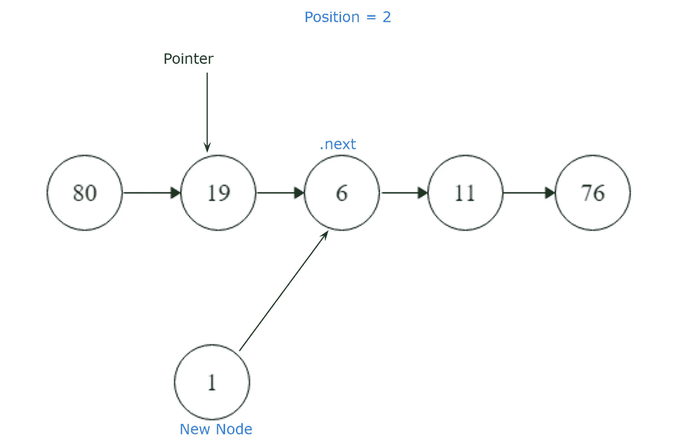
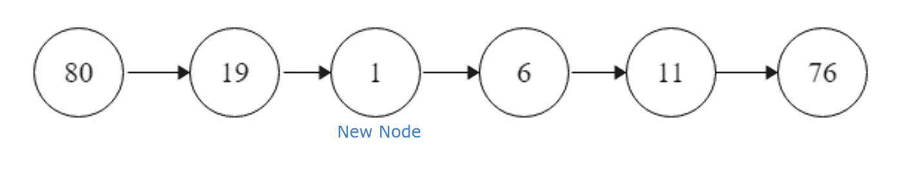
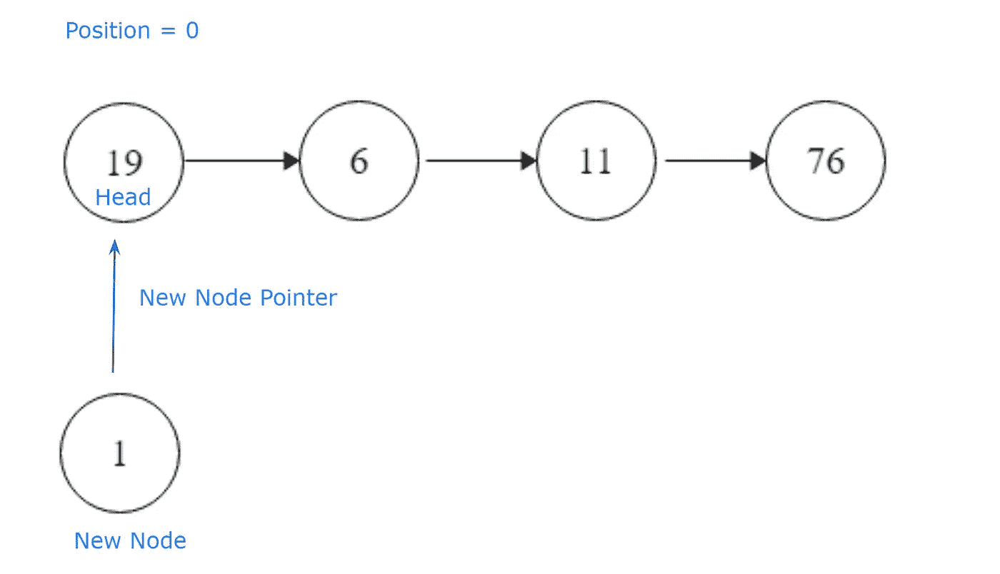
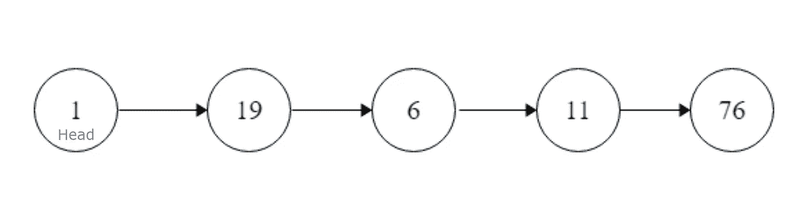

# 如何在链表中的特定位置插入一个节点

> 原文：<https://levelup.gitconnected.com/how-to-insert-a-node-at-a-specific-position-in-a-linked-list-2abc783a578b>


## 理解问题

我们有一个名为 insertNodeAtPosition 的函数，它有三个参数，head、data 和 Position。

我们的头是指向列表头的 SinglyLinkedListNode(类)指针，我们的数据是作为数据插入到我们将创建的新节点中的整数值，位置是我们应该插入新节点的从零开始的索引位置。

```
**head**: pointer to the head of the list
**data**: integer value of our new node (1)
**position**: a zero based index position (2)
```

为了在单链表中的特定位置插入一个节点，我们必须用我们的数据参数创建一个新节点，将它插入给定的位置，并返回头节点。

```
Example:If our list starts as4 -> 6 -> 2 -> 9and our **position = 2** and our **data = 3\.** Our new list will be4 -> 6 -> 3 -> 2 -> 9
```

我们必须返回对已完成列表的头节点的引用。

## 计划

我们知道，我们的第一步必须创建一个新节点，以便插入一个新节点。看一下我们的 SinglyLinkedListNode 类，我们可以看到它正在等待数据传入。

```
class SinglyLinkedListNode:
    def __init__(self, node_data):
        self.data = node_data
        self.next = None
```

通过将 new 设置为 SinglyLinkedListNode(data ),我们可以在 insertNodeAtPosition 函数定义中创建一个新节点。

```
new = SinglyLinkedListNode(data)
```

我们知道我们的位置是索引值 2，所以我们需要设置一个指向头部的指针，以便从最开始遍历列表，还需要设置一个计数器，以便在列表中逐个节点地移动指针，直到到达给定的位置。

```
pointer = head    
counter = 1
```

为了到达我们的位置，我们需要遍历列表，从头部开始。因为我们的指针已经被设置在头部，所以我们可以使用 while 循环遍历列表，直到 pointer.next 位于给定的位置。我们这样做，而指针。下一个不是没有。

```
while pointer.next is not None:
```

我们将使用指针遍历列表的每个位置，直到到达给定的位置，将 counter 设置为 counter + 1。

```
counter += 1
pointer = pointer.next
```

如果 pointer.next 最终在我们给定的位置，我们的计数器将等于我们的位置 2，我们将设置 new.next 指向 pointer.next。



然后我们将指针放在新的节点旁边，然后中断。



```
if counter == position:
    # new.next will point to pointer.next
    new.next = pointer.next
    # and our pointer.next will be equal to our new node
    pointer.next = new
    break
```

## 执行

```
# For our reference:# SinglyLinkedListNode:
#     int data
#     SinglyLinkedListNode next
#
#def insertNodeAtPosition(head, data, position): # create a new node
    new = SinglyLinkedListNode(data)
    # set a pointer to head in case our initial position is not 0
    pointer = head
    # set our counter so we can traverse through SLL
    counter = 1

    while pointer.next is not None:
        # and if our counter is equal to the position given
        if counter == position:
            # our new node will point to pointer.next
            new.next = pointer.next
            # and our pointer.next will be equal to our new node
            pointer.next = new
            break
        # we traverse the list one position at a time until 
        # counter == position
        counter += 1
        pointer = pointer.next
    # we return the head as requested
    return head
```

## 奖金

在我们给定的位置为零的情况下，或者如果我们被要求在列表的开头插入一个新的节点，我们将设置新的节点指针指向头节点。



然后我们需要设置头部到我们的新节点，并返回它。



```
if position == 0:
        # our new node will point to the head
        new.next = head
        # now head will point to the new node
        head = new
        # we then return head as requested
        return head
```

两个测试用例的执行代码将是:

```
# For our reference:# SinglyLinkedListNode:
#     int data
#     SinglyLinkedListNode next
#
#def insertNodeAtPosition(head, data, position):
    # create a new node
    new = SinglyLinkedListNode(data)
    # set a pointer to head in case our initial position is not 0
    pointer = head
    # set our counter so we can traverse through SLL
    counter = 1
    # if our given position is 0
    if position == 0:
        # our new node will point to the head
        new.next = head
        # now head will point to the new node
        head = new
        # we then return head as requested
        return head
    # while the next node away from the head node is not None
    while pointer.next is not None:
        # and if our counter is equal to the position given
        if counter == position:
            # our new node will point to pointer.next
            new.next = pointer.next
            # and our pointer.next will be equal to our new node
            pointer.next = new
            break
        # we traverse the list one position at a time until counter 
        # == position
        counter += 1
        pointer = pointer.next
    # we return the head as requested
    return head
```