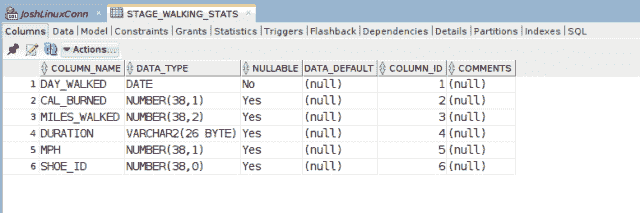
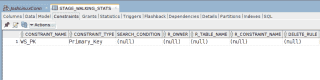
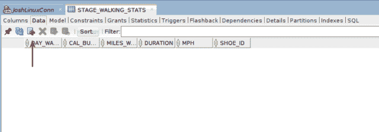
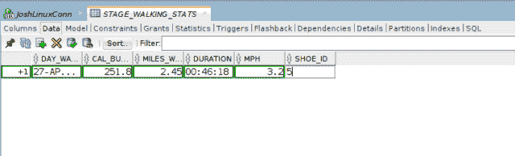
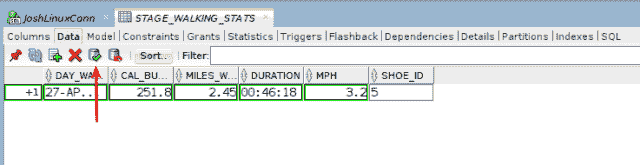
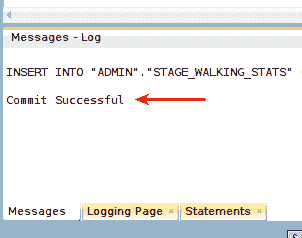
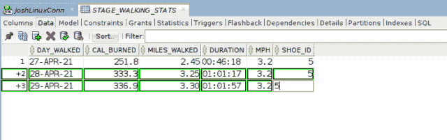
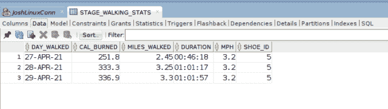
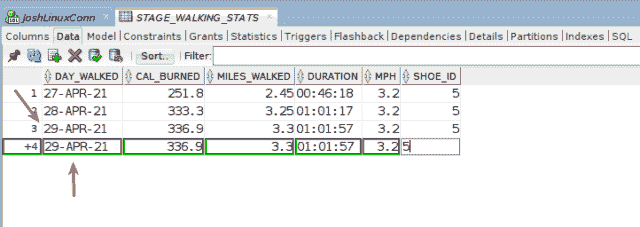
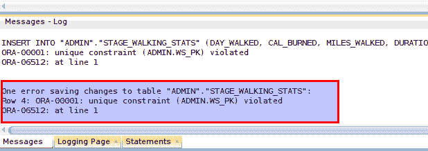

# 如何使用 Oracle SQL Developer 插入数据

> 原文：<https://levelup.gitconnected.com/how-to-insert-data-using-oracle-sql-developer-dc8827021a69>

`INSERT` [DML](https://en.wikipedia.org/wiki/Data_manipulation_language) 命令向 SQL 表中引入新的数据行。`INSERT`位于 [CRUD](https://en.wikipedia.org/wiki/Create,_read,_update_and_delete) 首字母缩略词的创建域下。使用 Oracle SQL Developer IDE 时，不需要编写`INSERT INTO`命令，IDE 界面中的可视元素有助于简化`INSERT`操作。继续阅读，通过一个简单的例子了解如何…

## 选择要插入数据的表格

在 SQL Developer 的左窗格(未显示)中双击你想要的表格，将`INSERT`数据导入。一个新的*仪表盘*将出现，包含几个不同的选项卡。

下图为*仪表盘*视图和**表格【STAGE_WALKING_STATS:** 的表格描述:

表格描述

**Constraints** 选项卡有关于表上任何约束的信息。在本例中，表 **STAGE_WALKING_STATS** 在 **DAY_WALKED** 列上有一个**主键**约束:

SQL Developer 表约束选项卡。

## 使用添加数据图标插入单行

要`INSERT`一行数据，点击文档顶部显示为绿色加号的**添加数据**图标:

添加数据图标。

在*数据行*中为您希望的每一行`INSERT`填写必要的字段值。在下面的示例中，我输入了单行数据的所有列值:

使用数据选项卡插入一行数据。

为了完成`INSERT`，提交任何新添加的行。只需单击**提交**图标(在下面的截图中用红色箭头标出)，该图标在众所周知的数据库容器符号上显示为绿色复选标记:

用提交图标按钮提交新插入。

如果`INSERT`成功并且没有出现错误，SQL Developer 将显示一条消息，指示提交成功:

成功提交消息。

## 使用添加数据图标插入多行

使用 Oracle SQL Developer 一次`INSERT`多行是完全可能的。当你填写并完成一行数据时，按键盘上的**键**。SQL Developer 会自动生成一个新的空白行。填写这些行以及任何后续行的列数据值，并继续提交新行:

使用 Oracle SQL Developer 数据选项卡插入多行

与单行示例相同，提交数据而不出现任何问题，您将收到一条*提交成功*的消息。( ***注*** :这两个步骤在这个特殊的例子中没有显示。相同的信息参见前面的单排`INSERT`部分，因为它们是相同的。)

使用 Oracle SQL Developer 数据选项卡插入多行

## 插入数据时会强制执行表约束

即使使用 Oracle SQL Developer 的可视化元素来对数据进行`INSERT`，任何表约束都会受到*的支持*。由于 **DAY_WALKED** 列日期值为‘29-APR-21’的行已经存在于 **STAGE_WALKING_STATS** 表中，由于 **DAY_WALKED** 列上的`PRIMARY KEY`约束，尝试`INSERT`一个具有该值的附加行会失败:

使用 Oracle SQL Developer 数据选项卡插入多行

Oracle SQL Developer 返回的不是*成功提交*消息，而是一个独特的违反约束的错误，如下图所示:

插入错误消息。

您可能感兴趣的其他帖子

*   [SUBSTR()字符函数— Oracle SQL 示例](https://link.medium.com/EyAiYwQQogb)
*   [如何使用 Oracle SQL 日期函数找到一个月的第一天和最后一天](https://link.medium.com/AZFz7JGYugb)
*   [使用 Oracle SQL Developer 导入 CSV 文件](https://joshuaotwell.com/import-csv-file-with-oracle-sql-developer/)

使用 Oracle SQL Developer 将数据行`INSERT`放入一个表中就是这么简单。

如果你在代码中看到任何错误，或者有任何问题或评论，请在帖子的评论部分随意添加。感谢您的阅读。

喜欢你读过的？看到什么不正确的吗？请在下面评论，感谢阅读！！！

# 行动的号召！

感谢你花时间阅读这篇文章。我真心希望你发现了一些有趣和有启发性的东西。请在这里与你认识的其他人分享你的发现，他们也会从中获得同样的价值。

访问 [Portfolio-Projects 页面](https://wp.me/P28ctb-3KD)查看我为客户完成的博客帖子/技术写作。

[**我绝对爱喝咖啡！**](https://ko-fi.com/joshlovescoffee)

要在最新的博客文章发表时收到来自本博客(“数字猫头鹰散文”)的电子邮件通知(绝不是垃圾邮件)，请点击“点击订阅！”按钮在首页的侧边栏！(如有任何问题，请随时查看 [Digital Owl 的散文隐私政策页面](https://wp.me/P28ctb-3gI):电子邮件更新、选择加入、选择退出、联系表格等……)

请务必访问[“最佳”](https://joshuaotwell.com/where-blog_post-in-digital-owls-prose-best-of/)页面，收集我的最佳博客文章。

[Josh Otwell](https://joshuaotwell.com/about/) 作为一名 SQL 开发人员和博客作者，他热衷于学习和成长。其他最喜欢的活动是让他埋头于一本好书、一篇文章或 Linux 命令行。其中，他喜欢桌面 RPG 游戏，阅读奇幻小说，并与妻子和两个女儿共度时光。

免责声明:本文中的例子是关于如何实现类似结果的假设。它们不是最好的解决方案。所提供的大多数(如果不是全部)示例都是在个人发展/学习工作站环境中执行的，不应被视为生产质量或就绪。您的特定目标和需求可能会有所不同。使用那些最有利于你的需求和目标的实践。观点是我自己的。

*原载于 2021 年 6 月 2 日 https://joshuaotwell.com***。*(注意:点击所提供的链接会将您带离介质，转到我的个人网站)*