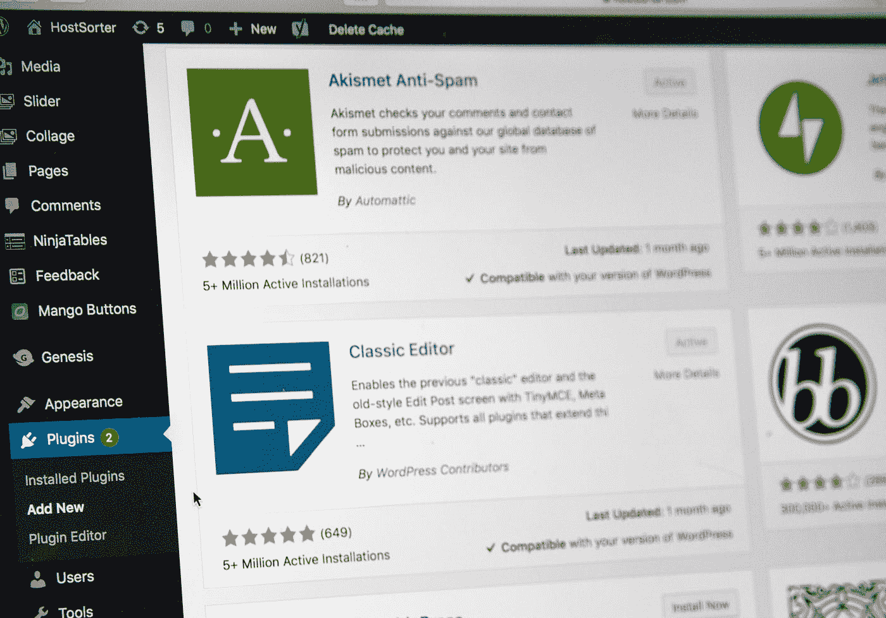
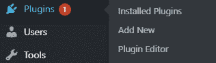
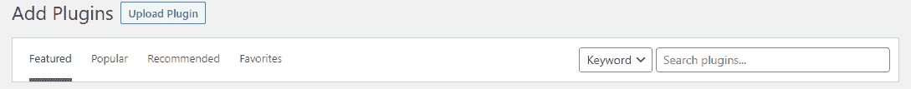
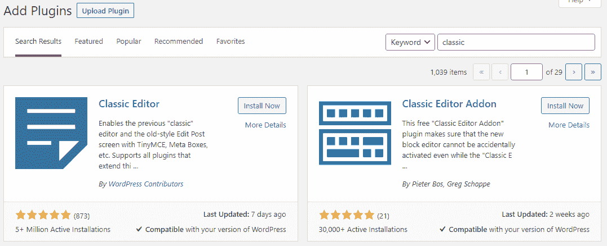
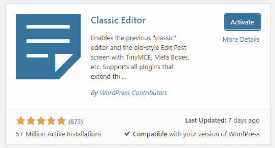
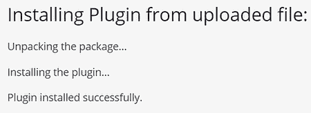

# 如何安装 WordPress 插件

> 原文：<https://levelup.gitconnected.com/how-to-install-a-wordpress-plugin-c2a8b33c3f9a>

如果你是一个初学者，刚刚开始使用这个网站，那么这篇文章将会给你极大的帮助。我将向你展示如何以各种不同的方式安装插件，但是首先，让我们向你介绍什么是插件。

斯蒂芬·菲利普斯-Hostreviews.co.uk 在 [Unsplash](https://unsplash.com?utm_source=medium&utm_medium=referral) 上的照片

# 什么是插件？

简短的回答和每个人最容易理解的方式是，插件就像你的 WordPress 站点的应用程序。它们增加了不同的功能，从购物车到幻灯片。大多数时候，如果没有安装插件，你的网站并不完整。所以，花点时间研究一下你的网站需要什么，点击“插件”->“添加新项”后，试着在你的仪表盘项目下的插件商店里找到它们

也可以有插件，帮助实用程序，如'自动优化'顾名思义，它在你的网站上做优化，使其加载速度更快。它优化了 JavaScript 代码，也修复了 CSS 和图像。这是对插件舰队的一个很好的补充，确实创造了奇迹。你可以通过在谷歌的[页面速度洞察](https://developers.google.com/speed/pagespeed/insights/)上检查你的网站速度来检查这个插件的区别。

# **为什么要用插件？**

作为初学者，这是一个很好的问题。你可能会觉得你找到了一个奇妙的主题，拥有你所需要的一切。所以你现在会问，当你觉得你的网站不需要添加任何东西的时候，为什么还要使用插件。好吧，让我告诉你你错了。

一个没有插件的网站就像一辆没有任何选项的汽车一样，既无聊又不好。插件不仅仅是为了让你的网站感觉完整和功能齐全，还有一些插件可以帮助你抵御攻击者或者查看统计数据，比如“Jetpack ”,这两种功能都有。

插件让你对你的网站有更多的控制，通过插件你可以极大地改进你的产品。我之前谈到过“自动优化”，它同时也是一个非常有用和强大的实用插件。还有很多实用类型的插件，比如“Easy SSL ”,可以帮助你在网站上保存 SSL 证书，并修复你经常遇到的重定向错误。这些都很棒，让你的网站运营和维护变得更加容易。

不要忘记提到“WooCommerce”，这是一个非常强大的插件，可以在几分钟内将你的网站变成一个在线商店。是的，你听到了，在安装插件的 10 到 15 分钟内，你就可以拥有一个在线商店了。

这个插件处理从产品库存到支付的所有事情，以及在线业务需要的所有事情。对你来说，拥有所有这些工具而不使用它们是不明智的。做你的研究，找出什么是错的，或者你的网站缺少什么，然后安装一个插件来解决它。有更多的选择从来不是一件坏事。

# **使用 WordPress 插件搜索安装插件**

通过插件搜索安装插件非常简单和直观。做起来超级快，你甚至可以在没有搜索或学习任何东西的情况下就知道如何去做。不管怎样，我会告诉你怎么做，你只要按照下面的步骤做就行了。

*   你应该已经在你的**仪表板**或站点管理面板上了，它是这样找到的:【http://your-domain.com/wp-admin/】T4
*   一旦你到了那里，你应该在侧边栏菜单中搜索一个名为“**插件**的标签。您可以点击它并在该页面上找到“**添加新的**”按钮，或者将鼠标悬停在它上面并在旁边找到它，如下图所示。

*   现在你可以搜索关键词、作者，甚至是你想要的插件的标签。你也可以浏览推荐给你的特色内容，流行插件，你也可以搜索另一个 WordPress.org 用户最喜欢的插件。

*   找到你想安装的插件后，你要做的就是点击**立即安装**按钮。这将下载插件并安装它，但这不是最后一步。

*   现在安装完成后，这取决于插件是否是一个大文件需要多长时间。你必须点击“**激活**”，你可能已经猜到它会激活网站上的插件。

这是你的插件在你的网站上安装并激活的最后一步。之后你所要做的就是调整设置，享受随之而来的功能。这是目前为止安装插件最简单快捷的方法。

# **使用 WordPress 管理插件上传安装一个插件**

上传插件并通过管理插件上传来安装它并不像听起来那么复杂，但是绝对值得你花时间去学习。如果你已经购买了一个高级或专业插件，并且你已经得到了一个文件来手动安装它，因为大多数插件在插件商店里都找不到。

该文件应该是一个可安装的 zip 存档。这是一个强大的工具，但要小心，它可能会通过调用一个关键错误来伤害你的网站，这将使你的网站不可用，只有后端管理员才能让你重新登录或恢复它。

这种情况在我身上发生过很多次，大部分是因为兼容性问题，但这不是重点，我只是警告每个人这可能会发生。

*   再一次，你应该已经在你的**仪表板**或者站点管理面板上了，它是这样找到的:【http://your-domain.com/wp-admin/】T2。
*   从那里，找到“**插件**标签。
*   你可以点击它，在打开的新页面上找到“**添加新的**”按钮，或者悬停在它上面，在边上找到它，然后从那里点击它。
*   一旦你在左上方，应该有一个按钮'**上传插件**，'点击它。

*   下一个屏幕将允许您浏览您的计算机文件，搜索带有插件的 zip 存档。一旦你找到并选择了它，它应该开始上传插件到网站。‎‎‎‎

*   成功完成安装后，确保你激活了插件，并对设置做了必要的调整，以感觉更完整。

就这样，现在你已经学会了如何从 WordPress 管理插件上传中安装插件。这并不像它的名字所暗示的那样令人生畏，而且在你练习了一段时间后，你也可以很快完成这个任务。这是一种强大的安装插件的方法，总有一天你会需要使用这种方法，所以如果你学习这种方法会更好。

# **使用 FTP 手动安装 WordPress 插件**

使用 FTP 或文件传输协议程序在 WordPress 中安装插件并不是一种常用的技术。但是在一些罕见的情况下，你可能不得不使用这种方法，因为你的主机提供商可能有一些限制，不允许你用上面提到的两种方法安装插件。FTP 管理器方法对于初学者来说既不是最容易的也不是最友好的，所以在这个问题上请耐心等待，慢慢来理解正在发生的事情。

*   就像最后一种方法一样，您需要一个可安装的 zip 存档形式的插件。然而，要将它安装到您的网站上，您首先需要提取 zip 文件，这将产生一个具有确切文件名的文件夹。这是您将用来上传到您的网站文件目录的文件夹。
*   你应该打开你的主机提供商的 FTP 管理器。如果您没有或以前没有使用过，请尝试联系他们以获得用户名和密码。
*   打开 **FTP 客户端**，使用您的主机提供商提供的凭证登录。从那里，导航到/wp-content/plugins/文件夹并选择它。
*   **上传您从档案中提取的文件夹**。
*   上传完成后，您仍然需要导航回您的**仪表板- >插件- >已安装插件**，找到您已经安装的插件并激活它。激活后，确保编辑设置，然后你就完成了。

这些都是通过 FTP 管理器完成上传插件的步骤。这对于新手来说有点难理解，要成功完成第一次尝试，但在老手手里却是一个强有力的工具。让它变得如此有用的是它能够让整个网站的结构和文件都在你的手边，你可以在那里做任何你想做的改变。不过，如果你不是专业人士，不建议在那里做这些修改和编辑。

# **结束语**

到目前为止，每个人都应该很清楚使用插件对网站和他们都有好处。插件应该在你的网站上可用和安装的原因有很多，但几乎没有反对的理由。我个人不明白为什么我不应该在创建我的第一个站点后立即安装至少五个，更不用说不安装任何一个了。

它们是有用的工具，可以让我们的生活变得更轻松，我不会马上拒绝它们。你越快养成在不影响网页速度和网站性能的情况下尽可能使用它们的习惯，最终对你越有利。

你应该学习安装插件的所有方法，因为如果你打算走这条路，有一天你可能会用到它们。就像你从上面的方法中看到的那样，这些步骤并不难，而且一般来说也很简单。我希望这篇文章能帮助你学习如何安装 WordPress 插件，以及它们对你的网站的重要性。