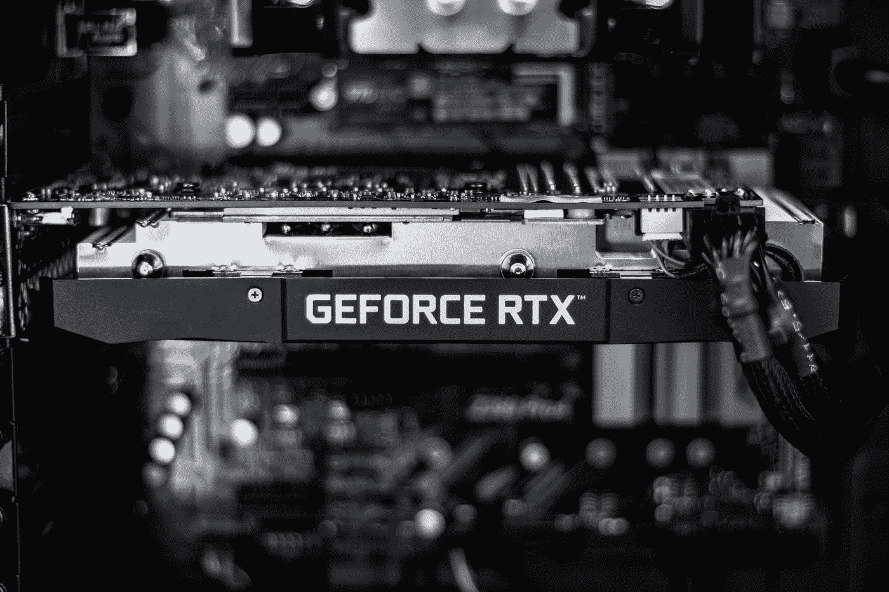

# 如何在 AWS EC2 实例上安装 Nvidia GPU 驱动程序

> 原文：<https://levelup.gitconnected.com/how-to-install-an-nvidia-gpu-driver-on-an-aws-ec2-instance-20185c1c578c>

## AWS 提供的 AMI 映像并不支持所有 AWS EC2 实例类型，但幸运的是，您可以通过不到 10 个简单的步骤自己安装一个 GPU 驱动程序。

照片由[克里斯蒂安·威迪格](https://unsplash.com/@christianw?utm_source=medium&utm_medium=referral)在 [Unsplash](https://unsplash.com?utm_source=medium&utm_medium=referral) 拍摄

假设您已经使用*深度学习 AMI GPU py torch 1 . 11 . 0(Ubuntu 20.04)20220824*映像启动了一个 AWS EC2 *p2.xlarge* 实例，现在您想要运行一些 GPU 密集型 Python 脚本，例如为时间序列预测训练一个[转换器。](https://towardsdatascience.com/how-to-make-a-pytorch-transformer-for-time-series-forecasting-69e073d4061e)

这将失败。它会告诉你这个实例没有 GPU。

如果你[想知道](https://repost.aws/questions/QUQOTlY57YQ7q2H0XxSoZboA/why-is-the-gpu-not-working-out-of-the-box-for-deep-learning-ami-ec-2-instance)为什么 GPU 不能使用深度学习 AMI 为你的 AWS EC2 p2 实例开箱即用，那是因为这些深度学习 AMI[只在特定实例类型上受支持](https://aws.amazon.com/releasenotes/aws-deep-learning-ami-gpu-pytorch-1-11-ubuntu-20-04/)，如 G3、P3、P3dn、P4d、G5、G4dn。

但是有一个解决方法，允许您在 AWS EC2 p2 实例上安装 Nvidia GPU 驱动程序，并使该实例识别 GPU，以便您的 Python / PyTorch 脚本可以使用它。

我花了几个小时试图找出如何在我的 EC2 实例上正确安装 Nvidia GPU，在 AWS wizard 同事的帮助下，终于成功了。为了省去你的麻烦，我发了这个帖子。一旦知道怎么做，真的很简单。

以下是如何在 AWS EC2 实例上安装 Nvidia GPU 驱动程序，如与深度学习 AMI 一起启动的 p2.xlarge:

1.  [启动实例并通过 ssh 连接](https://awstip.com/how-to-launch-an-aws-ec2-instance-upload-and-run-a-python-file-from-it-5eef1e1fdc04)，例如使用 Putty。在 Amazon Linux AMI 上，你必须用来连接的用户名是“ec2-user ”,但是在 Ubuntu AMI 上，用户名是“Ubuntu”
2.  运行`sudo apt-get update`
3.  运行`sudo apt-get upgrade`(注意 2 和 3 的区别)
4.  通过运行`sudo reboot`重新启动实例—当实例重新启动时，putty 会话将变为非活动状态。可能需要几分钟才能通过新会话进行连接。
5.  运行`sudo apt-get install xorg`
6.  运行`sudo apt-get install nvidia-driver-460`
7.  再次重启:`sudo reboot`
8.  运行`nvidia-smi`以验证 GPU 现已安装。
9.  要测试 PyTorch 是否能够访问和使用 GPU，您可以运行命令`pip install torch`，然后上传包含以下代码的文件，并从 Putty 命令行运行该文件，如下所示`python3 get_gpu_devices.py`，输出应该是“真”和“0”(假设您在 AWS EC2 p2.xlarge 实例上)

就是这样！我希望你喜欢这篇文章🤞

请随意关注。我有时会写一些关于 [AWS 的技巧](https://awstip.com/how-to-launch-an-aws-ec2-instance-upload-and-run-a-python-file-from-it-5eef1e1fdc04)。我也写关于[时间序列预测](https://towardsdatascience.com/how-to-make-a-pytorch-transformer-for-time-series-forecasting-69e073d4061e)、[绿色软件工程](https://kaspergroesludvigsen.medium.com/the-10-most-energy-efficient-programming-languages-6a4165126670)和[数据科学的环境影响](https://towardsdatascience.com/8-podcast-episodes-on-the-climate-impact-of-machine-learning-54f1c19f52d)🍀

请随时在 LinkedIn 上与我联系。