# 如何在 Windows 10 上安装和管理多个 Python 版本

> 原文：<https://levelup.gitconnected.com/how-to-install-and-manage-multiple-python-versions-on-windows-10-c90098d7ba5a>

## 创始人指南:

## 带有简明解释和截图的扩展教程


图片由[伊莎贝拉和路易莎·菲舍尔](https://unsplash.com/photos/9_5z24t0DFA)

> “本文的[精简版](https://medium.com/p/2d2db2c8043f)使用复制和粘贴代码来帮助您尽快获得结果，⚡”

## 检查系统类型:

在 Windows 10 中使用*系统类型*来确定操作系统是 32 位还是 64 位版本。它可以是 32 位版本，使用 32 位处理器和高达 4gb 的内存。它也可以是 64 位版本，使用 64 位处理器和高达 128 的内存。

1.  按下“⊞之窗”
2.  在搜索栏中输入“关于”
3.  点击“关于您的电脑”

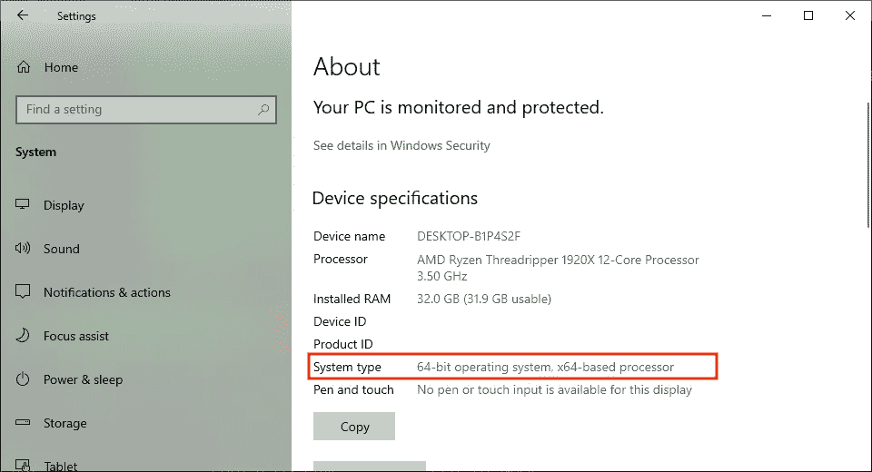

## 下载 Python:

Python 是一种面向对象的语言，以其简单的语法、代码可读性、灵活性和可伸缩性而闻名。它主要用于开发 web 和软件应用程序。它也已经成为人工智能、机器学习和数据科学最流行的语言之一。

1.  访问官网:[[3.5](https://www.python.org/downloads/release/python-354/)][[3.6](https://www.python.org/downloads/release/python-368/)][[3.7](https://www.python.org/downloads/release/python-379/)][[3.8](https://www.python.org/downloads/release/python-386/)][[3.9](https://www.python.org/downloads/release/python-390/)]
2.  滚动到“寻找特定版本？”部分
3.  滚动到“文件”部分
4.  下载与系统类型匹配的“可执行安装程序”
5.  重复

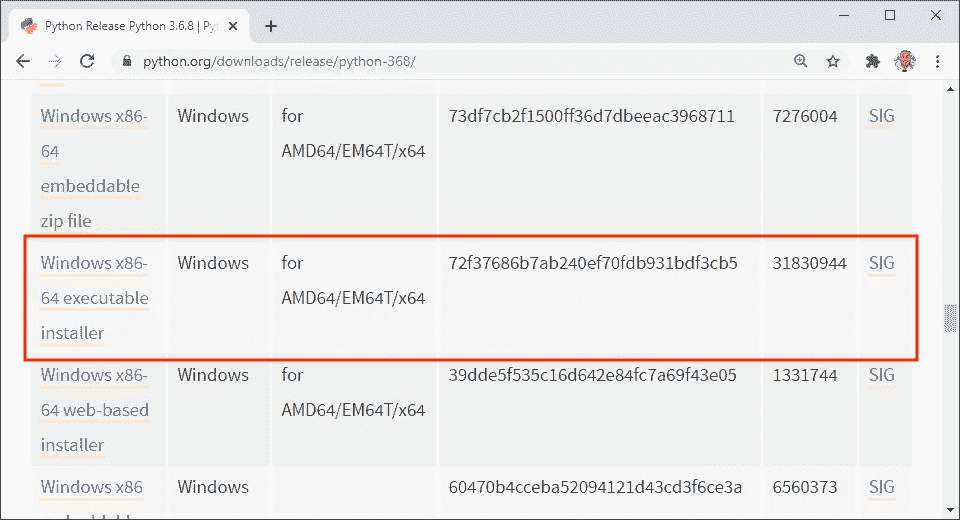

## 打开可执行文件:

*可执行文件(exe)* 是一种打开后用于运行程序和脚本的文件格式。它根据程序或脚本中包含的源代码或指令执行一项或一组任务。根据其来源是否可信，它也可能包含病毒。

1.  双击 Python 文件
2.  选中“将 Python **添加到路径”框
3.  单击“立即安装”
4.  重复

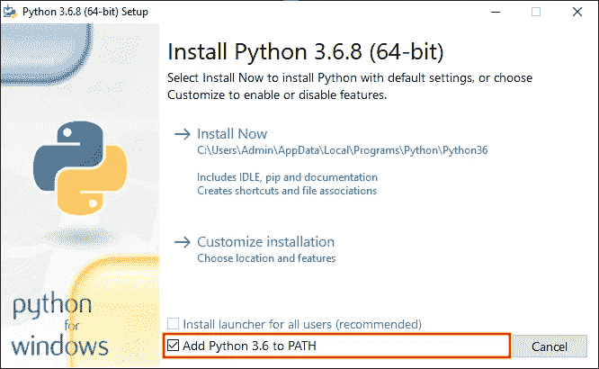

## 打开 PowerShell:

PowerShell 是一种命令行 shell[和面向对象的脚本语言，用于自动化管理任务和配置系统设置。它可以用于自动化操作系统中的几乎任何事情。它还取代了命令提示符，成为 Windows 10 的默认系统外壳。](#c4be)

1.  按下“⊞之窗”
2.  在搜索栏中输入“PowerShell”
3.  单击“以管理员身份运行”

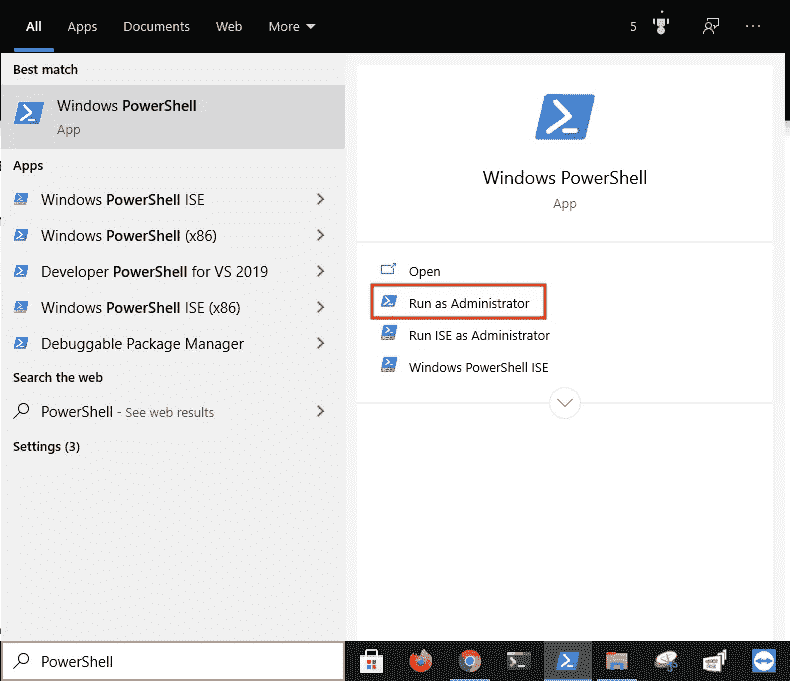

## 打开 Python 目录:

*改变目录(cd)* 命令用于将当前工作目录改变到指定目录。它可以导航到分别从根目录和当前工作目录开始的绝对路径和相对路径。它还可以导航到存储在[变量](#6492)和环境变量中的路径。

1.  从下面这些指令中复制命令
2.  将命令粘贴到 PowerShell 中
3.  按“回车”

```
cd $HOME\appdata\local\programs\python
```

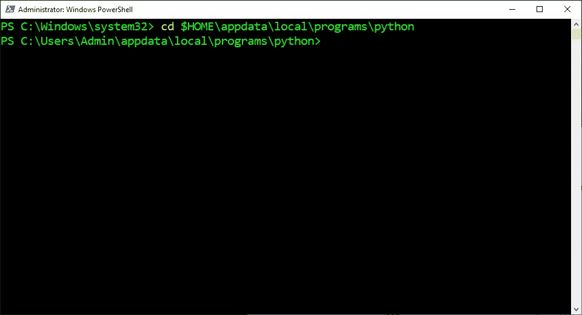

## 复制可执行文件:

*复制*命令用于将指定的文件或文件组复制到计算机上的指定位置。它可以创建完美的文件副本，并将其保存为原始或不同的文件名。它还会自动覆盖同名文件，而不要求确认。

1.  从以下这些说明中找到版本
2.  复制提供的命令
3.  将命令粘贴到 PowerShell 中
4.  按“回车”
5.  重复

```
**Python 3.5:**
copy python35\python.exe python35\python35.exe**Python 3.6:** copy python36\python.exe python36\python36.exe**Python 3.7:** copy python37\python.exe python37\python37.exe**Python 3.8:** copy python38\python.exe python38\python38.exe**Python 3.9:** copy python39\python.exe python39\python39.exe
```

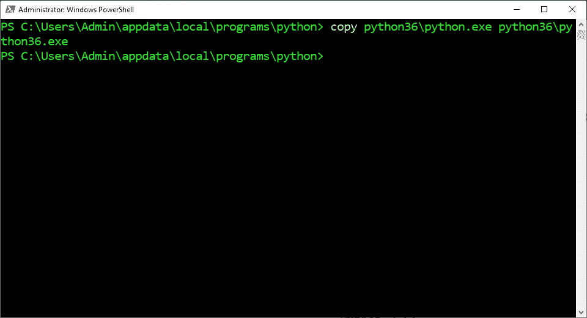

## 打开环境变量:

*环境变量*是由计算机自动创建和维护的变量。它帮助系统知道在哪里安装文件、查找程序以及检查用户和系统设置。它也可以被计算机上任何地方的图形和命令行程序使用。

1.  按下“⊞之窗”
2.  在搜索栏中输入“环境变量”
3.  单击“编辑系统环境变量”
4.  单击“环境变量…”

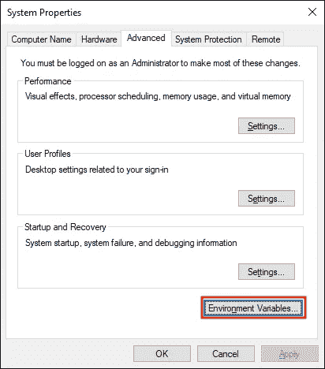

## 打开路径:

*路径*是一个环境变量，包含计算机用来查找可执行文件的目录列表。它从上到下在列表的每个目录中查找请求的可执行文件。一旦找到匹配的可执行文件并运行程序或命令，它也会停止搜索。

1.  在“用户变量”部分选择“路径”
2.  点击“编辑”

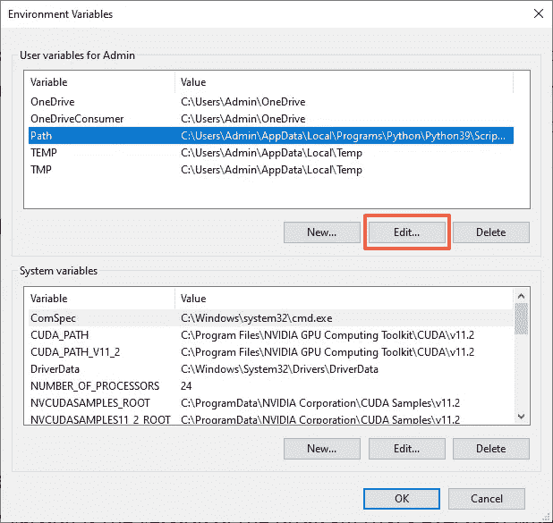

## 设置默认版本:

*默认版本*是调用命令时执行的程序版本。它从 PATH 环境变量的目录中选择第一个与命令匹配的可执行文件。这也取决于目录的顺序，但也可以手动设置。

1.  从以下这些说明中找到版本
2.  在路径中选择提供的路径
3.  点击“上移”
4.  单击“上移”,直到提供的路径成为顶部的两个项目
5.  单击“确定”
6.  单击“确定”
7.  单击“确定”

```
**Python 3.5:**
c:\users\admin\appdata\local\programs\python\python35\scripts\
c:\users\admin\appdata\local\programs\python\python35\**Python 3.6:**
c:\users\admin\appdata\local\programs\python\python36\scripts\
c:\users\admin\appdata\local\programs\python\python36\**Python 3.7:**
c:\users\admin\appdata\local\programs\python\python37\scripts\
c:\users\admin\appdata\local\programs\python\python37\**Python 3.8:**
c:\users\admin\appdata\local\programs\python\python38\scripts\
c:\users\admin\appdata\local\programs\python\python38\**Python 3.9:**
c:\users\admin\appdata\local\programs\python\python39\scripts\
c:\users\admin\appdata\local\programs\python\python39\
```

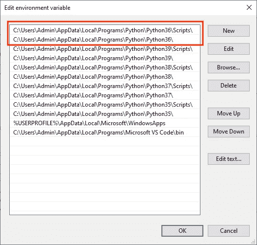

## 检查默认版本:

*版本(V)* 选项用于检查哪个版本的 Python 当前被选为默认版本。它由句点分隔的三个数字组成，分别代表[主](#ec7f)、[次](#2307)和[微](#6ac9)版本号。如果计算机上尚未安装 Python，它还会显示一条错误消息。

1.  从下面这些指令中复制命令
2.  将命令粘贴到 PowerShell 中
3.  按“回车”

```
python --version
```

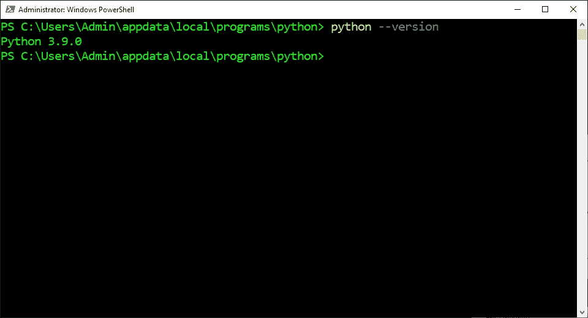

## 使用特定的 Python 解释器:

*解释器*是一个程序，它通读以人类可读编程语言编写的指令，并从上到下执行这些指令。它将每条指令翻译成硬件可以理解的机器语言，执行它，然后继续下一条指令。

1.  从以下这些说明中找到版本
2.  复制提供的命令
3.  将命令粘贴到 PowerShell 中
4.  按“回车”

```
**Python 3.5:**
python35**Python 3.6:** python36**Python 3.7:** python37**Python 3.8:** python38**Python 3.9:** python39
```

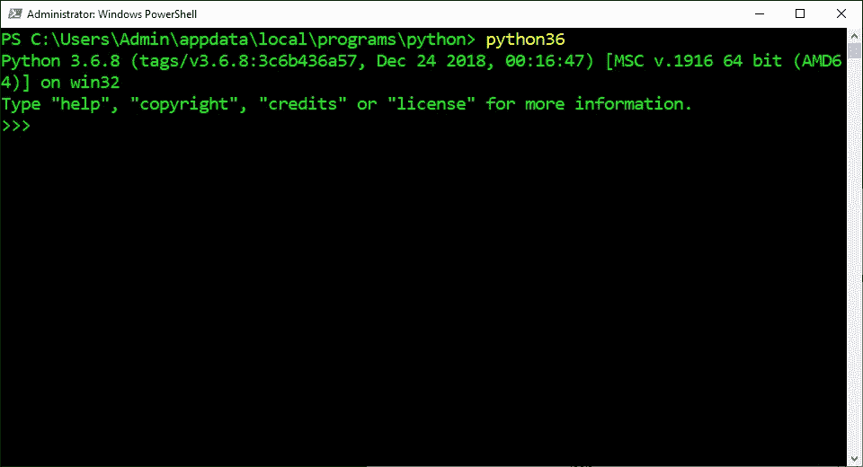

## 退出 Python 解释器:

Exit 命令是 Python 中的一个内置函数，用于从交互式 shell 内部终止 Python 解释器。它会引发“系统退出”异常，该异常会退出解释器而不打印堆栈跟踪。它还应该只在交互式 shell 中使用，而不应该在生产代码中使用。

1.  从下面这些指令中复制命令
2.  将提供的命令粘贴到 PowerShell 中
3.  按“回车”

```
exit()
```

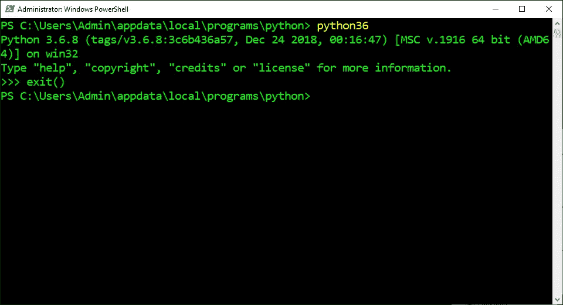

## 打开桌面目录:

*改变目录(cd)* 命令用于将当前工作目录改变到指定目录。它可以导航到分别从根目录和当前工作目录开始的绝对路径和相对路径。它还可以导航到存储在变量和环境变量中的路径。

1.  从下面这些指令中复制命令
2.  将提供的命令粘贴到 PowerShell 中
3.  按“回车”

```
cd $HOME\desktop
```

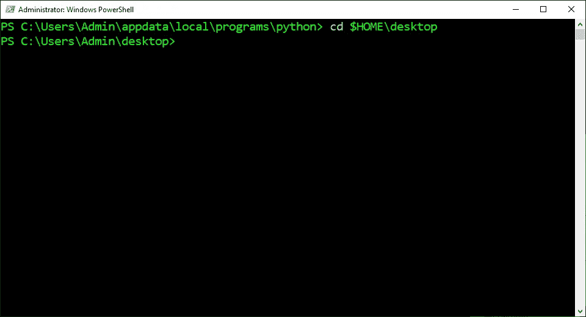

## 创建虚拟环境:

虚拟环境是一个独立的 Python 安装目录，它有自己的解释器、站点包和脚本。它主要用于防止来自不同项目的[依赖关系](#6c33)之间的版本冲突。它还被用来满足来自 GitHub 的不同程序的依赖需求。

1.  从以下这些说明中找到版本
2.  复制提供的命令
3.  将命令粘贴到 PowerShell 中
4.  按“回车”

```
**Python 3.5:**
python35 -m venv venv35**Python 3.6:**
python36 -m venv venv36**Python 3.7:**
python37 -m venv venv37**Python 3.8:**
python38 -m venv venv38**Python 3.9:**
python39 -m venv venv39
```


## 激活虚拟环境:

*激活*脚本用于启动虚拟环境。它将虚拟环境路径添加到 path 环境变量中，该变量将新的 Python 解释器和包管理器设置为默认版本。它还设置要安装在虚拟环境安装目录中的包。

1.  从以下这些说明中找到版本
2.  复制提供的命令
3.  将命令粘贴到 PowerShell 中
4.  按“回车”

```
**Python 3.5:** venv35\scripts\activate**Python 3.6:**
venv36\scripts\activate**Python 3.7:**
venv37\scripts\activate**Python 3.8:**
venv38\scripts\activate**Python 3.9:** venv39\scripts\activate
```


## 检查可执行文件:

*Get-Command(GCM)***命令用于查找计算机上安装的所有 cmdlets、别名、函数、过滤器、脚本和程序。它按命令类型、模块、名称、动词、名词和参数进行搜索。这将显示有关命令类型、名称、版本和来源的数据。**

1.  **从下面这些指令中复制命令**
2.  **将命令粘贴到终端**
3.  **按“回车键”**

```
$(get-command python).path
```

**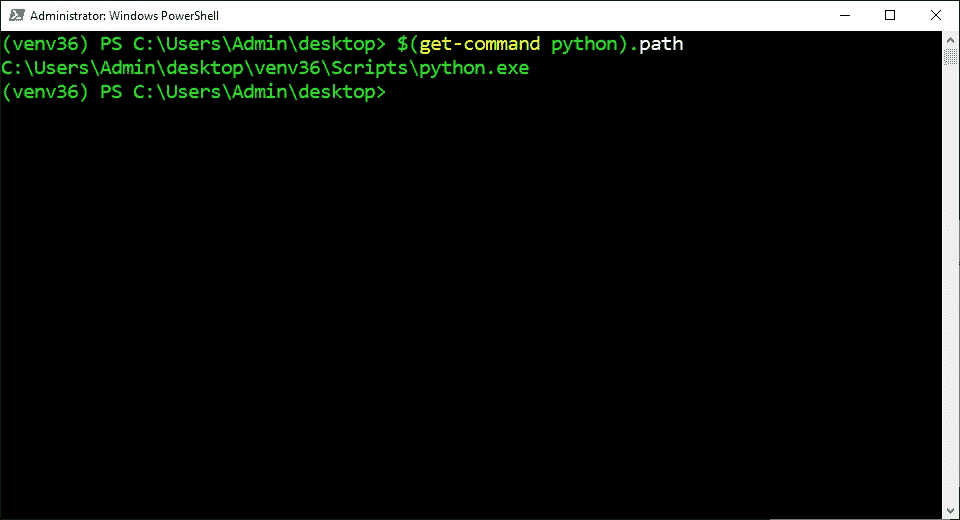**

## **停用虚拟环境:**

***停用*命令用于停止虚拟环境。它从 path 环境变量中删除了虚拟环境路径，该变量将最后一个 Python 解释器和包管理器设置为默认版本。它还设置要安装在系统 Python 安装目录中的包。**

1.  **从下面这些指令中复制命令**
2.  **将命令粘贴到 PowerShell 中**
3.  **按“回车”**

```
deactivate
```

**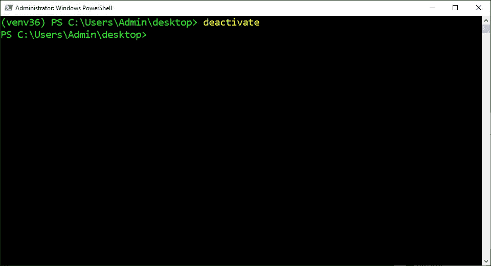**

> **“希望这篇文章能帮助您获得👯‍♀️🏆👯‍♀️，记得订阅获取更多内容🏅"**

## **后续步骤:**

**这篇文章是一个迷你系列的一部分，帮助读者设置他们开始学习人工智能、机器学习、深度学习和/或数据科学所需的一切。它包括包含复制和粘贴代码的说明和截图的文章，以帮助读者尽快获得结果。它还包括一些文章，包含带有解释和截图的说明，以帮助读者了解正在发生的事情。**

```
**Linux:**
01\. [Install and Manage Multiple Python Versions](https://medium.com/p/916990dabe4b)
02\. [Install the NVIDIA CUDA Driver, Toolkit, cuDNN, and TensorRT](https://medium.com/p/cd5b3a4f824)
03\. [Install the Jupyter Notebook Server](https://medium.com/p/b2c14c47b446)
04\. [Install Virtual Environments in Jupyter Notebook](https://medium.com/p/1556c8655506)
05\. [Install the Python Environment for AI and Machine Learning](https://medium.com/p/765678fcb4fb)**WSL2:**
01\. [Install Windows Subsystem for Linux 2](https://medium.com/p/cbdd835612fb)
02\. [Install and Manage Multiple Python Versions](https://medium.com/p/1131c4e50a58)
03\. [Install the NVIDIA CUDA Driver, Toolkit, cuDNN, and TensorRT](https://medium.com/p/9800abd74409) 
04\. [Install the Jupyter Notebook Server](https://medium.com/p/7c96b3705df1)
05\. [Install Virtual Environments in Jupyter Notebook](https://medium.com/p/3e6bf456041b)
06\. [Install the Python Environment for AI and Machine Learning](https://medium.com/p/612240cb8c0c)
07\. [Install Ubuntu Desktop With a Graphical User Interface](https://medium.com/p/95911ee2997f) (Bonus)**Windows 10:**
01\. [Install and Manage Multiple Python Versions](https://medium.com/p/c90098d7ba5a)
02\. [Install the NVIDIA CUDA Driver, Toolkit, cuDNN, and TensorRT](https://medium.com/p/55febc19b58)
03\. [Install the Jupyter Notebook Server](https://medium.com/p/e8f3e9436044)
04\. [Install Virtual Environments in Jupyter Notebook](https://medium.com/p/5c189856479)
05\. [Install the Python Environment for AI and Machine Learning](https://medium.com/p/23c34b2baf12)**Mac:** 01\. [Install and Manage Multiple Python Versions](https://medium.com/p/ca01a5e398d4)
02\. [Install the Jupyter Notebook Server](https://medium.com/p/2a276f679e0)
03\. [Install Virtual Environments in Jupyter Notebook](https://medium.com/p/e3de97491b3a)
04\. [Install the Python Environment for AI and Machine Learning](https://medium.com/p/2b2353d7bcc3)
```

## **词汇表:**

***外壳*是一个解释器，它将[命令行界面](#529f)呈现给用户，并允许他们与[内核](#74ed)交互。它让他们通过键盘输入命令来控制系统。它还将命令从编程语言翻译成内核的机器语言。
[回车](#eb53)**

***命令行界面(CLI)* 是一个接受用户文本输入以在操作系统上运行命令的程序。它允许他们配置系统、安装软件和访问图形用户界面中不可用的功能。它也被称为终端或控制台。
[ [返回](#c4be)**

**内核是操作系统的核心程序，控制着电脑的一切。它简化了内存管理、进程管理、磁盘管理和任务管理。它还有助于程序和硬件之间用机器语言进行交流。
[ [返回](#c4be)**

***变量*是用来存储不同类型值的容器。它可以通过在指定的变量名和值之间放置一个等号来赋值或更新一个值。它还可以通过在现有变量名前放置一个美元符号来引用存储的值。
[ [返回](#14cb)**

**主要版本是一个数字，表示对程序进行重大更改的更新。它可以添加与以前版本不兼容的不同架构、特性和功能。这通常会导致用以前版本构建的程序停止工作。
[返回](#0f71)**

***次要*版本是一个表示对程序进行适度修改的更新的数字。它可以添加与最新主要更新兼容的小特性和功能。这通常不会导致用以前的小更新构建的程序出现问题。
[返回](#0f71)**

**微型版本是一个数字，表示对程序进行非常小的改动的更新。它可以添加与以前的更新兼容的错误修复和性能增强。这不会导致用以前的更新构建的程序出现问题。
[回车](#0f71)**

***站点包*是一个目录，位于系统范围的 Python 安装目录中。它表示包管理器用来安装 Python 包的默认位置。它还表示 Python 用来导入已经安装的 Python 包的目录。
[ [返回](#d159)**

**依赖项是一个附加的二进制包，特定的二进制包需要它才能正常工作。它可能需要多个依赖项来构建几乎所有由包管理器发布的程序。它也会被一些包管理器自动下载和安装。
[ [返回](#d159)**