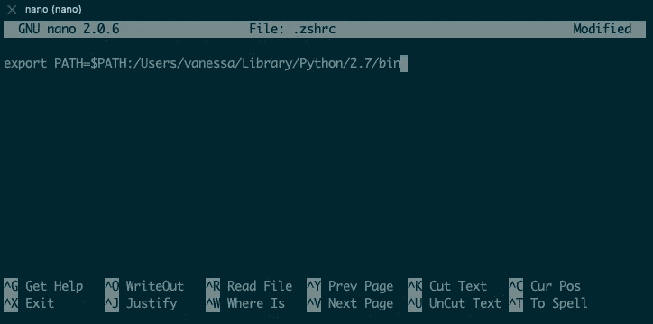
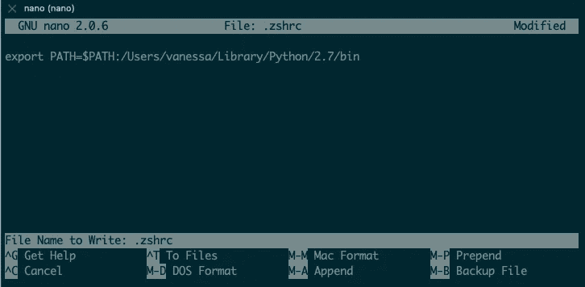
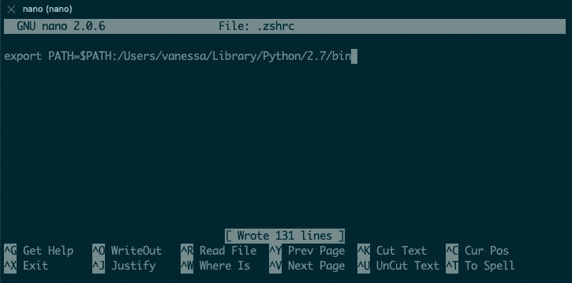
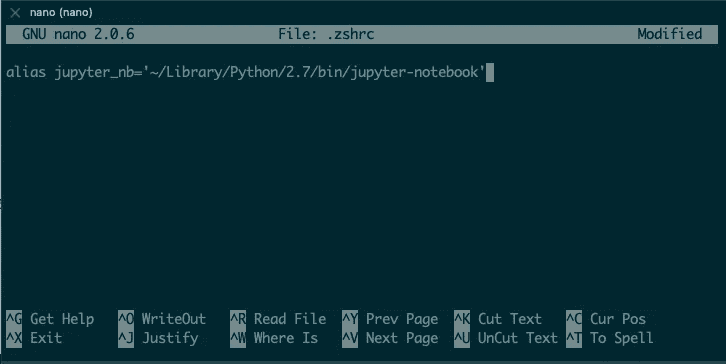
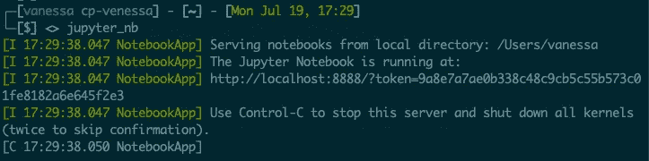

# Mac 用户如何安装和运行 Jupyter 笔记本

> 原文：<https://levelup.gitconnected.com/how-to-install-and-run-jupyter-notebook-for-mac-users-d320e3d62b83>


伊恩·杜利在 [Unsplash](https://unsplash.com?utm_source=medium&utm_medium=referral) 上拍摄的照片

## 帮助你克服常见障碍的快速教程

我假设你已经知道朱庇特笔记本是什么，这就是你在这里的原因。主要目的是帮助您跨越启动和运行的障碍。很多人第一次安装 Jupyter 笔记本时会遇到以下错误:

```
Exception: Jupyter command `jupyter-notebook` not found.
```

在下面的文章中，我将解释为什么会出现这种错误，并为您提供两种解决方案。作为一名 Python 开发人员，Jupyter Notebook 是编写和调试代码的一种非常有用和高效的方式。不要放弃它！

希望我能把自己几个小时的困惑浓缩成你几分钟的轻松时光。

# 装置

[](https://jupyter.org/install) [## Jupyter 项目

### 安装指南包含更详细的说明 JupyterLab 可以与 mamba 和 conda 一起安装:或者注意…

jupyter.org](https://jupyter.org/install) 

如果您使用`pip`，您可以安装它:

```
pip install notebook# if you run into user permissions, use this
pip install --user notebook
```

一旦完成，在他们的文档中他们会说，“恭喜！你已经安装好了。用命令`jupyter notebook`运行它。

所以，请输入以下命令:

```
jupyter notebook
```

## 但是您遇到了这个可怕的错误:

```
Traceback (most recent call last):
  File "/usr/local/bin/jupyter", line 8, in <module>
    sys.exit(main())
  File "/Library/Python/2.7/site-packages/jupyter_core/command.py", line 247, in main
    command = _jupyter_abspath(subcommand)
  File "/Library/Python/2.7/site-packages/jupyter_core/command.py", line 134, in _jupyter_abspath
    'Jupyter command `{}` not found.'.format(jupyter_subcommand)Exception: Jupyter command `jupyter-notebook` not found.
```

那不可能是对的。你刚刚安装了它。你做`pip list`，看到它肯定在那里。在你开始安装和重新安装之前(像我一样)，试试这个:

# 1 |将 python 添加到您的环境中$PATH

我不得不谷歌:python 路径是什么？

> 将 python 添加到您的路径基本上意味着，您告诉您的计算机在指定的目录路径中搜索命令，这样您就不必每次都写完整的路径。你可以直接输入命令。

要像现在这样运行 Jupyter Notebook，您可能需要这样做:

```
~/Library/Python/2.7/bin/jupyter-notebook
```

去试试吧。现在应该能用了！

这是因为你的电脑不知道去哪里找`jupyter notebook`命令，所以我们每次都要指定完整的路径。

为了使事情变得简单，我们需要将 `jupyter-notebook`之前的所有东西**添加到我们的环境路径中。**

首先，按下 **Control + C** 键，然后按下**“y”**键确认关机。

然后在您的终端中执行以下操作:

```
# Enter this to see what your current environment variables are.
echo $PATH# It should look something like this
/usr/local/bin:/usr/bin:/bin:/usr/sbin:/sbin# Run this to add python to your path.
export PATH=$PATH:~/Library/Python/2.7/bin# OR this, depending on which version of python you are using.
export PATH=$PATH:~/Library/Python/3.8/bin# Run this again.
echo $PATH# Now it should look something like this
/usr/local/bin:/usr/bin:/bin:/usr/sbin:/sbin:**~/Library/Python/2.7/bin**
```

恭喜你！您已经将 python 添加到了您的路径中。现在，当您想要运行 Jupyter Notebook 时，只需输入:

```
jupyter notebook
```

但是我们还没有完成。

# 2 |保持对$PATH 的更改

打开一个**新的**终端会话。

运行`echo $PATH`

你会发现我们刚刚做的一切都消失了。回到起点。这是因为环境变量在会话中是**不持久的**。

为了使它持久，我们需要对 shell 的配置脚本进行修改。每当您打开一个新的 shell 会话时，都会运行这个脚本。

> 注意:我将展示一个带有。因为我用 zsh。**如果你使用 bash** ，可以按照以下步骤，只需**替换即可。zshrc 与。bash_profile** 。

```
# Return to home directory ~
cd# Use nano to access and edit the file
nano .zshrc
```

您将看到下面的屏幕。
复制/粘贴或键入我们在上一节中使用的“导出路径=…”语句。



一旦完成，做**控制+ O** 写出。
您将看到下面的屏幕。



然后**按回车键**保存您的更改。你会看到如下所示的[写了数字行]。



按下 **Control + X** 退出 nano。

回到您的终端，运行下面的命令以确保您的终端正在从文件中提取或 *sourcing* 您刚才所做的更改(记住每次更改 shell 配置脚本时都要这样做！):

```
source .zshrc
```

打开一个新的终端会话并运行`echo $PATH`。

python 路径现在应该在环境变量 path 中了！您还可以通过在终端中输入`env`来检查您的环境变量。

> 提示:如果您打开了多个终端会话，请记住，您需要关闭旧的会话才能看到新的更改。一个会话中的更改不会延续到其他打开的会话。

## 替代解决方案:使用别名

在您的 shell 配置脚本中，您可以通过执行第 2 节中的相同步骤来创建别名或快捷方式命令，但是将“导出路径=…”步骤替换为以下内容:

```
alias CUSTOM_ALIAS_NAME='COMMAND'
```

**示例:**



保存后，记得运行:

```
source .zshrc
```

现在，当我想运行 Jupyter Notebook 时，我可以使用我创建的别名，而无需将 python 添加到环境路径变量中:



请不要犹豫提出任何问题，分享任何其他障碍，或指出文章中的任何错误。谢谢大家！