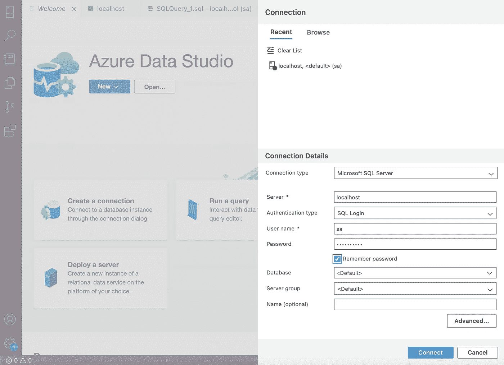

# 如何在 Mac 上安装和运行微软 SQL Server 和 MySQL

> 原文：<https://levelup.gitconnected.com/how-to-install-and-run-microsoft-sql-server-mysql-on-mac-421f9e4d9e9c>

## 在 Mac 上运行微软 SQL Server 和 MySQL 的指南


由[米哈伊尔·费申科](https://unsplash.com/@proggga?utm_source=unsplash&utm_medium=referral&utm_content=creditCopyText)在 [Unsplash](https://unsplash.com/s/photos/databases?utm_source=unsplash&utm_medium=referral&utm_content=creditCopyText) 拍摄的照片

如果你熟悉 SQL 查询，你可能知道这两个软件。说到 Windows 操作系统，安装微软 SQL Server 和 MySQL 是相当容易的。但是当你有一台 Mac 作为你的本地工作站时，你不得不采取一些额外的步骤来安装和正常运行它们。

在本文中，我将一步一步地解释如何在 Mac 电脑上安装这两个应用程序。如果你愿意，你可以跟随我，或者如果你已经知道一些步骤，你可以跳过它们，到需要的地方去。

# 1.如何在 Mac 上运行 Microsoft SQL Server

在这个场景中，我们在 Docker 的帮助下安装并运行 Microsoft SQL Server。

## 第一步:

首先，如果你没有 Docker，你需要把它下载到你的本地机器上。使用下面的链接下载 Docker 并安装在您的本地机器上。

[](https://www.docker.com/products/docker-desktop) [## 用于 Mac 和 Windows 的 Docker 桌面

### Docker 订阅服务协议已更新。我们的 Docker 订阅服务协议包括一项更改…

www.docker.com](https://www.docker.com/products/docker-desktop) 

您可以使用下面的命令来验证 Docker 安装。

```
$ docker --version
```

## 第二步:

之后，您需要从 Microsoft Container Registry 中拉出 SQL Server 2019 Linux 容器映像。打开终端，粘贴下面的命令*【确保 docker 在后台运行】。*

你可以从[这里](https://hub.docker.com/_/microsoft-mssql-server)找到相关的 Docker 图片。

```
$ docker pull mcr.microsoft.com/mssql/server:2019-latest
```

然后可以运行`docker images`命令，验证 docker 镜像是否已经被成功拉取。

## 步骤 03:

然后你需要运行上面的 docker 容器。以便将下面的命令粘贴到终端*[确保您为" SA_PASSWORD=* yourStrong(！)密码*字段；您的密码应至少包含 8 个字符，包括大写字符、小写字符、10 位数字和符号]*

```
$ docker run -e "ACCEPT_EULA=Y" -e "SA_PASSWORD=yourStrong(!)Password" -p 1433:1433 --name mssql -d mcr.microsoft.com/mssql/server:2019-latest
```

*【这里，您需要为****SA _ PASSWORD****字段添加一个密码，并且您可以用* `*--name*` *标志来命名您的容器。* `*-d*` *标志代表运行上述命令后释放终端的分离模式】。*

然后运行`docker ps`命令来验证您的容器是否已经开始运行。如果你的容器在启动几秒钟后停止，运行`docker ps -a`命令& `docker logs <container-id>`来检查有什么错误。

## 步骤 04:

接下来，你需要通过 npm 安装`**sql-cli**`。为此，在您的终端上使用下面的命令*【在继续之前，确保您已经在 Mac 上安装了 npm】。*

如果您的 Mac 上没有安装 npm，请访问此[链接](https://nodejs.org/en/download/)并在 Mac 上安装 npm。

```
$ npm install -g sql-cliOR$ sudo npm install -g sql-cli
```

## 第五步:

然后，您需要启动 SQL server。为此，请在您的终端上使用下面的命令。

```
$ mssql -u sa -p <yourStrong(!)Password>
```

如果到目前为止您已经正确地配置了它，那么您应该会在您的终端中看到`mssql>`提示符。

然后运行`select @@version`来验证连通性。

```
$ mssql -u sa -p yourStrong(!)PasswordConnecting to localhost...donesql-cli version 0.6.2Enter ".help" for usage hints.mssql> select @@version--------------------------------------------------------------------Microsoft SQL Server 2019 (RTM-CU15) (KB5008996) - 15.0.4198.2 (X64)Jan 12 2022 22:30:08Copyright (C) 2019 Microsoft CorporationDeveloper Edition (64-bit) on Linux (Ubuntu 20.04.3 LTS) <X64>1 row(s) returnedExecuted in 1 msmssql>
```

## 步骤 06:

接下来，我们需要安装一个 GUI。为此，我们使用了 **Azure Data Studio** 。你可以通过下面的链接下载 Azure Data Studio。

[](https://docs.microsoft.com/en-us/sql/azure-data-studio/download-azure-data-studio?view=sql-server-ver15&viewFallbackFrom=sql-server-ver15%5D) [## 下载并安装 Azure Data Studio-Azure Data Studio

### Azure Data Studio 是一个跨平台的数据库工具，面向使用内部和云数据平台的数据专业人员…

docs.microsoft.com](https://docs.microsoft.com/en-us/sql/azure-data-studio/download-azure-data-studio?view=sql-server-ver15&viewFallbackFrom=sql-server-ver15%5D) 

*【确保下载 macOS 的相关文件】。*

下载并解压缩软件后，您将能够通过给出一个**用户名&密码**自动连接到本地主机连接。

如果您没有自动连接到您的本地主机连接，请尝试通过给出**服务器名称**、**用户名**和**密码**来手动建立连接。然后您将能够连接到**本地主机**。

在 Azure Data Studio 窗口中，点击**创建连接**并输入以下信息，然后点击**连接**。

```
server -> localhostusername -> sapassword -> yourStrong(!)Passwordthen click **connect**
```



作者截图| Azure Data Studio —创建连接

如果你试了几次都无法建立连接，不要担心；首先，通过`docker rm <container id>`命令删除之前创建的 docker 容器，然后使用`docker rmi <docker-image-name with tag>`命令删除 docker 映像。一旦您删除了所有内容，再从头开始*【确保您根据约束在* `*docker run*` *命令中设置了强密码】。*

## 步骤 07:

一旦通过 Azure Data Studio 获得了连接，就可以运行 SQL 查询并完成工作。

## 步骤 08:

一旦你完成了你的工作。您可以保存您的工作并退出工作区和 **mssql 提示符**【按 **ctrl+c** 】并使用`docker stop <container-id>`命令停止正在运行的 Docker 容器。一旦您想重新打开它，重新启动现有的 docker 容器，并通过提供您的用户名和密码的终端启动 SQL server。

```
$ mssql -u sa -p yourStrong(!)Password
```

然后再次打开 Azure Data Studio，继续您的工作。

## 参考资料:

*   [快速启动:使用 Docker 运行 SQL Server 容器映像](https://docs.microsoft.com/en-us/sql/linux/quickstart-install-connect-docker?view=sql-server-ver15&pivots=cs1-bash)
*   [Docker 桌面](https://www.docker.com/products/docker-desktop)
*   [下载并安装 Azure Data Studio](https://docs.microsoft.com/en-us/sql/azure-data-studio/download-azure-data-studio?view=sql-server-ver15)

# 2.如何在 Mac 上运行 MySQL

在这个场景中，您可以在 Mac 上使用**MySQL work bench**&**MySQL Community Server**执行 SQL 查询。

## 第一步:

首先，你需要下载两个软件到你的 Mac 电脑上，即**MySQL work bench**&**MySQL Community Server**，以便在你的 Mac 电脑上执行 SQL 查询。

使用以下链接将它们下载到您的计算机上。

[](https://dev.mysql.com/downloads/workbench/) [## MySQL::下载 MySQL 工作台

### MySQL Workbench 为数据库管理员和开发人员提供了一个集成的工具环境，用于:数据库设计和建模

dev.mysql.com](https://dev.mysql.com/downloads/workbench/) [](https://dev.mysql.com/downloads/mysql/) [## MySQL::下载 MySQL 社区服务器

### MySQL 社区版是世界上最流行的开源数据库的免费下载版本，它是…

dev.mysql.com](https://dev.mysql.com/downloads/mysql/) 

## 第二步:

安装这两个软件后，您可以通过 MySQL Workbench 建立 SQL 连接，并根据自己的喜好执行 SQL 查询。

首先，您需要打开“系统偏好设置”并选择 MySQL(很可能位于“系统偏好设置”窗口的底部)。然后点击启动 MySQL 服务器。接下来，打开 MySQL 工作台，用连接名、用户名和密码创建一个新连接。然后，您将能够访问 MySQL 服务器并运行您的 SQL 查询。

感谢您的阅读，希望您对本文中的信息感兴趣。如果你有任何关于安装软件的问题，请给我留言。

快乐学习！😀

# 为初学者下载 Docker PDF🎉

[](https://www.buymeacoffee.com/krbtennakoon/e/68939) [## 初学者码头工人

### 这涵盖了 Docker 的基础知识，包括您需要知道的命令。以 PDF 格式提供。

www.buymeacoffee.com](https://www.buymeacoffee.com/krbtennakoon/e/68939) [](https://randiltennakoon.medium.com/subscribe) [## 每当 Randil Tennakoon 发表文章时，都会收到电子邮件。

### 每当 Randil Tennakoon 发表文章时，都会收到电子邮件。通过注册，您将创建一个中型帐户，如果您还没有…

randiltennakoon.medium.com](https://randiltennakoon.medium.com/subscribe) [](https://www.buymeacoffee.com/krbtennakoon)

点击图片“给我买杯咖啡”