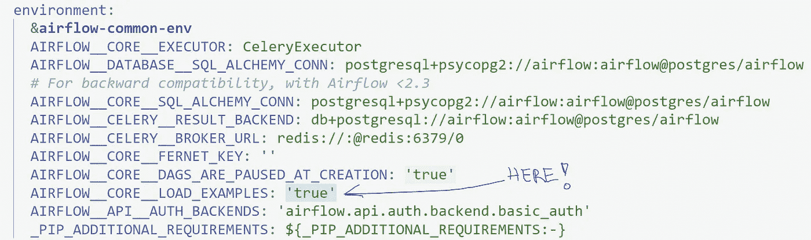
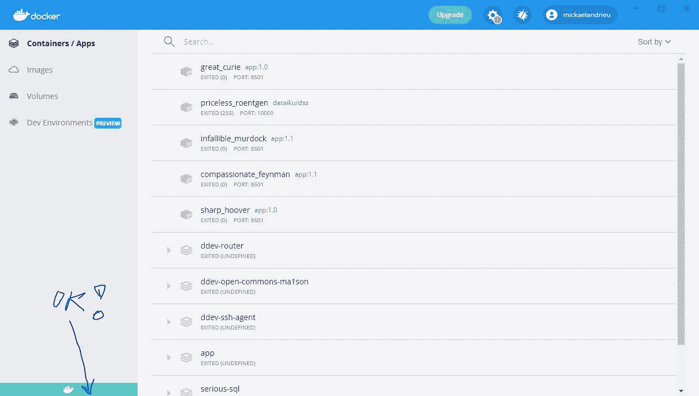
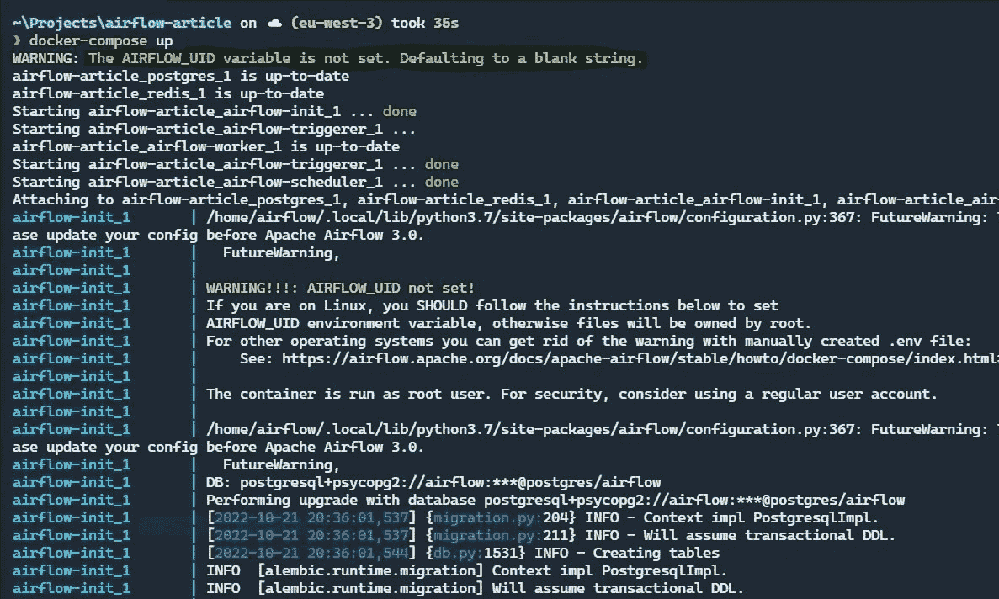
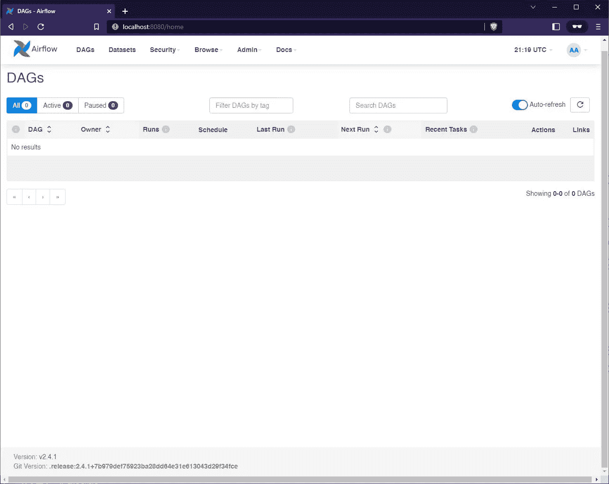
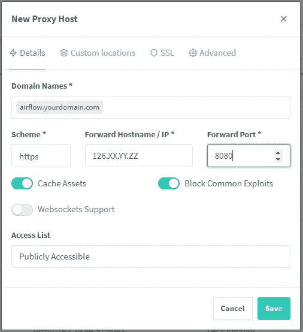
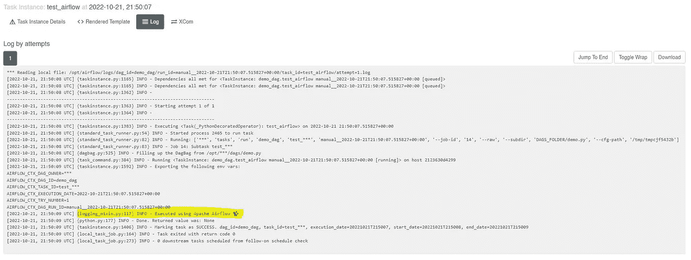
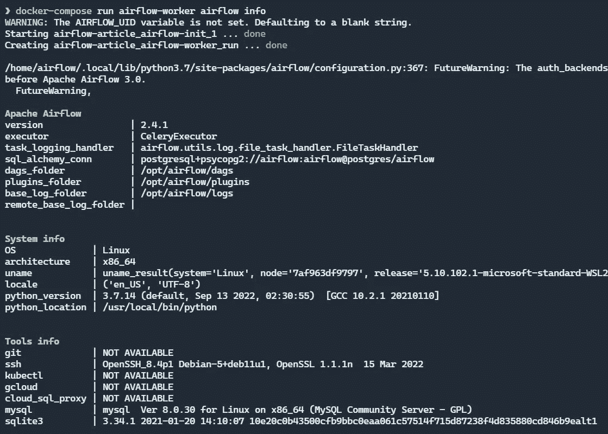

# 如何用 Docker 安装 Apache Airflow

> 原文：<https://levelup.gitconnected.com/how-to-install-apache-airflow-with-docker-7902be3301b8>

## 八步指南在 Windows、Ubuntu 和 Mac OS X 上测试

在本文中，我们将使用 Docker 来介绍 Apache Airflow 的本地安装。我会详细解释每一步，让你准确无误地重现。

**如果有什么问题，请告诉我，这样我就可以更新内容，尽可能长时间保持这篇文章的正确性🙏**


**如何用 Docker 安装气流，**摄影[凯利·西克玛](https://unsplash.com/@kellysikkema?utm_source=medium&utm_medium=referral)

## 1.检查 Docker 的安装

首先，检查 Docker 是否正确安装在您的计算机上。

为此，您可以键入以下两个命令:

```
docker --version
Docker version 20.10.12, build e91ed57docker-compose --version
Docker Compose version v2.2.3
```

**你至少需要 Docker Compose v1.29+。**

如果不是这样，最简单的方法就是安装 [Docker 桌面](https://www.docker.com/products/docker-desktop/)(它也有一个方便的图形界面)并安装与你的操作系统对应的版本。

> 我在 Windows 10、Ubuntu 20.04 和 Mac OS X·蒙特里上测试了提议的操作。

## 2.检索阿帕奇气流码头食谱

访问 [Apache Airflow 文档网站](https://airflow.apache.org/docs/apache-airflow/stable/index.html)和顶部的版本选择器。然后选择适合自己的版本，在 **Docker** 部分的**快速启动>运行气流**中找到文件下载。

如果您需要安装 Apache Airflow 2.4.1:

```
curl -LfO 'https://airflow.apache.org/docs/apache-airflow/2.4.1/docker-compose.yaml'
```

“我在 Windows 上没有 curl 软件。”

取前一个链接，放入浏览器，将内容保存在“ *docker-compose.yaml* 文件中。

## 3.创建适当的文件夹/文件结构

如果您的目标是能够在本地开发脚本，然后部署它们，那么您可以将 Docker 映像中的文件夹与文件系统中的文件夹同步。

我们将计划同步 *dag* 和 *plugin* 开发，能够访问日志总是很有帮助的。

这就是为什么在包含 Apache Airflow 实例的文件夹中，您将创建以下三个文件夹:

```
mkdir ./dags ./logs ./plugins
```

在 Windows 上，您可能无法访问 **mkdir** ，请使用 [PowerShell](https://learn.microsoft.com/en-us/powershell/scripting/overview?view=powershell-7.2) :

```
New-Item "dags" -ItemType "directory"
New-Item "logs" -ItemType "directory"
New-Item "plugins" -ItemType "directory"
```

然后再加一个**。包含 Docker 映像使用的环境变量的 env** 文件:

```
# Ubuntu / Mac OSX
touch .env# Windows (PowerShell)
ni .env
```

在这个文件中，需要配置一个名为 **AIRFLOW_UID** 的环境变量，它对应于运行 Docker 容器的用户的 [UID](https://fr.wikipedia.org/wiki/User_identifier) 。

> 还记得您在一些 Docker 映像上的访问/权限管理问题吗？这可能是因为错误配置的 UID。

在像 Mac OSX 或 GNU/Linux 这样的类 UNIX 系统上，这非常简单:

```
echo -e "AIRFLOW_UID=$(id -u)" > .env
```

但是在 Windows 上，用户的管理是复杂的🙃。

在这种情况下，*因为 Windows 非常宽容*，你不必配置它。但是作为回报，每次 Docker 映像启动时，您都会收到一条小小的警告消息:没什么大不了的。

如果这困扰着你，在**中添加下面一行。env** 文件:

```
AIRFLOW_UID=50000
```

## 4.移除样本 Dag

Apache Airflow 将默认安装一堆 DAGs 示例流。

如果您不需要它们(您已经了解了 Airflow)，那么您必须在 *docker-compose.yaml* 文件中将**Airflow _ _ CORE _ _ LOAD _ EXAMPLES**变量设置为‘false ’,而不是 true:



## 5.安装并启动 Docker 镜像

现在，请 Docker 安装 Apache Airflow:

```
docker-compose up airflow-init
```

要检查 Docker 守护程序是否再次处于活动状态，您可以执行以下命令:

```
docker ps
```

如果你能看到与上面类似的信息，这意味着你需要启动 Docker 桌面应用程序:

```
error during connect: This error may indicate that the docker daemon is not running.: Get "[http://%2F%2F.%2Fpipe%2Fdocker_engine/v1.24/containers/json](http://%2F%2F.%2Fpipe%2Fdocker_engine/v1.24/containers/json)": open //./pipe/docker_engine: The specified file can't be found.
```

> 在 Mac OSX 和 Windows 10 版本中，您都可以将其配置为在启动时启动。我没有在 Ubuntu 上使用 Docker 桌面，所以我不能确定… *😕*

最后，你也可以看看 Docker 桌面 UI 客户端的内部:如果状态栏是绿色的，说明引擎已经启动并按预期工作！



绿色= ✅

> 一旦安装了镜像，将来你只需要指令 **docker-compose up** “照常”。



在 Windows 上，每次启动✅时都会出现警告消息

## 6.对 Web 应用程序的访问

要使用浏览器访问应用程序，请使用以下凭据点击[此链接](http://localhost:8080/home)([http://localhost:8080/home](http://localhost:8080/home)):**air flow**/*air flow。*

这是我在 Apache Airflow 2.4.1 上看到的画面:



Apache Airflow 主页(2.4.1 版)

> 此时，它是空的，因为我已经在 Docker Compose 文件中将**air flow _ _ CORE _ _ LOAD _ EXAMPLES**变量设置为‘false’。

如果您需要将这个容器应用程序与服务器中的 DNS 相匹配，以便在生产中使用 Airflow 的 Dockerized 实例，请使用类似 Nginx 代理管理器的工具。

然后将您的服务器的 IP 映射到域名，并使用 8080 作为 HTTP 端口:这是在我的服务器上完成[的方法。](https://airflow.solvolabs.com/)



我将很快发表一篇关于 Nginx 代理管理器的文章🕗

## 7.添加并执行 DAG

让我们介绍一个最小的例子，这样您可以检查 Apache Airflow 是否可以执行 Dag。

在 **dags** 文件夹中，新建一个名为 **demo.py** 的文件，内容如下:

然后等待 20 秒并重新加载您的 web 浏览器，DAG 现在应该列在 Apache Airflow 主页上:


您可以触发并查看输出，以确认 Apache Airflow 完全正常工作。



该任务被触发并返回预期的输出✅

## 8.访问 CLI 应用程序

默认情况下，web 服务器和作业编排器非常活跃，响应速度足以让您创建和测试 Dag。但是有些功能无法通过 Web 客户端使用，您可能需要访问 Apache Airflow 的命令行客户端。

由于 Docker 管理一切，您可以使用 Docker Composer 访问包含在您面前运行的 airflow 实例的 **airflow-worker** 容器。

例如，要显示实例的主要信息:

```
docker-compose run airflow-worker airflow info
```

> 文档中列出了所有可用的[命令](https://airflow.apache.org/docs/apache-airflow/stable/cli-and-env-variables-ref.html)。



导游结束了！感谢您的阅读，希望它的内容对您有所帮助。

现在轮到您通过查阅官方文档或互联网上的教程来创建强大的 Dag 了😉

[](https://dataforeveryone.medium.com/membership) [## 加入我的推荐链接媒体-数据 4 每个人！

### 作为一个媒体会员，你的会员费的一部分会给你阅读的作家，你可以完全接触到每一个故事…

dataforeveryone.medium.com](https://dataforeveryone.medium.com/membership) 

如果您有任何问题，请随时发表评论，如果您喜欢这篇文章，[关注我](https://dataforeveryone.medium.com/)，当我下一次发布时，您会收到通知。