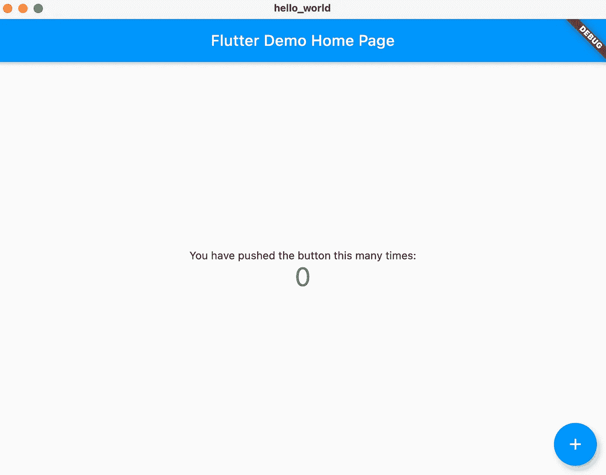

# 如何在 macOS 上安装 Flutter

> 原文：<https://levelup.gitconnected.com/how-to-install-flutter-on-macos-6e65dc592449>

## 创建您的第一个 Flutter macOS 应用程序


在[https://dashatar-dev.web.app/#/](https://dashatar-dev.web.app/#/)生成的图像

几周前，我注意到对 Flutter 的桌面支持现在处于测试阶段。因为我觉得这很令人兴奋，所以我开始在我的 MacBook Pro 上安装 Flutter 来进行实验。

安装本身并不太难，但是需要很多步骤。我还有一个官方文档中没有提到的问题。

最后，我决定写这篇文章，这样任何想在 macOS 上安装 Flutter 的人都可以在一个页面上找到所有信息。

本文介绍了如何在 macOS 上安装 Flutter，如何修复我遇到的问题，以及如何创建您的第一个 Flutter macOS 桌面应用程序。作为锦上添花，我们将看看如何建立一个开发环境。

# 颤振 SDK


在[https://dashatar-dev.web.app/#/](https://dashatar-dev.web.app/#/)生成的图像

在本节中，我们将安装 Flutter SDK 并将其添加到我们的`PATH`变量中，这样我们就可以从任何终端窗口运行`flutter`命令。

## 从 Github 下载

我们可以通过各种方式安装 Flutter SDK。你可以下载 SDK，使用 Homebrew，或者直接从 GitHub 下载。

本文将展示后一种选择。

打开您喜欢的终端，导航到您想要下载 SDK 的文件夹，并将 SDK 克隆到该文件夹中。

```
cd tools
git clone [https://github.com/flutter/flutter.git](https://github.com/flutter/flutter.git) -b stable
```

现在你应该会在`tools`文件夹中看到一个名为`flutter`的新文件夹。

## 频道

`git clone`命令的最后一部分，`-b stable`显示我们想要下载`stable`分支。这对我们来说没问题，因为即使桌面支持仍处于测试阶段，也有可能在稳定分支上创建桌面构建。

有四种不同的发布渠道:稳定版、测试版、开发版和主版。我建议使用稳定的渠道，除非您有特定的需求，这些需求只能通过最新的版本获得。

## 给你的道路增加颤动

为了在任何终端会话中运行`flutter`命令，我们必须将 Flutter SDK 添加到我们的系统`PATH`变量中。

首先，我们将找到我们的 Flutter `bin`文件夹的路径。最简单的方法是使用终端导航到`flutter/bin`文件夹，并使用`pwd`命令打印当前工作目录。

```
cd tools/flutter/bin
pwdresult: 
/Users/bas/tools/flutter/bin
```

复制`pwd`命令的结果。这是你的 Flutters `bin`文件夹的路径，我们马上就需要它。

要将这个路径添加到我们的`PATH`变量中，我们必须更新 shell 的`rc`文件。这个文件的确切名称取决于您使用的 shell 类型。如果你使用 Bash，编辑`~/.bash_profile`或者`~/.bashrc`。如果你正在使用 Z shell (zsh)，你必须编辑`~/.zshrc`。

如果您有最新版本的 macOS，您可能正在使用 zsh，因为从 macOS Catalina 开始，zsh 就是默认的 shell。

为了更新`~/.zshrc`文件，我使用了 nano 编辑器。

```
nano ~/.zshrc
```

添加新的一行来导出你的 Flutter `bin`目录的路径。

```
export PATH=”$PATH:[PATH_OF_FLUTTER_BIN_DIRECTORY]”
```

点击`control + x`保存您的更改。如果我们用`cat`检查`rc`文件的内容，它应该显示您所做的更改。

```
cat ~/.zshrcresult: 
export PATH="$PATH:/Users/bas/tools/flutter/bin"
```

终端不会自动拾取更改过的`PATH`。为了让我们的更改生效，我们需要重新启动终端或者获取`rc`文件。

```
source ~/.zshrc
```

我们现在可以验证颤振命令可以找到。

```
which flutterresult:
/Users/bas/tools/flutter/bin/flutter
```

# 安装缺少的依赖项


在[https://dashatar-dev.web.app/#/](https://dashatar-dev.web.app/#/)生成的图像

既然我们可以运行`flutter`命令，我们也可以访问 Flutter doctor。`flutter doctor`命令显示您的 Flutter 安装的状态，并告诉您缺少什么依赖项。


颤振医生第一次运行命令的结果。

虽然你的里程数可能会有所不同，但在我的情况下，Flutter doctor 透露我有一个不完整的 Xcode 安装，没有 Android 工具链。让我们解决这个问题！

## Xcode 和 CocoaPods

因为我不确定我的 Xcode 安装缺少了哪一部分，所以我通过 app store 重新安装了完整的部分。安装完成后，我运行了 Flutter doctor 建议的命令。

```
sudo xcode-select --switch /Applications/Xcode.app/Contents/Developer

sudo xcodebuild -runFirstLaunch
```

Flutter doctor 还显示我没有安装 CocoaPods，所以我也安装了它。

```
sudo gem install cocoapods
```

这给了我一个绿色的 Xcode 部分的勾号。

## Android 工具链

我不认为你需要 Android 工具链，如果你只是想为 macOS 构建应用程序，但因为我是一个绿色复选标记的吸盘，我也设置了 Android 工具链。

我从 Flutter doctor 建议的链接安装了 Android Studio，并认为这将修复一切。

然而，当我再次运行 Flutter doctor 时，它显示了一个在 Flutter 的文档中没有提到的奇怪问题。Flutter doctor 表示，它“无法找到 Android Studio 的捆绑 Java 版本”。

## 找不到捆绑的 Java 版本

在做了一些研究之后，我找到了对 Stackoverflow 的修复。

首先，您需要设置一个`JAVA_HOME`环境变量，如这篇[文章](https://mkyong.com/java/how-to-set-java_home-environment-variable-on-mac-os-x/#what-is-usrlibexecjava-home)中所述。

在`JAVA_HOME`被设置后，你创建一个从`jre`到一个新的`jdk`文件夹的符号链接。

```
cd /Applications/Android\ Studio.app/Contents/jre
ln -s ../jre jdk
```

## 接受 Android 许可

在修复了“无法找到捆绑的 Java 版本”的问题后，剩下唯一要做的就是接受 Android 许可，这样就万事俱备了。

```
flutter doctor --android-licenses
```

当您运行这个命令时，它会要求您逐个接受大约八个许可证。

在这一点上运行`flutter doctor`给我带来了巨大的成功。


安装缺少的依赖项后，颤振医生的输出。

# 创建 macOS 桌面应用程序


在[https://dashatar-dev.web.app/#/](https://dashatar-dev.web.app/#/)生成的图像

随着我们的 Flutter 安装完成，我们可以创建我们的第一个 macOS 桌面应用程序。

由于桌面支持仍处于测试阶段，我们需要通过`flutter config`启用 macOS 桌面支持。

```
flutter config --enable-macos-desktop
```

启用 macOS 桌面后，我们可以创建一个`hello_world`应用程序并运行它。

```
flutter create hello_world
cd hello_world
flutter run
```

`run`命令将构建并启动我们的 macOS 应用程序，过一会儿，默认的 Flutter 应用程序将出现在您的桌面上。



默认的颤动计数器应用程序。

# 设置开发环境


在[https://dashatar-dev.web.app/#/](https://dashatar-dev.web.app/#/)生成的图像

默认的应用程序很好，但是如果我们想开始自己构建东西，拥有一个开发环境会很方便。

建立一个 Flutter 开发环境很容易。有设置 [Android Studio](https://flutter.dev/docs/get-started/editor?tab=androidstudio) 、 [IntelliJ](https://flutter.dev/docs/get-started/editor?tab=androidstudio) 、 [Visual Studio Code](https://flutter.dev/docs/get-started/editor?tab=vscode) 和 [Emacs](https://flutter.dev/docs/get-started/editor?tab=emacs) 的文档。

因为我在工作中使用 IntelliJ，因此知道它的许多快捷方式，所以我决定在 Flutter 开发中也使用它。

你需要做的就是打开 IntelliJ 并导航到`Preferences -> Plugins`，搜索并安装 Flutter 插件。重启 IntelliJ 后，你就可以开始了。

# 结论

尽管安装过程包含很多步骤，但并不太难。唯一给我带来麻烦的部分是“无法找到捆绑的 Java 版本”错误。

颤振医生做了惊人的工作，帮助你找到你的安装问题。我希望更多的程序能有类似的工具。

我认为这真的很酷，Flutter 允许你构建 macOS 应用程序，我已经等不及要构建我的第一个真正的 Flutter 应用程序了。

感谢您的阅读。我希望这有所帮助。如果您有任何问题或反馈，请随时回复。