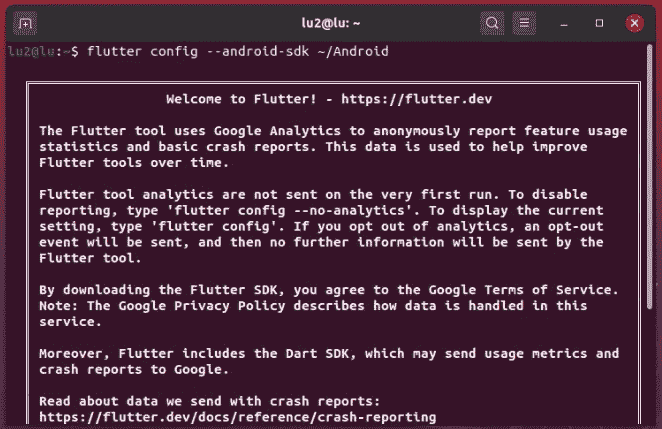

# 如何在 Ubuntu 上不用 Android Studio 安装 Flutter

> 原文：<https://levelup.gitconnected.com/how-to-install-flutter-without-android-studio-on-ubuntu-6d8b55741afa>


终于！！

在本文中，我将向您展示如何在 Ubuntu 上安装 Flutter，Ubuntu 是 Google 为移动、web 和桌面应用程序开发的框架。我将使用 Ubuntu 20.04，但它也可以与 Ubuntu 18.04 或更高版本一起工作。这个过程会用到你的终端，所以打开它，让我们开始吧。

# 下载软件包

首先下载 [Flutter](https://flutter.dev/docs/get-started/install/linux) 和[命令行工具](https://developer.android.com/studio#command-tools)

然后通过终端下载 Java 8 和 Git。

> **注意**:Java 的最新版本显示了一些关于 flutter 的问题，所以我们将使用版本 8，因为它是最重要的

`sudo apt install openjdk-8-jre`

`sudo apt install git`

# 设置环境变量

## 机器人

转到您下载命令行工具包的文件夹，并解压缩文件。您可以使用 *ls* 命令找出文件的名称。

`unzip commandlinetools-linux-6514223_latest.zip`

现在，创建一个新文件夹，命名为 *Android* ，然后将解压的文件夹移动到这个新文件夹中。

`mkdir Android`

`sudo mv tools/ Android/`

我们将把 *Android* 文件夹移到另一个目录。我会把它移到我的个人文件夹。

`sudo mv Android/ ~/`

转到您的主目录并打开文件*。在您最喜欢的编辑器中描述*。这个文件将保存您的环境变量。

`cd ~/`

`sudo gedit .profile`

在文件的末尾，键入或复制这几行。确保您没有添加多余的空格，然后保存您的文件。

> **注意**:如果你没有把你的 Android 文件夹移动到主目录，用你移动它的路径替换第一行。

```
# Android
export ANDROID=$HOME/Android
export PATH=$ANDROID/tools:$PATH
export PATH=$ANDROID/tools/bin:$PATH
export PATH=$ANDROID/platform-tools:$PATH# Android SDK
export ANDROID_SDK=$HOME/ANDROID
export PATH=$ANDROID_SDK:$PATH
```

## 摆动

转到你下载 Flutter 包的地方并解压。

`tar xvf flutter_linux_1.17.3-stable.tar.xz`

将 *flutter* 文件夹移动到新目录。我还会将它移动到我的主目录中。

`sudo mv flutter/ ~/`

去你的主目录，打开*。再次配置*，并键入下面的行。保存您的文件。

```
# Flutter
export FLUTTER=$HOME/flutter
export PATH=$FLUTTER/bin:$PATH
```

现在我们的环境变量已经创建好了，为了让它工作，我们需要做的就是在终端中键入下面一行:

`source ~/.profile`

# Android 配置

在您的终端中键入以下行。

android-29 意味着我们将在模拟器中使用 Android 10。想要安卓 11 就放安卓-30，老一点的可以降级编号。

> **注意**:如果你得到一个错误，不要担心。这仅仅是因为我们将包含命令行工具的文件夹命名为 Android *，*你只需要输入`*sdkmanager --sdk_root=${ANDROID} tools*`

```
sdkmanager "system-images;android-29;google_apis;x86_64"
sdkmanager "platforms;android-29"
sdkmanager "platform-tools"
sdkmanager "patcher;v4"
sdkmanager "emulator"
sdkmanager "build-tools;29.0.2"
```

现在接受许可。

`sdkmanager --licenses`

# 颤振构型

我们将通过设置 Android SDK 的路径来配置 Flutter。

`flutter config --android-sdk ~/Android`

之后，你应该明白了。



# 创建模拟器

键入下面的行，这将显示一个设备列表，选择一个，并复制其 ID。

`avdmanager list`

给模拟器起一个名字，并将复制的 ID 粘贴到下面一行。

```
avdmanager -s create avd -n *name* -k "system-images;android-29;google_apis;x86_64" -d *id_device*
```

# 成功了吗？

跑`flutter doctor`

除了 Android Studio 路径之外，它应该全部显示为绿色。

如果一切正常，现在让我们启动模拟器。你可以通过在你的终端中运行`flutter emulator --launch *name*` 来完成，或者你可以从 [Visual Studio 代码](https://code.visualstudio.com/)中测试启动，安装 Flutter 插件，并通过使用`CTRL + SHIFT + P`并键入`Flutter: create a new project`来创建一个新项目。


现在你已经准备好创建你的 Flutter 应用程序了，祝你玩得开心！