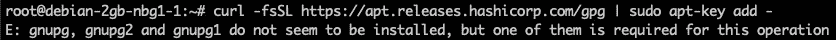
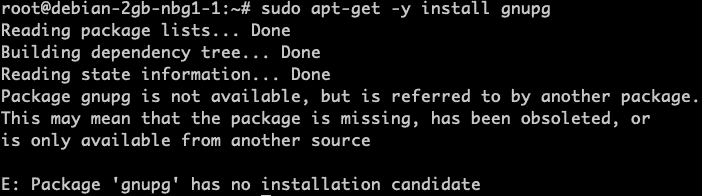

# 如何在 Debian 11 上安装 gnupg

> 原文：<https://levelup.gitconnected.com/how-to-install-gnupg-on-debian-11-2fcae38bc257>

在这篇简短的指南中，我将为您提供在 Debian 机器上安装`gnupg`包( [GnuPG](https://gnupg.org/) )的两种常用方法。


Debian 徽标—[https://www.debian.org/](https://www.debian.org/)

## 简而言之 GnuPG

根据[官网](https://gnupg.org/):

> GnuPG 是由 [**RFC4880**](https://www.ietf.org/rfc/rfc4880.txt) (也称为 *PGP* )定义的 OpenPGP 标准的完整免费实现。GnuPG 允许你对你的数据和通信进行加密和签名；它具有一个多功能的密钥管理系统，以及各种公钥目录的访问模块。GnuPG，也称为 *GPG* ，是一个命令行工具，具有与其他应用程序轻松集成的特性。丰富的 [**前端应用**](https://gnupg.org/software/frontends.html) 和 [**库**](https://gnupg.org/software/libraries.html) 可供选择。GnuPG 还提供对 S/MIME 和安全外壳(ssh)的支持。

## 如果您没有安装它

如果您的 Debian 系统上没有安装 GnuPG，但是您正在运行的命令需要它，例如，您将得到下面的错误消息:

```
E: gnupg, gnupg2 and gnupg1 do not seem to be installed, but one of them is required for this operation
```

在下一张图中，你可以看到我是如何试图通过`apt-key add`命令从 HashiCorp 添加 gpg 密钥的，但是失败了，因为我还没有在系统上安装`gnupg`。



## 使用 apt-get

最常见的方法是使用`apt-get`。

首先，您必须使用`update`命令更新`apt`数据库。

```
sudo apt-get update
```

在您更新了系统上的数据库之后，您可以通过`install`命令安装`gnupg`。

```
sudo apt-get -y install gnupg
```

`-y`标志表示您同意安装`gnupg`库(+它的依赖项),并且您不希望在终端中再次被明确询问。

如果您以前没有使用`apt-get update`命令，您可能会遇到以下错误消息，这取决于您系统的当前状态:

```
...
Package gnupg is not available, but is referred to by anoher package.
This may mean that the package is missing, has been obsoleted, or is only available from another sourceE: Package 'gnupg' has no installation candidate
```



## 使用 apt

除了使用`apt-get`还可以使用`apt`，过程和突击队是一样的。上面几段我就不重复了，这一节保持得很短。

因此，首先，您必须更新您的数据库，如果还没有这样做的话:

```
sudo apt update
```

接下来，你要安装`gnupg`:

```
sudo apt -y install gnupg
```

## 清除

如果你想从你的系统中再次卸载`gnupg`，就像安装它一样简单。

如果你只想卸载实际的`gnupg`包:

```
sudo apt-get remove gnupg
```

使用`remove`命令，安装的依赖项仍然保留在系统中。如果你也想删除它们，你可以使用`autoremove`命令:

```
sudo apt-get -y autoremove gnupg
```

如果您想更进一步，您也可以使用`purge`命令从系统中删除`gnupg`配置和数据。

```
sudo apt-get -y purge gnupg
```

最后但同样重要的是，如果您想完全删除与`gnupg`安装相关的所有内容，您可以将`autoremove`命令与`--purge`标志结合使用。

```
sudo apt-get -y autoremove --purge gnupg
```

# 摘要

我希望你会发现这本简明指南很有用，并且学会了如何使用`apt-get`和`apt`来安装`gnupg`并且在你不再需要它的时候再次清理你的系统。

## 你想联系吗？

如果你想联系我，请在 LinkedIn 上给我打电话。

另外，请随意查看我的书籍推荐📚。

[](https://mr-pascal.medium.com/my-book-recommendations-4b9f73bf961b) [## 我的书籍推荐

### 在接下来的章节中，你可以找到我对所有日常生活话题的书籍推荐，它们对我帮助很大。

mr-pascal.medium.com](https://mr-pascal.medium.com/my-book-recommendations-4b9f73bf961b) [](https://mr-pascal.medium.com/membership) [## 通过我的推荐链接加入 Medium—Pascal Zwikirsch

### 作为一个媒体会员，你的会员费的一部分会给你阅读的作家，你可以完全接触到每一个故事…

mr-pascal.medium.com](https://mr-pascal.medium.com/membership)