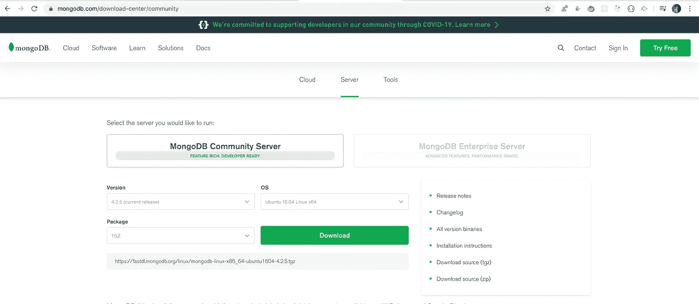
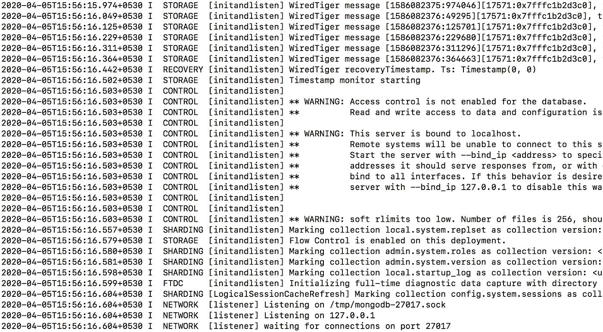
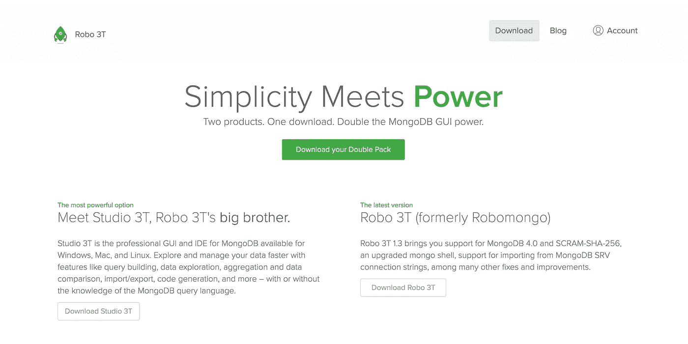

# 如何在本地环境中安装 MongoDB 数据库

> 原文：<https://levelup.gitconnected.com/how-to-install-mongodb-database-on-local-environment-19a8a76f1b92>

了解如何在 windows / Mac / Linux 环境下为本地开发设置 MongoDB。


照片由 [Jonas Denil](https://unsplash.com/@jonasdenil?utm_source=medium&utm_medium=referral) 在 [Unsplash](https://unsplash.com?utm_source=medium&utm_medium=referral) 拍摄

在本文中，我们将在本地机器上安装`MongoDB`，这样我们就可以开始使用它进行本地开发。

所以让我们开始吧。

## **在 Mac / Linux 环境下设置 MongoDB:**

通过导航到[该 url](https://www.mongodb.com/download-center/community) 下载`MongoDB community server`，并选择最新版本、您的操作系统和软件包。对于该包，从下拉菜单中选择`tgz`，并点击`download`按钮。



下载完成后，解压文件并将解压后的文件夹重命名为一个短名称，如`mongodb-setup`，并将该文件夹从下载目录移动到您的用户目录或桌面，并在`mongodb-setup`文件夹移动到的同一目录下创建另一个名为`mongodb-data`的文件夹。

现在，您的桌面或用户目录中将有两个文件夹，一个名为`mongodb-setup`，另一个名为`mongodb-data`。

现在打开终端，导航到`mongodb-setup/bin`文件夹，执行以下命令

```
./mongod --dbpath=<path_to_mongodb-data_folder>For ex. ./mongod --dbpath=/home/yogesh/Desktop/mongodb-data/
```

一旦执行，它将启动`MongoDB`数据库服务器，您将在日志中的某处看到消息“`waiting for connections on port 27017`”，这意味着现在我们可以开始使用在默认端口`27017`上运行的`MongoDB`



如果您检查`mongodb-data`文件夹，您将会看到许多 mongodb 用来处理数据库的文件。不要删除或更改此文件夹，因为它将包含您所有的收藏数据。

**注意:**每当您想要启动`MongoDB`服务器并保持它在终端中运行时，您将需要运行前面的命令`./mongod --dbpath=<path_to_mongodb-data_folder>`。要停止服务器，从终端按下
`Control + C`。

## **在 Windows 环境下设置 MongoDB:**

在 windows 上设置`MongoDB`的步骤与上面提到的 Mac/Linux 安装步骤完全相同。唯一的区别是:

1.下载`MongoDB community server`时，对于 windows 64 位版本，需要从下拉框中选择`windows x64`选项，对于包下拉框值，需要选择`zip`。如果您使用的是 32 位 windows，请从这个 url 下载最新版本的 zip 文件。

2.启动服务器时，不需要执行`./mongod --dbpath=<path_to_mongodb-data_folder>`，需要执行`mongodb-setup/bin`文件夹中的`mongod.exe --dbpath=<path_to_mongodb-data_folder>`。

这是 windows 安装程序唯一需要的更改。

恭喜你！您已经成功地在您的机器上安装了 MongoDB。

现在，我们已经安装了`MongoDB`服务器，我们可以通过从`mongodb-setup/bin`文件夹运行`./mongo or mongo.exe`来开始创建`collections(tables)`和`documents(records)`。

一边学`MongoDB`一边用命令行很好，但是每次用命令行创建或者修改数据都会很费时间。

因此，您可以为此安装 GUI 工具。有很多 GUI 工具，比如`Robo 3T` 或`MongoDB Compass`等。

你可以在 Windows 和 Mac/Linux 上安装`Robo 3T`，它只是一个点击下一个安装程序。

通过导航到[该 url](https://robomongo.org/download) 并点击`Download Robo 3T`按钮来下载`Robo 3T`。



**您需要确定的一件事是，在从 Robo 3T GUI 工具连接到数据库之前，您需要按照上述步骤启动 MongoDB 服务器。**

看看我最近出版的[掌握 Redux](https://master-redux.yogeshchavan.dev/) 课程。

在本课程中，您将构建 3 个应用程序以及一个点餐应用程序，您将了解:

*   基本和高级冗余
*   如何管理数组和对象的复杂状态
*   如何使用多个减速器管理复杂的冗余状态
*   如何调试 Redux 应用程序
*   如何在 React 中使用 Redux 使用 react-redux 库让你的 app 反应性。
*   如何使用 redux-thunk 库处理异步 API 调用等等

最后，我们将从头开始构建一个完整的[订餐应用](https://www.youtube.com/watch?v=2zaPDfCKAvM)，集成 stripe 以接受支付，并将其部署到生产中。

**别忘了直接在你的收件箱** [**订阅我的每周时事通讯，里面有惊人的技巧、诀窍和文章。**](https://yogeshchavan.dev/)