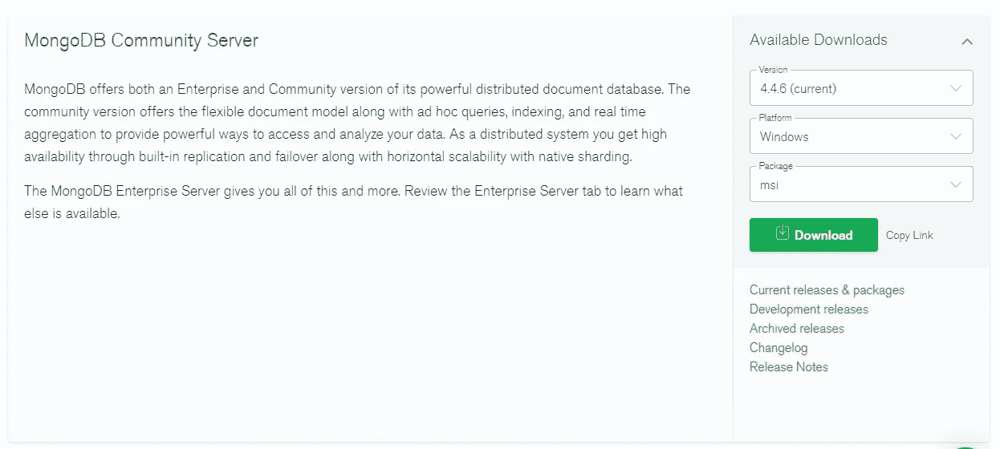

# 如何在 Windows 上安装 MongoDB(2021)

> 原文：<https://levelup.gitconnected.com/how-to-install-mongodb-on-windows-2021-cb6fb8cb099>

## 逐步指南

如何在 windows 上安装 MongoDB

如果您正在使用 MERN(MongoDB，Express，React，Node)堆栈构建应用程序，安装 MongoDB 是必不可少的。MongoDB 是 web 社区中最著名的基于集合的非关系数据库。通过本文可以了解如何在 windows 上安装 MongoDB。

我浏览了官方的安装文档，信息有点超载，所以想到分享这些简单的步骤，让某人快速入门。

从这里观看 youtube 教程

# 第一步

首先从[这里](https://www.mongodb.com/try/download/community)下载正确的 MongoDB 安装 MSI 文件

 [## MongoDB 社区下载

### 2021 MongoDB，Inc.Mongo、MongoDB 和 MongoDB leaf 徽标是 MongoDB，Inc .的注册商标。2021…

www.mongodb.com](https://www.mongodb.com/try/download/community) 

从网站上的表格中选择正确的版本平台和可下载的 MSI。

# 第二步

下载完成后，双击下载的。并遵循安装指南。

选择完成

保持默认选择如下所示，然后单击下一步

单击下一步

安装

安装开始

完成的

# 第三步

安装完成后，在本地**磁盘 C** 中创建一个名为 **data** 的文件夹，然后在文件夹 **data 中创建一个名为 **db** 的文件夹。** 完整路径将是`C:\data\db`

# 第四步

将 MongoDB 安装位置添加到**系统路径变量**

点击 windows 并搜索“环境”一词，然后点击出现的**编辑系统环境变量**

点击**环境变量**按钮

从**系统变量**部分选择**路径**并点击编辑

点击**新建**，将 mongod.exe 的路径添加到安装文件夹中。我的安装文件夹路径是`C:\Program Files\MongoDB\Server\4.4\bin`

添加并**点击确定**

现在您可以使用命令`mongod`从文件系统的任何地方运行 MongoDB

在终端中键入`mongo` 以获得 mongo shell 并执行您可以使用的 MongoDB 命令

视频教程
https://youtu.be/Q0ZqCVF9ov0