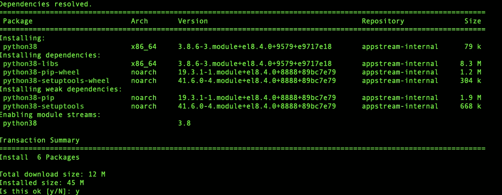
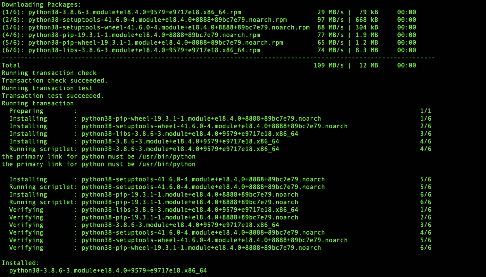
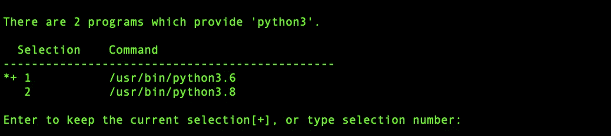

# 如何在 RHEL 8 和 CentOS 8 上安装 Python 3.8

> 原文：<https://levelup.gitconnected.com/how-to-install-python-3-8-on-rhel-8-and-centos-8-fac11aef2165>


照片由 [Anupkumar patel](https://unsplash.com/@anup_304?utm_source=medium&utm_medium=referral) 在 [Unsplash](https://unsplash.com?utm_source=medium&utm_medium=referral) 上拍摄

# 将 Python 3.8 添加到 RHEL 8/CentOS 8/Stream

RHEL 8.0 的标准库提供了 Python 3.8。可以使用 **dnf 或 yum 命令**进行安装。

在您的机器上执行以下步骤:

```
yum install python3.8
```

按下 **Y** 键接受下载和安装。

**上述命令的输出:**



# 检查 RHEL8 安装的 python 版本

验证 Python 版本，如下所示:

```
python3.8 --version
```

**输出将是:**

```
Python 3.8.6
```

注意:如果你找不到检查版本的命令，我的意思是它不起作用，然后简单地使用**yum**update 更新系统并注销。并再次登录。

**让我们在 RHEL 8 上设置默认的 python3 为 python 3.8**:

在您的机器上执行以下步骤

```
sudo alternatives --config python3
or 
sudo update-alternatives --config python3
```



只需输入您想要使用的版本的序列号。

现在让我们验证 Python3 版本如下:

```
python3 --version or just type python3
```

**输出将是:**

```
Python 3.8.6
```

## 将 Python3.8 安装到自定义位置

如果您有兴趣将 python3.8 安装到自定义位置，请在您的机器上执行以下步骤。

在安装 Python 3.8 之前，您必须安装必要的开发工具和包，例如 gcc、make、Openssl-devel、Bzip2-devel、Libffi-devel 和 Zlib-devel

```
yum install gcc openssl-devel bzip2-devel libffi-devel zlib-devel -y
```

1.  下载 Python 3.8，并通过运行以下命令解压缩包:

```
cd /temp
curl -O https://www.python.org/ftp/python/3.8.12/Python-3.8.12.tgztar -zxvf Python-3.8.12.tgz
```

2.将目录更改为您解压缩 Python 3.8 包的位置:

```
cd /temp/Python-3.8.12
```

3.运行以下命令之一开始安装 Python 3.8

*   如果要安装到标准位置，请运行以下命令

```
 ./configure --enable-shared
```

*   如果要安装到自定义位置，请运行以下命令:

```
./configure --enable-shared --prefix=[***CUSTOM-INSTALL-PATH***]
```

**注**:

默认情况下，Python 可以安装在以下任何一个位置:

*   /usr/bin
*   /usr/local/python38/bin
*   /usr/local/bin

如果您在任何其他位置安装 Python 3.8，那么您必须使用`--prefix`选项指定路径。

`--enabled-shared`选项用于构建共享库，而不是静态库。

4.按如下方式构建 Python 3.8:

*   运行`make`命令来编译文件:

```
make
```

*   运行以下命令，将编译后的文件放在默认位置或您使用`--prefix`选项指定的自定义位置:

```
make altinstall
```

*   将共享的编译库文件(libpython3.8.so)复制到/lib64/目录:

```
cp --no-clobber ./libpython3.8.so* /lib64/
```

`--no-clobber`选项用于防止文件被覆盖。

*   按如下方式更改 libpython3.8.so 文件的权限:

```
chmod 755 /lib64/libpython3.8.so*
```

注意:如果您在加载共享库时看到错误: **libpython3.8.so.1.0:无法打开共享对象文件:没有这样的文件或目录错误，**然后运行以下命令:

```
export LD_LIBRARY_PATH=$LD_LIBRARY_PATH:/usr/local/lib/
```

至此，我们的帖子到此结束。感谢您的阅读。