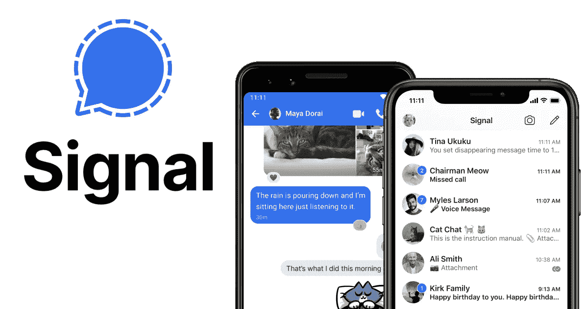
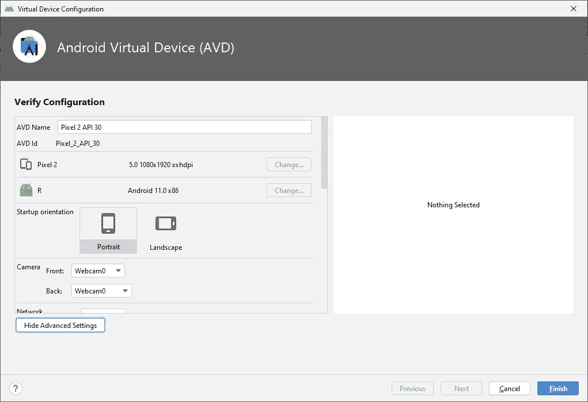
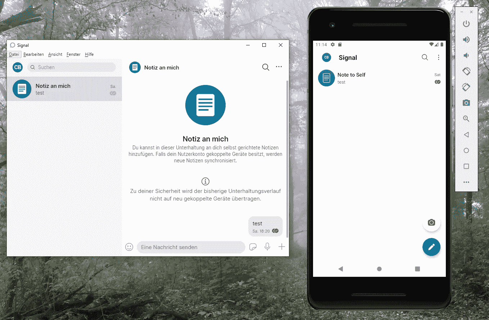

# 没有电话怎么装信号

> 原文：<https://levelup.gitconnected.com/how-to-install-signal-without-a-phone-33a402cd318e>

## 这款安全开源的 messenger 应用有一个合适的桌面版本，可以在没有手机的情况下运行

安全开源的信使应用软件 Signal，图片来自 signal.org。

随着越来越多的[人从 WhatsApp 转向 Signal](https://www.theguardian.com/technology/2021/jan/24/is-it-time-to-leave-whatsapp-and-is-signal-the-answer) ，Signal 最近受到了很多关注。上个月，WhatsApp 推出了一项新的隐私政策，这让很多用户感到困惑。虽然朋友之间的聊天应该会保持端到端加密，而且更新只会影响商业互动，但它突显出 WhatsApp 与母公司脸书的整合程度越来越高，用户担心会有比现在更多的数据共享。

当人们在寻找替代品时，信号成了主要的受益者。它是端到端加密的，拥有现代 messenger 应用程序的所有功能。它也是完全开源的。

即使除了与脸书的关系，我也从未真正喜欢过 WhatsApp。网络版要求手机一直开机并连接到网络，消耗不必要的电量。

另一方面，Signal 有一个适用于所有主要操作系统的全功能桌面版本，即使你的手机关机也能运行。你只需要在手机上安装该应用程序，就可以将桌面版本链接到它。

然而，当我想亲自尝试 Signal 时，我无法在我的手机上安装它，因为它需要最低 4.4 的 Android 版本，而我的手机只有 4.2。

幸运的是，即使你的 Android 版本太低或者你根本没有手机，你仍然可以安装 Signal 桌面版。

# Android 模拟器

在没有手机的情况下，你首先需要安装一个 Android 模拟器。我用的是集成到[Android Studio](https://developer.android.com/studio)(Android 官方开发工具)的那个。在过去，我用它取得了最大的成功，但是没有软件开发经验的用户可能会发现设置起来有点混乱(更多用户友好的 Android 模拟器，如 [BlueStacks](https://www.bluestacks.com/) 或 [NoxPlayer](https://www.bignox.com/) 也可能工作，尽管我还没有尝试过)。

创建 Android 模拟器时，选择一个现代 Android 版本，启用 Play Store，并在高级设置中打开摄像头。

创建一个虚拟的 Android 设备，图片由作者提供。

# 信号应用程序

一旦你设置好你的 Android 模拟器，你就可以安装信号应用了。前往 Play Store，使用您的 Google 帐户登录并下载应用程序。

创建您的信号帐户时，您需要一个电话号码来接收识别码。任何能接收短信的旧手机都可以用。我的智能手机的安卓版本足够现代，可以接收短信，所以我只用了我的普通电话号码，但一个 20 岁的诺基亚也可以。如果你根本没有电话，你也可以用固定电话打电话。

我听说临时电话号码也可以。但是，因为你的电话号码也是你的 ID，我不确定当你不再拥有临时电话号码的访问权限时会发生什么，所以我不建议这样做。

# 桌面版

模拟器中安装了 Signal 应用程序后，您就可以安装桌面版本了。去[https://signal.org/download/](https://signal.org/download/)，选择你的操作系统，下载程序。按照安装步骤，它会显示一个二维码，你需要将桌面版本与应用程序链接。

# 链接应用程序

现在我们必须将桌面版本链接到应用程序。如果您没有在 android studio 安装步骤中启用摄像头，您可以稍后通过工具> AVD 管理器>编辑>高级设置添加它们。

还要确保你的 Windows 隐私设置允许应用程序和程序使用摄像头(这让我困惑了一段时间，一切似乎都很好，但它不起作用。原来是我的 Windows 设置屏蔽了 Android Studio 使用摄像头)。

## 带网络摄像头

如果你的电脑有摄像头，链接会容易得多。只需调整网络摄像头的位置，使其能够看到二维码。

在模拟器中打开 Signal 应用程序，前往“设置”>“链接的设备”,然后点按“添加”图标。它会对二维码拍照，并将桌面版链接到应用程序。

## 没有网络摄像头

如果你没有带网络摄像头的电脑，或者你像我一样，不知道你需要网络摄像头，因此把所有东西都安装在你的台式机上，而不是笔记本电脑上，仍然有一种方法可以让应用程序与虚拟网络摄像头链接。

安装一个虚拟摄像头程序。我用了 [ManyCam](https://manycam.com/) ，但是其他程序应该也可以。

二维码截图。我必须镜像图像，所以代码正确地出现在网络摄像头中。

将截图添加到您的虚拟网络摄像头。大多数程序都有一个添加图像层的功能，或者只是将它裁剪到正确的屏幕区域。

现在，您可以在模拟器中打开信号应用程序，进入设置>链接的设备，然后单击添加图标。这将用虚拟网络摄像头拍照，因为它看到了设备将链接的二维码。

# 完成的

安装并成功链接桌面版本后，您可以关闭模拟器，桌面版本将在没有模拟电话的情况下工作。

我建议保持安装模拟器，以防你需要访问“真正的”应用程序，例如，如果你想链接另一个设备。但是卸载它也应该没问题，只要你有你的电话号码和你的密码。

信号在桌面程序和 Android 模拟器中运行，图片由作者提供。

Signal 是一款开源的端到端加密信使应用，很多人都在转向这款应用，因为他们越来越怀疑 WhatsApp 及其母公司脸书。

它提供了现代 messenger 应用程序的所有功能，与 WhatsApp 不同，它还有一个桌面版本，即使在手机关机时也能工作。即使你没有手机或者智能手机的 Android 版本太旧，你也可以使用 Android 模拟器安装桌面版本。

如果你正在寻找一个安全的消息应用程序，你绝对应该试试 Signal。

你喜欢这样的内容吗？通过加入 Medium ，可以无限制地访问所有故事，并支持我和其他作者。*如果你通过这个链接注册，你的一部分会员费将会转给我。*