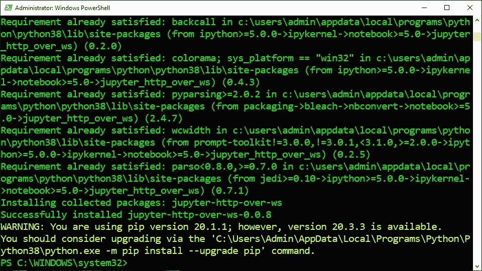
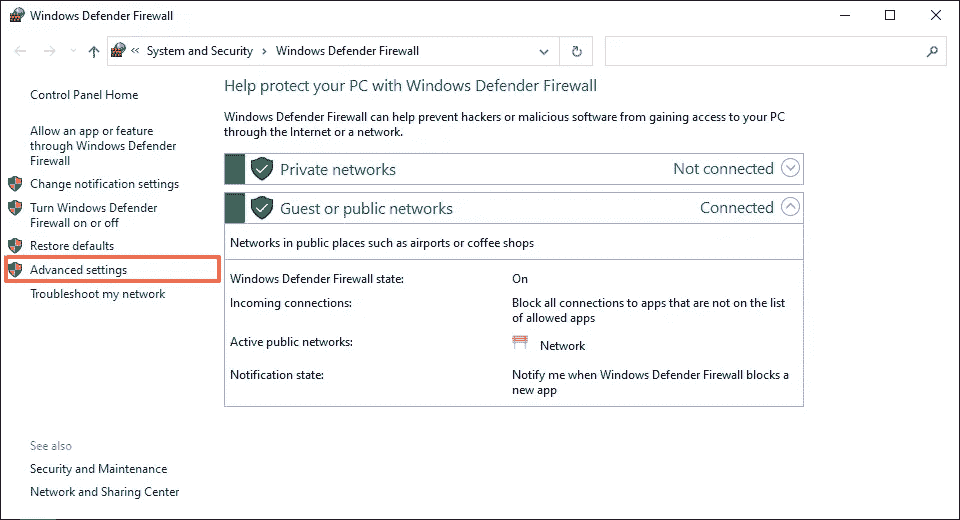
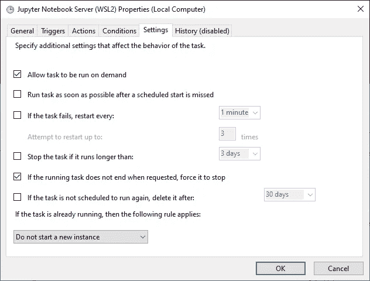

# 如何在 Windows 10 上安装 Jupyter 笔记本服务器

> 原文：<https://levelup.gitconnected.com/how-to-install-the-jupyter-notebook-server-on-windows-10-6f1c232259dc>

## 创始人指南:

## 带有复制粘贴代码和屏幕截图的浓缩教程


图片由[维塔·维尔西娜](https://unsplash.com/photos/KtOid0FLjqU)拍摄

> “这篇文章的[扩展版](https://medium.com/p/e8f3e9436044)使用简明的解释来帮助你了解正在发生的事情💡"

## 打开 PowerShell:

1.  按下“⊞之窗”
2.  在搜索栏中输入“PowerShell”
3.  单击“以管理员身份运行”


## 安装 Jupyter 笔记本:

1.  从下面这些指令中复制命令
2.  将命令粘贴到 PowerShell 中
3.  按“回车”

```
python -m pip install jupyter
```


## 安装 WebSocket 扩展:

1.  从下面这些指令中复制命令
2.  将命令粘贴到 PowerShell 中
3.  按“回车”

```
python -m pip install jupyter_http_over_ws
```



## 打开环境变量:

1.  按下“⊞之窗”
2.  在搜索栏中输入“环境变量”
3.  单击“编辑系统环境变量”
4.  单击“环境变量…”


## 打开路径:

1.  在“用户变量”部分选择“路径”
2.  点击“编辑”


## 将 Git 添加到环境变量:

1.  从下面这些指令中复制路径
2.  点击“新建”
3.  将路径粘贴到环境变量中
4.  单击“确定”
5.  单击“确定”
6.  单击“确定”

```
C:\Program Files\Git\usr\bin
```


## 创建配置文件:

1.  从下面这些指令中复制命令
2.  将命令粘贴到 PowerShell 中
3.  按“回车”

```
jupyter notebook --generate-config
```


## 退出 PowerShell:

1.  从下面这些指令中复制命令
2.  将命令粘贴到 PowerShell 中
3.  按“回车”

```
exit
```


## 打开 PowerShell:

1.  按下“⊞之窗”
2.  在搜索栏中输入“PowerShell”
3.  单击“以管理员身份运行”


## 打开 Jupyter 目录:

1.  从下面这些指令中复制命令
2.  将命令粘贴到 PowerShell 中
3.  按“回车”

```
cd $HOME\.jupyter
```


## 创建 SSL 证书:

1.  从下面这些指令中复制命令
2.  将命令粘贴到 PowerShell 中
3.  按“回车”
4.  在“国家名称”中输入“美国”
5.  按“回车”
6.  输入“.”到剩余的字段中
7.  按“回车”

```
openssl req -config “C:\Program Files\Git\usr\ssl\openssl.cnf” -x509 -nodes -days 365 -newkey rsa:2048 -keyout mykey.key -out mycert.pem
```


## 创建 JSON 文件:

1.  从下面这些指令中复制命令
2.  将命令粘贴到 PowerShell 中
3.  按“回车”

```
Set-Content $HOME\.jupyter\jupyter_notebook_config.json "" -Encoding ASCII
```


## 打开 JSON 文件:

1.  从下面这些指令中复制命令
2.  将命令粘贴到 PowerShell 中
3.  按“回车”

```
notepad $HOME/.jupyter/jupyter_notebook_config.json
```


## 编辑 JSON 文件:

1.  从这些说明下面复制 JSON
2.  将 JSON 粘贴到记事本中
3.  将“Admin”更改为 Windows 用户名
4.  单击“文件”菜单
5.  点击“保存”


## 创建密码:

1.  从下面这些指令中复制命令
2.  将命令粘贴到 PowerShell 中
3.  按“回车”

```
jupyter notebook password
```


## 打开防火墙设置:

1.  按下“⊞之窗”
2.  在搜索栏中输入“Windows Defender Firewall”
3.  单击“Windows Defender 防火墙”
4.  单击左侧面板中的“高级设置”



## 创建入站规则:

1.  单击左侧面板中的“入站规则”
2.  单击右侧面板中的“新建规则…”


## 指定端口:

1.  选择“端口”
2.  点击“下一步”
3.  选择“特定本地端口”
4.  输入“9999”
5.  点击“下一步”


## 允许连接:

1.  选择“允许连接”
2.  点击“下一步”


## 完成入站规则:

1.  检查“域”、“私有”和“公共”
2.  点击“下一步”
3.  从这些说明下面抄下名字
4.  将名称粘贴到“名称”文本框中
5.  点击“完成”

```
Jupyter Notebook Server (WIN)
```


## 打开任务计划程序:

1.  按下“⊞之窗”
2.  在搜索栏中输入“任务计划程序”
3.  单击“任务计划程序”


## 创建任务:

1.  单击右侧面板中的“创建基本任务”
2.  从这些说明下面抄下名字
3.  将名称粘贴到“名称”文本字段中
4.  点击“下一步”
5.  选择“电脑启动时”
6.  点击“下一步”
7.  选择“启动程序”
8.  点击“下一步”

```
Jupyter Notebook Server (WIN)
```


## 指定操作:

1.  从下面这些指令中复制路径
2.  将路径粘贴到“程序/脚本”文本字段中
3.  点击“下一步”
4.  选中“打开属性对话框…”
5.  点击“完成”

```
%userprofile%\AppData\Local\Programs\Python\Python38\Scripts\jupyter-notebook.exe
```


## 指定触发器:

1.  单击顶部选项卡栏中的“触发器”
2.  单击“启动时”
3.  点击“编辑”
4.  选中“延迟任务时间”
5.  输入“30 秒”
6.  单击“确定”


## 以用户身份运行任务:

1.  单击标签栏中的“常规”
2.  选中“以最高权限运行”


## 取消时间限制:

1.  点击标签栏中的“设置”
2.  取消选中“如果任务运行时间超过，则停止任务”
3.  单击“确定”
4.  重新启动计算机



## 登录路由器:

1.  打开 web 浏览器
2.  从下面这些指令中复制[路由器的 IP 地址](#https://www.techspot.com/guides/287-default-router-ip-addresses/)
3.  将路由器 IP 地址粘贴到 web 浏览器中
4.  按“回车”
5.  登录路由器

```
192.168.0.1
```


## 设置端口转发:

1.  找到“端口转发”页面
2.  将 IPv4 地址粘贴到“输入 IP 地址”文本字段中
3.  从下面复制端口这些说明
4.  将端口粘贴到“WAN 起始端口”文本字段中
5.  将端口粘贴到“WAN 终端端口”文本字段中
6.  选择“所有 IP 地址”
7.  点击“应用”

```
9999
```


## 获取网络配置信息:

1.  重新打开 PowerShell
2.  从下面这些指令中复制命令
3.  将命令粘贴到 PowerShell 中
4.  按“回车”
5.  记下 IPv4 地址、子网掩码和默认网关。
6.  记下 DNS 服务器。

```
ipconfig /all
```


## 打开网络适配器属性:

1.  按下“⊞之窗”
2.  输入“网络状态”
3.  单击“网络状态”
4.  单击“更改适配器选项”
5.  右键单击连接到互联网的网络适配器
6.  单击“属性”


## 设置静态 IP 地址:

1.  选择“互联网协议版本 4 (TCP/IPv4)”
2.  单击“属性”
3.  选择“使用以下 IP 地址”
4.  输入之前的 TCP/IP 信息
5.  选择“使用下列 DNS 服务器地址”
6.  输入之前的 TCP/IP 信息
7.  单击“确定”


## 从本地网络访问服务器:

1.  登录到不同的计算机或笔记本电脑
2.  连接到同一个 WiFi 网络
3.  在 web 浏览器中输入 IPv4 地址
4.  在 IP 地址前添加“https://”
5.  在 IP 地址后附加“9999”
6.  按“回车”
7.  键入“thisisunsafe”
8.  输入密码
9.  点击“登录”


## 获取公共 IP 地址:

1.  从这些说明下面复制 URL
2.  将 URL 粘贴到 web 浏览器中
3.  记下公共 IP 地址

```
[https://www.google.com/search?q=whatsmyip](https://www.google.com/search?q=whatsmyip)
```


## 从远程网络访问服务器:

1.  登录到不同的计算机或笔记本电脑
2.  连接到不同的 WiFi 网络
3.  在 web 浏览器中输入公共 IP 地址
4.  在 IP 地址前添加“https://”
5.  在 IP 地址后附加“9999”
6.  按“回车”
7.  键入“thisisunsafe”
8.  输入密码
9.  点击“登录”


> “希望这篇文章能帮助您获得👯‍♀️🏆👯‍♀️，记得订阅获取更多内容🏅"

## 后续步骤:

这篇文章是一个迷你系列的一部分，帮助读者设置他们开始学习人工智能、机器学习、深度学习和/或数据科学所需的一切。它包括包含复制和粘贴代码的说明和截图的文章，以帮助读者尽快获得结果。它还包括一些文章，包含带有解释和截图的说明，以帮助读者了解正在发生的事情。

```
**Linux:**
01\. [Install and Manage Multiple Python Versions](https://medium.com/p/39167f6a32e6)
02\. [Install the NVIDIA CUDA Driver, Toolkit, cuDNN, and TensorRT](https://medium.com/p/2b76c1b7b3be)
03\. [Install the Jupyter Notebook Server](https://medium.com/p/c5c7fa4853cb)
04\. [Install Virtual Environments in Jupyter Notebook](https://medium.com/p/8041f8952177)
05\. [Install the Python Environment for AI and Machine Learning](https://medium.com/p/79236ec1f511)**WSL2:**
01\. [Install Windows Subsystem for Linux 2](https://medium.com/p/7f19d91d6d4a)
02\. [Install and Manage Multiple Python Versions](https://medium.com/p/35d8eab2e221)
03\. [Install the NVIDIA CUDA Driver, Toolkit, cuDNN, and TensorRT](https://medium.com/p/e0916ceb924e) 
04\. [Install the Jupyter Notebook Server](https://medium.com/p/5848b7b4fc21)
05\. [Install Virtual Environments in Jupyter Notebook](https://medium.com/p/8b6cff4cd6ec)
06\. [Install the Python Environment for AI and Machine Learning](https://medium.com/p/bbe136458bc1)
07\. [Install Ubuntu Desktop With a Graphical User Interface](https://medium.com/p/5b03894f743f) (Bonus)**Windows 10:**
01\. [Install and Manage Multiple Python Versions](https://medium.com/p/14d197119302)
02\. [Install the NVIDIA CUDA Driver, Toolkit, cuDNN, and TensorRT](https://medium.com/p/c4fc73b665ac)
03\. [Install the Jupyter Notebook Server](https://medium.com/p/8e38f230fe6d)
04\. [Install Virtual Environments in Jupyter Notebook](https://medium.com/p/623165e1044c)
05\. [Install the Python Environment for AI and Machine Learning](https://medium.com/p/a382ef83f85f)**Mac:** 01\. [Install and Manage Multiple Python Versions](https://medium.com/p/d5e2eea70507)
02\. [Install the Jupyter Notebook Server](https://medium.com/p/5b0b5bad1c4e)
03\. [Install Virtual Environments in Jupyter Notebook](https://medium.com/p/ca78a2be86c8)
04\. [Install the Python Environment for AI and Machine Learning](https://medium.com/p/2ec86ac69f14)
```