# 如何在 Windows 10 上安装 Jupyter 笔记本服务器

> 原文：<https://levelup.gitconnected.com/how-to-install-the-jupyter-notebook-server-on-windows-10-e8f3e9436044>

## 创始人指南:

## 带有简明解释和截图的扩展教程


图片由[维塔·维尔西娜](https://unsplash.com/photos/KtOid0FLjqU)拍摄

> “本文的[精简版](https://medium.com/p/6f1c232259dc)使用复制和粘贴代码来帮助您尽快获得结果，⚡”

## 打开 PowerShell:

*PowerShell* 是一种命令行 [shell](#4bde) 和面向对象的脚本语言，用于自动化管理任务和配置系统设置。它可以用于自动化操作系统中的几乎任何事情。它还取代了命令提示符，成为 Windows 10 的默认系统外壳。

1.  按下“⊞之窗”
2.  在搜索栏中输入“PowerShell”
3.  单击“以管理员身份运行”


## 安装 Jupyter 笔记本:

Jupyter Notebook 是一个用于创建、修改和分发包含代码、等式、可视化和叙述性文本的笔记本的程序。它提供了一个在 web 浏览器中运行的交互式编码环境。它也已经成为机器学习和数据科学的首选工具。

1.  从下面这些指令中复制命令
2.  将命令粘贴到 PowerShell 中
3.  按“回车”

```
python -m pip install jupyter
```


## 安装 WebSocket 扩展:

*WebSocket* *协议*是一种用于建立和维护 web 浏览器与服务器之间连接的协议，不会被[同源策略](#9d15)所阻塞。它通过指定的端口传递 HTTP 流量，从而允许 web 浏览器通过互联网访问硬件。

1.  从下面这些指令中复制命令
2.  将命令粘贴到 PowerShell 中
3.  按“回车”

```
python -m pip install jupyter_http_over_ws
```


## 打开环境变量:

*环境变量*是由计算机自动创建和维护的变量。它帮助系统知道在哪里安装文件、查找程序以及检查用户和系统设置。它也可以被计算机上任何地方的图形和命令行程序使用。

1.  按下“⊞之窗”
2.  在搜索栏中输入“环境变量”
3.  单击“编辑系统环境变量”
4.  单击“环境变量…”


## 打开路径:

*路径*是一个环境变量，包含计算机用来查找可执行文件的目录列表。它从上到下在列表的每个目录中查找请求的可执行文件。一旦找到匹配的可执行文件并运行程序或命令，它也会停止搜索。

1.  在“用户变量”部分选择“路径”
2.  点击“编辑”


## 将 Git 添加到环境变量:

Git 是一个程序，用来跟踪随着时间的推移对源代码所做的更改。它可以处理各种规模的项目，并允许多个团队和人员对同一个存储库进行更改。它还可以从存储库的整个历史中将源代码恢复到以前的版本。

1.  从下面这些指令中复制路径
2.  点击“新建”
3.  将路径粘贴到环境变量中
4.  单击“确定”
5.  单击“确定”
6.  单击“确定”

```
C:\Program Files\Git\usr\bin
```

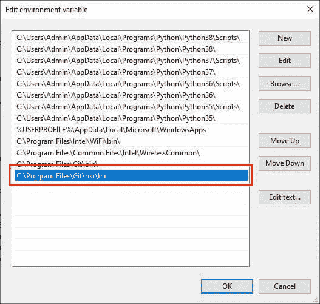

## 创建配置文件:

*配置文件*是一个 Python 文件，用于定制 Jupyter 笔记本服务器。它生成时包含了所有可能的服务器参数、选项和设置，但默认情况下它们被注释掉了。它也存储在隐藏的。主目录的 jupyter 子目录。

1.  从下面这些指令中复制命令
2.  将命令粘贴到 PowerShell 中
3.  按“回车”

```
jupyter notebook --generate-config
```

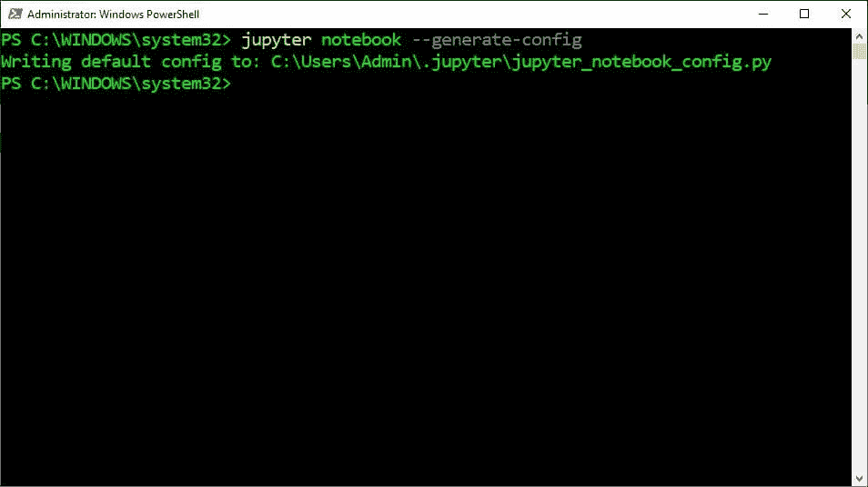

## 退出 PowerShell:

PowerShell 中使用了 *Exit* 命令来关闭当前会话，并向父进程返回一个错误代码。可以在交互式 shell 中使用它来简单地终止 PowerShell 进程。还可以在脚本中使用它来终止脚本并向父进程返回错误代码。

1.  从下面这些指令中复制命令
2.  将命令粘贴到 PowerShell 中
3.  按“回车”

```
exit
```

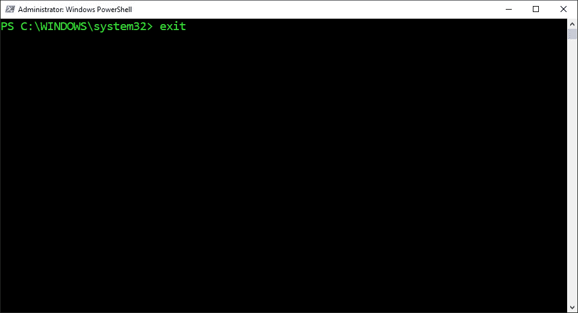

## 打开 PowerShell:

PowerShell 是一种命令行 Shell 和面向对象的脚本语言，用于自动化管理任务和配置系统设置。它几乎可以用于自动化操作系统中的任何事情。它还取代了命令提示符，成为 Windows 10 的默认系统外壳。

1.  按下“⊞之窗”
2.  在搜索栏中输入“PowerShell”
3.  单击“以管理员身份运行”


## 打开 Jupyter 目录:

*改变目录(cd)* 命令用于将当前工作目录改变到指定目录。它可以导航到分别从根目录和当前工作目录开始的绝对路径和相对路径。它还可以导航到存储在[变量](#9399)和环境变量中的路径。

1.  从下面这些指令中复制命令
2.  将命令粘贴到 PowerShell 中
3.  按“回车”

```
cd $HOME\.jupyter
```


## 创建 SSL 证书:

*Req* 命令在 [OpenSSL](#73eb) 中用于生成和处理证书请求。它可以与 x509 命令结合使用，以生成自签名证书。它还可以用来生成最大强度加密的非加密私钥，有效期最长可达 825 天。

1.  从下面这些指令中复制命令
2.  将命令粘贴到 PowerShell 中
3.  按“回车”
4.  在“国家名称”中输入“美国”
5.  按“回车”
6.  输入“.”到剩余的字段中
7.  按“回车”

```
openssl req -config “C:\Program Files\Git\usr\ssl\openssl.cnf” -x509 -nodes -days 365 -newkey rsa:2048 -keyout mykey.key -out mycert.pem
```

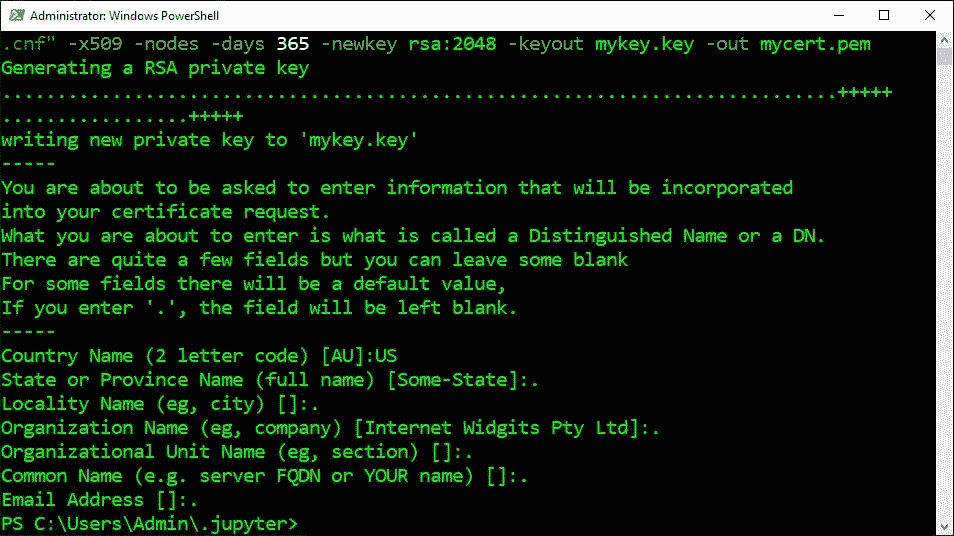

## 创建 JSON 文件:

在 PowerShell 中使用 *Set Content (sc)* 命令将文本保存到新文件中，并将文本添加到现有文件中。它可以覆盖现有文件中的文本并替换文件中的特定文本。它也可以与“Encoding”参数结合使用，以设定用于文件的编码类型。

1.  从下面这些指令中复制命令
2.  将命令粘贴到 PowerShell 中
3.  按“回车”

```
Set-Content $HOME\.jupyter\jupyter_notebook_config.json "" -Encoding ASCII
```

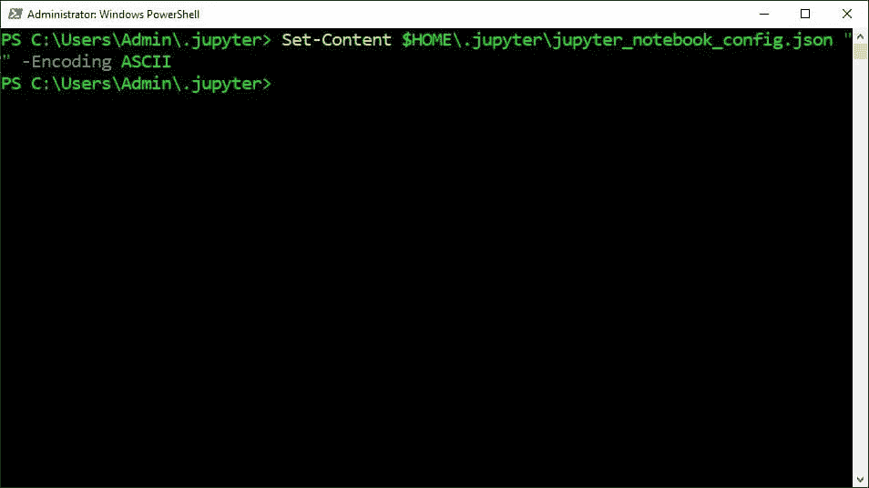

## 打开 JSON 文件:

*JavaScript Object Notation(JSON)*是一种用于在互联网上存储和传输数据的文件格式。它可以将数据转换成大多数编程语言都能解析的人类和机器可读的文本。它还可以包含字符串、数字、布尔值、数组和对象的键值对。

1.  从下面这些指令中复制命令
2.  将命令粘贴到 PowerShell 中
3.  按“回车”

```
notepad $HOME/.jupyter/jupyter_notebook_config.json
```


## 编辑 JSON 文件:

*配置文件*是一个 JSON 文件，用于定制 Jupyter 笔记本服务器。它仅包含用户指定的服务器参数、选项和设置，这些参数、选项和设置的优先级高于 Python 文件。它也存储在隐藏的。主目录的 jupyter 子目录。

1.  从这些说明下面复制 JSON
2.  将 JSON 粘贴到记事本中
3.  将“Admin”更改为 Windows 用户名
4.  单击“文件”菜单
5.  点击“保存”

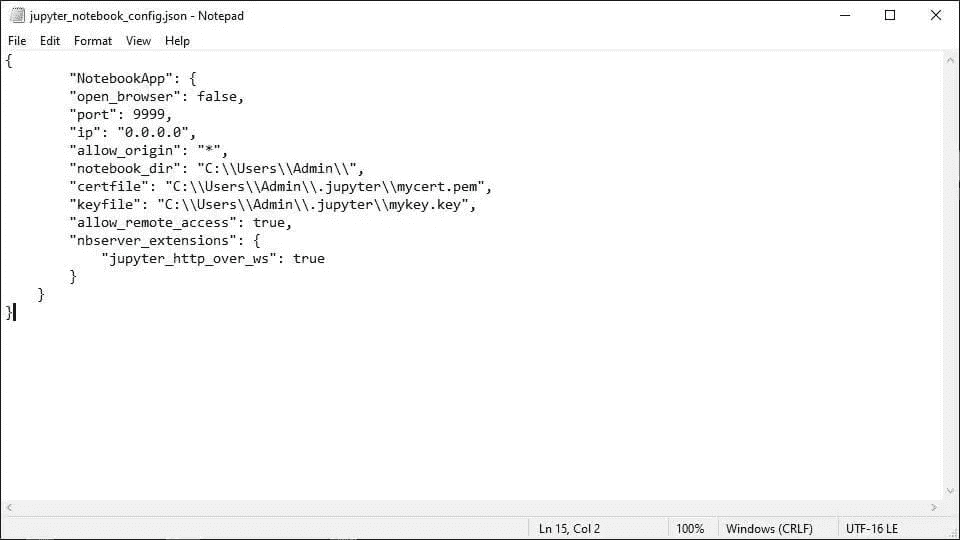

## 创建 Visual Basic 脚本文件:

在 PowerShell 中使用 *Set Content (sc)* 命令将文本保存到新文件中，并将文本添加到现有文件中。它可以覆盖现有文件中的文本并替换文件中的特定文本。它也可以与“Encoding”参数结合使用，以设定用于文件的编码类型。

1.  从下面这些指令中复制命令
2.  将命令粘贴到 PowerShell 中
3.  按“回车”

```
set-content $HOME\.jupyter\startup_script.vbs "" -encoding ascii
```


## 打开 Visual Basic 脚本文件:

*Visual Basic 脚本文件(vbs)* 是一个脚本文件，它包含要用 Windows 脚本宿主程序执行的源代码。它可以使用 Wscript 运行，Wscript 是为交互式窗口程序设计的。它也可以使用 Cscript 运行，Cscript 是为非交互式控制台程序设计的。

1.  从下面这些指令中复制命令
2.  将命令粘贴到 PowerShell 中
3.  按“回车”

```
notepad $HOME\.jupyter\startup_script.vbs
```


## 编辑 Visual Basic 脚本文件:

任务计划程序无法在启动时在后台正常启动 Jupyter 笔记本，因为后台进程正在会话零中运行。这将导致从命令行运行的程序在没有窗口的情况下启动。也可以用一个 [visual basic 脚本](#f714)来控制进程如何启动。

1.  从这些指令下面复制代码
2.  将代码粘贴到记事本中
3.  单击“文件”菜单
4.  点击“保存”

```
set object = [createobject](#d2bf)("[wscript](#36a4).[shell](#8bdf)") 
object.[run](#168e) "jupyter notebook --no-browser", 0
```


## 创建密码:

Jupyter Notebook 使用[基于令牌的认证](#f807)来限制对服务器的访问。这就产生了一个问题，因为服务器启动时在后台运行，所以令牌是不可见的。它也可以选择使用[基于密码的认证](#c0ff)，这提供了一种远程访问服务器的安全方式。

1.  从下面这些指令中复制命令
2.  将命令粘贴到 PowerShell 中
3.  按“回车”

```
jupyter notebook password
```


## 打开防火墙设置:

*Windows 防火墙*是一个用来保护电脑免受本地网络和互联网攻击的应用程序。它根据 IP 地址和端口信息过滤流量。它允许所有出站流量，但将入站流量限制在防火墙规则中明确规定的来源。

1.  按下“⊞之窗”
2.  在搜索栏中输入“Windows Defender Firewall”
3.  单击“Windows Defender 防火墙”
4.  单击左侧面板中的“高级设置”


## 创建入站规则:

Windows 防火墙使用*入站规则*来确定允许哪些流量使用特定端口和程序。它保护计算机免受互联网、不允许的连接、恶意软件和攻击者的攻击。它还保护计算机不接受来自未知计算机的连接。

1.  单击左侧面板中的“入站规则”
2.  单击右侧面板中的“新建规则…”


## 指定端口:

*端口*是一个在网络中使用的数字，用于将流量路由到计算机上的特定程序、应用程序或服务。它是指附加在用于程序、应用程序或服务的 IP 地址后面的数字。它还必须在路由器上打开，以便流量通过它。

1.  选择“端口”
2.  点击“下一步”
3.  选择“特定本地端口”
4.  输入“9999”
5.  点击“下一步”


## 允许连接:

*允许连接*选项用于 Windows 防火墙，允许计算机在指定端口传输安全和不安全数据。它允许计算机使用该端口与其他计算机进行交互。它也可能是某些程序运行所必需的，但它会使计算机不太安全。

1.  选择“允许连接”
2.  点击“下一步”


## 完成入站规则:

*防火墙配置文件*是一组预定义的防火墙规则和连接安全规则，用于确定计算机上允许的网络流量。它使用不同的保护级别连接到从非常严格到非常宽松的[公共](#2b95)、[私有](#0d9b)和[域](#e150) 网络。

1.  检查“域”、“私有”和“公共”
2.  点击“下一步”
3.  从这些说明下面抄下名字
4.  将名称粘贴到“名称”文本框中
5.  点击“完成”

```
Jupyter Notebook Server (WIN)
```

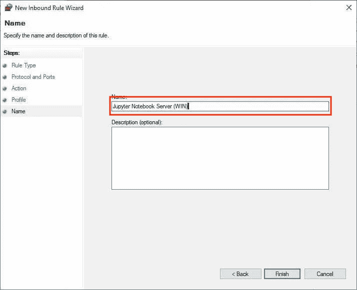

## 打开任务计划程序:

*任务调度器*是一个在满足一定标准时自动执行任务的程序。它可以在指定的时间或指定的时间间隔和事件后启动程序、执行命令和运行脚本。也可以使用图形用户界面或命令行界面进行编程。

1.  按下“⊞之窗”
2.  在搜索栏中输入“任务计划程序”
3.  单击“任务计划程序”


## 创建任务:

任务调度器使用*任务*根据用户指定的动作、触发器、主体和设置完成一个结果。它使用主帐户执行动作以响应触发器。它还根据设置中列出的情况执行操作。

1.  单击右侧面板中的“创建基本任务”
2.  从这些说明下面抄下名字
3.  将名称粘贴到“名称”文本字段中
4.  点击“下一步”
5.  选择“电脑启动时”
6.  点击“下一步”
7.  选择“启动程序”
8.  点击“下一步”

```
Jupyter Notebook Server (WIN)
```


## 指定操作:

在任务调度器中使用*动作*来指定当一个任务被触发时执行的工作。我可以启动程序、执行命令、运行脚本和打开文件。它还可以执行单个动作和多个动作，最多可包括 32 个顺序执行的动作。

1.  从下面这些指令中复制路径
2.  将路径粘贴到“程序/脚本”文本字段中
3.  点击“下一步”
4.  选中“打开属性对话框…”
5.  点击“完成”

```
%userprofile%\.jupyter\startup_script.vbs
```


## 指定触发器:

任务调度器中使用*触发器*来设置决定是否执行任务的条件。它可以使用基于时间的触发器和基于事件的触发器来启动任务。它还可以使用单个触发器和多个触发器来启动任务，这些触发器最多可以包括 48 个全部启动任务的触发器。

1.  单击顶部选项卡栏中的“触发器”
2.  单击“启动时”
3.  点击“编辑”
4.  选中“延迟任务时间”
5.  输入“30 秒”
6.  单击“确定”


## 以用户身份运行任务:

*仅在用户登录时运行*选项用于在用户登录后在任务调度程序中运行任务。它在前台用一个可以交互使用的窗口运行任务。它还会导致由任务启动的进程像正常一样在前台窗口中运行。

1.  单击标签栏中的“常规”
2.  选中“以最高权限运行”


## 取消时间限制:

任务调度器中的*如果任务运行时间超过*则停止任务设置用于限制任务能够运行的时间长度。它会在达到指定的时间限制后停止任务，以防止任务执行时间过长。它还可以防止冻结的任务永远运行下去。

1.  点击标签栏中的“设置”
2.  取消选中“如果任务运行时间超过，则停止任务”
3.  单击“确定”
4.  重新启动计算机


## 获取网络配置信息:

*互联网协议配置(ipconfig)* 命令用于显示[传输控制协议/互联网协议](#201e)值。它打印计算机上所有物理和虚拟网络适配器的 [IPv4 地址](#1173)、[子网掩码](#6981)、[默认网关](#ff9e)和[域名系统](#fd1d)地址。

1.  重新打开 PowerShell
2.  从下面这些指令中复制命令
3.  将命令粘贴到 PowerShell 中
4.  按“回车”
5.  记下 IPv4 地址、子网掩码和默认网关
6.  记下 DNS 服务器

```
ipconfig /all
```

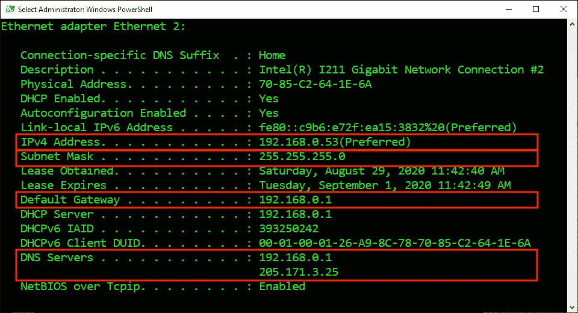

## 登录路由器:

*路由器*是一种用于在互联网和本地网络上的计算机之间传输数据的设备。它使用防火墙通过基于安全规则限制网络流量来保护计算机免受攻击者的攻击。也可以通过访问因品牌而异的[路由器 IP 地址](https://www.techspot.com/guides/287-default-router-ip-addresses/)进行设置。

1.  打开 web 浏览器
2.  从下面这些说明中复制路由器 IP 地址
3.  将路由器 IP 地址粘贴到 web 浏览器中
4.  按“回车”
5.  登录路由器

```
192.168.0.1
```

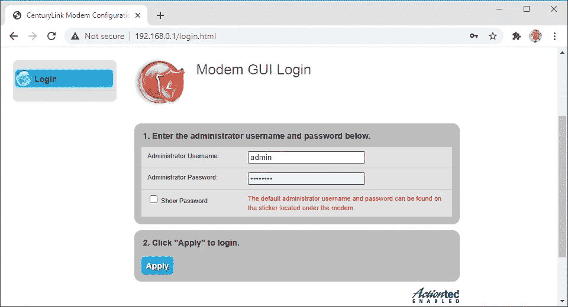

## 设置端口转发:

*端口转发*是一种路由器功能，用于让本地网络上的计算机通过互联网与其他计算机进行交互。它拦截指定端口号上的传入流量。它还将流量重定向到特定计算机的指定专用 IP 地址和端口号。

1.  找到“端口转发”页面
2.  将 IPv4 地址粘贴到“输入 IP 地址”文本字段中
3.  从下面复制端口这些说明
4.  将端口粘贴到“ [WAN](#579b) Starting Port”文本字段中
5.  将端口粘贴到“WAN 终端端口”文本字段中
6.  选择“所有 IP 地址”
7.  点击“应用”

```
9999
```

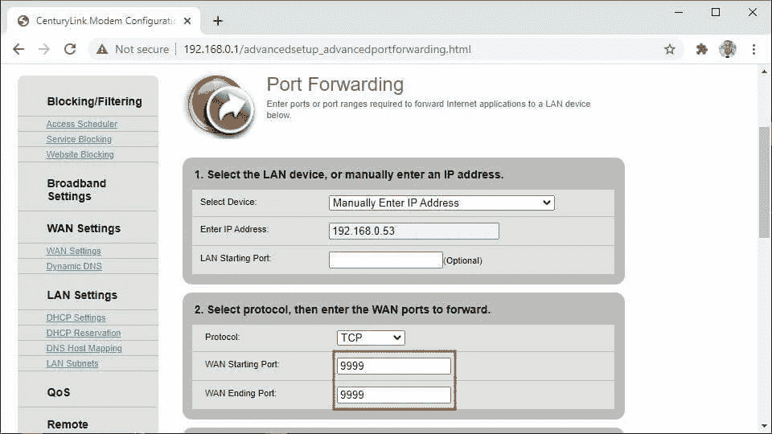

## 打开网络适配器属性:

*动态主机配置协议(DHCP)* 是一种用于改变网络而无需手动设置新 IP 地址的协议。它会自动为连接到网络的每台计算机分配一个 IP 地址。它还分配子网掩码、默认网关和 DNS 服务器。

1.  按下“⊞之窗”
2.  输入“网络状态”
3.  单击“网络状态”
4.  单击“更改适配器选项”
5.  右键单击连接到互联网的网络适配器
6.  单击“属性”

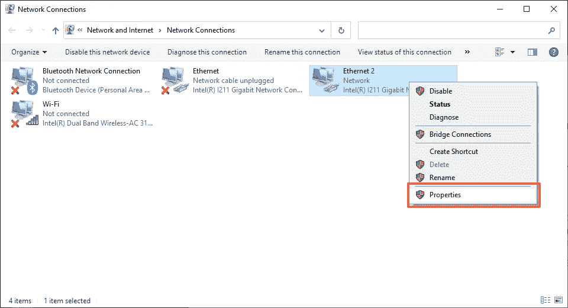

## 设置静态 IP 地址:

*静态 IP 地址*是一个 IP 地址，用于使本地网络上的其他计算机更容易访问使用相同 IP 地址的计算机。它可以分配给计算机，不会随时间而改变。它也需要在网络适配器属性中手动配置。

1.  选择“互联网协议版本 4 (TCP/IPv4)”
2.  单击“属性”
3.  选择“使用以下 IP 地址”
4.  输入之前的 TCP/IP 信息
5.  选择“使用下列 DNS 服务器地址”
6.  输入之前的 TCP/IP 信息
7.  单击“确定”

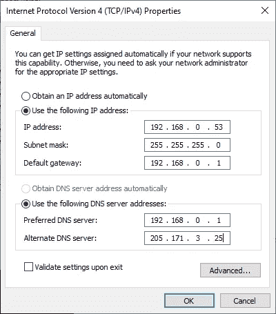

## 从本地网络访问服务器:

警告会出现在 web 浏览器中，因为 SSL 证书没有经过证书颁发机构的验证。它警告用户小心行事，因为它无法确认网站所有者的身份。发生这种情况是因为证书是自签名的，但它提供完全相同的保护。

1.  登录到不同的计算机或笔记本电脑
2.  连接到同一个 WiFi 网络
3.  在 web 浏览器中输入 IPv4 地址
4.  在 IP 地址前添加“https://”
5.  在 IP 地址后附加“9999”
6.  按“回车”
7.  键入“thisisunsafe”
8.  输入密码
9.  点击“登录”


## 获取公共 IP 地址:

*公共 IP 地址*是由互联网服务提供商分配给路由器的唯一 IP 地址。它在本地网络上的计算机之间共享，允许它们访问互联网。它还用于通过互联网从计算机访问本地网络上的计算机。

1.  从这些说明下面复制 URL
2.  将 URL 粘贴到 web 浏览器中
3.  记下公共 IP 地址

```
[https://www.google.com/search?q=whatsmyip](https://www.google.com/search?q=whatsmyip)
```


## 从远程网络访问服务器:

警告会出现在 web 浏览器中，因为 SSL 证书没有经过证书颁发机构的验证。它警告用户小心行事，因为它无法确认网站所有者的身份。发生这种情况是因为证书是自签名的，但它提供完全相同的保护。

1.  登录到不同的计算机或笔记本电脑
2.  连接到不同的 WiFi 网络
3.  在 web 浏览器中输入公共 IP 地址
4.  在 IP 地址前添加“https://”
5.  在 IP 地址后附加“9999”
6.  按“回车”
7.  键入“thisisunsafe”
8.  输入密码
9.  点击“登录”


> “希望这篇文章能帮助您获得👯‍♀️🏆👯‍♀️记得订阅以获取更多内容🏅"

## 后续步骤:

这篇文章是一个迷你系列的一部分，帮助读者设置他们开始学习人工智能、机器学习、深度学习和/或数据科学所需的一切。它包括包含复制和粘贴代码的说明和截图的文章，以帮助读者尽快获得结果。它还包括一些文章，包含带有解释和截图的说明，以帮助读者了解正在发生的事情。

```
**Linux:**
01\. [Install and Manage Multiple Python Versions](https://medium.com/p/916990dabe4b)
02\. [Install the NVIDIA CUDA Driver, Toolkit, cuDNN, and TensorRT](https://medium.com/p/cd5b3a4f824)
03\. [Install the Jupyter Notebook Server](https://medium.com/p/b2c14c47b446)
04\. [Install Virtual Environments in Jupyter Notebook](https://medium.com/p/1556c8655506)
05\. [Install the Python Environment for AI and Machine Learning](https://medium.com/p/765678fcb4fb)**WSL2:**
01\. [Install Windows Subsystem for Linux 2](https://medium.com/p/cbdd835612fb)
02\. [Install and Manage Multiple Python Versions](https://medium.com/p/1131c4e50a58)
03\. [Install the NVIDIA CUDA Driver, Toolkit, cuDNN, and TensorRT](https://medium.com/p/9800abd74409) 
04\. [Install the Jupyter Notebook Server](https://medium.com/p/7c96b3705df1)
05\. [Install Virtual Environments in Jupyter Notebook](https://medium.com/p/3e6bf456041b)
06\. [Install the Python Environment for AI and Machine Learning](https://medium.com/p/612240cb8c0c)
07\. [Install Ubuntu Desktop With a Graphical User Interface](https://medium.com/p/95911ee2997f) (Bonus)**Windows 10:**
01\. [Install and Manage Multiple Python Versions](https://medium.com/p/c90098d7ba5a)
02\. [Install the NVIDIA CUDA Driver, Toolkit, cuDNN, and TensorRT](https://medium.com/p/55febc19b58)
03\. [Install the Jupyter Notebook Server](https://medium.com/p/e8f3e9436044)
04\. [Install Virtual Environments in Jupyter Notebook](https://medium.com/p/5c189856479)
05\. [Install the Python Environment for AI and Machine Learning](https://medium.com/p/23c34b2baf12)**Mac:** 01\. [Install and Manage Multiple Python Versions](https://medium.com/p/ca01a5e398d4)
02\. [Install the Jupyter Notebook Server](https://medium.com/p/2a276f679e0)
03\. [Install Virtual Environments in Jupyter Notebook](https://medium.com/p/e3de97491b3a)
04\. [Install the Python Environment for AI and Machine Learning](https://medium.com/p/2b2353d7bcc3)
```

## 词汇表:

*外壳*是一个[解释器](#4ae9)，它向用户呈现[命令行界面](#324b)，并允许他们与[内核](#38ac)进行交互。它让他们通过键盘输入命令来控制系统。它还将命令从编程语言翻译成内核的机器语言。
[回车](#0e76)

*解释器*是一个程序，它通读以人类可读编程语言编写的指令，并从上到下执行指令。它将每条指令翻译成硬件可以理解的机器语言，执行它，然后继续下一条指令。
[ [返回](#4bde)

*命令行界面(CLI)* 是一个接受用户文本输入以在操作系统上运行命令的程序。它允许他们配置系统、安装软件和访问图形用户界面中不可用的功能。它也被称为终端或控制台。
[ [返回](#4bde)

*内核*是操作系统的核心程序，控制着电脑的一切。它简化了内存管理、进程管理、磁盘管理和任务管理。它还有助于程序和硬件之间用机器语言进行交流。[ [返回](#4bde)

*同源策略*是网络浏览器中使用的一种安全功能，用于阻止网站在其他网站上运行恶意脚本。它会禁用 HTTP 上的跨域通信，这也会阻止 web 浏览器访问运行服务器的计算机上的硬件。[ [Return](#40c3)

*变量*是用来存储不同类型值的容器。它可以通过在指定的变量名和值之间放置一个等号来赋值或更新一个值。它还可以通过在现有变量名前放置一个美元符号来引用存储的值。[ [返回](#035c)

OpenSSL 是一个用来实现[安全套接字层](#b907)的程序。它可以生成私钥，创建证书签名请求，生成[自签名证书](#bab2)，并验证证书信息。这可以用来帮助识别网站所有者，并保护敏感的用户数据免受攻击者的攻击。
[回车](#326a)

*安全套接字层(SSL)* 是使用密钥对为敏感数据增加一层保护的安全协议。它将私钥存储在服务器上，并将公钥分发给 web 浏览器。它使用密钥在 web 浏览器和服务器之间建立加密连接。
[ [返回](#73eb)

*自签名证书*是用于识别网站所有者的证书。它可以由生成证书的同一个人或公司而不是证书颁发机构来签名。它还可以提供与由证书颁发机构签名的证书相同的保护级别。
[ [返回](#326a)

*Visual Basic Script(VBScript)*是一种基于 Visual Basic 的脚本语言。它是为开发网页而创建的，但它已经成为在 Windows 上编写批处理文件的流行语言。它也可以使用 Windows 脚本宿主与 Windows 操作系统交互来执行。
[返回](#253a)

*创建对象*是 Visual Basic 脚本中的一个函数，创建[组件对象模型](#168e) 对象的[实例](#f290) 。它指定了访问组件对象模型中的方法和属性的编程标识符。这允许用户启动和控制具有程序标识符的外部程序。
[回车](#253a)

*实例*是指存在于零个或多个属于同一类的对象中的特定对象的独特身份。它与其他对象具有相同的属性，但属性值通常不同。它也可以有相同的值，但仍然是一个不同的实例。
[回车](#d2bf)

*组件对象模型(COM)* 是一种对象模型和编程标准，允许对象使用不同的编程语言和操作系统与其他对象进行交互。它定义了一组或多组相关函数，可用于启动和控制其他程序。
[返回](#d2bf)

在 Visual Basic 脚本中使用 *WScript* 对象来创建 Windows 脚本宿主的实例。它运行多种编程语言的脚本，这些脚本使用对象模型来执行任务。它还可以访问程序、快捷方式、环境变量、注册表和操作系统。
[回车](#253a)

在 Visual Basic 脚本中使用 *WshShell* 对象来允许用户与 Windows 操作系统进行交互。它可以访问环境变量、系统文件夹和注册表。它还可以创建快捷方式、显示弹出窗口，以及使用命令行参数和击键来运行程序。
[ [返回](#253a)

在 Visual Basic 脚本中使用 *Run* 方法来运行程序。它可以使用命令行参数和击键来运行图形程序、命令行程序和脚本。它还可以在有或没有窗口的情况下运行程序，激活程序窗口，以及暂时暂停程序。
[ [返回](#253a) ]

*基于令牌的认证*是一种实践，用于授权试图使用服务器提供的令牌访问服务器的用户。它创建一个令牌，并且只向拥有该令牌的用户授予访问权限。它还允许 web 浏览器存储和重用令牌，直到服务器复位。
[ [返回](#c535)

*基于密码的认证*是一种实践，用于授权试图使用用户提供的密码访问服务器的用户。它[散列](#6489)并存储密码，只允许拥有该密码的用户访问。它还允许网络浏览器存储和重复使用密码。
[回车](#c535)

*哈希*是一个用于将密码转换为不可逆密码的过程。它使用哈希算法将密码转换成一串简短的字母和数字。这使得攻击者更难使用哈希密码，因为他们仍然必须解码密码才能使用。[ [返回](#c0ff)

*公共* *配置文件*是当计算机在咖啡店、图书馆、餐馆、机场或其他公共场所连接到网络时，在 Windows 防火墙中使用的配置文件。它对配置文件施加了最多的限制，因为这种网络类型的安全性通常是不受控制的。[ [归来](#ff54)

*私有* *配置文件*是当计算机使用路由器或硬件防火墙连接到家庭或小型企业的网络时，在 Windows 防火墙中使用的配置文件。与域配置文件相比，它施加了更多的限制，因为这种网络类型的安全性只受到轻微的控制。
[ [返回](#ff54)

*域* *配置文件*是当计算机连接到政府工作场所、公司办公室或教育机构的网络时，在 Windows 防火墙中使用的配置文件。它对配置文件的限制最少，因为这种网络类型的安全性通常得到很好的控制。[ [返回](#ff54)

*广域网*是一种用于在相距很远的不同网络上的计算机之间传输数据的网络。它包含了一个[局域网](#62dd)网络，跨越了大的地理区域，如城市、州、国家，甚至世界。
[ [返回](#2d7b)

*局域网*是一种用于在位于同一物理区域的同一网络上的计算机之间传输数据的网络。它包含一个由计算机和外围设备组成的网络，这些设备局限于家庭、学校、实验室和办公楼等地理区域。[ [Return](#579b)

[*传输控制协议*](#0d83) */* [*互联网协议*](#3b1c) 是使计算机能够通过互联网交换信息的互联网协议套件。它定义了信息如何被分解成[包](#8131)，被成功地寻址、发送、路由、接收和重组，而没有错误或遗漏。
[回车](#1d61)

*数据包*是一小段被分解后通过互联网发送的数据。它包含两个部分，包括正在发送的实际数据和用于发送、接收和重组数据的元数据。它还通过最有效的路径和文件顺序发送。
[返回](#201e)

*传输控制协议(TCP)* 是一种用于将数据分成数据包在互联网上发送的协议。它对数据包进行编号，并按顺序重新组合，然后将它们交给接收计算机。它还检查错误、遗漏，并请求重新发送丢失的数据。
[回车](#201e)

*互联网协议(IP)* 是一种用于通过互联网向 IP 地址传送数据包的协议。它为每台连接到互联网的设备分配一个唯一的 IP 地址，让它们发送和接收数据包。它还将数据包从源 IP 地址路由到目的 IP 地址。
[ [返回](#201e)

*IPv4 地址*是一个唯一的 IP 地址，用于访问互联网和本地网络上的计算机。它可以用作公共 IP 地址，提供对互联网的访问。它也可以用作私有 IP 地址，用于访问本地网络中的其他计算机。
[ [返回](#1d61) ]

*子网掩码*是一个四个八位字节的数字，在 TCP/IP 协议中用来确定计算机是在本地网络还是远程网络上。它向计算机显示 IP 地址的哪一部分用于代表网络，哪一部分用于代表网络上的其他计算机。
[ [返回](#1d61)

*默认网关*是一个 IP 地址，路由器使用它来接收来自本地网络计算机的输出流量。它在计算机和不同网络上的其他计算机之间传输流量。它还在计算机和本地网络上的计算机之间传输流量。
[返回](#1d61)

*域名系统(DNS)* 是一种将人类可读的域名转换成公共 IP 地址的服务。它将域名和公共 IP 地址存储在服务器的数据库中。它查找用户请求的域名，并使用公共 IP 地址将它们路由到网站。
[回车](#1d61)