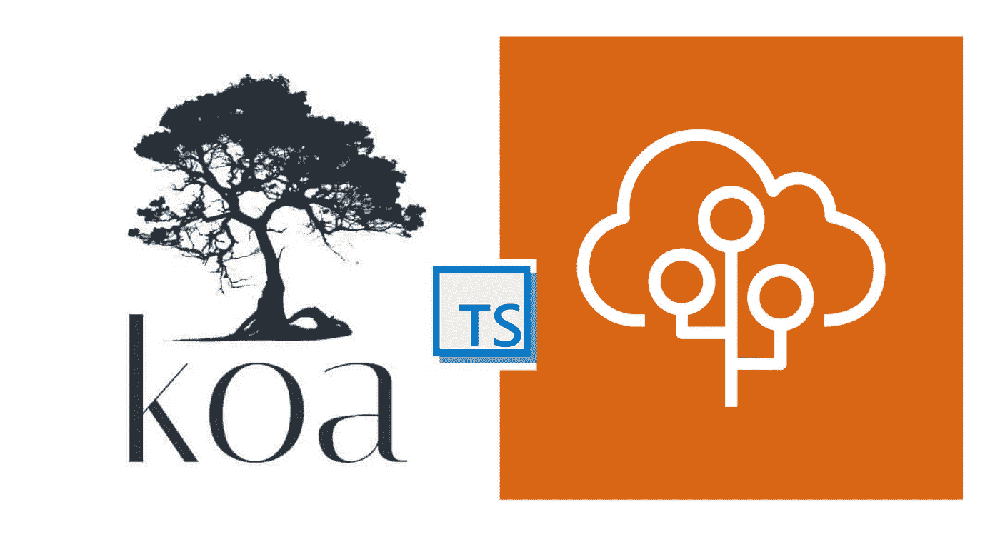
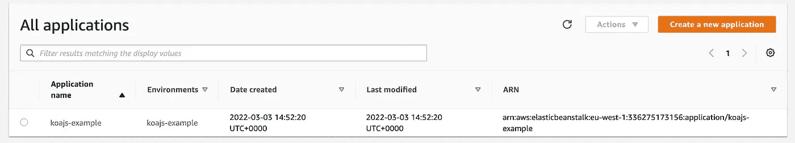
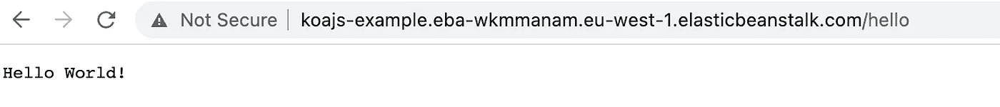

# 如何在 AWS Elastic beanstalk 上安装带有 Typescript 的 Koa web 框架

> 原文：<https://levelup.gitconnected.com/how-to-install-the-koa-web-framework-with-typescript-on-aws-elastic-beanstalk-c339ddb0bc57>

在 AWS 弹性豆茎上带有 TS 的 Kon

如何在 AWS elastic beanstalk 上安装带有 typescript 的 [Koa web framework](https://koajs.com/) 的分步指南。

简单总结一下我们要做的事情-

1.  创建一个支持类型脚本的小节点应用程序
2.  配置 tsconfig.json
3.  使用 Koa.js 编写几个端点
4.  安装 Elasticbeanstalk CLI
5.  创建电子商务环境
6.  在 EB 上部署我们的节点应用程序
7.  终止环境

但是在我们开始之前，一些文献📖论树袋熊&弹性豆茎

**什么是 KOA？**

> Koa 是由 Express 背后的团队设计的一个新的 web 框架，它的目标是成为一个更小、更有表现力、更健壮的 web 应用程序和 API 的基础。通过利用异步函数，Koa 允许您放弃回调并大大提高错误处理能力。Koa 在其核心中没有捆绑任何中间件，它提供了一套优雅的方法，使得编写服务器变得快速而愉快。
> 
> 出发地: [KoaJs](https://koajs.com/)

给你带来 Express developed Koa 的是同一个开发者。Koa 只是 Express 的一个更轻量级的版本，没有开箱即用的路由和模板。

Express 比 Koa 成熟多了。它的社区更加成熟。您将在 Express 上找到比 Koa 更多的文档/示例。

虽然 Koa 使得编写中间件更加简洁，但是使用带有 async/await 的 Express 也避免了“回调地狱”,并实现了类似的语法。

Koa 与 Express 之间的一些主要差异在这里详细介绍-[https://github . com/koajs/Koa/blob/master/docs/Koa-vs-Express . MD](https://github.com/koajs/koa/blob/master/docs/koa-vs-express.md)

**什么是 AWS 豆茎？**

> AWS Elastic Beanstalk 是一个易于使用的服务，用于部署和扩展用 Java 开发的 web 应用程序和服务。NET、PHP、Node.js、Python、Ruby、Go、Docker 在 Apache、Nginx、Passenger、IIS 等熟悉的服务器上。
> 
> 您只需上传您的代码，Elastic Beanstalk 就会自动处理部署，从容量供应、负载平衡、自动扩展到应用健康监控。同时，您保留了对驱动应用程序的 AWS 资源的完全控制，并且可以随时访问底层资源。
> 
> Elastic Beanstalk 不收取额外费用——您只需为存储和运行应用程序所需的 AWS 资源付费。
> 
> 来自 [AWS](https://aws.amazon.com/elasticbeanstalk/)

**第一步:创建支持类型脚本的节点应用**

[koa](https://www.npmjs.com/package/koa) : Koa 框架
[Koa-Router](https://www.npmjs.com/package/koa-router):Koa
[打字稿的路由器中间件](http://TypeScript is a language for application scale JavaScript development):打字稿支持

package.json

**第二步:配置 tsconfig.json**

`tsconfig.json`是配置 TypeScript 编译器选项的地方。我们可以用几个选项集创建一个“tsconfig”。

*   `rootDir`:这是 TypeScript 查找我们代码的地方。我们已经将其配置为在`src/`文件夹中查找。那是我们写打字稿的地方。
*   【TypeScript 放我们编译好的代码的地方。我们希望它进入一个`build/`文件夹。
*   `esModuleInterop`:如果你在过去几年里一直在 JavaScript 领域工作，你可能已经意识到模块系统已经有点失控了(AMD、SystemJS、es 模块等)。对于一个需要更长时间讨论的主题，如果我们使用`commonjs`作为我们的模块系统(对于节点应用程序，你应该这样)，那么我们需要将它设置为`true`。
*   `resolveJsonModule`:如果我们在这个项目中使用 JSON，这个选项允许 TypeScript 使用它。
*   `lib`:这个选项将*环境*类型添加到我们的项目中，允许我们依赖来自不同 Ecmascript 版本、测试库甚至浏览器 DOM api 的特性。我们想利用一些`es6`语言特性。这些都被编译成`es5`。
*   `module` : `commonjs`是 2019 年的标准节点模块系统。让我们利用这一点。
*   `allowJs`:如果你正在将一个旧的 JavaScript 项目转换成 TypeScript，这个选项将允许你在`.ts`文件中包含`.js`文件。
*   `noImplicitAny`:在类型脚本文件中，不允许不明确地指定类型。每个类型都需要有一个特定的类型或者被显式声明`any`。没有隐含的`any` s

在根目录中运行上述命令后，您应该有一个新的 tsconfig.json 文件，它应该如下所示

**步骤 3:使用 Koa & TS** 构建端点

这是一个非常基本的设置，有几条路线。一旦部署完毕，我们应该能够在“/”和“/hello”端点上访问它们。

**步骤 4:安装 Elasticbeanstalk CLI**

完成这里给出的步骤。https://github.com/aws/aws-elastic-beanstalk-cli-setup[。这是一个非常简单的设置，应该在几分钟内完成。](https://github.com/aws/aws-elastic-beanstalk-cli-setup)

**第五步:创建 EB 环境**

现在，您已经安装了 EB CLI，我们准备好部署我们的节点应用程序，但在此之前，我们需要注意几个步骤

*   在项目的根目录下添加一个. elasticbeanstalk 文件夹。
*   在该文件夹中添加一个 source_compile.config 文件，然后粘贴以下代码

这一点非常重要，否则您的 typescript 代码将无法构建。在运行启动脚本之前，这个命令在您的 EB 容器上运行。这里，我们运行 build 命令来生成您的输出目录。

*   添加节点命令. config

这将在构建环境后运行，并将启动您的节点应用程序。

**步骤 6:在 EB 上部署我们的节点应用**

现在，我们已经准备好部署我们的节点应用程序。确保在您的环境中正确设置了 AWS_ACCESS_KEY_ID 和 AWS_SECRET_ACCESS_KEY。

*   初始化您的电子商务平台

*   创建您的电子商务环境

*   部署您的 EB 应用程序

*   如果你打开 AWS 控制台，进入 EB 页面，你应该会看到类似这样的内容

*   在浏览器上打开应用程序

🎉🎉🎉🎉用 typescript 编写的 Koa 应用程序已成功部署，并且端点是可访问的

KOA 端点

**步骤 7:终止环境**

如果您将此作为测试运行，并且不再需要它，那么您可以像这样轻松地终止整个环境

这将负责删除 ec2 实例和所有其他相关服务。

你可以从这里查看这篇文章的代码[https://github.com/appletreeat56/koajs-example](https://github.com/appletreeat56/koajs-example)

**参考**

*   [https://khalilstemmler . com/blogs/typescript/node-starter-project/# Create-a-tsconfigjson](https://khalilstemmler.com/blogs/typescript/node-starter-project/#Create-a-tsconfigjson)
*   [https://docs . AWS . Amazon . com/elastic beanstalk/latest/DG/e b-CLI 3-install . html # e b-CLI 3-install . scripts](https://docs.aws.amazon.com/elasticbeanstalk/latest/dg/eb-cli3-install.html#eb-cli3-install.scripts)
*   [https://medium . com/@ lhviet 88/deploy-a-typescript-express js-into-elastic beanstalk-nodejs-server-8381 e00 e7e 52](https://medium.com/@lhviet88/deploy-a-typescript-expressjs-into-elasticbeanstalk-nodejs-server-8381e00e7e52)

感谢您的阅读，如果您想支持我，请关注我，成为会员来支持更广泛的社区[https://medium.com/@metacollective/membership](https://medium.com/@metacollective/membership)