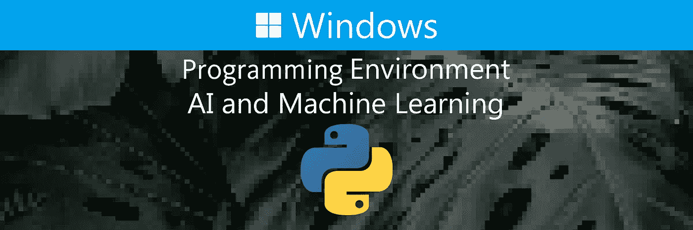

# 如何在 Windows 上安装 AI 和机器学习的编程环境

> 原文：<https://levelup.gitconnected.com/how-to-install-the-programming-environment-for-ai-and-machine-learning-on-windows-8d1bc340c1c5>

## 编程:

## 漂亮简单的教程，一步一步的指导



图片由约书亚·富勒拍摄

## 总结:

本文安装了用于人工智能和机器学习的编程环境。它安装创建虚拟环境的包，指定 python 版本，创建并激活虚拟环境，并升级 pip 包管理器。它还安装最常用于人工智能和机器学习的支持包和主包。

## 目录:

1.  [安装要求](#098b)
2.  [安装虚拟环境](#bdc7)
3.  [安装支持包](#0ab0)
4.  [安装主包](#5a84)

## 附录:

1.  [教程:人工智能设置](#50ec)
2.  [教程:人工智能课程](#c3c2)
3.  [教程:人工智能库](#e533)

## 安装要求:

本节安装创建虚拟环境的包。

```
**# open the powershell shell** 1\. press “⊞ windows”
2\. enter “powershell” into the search bar
3\. right-click "windows powershell"
4\. click “run as administrator”**# open the desktop directory**
cd $home\desktop\**# install virtualenv to create virtual environments**
python -m pip install virtualenv
```

## 安装虚拟环境:

本节指定 python 版本，用该版本创建并激活虚拟环境，并升级 pip 包管理器。

```
**# change "python36" to the desired python version** $python_version = "python36"**# create the virtual environment**
python -m virtualenv -p $python_version venv**# activate the virtual environment**
venv/scripts/activate**# upgrade the pip package manager**
python -m pip install --upgrade pip
```

## 安装支持包:

本节安装人工智能和机器学习的支持包。

```
**# install numpy to work with arrays**
python -m pip install numpy**# install pandas to work with structured data**
python -m pip install pandas**# install scipy to perform numerical computations**
python -m pip install scipy**# install pillow to manipulate images** python -m pip install pillow**# install matplotlib to create visualizations**
python -m pip install matplotlib**# install opencv to capture video and process images** python -m pip install opencv-python
```

## 安装主软件包:

本节安装 AI 和机器学习的主包。

```
**# prevent dependency conflicts between packages**
1\. install only one of the following packages per project
2\. create a separate virtual environment for each project
3\. install only the packages that are needed for each project**# install scikit-learn for prototyping** python -m pip install scikit-learn**# install tensorflow & keras for prototyping and production**
python -m pip install tensorflow tensorflow-gpu**# install pytorch for prototyping with cuda toolkit 11**
python -m pip install torch===1.7.1+cu110 torchvision===0.8.2+cu110 torchaudio===0.7.2 -f [https://download.pytorch.org/whl/torch_stable.html](https://download.pytorch.org/whl/torch_stable.html)**# install pytorch for prototyping with cuda toolkit 10**
python -m pip install torch===1.7.1 torchvision===0.8.2 torchaudio===0.7.2 -f [https://download.pytorch.org/whl/torch_stable.html](https://download.pytorch.org/whl/torch_stable.html)**# install pytorch for prototyping with cpu**
python -m pip install torch==1.7.1+cpu torchvision==0.8.2+cpu torchaudio===0.7.2 -f [https://download.pytorch.org/whl/torch_stable.html](https://download.pytorch.org/whl/torch_stable.html)**# install mxnet for prototyping and production with cuda toolkit 10**
python -m pip install mxnet-cu102 -f [https://dist.mxnet.io/python](https://dist.mxnet.io/python)**# install mxnet for prototyping and production with cpu** python -m pip install mxnet -f [https://dist.mxnet.io/python](https://dist.mxnet.io/python)
```

> "最后，记得订阅并按住鼓掌按钮，以获得定期更新和帮助."

## 附录:

这个博客的存在是为了提供完整的解决方案，回答你的问题，加速你与人工智能相关的进步。它提供了设置计算机和完成 fastai 课程前半部分所需的一切。它将让你接触到人工智能子领域中最先进的知识库。它也将涵盖 fastai 课程的后半部分。

## 教程:人工智能设置

本节提供了设置电脑所需的一切。

```
**# linux**
01\. [install and manage multiple python versions](https://medium.com/p/916990dabe4b)
02\. [install the nvidia cuda driver, toolkit, cudnn, and tensorrt](https://medium.com/p/cd5b3a4f824)
03\. [install the jupyter notebook home and public server](https://medium.com/p/b2c14c47b446)
04\. [install virtual environments in jupyter notebook](https://medium.com/p/1556c8655506)
05\. [install the python environment for ai and machine learning](https://medium.com/p/765678fcb4fb)
06\. [install the fastai course requirements](https://medium.com/p/116415a9df22/)**# wsl 2**
01\. [install windows subsystem for linux 2](https://medium.com/p/8ef0e1538052/)
02\. [install and manage multiple python versions](https://medium.com/p/1131c4e50a58)
03\. [install the nvidia cuda driver, toolkit, cudnn, and tensorrt](https://medium.com/p/9800abd74409) 
04\. [install the jupyter notebook home and public server](https://medium.com/p/7c96b3705df1)
05\. [install virtual environments in jupyter notebook](https://medium.com/p/3e6bf456041b)
06\. [install the python environment for ai and machine learning](https://medium.com/p/612240cb8c0c)
07\. [install ubuntu desktop with a graphical user interface](https://medium.com/p/95911ee2997f)
08\. [install the fastai course requirements](https://medium.com/p/15a77fc7e301/)**# windows 10**
01\. [install and manage multiple python versions](https://medium.com/p/153f8258be0f/)
02\. [install the nvidia cuda driver, toolkit, cudnn, and tensorrt](https://medium.com/p/af58647b6d9a/) 03\. [install the jupyter notebook home and public server](https://medium.com/p/9bfcf39ee2a7/)
04\. [install virtual environments in jupyter notebook](https://medium.com/p/296e1d176ea9/)
05\. [install the programming environment for ai and machine learning](https://medium.com/p/8d1bc340c1c5/)**# mac** 01\. [install and manage multiple python versions](https://medium.com/p/ca01a5e398d4)
02\. [install the jupyter notebook home and public server](https://medium.com/p/2a276f679e0)
03\. [install virtual environments in jupyter notebook](https://medium.com/p/e3de97491b3a)
04\. [install the python environment for ai and machine learning](https://medium.com/p/2b2353d7bcc3)
05\. [install the fastai course requirements](https://medium.com/p/90fdd524bc82)
```

## 教程:人工智能课程

本部分包含每课结束时对问卷的回答。

```
**# fastai course** 01\. [chapter 1: your deep learning journey q&](https://medium.com/p/6f266bdb1340/)a
02\. [chapter 2: from model to production q&a](https://medium.com/p/5a0902207f5b)
03\. [chapter 3: data ethics q&a](https://medium.com/p/501bb37ca30d)
04\. [chapter 4: under the hood: training a digit classifier q&a](https://medium.com/p/89077906197e/)
05\. [chapter 5: image classification q&a](https://medium.com/p/aa7cacdeab1/)
06\. [chapter 6: other computer vision problems q&a](https://medium.com/p/aa7cacdeab1/)
07\. [chapter 7: training a state-of-the-art model q&a](https://medium.com/p/6f6dcc83dd9f/)
08\. [chapter 8: collaborative filtering deep dive q&a](https://medium.com/p/52d3583d626b/)
```

## 教程:人工智能库

这个部分包含不同子领域中的最先进的知识库。

```
**# repositories related to audio** 01\. [raise audio quality using nu-wave](https://medium.com/p/e3dd979056e0/)
02\. [change voices using maskcyclegan-vc](https://medium.com/p/8bdfeb1faecb/)
03\. [clone voices using real-time-voice-cloning toolbox](https://medium.com/p/7b8609438001/)**# repositories related to images**
01\. [achieve 90% accuracy using facedetection-dsfd](https://medium.com/p/9c9fefb3f863/)
```