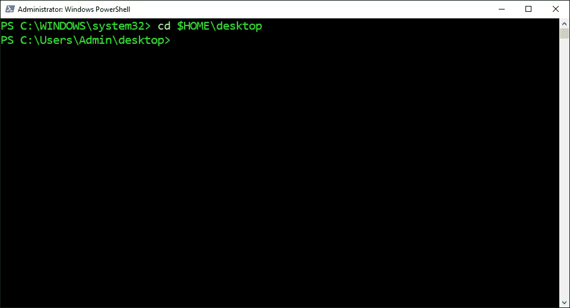
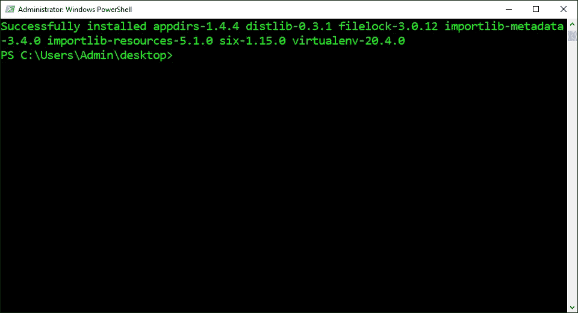
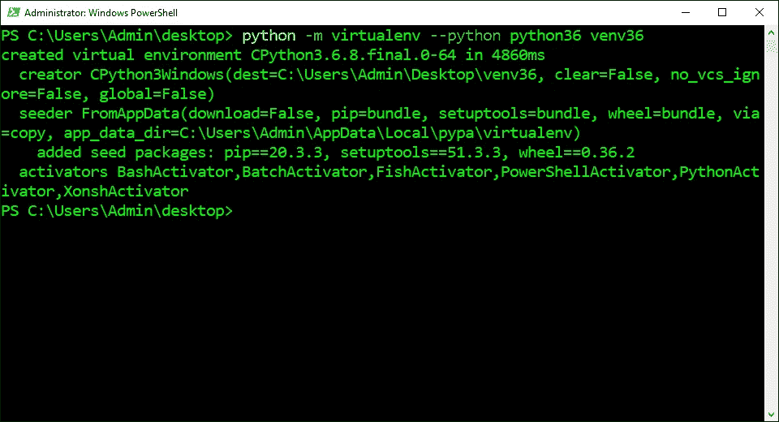
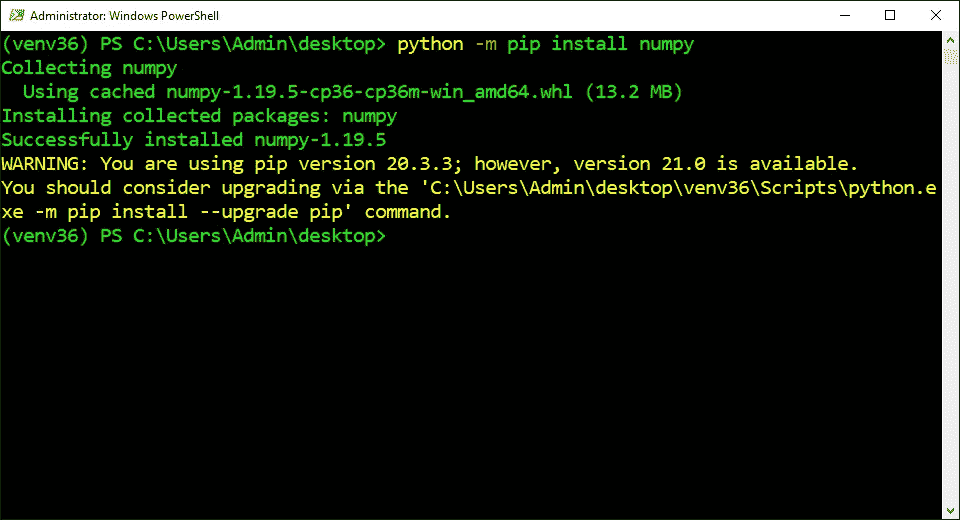
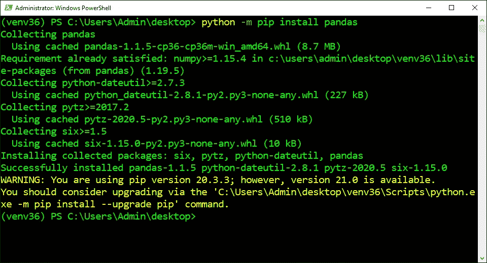
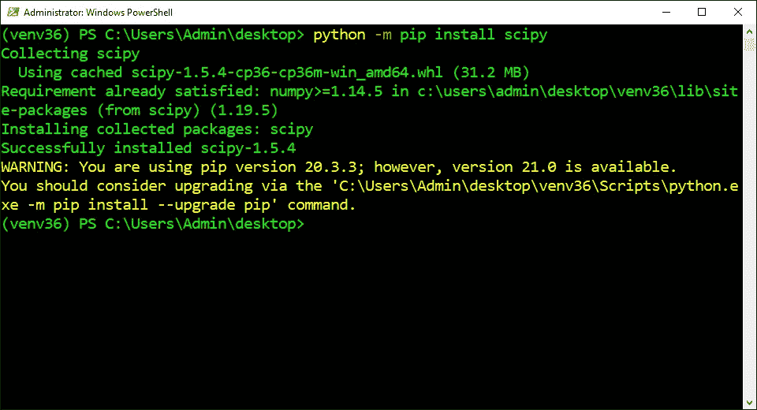
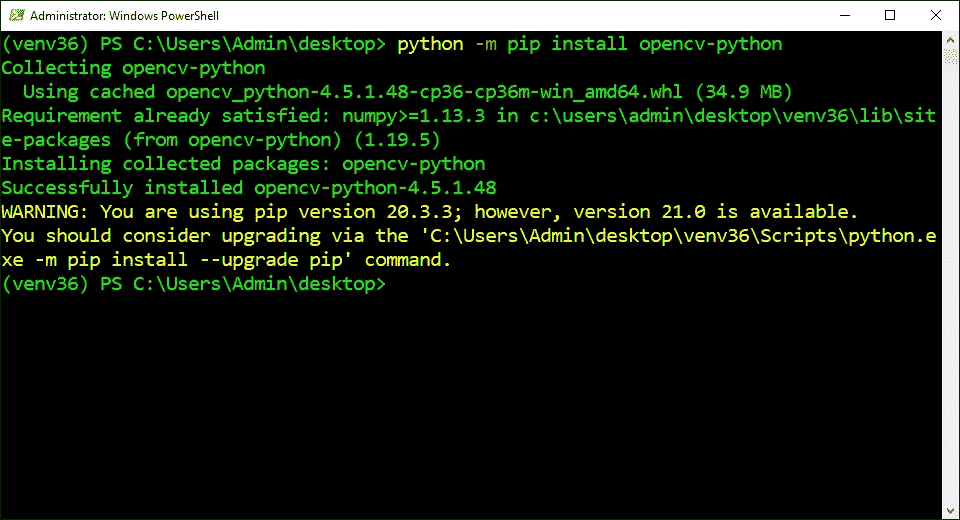
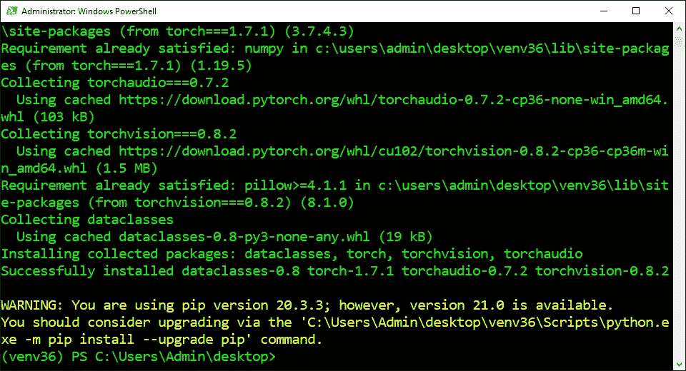
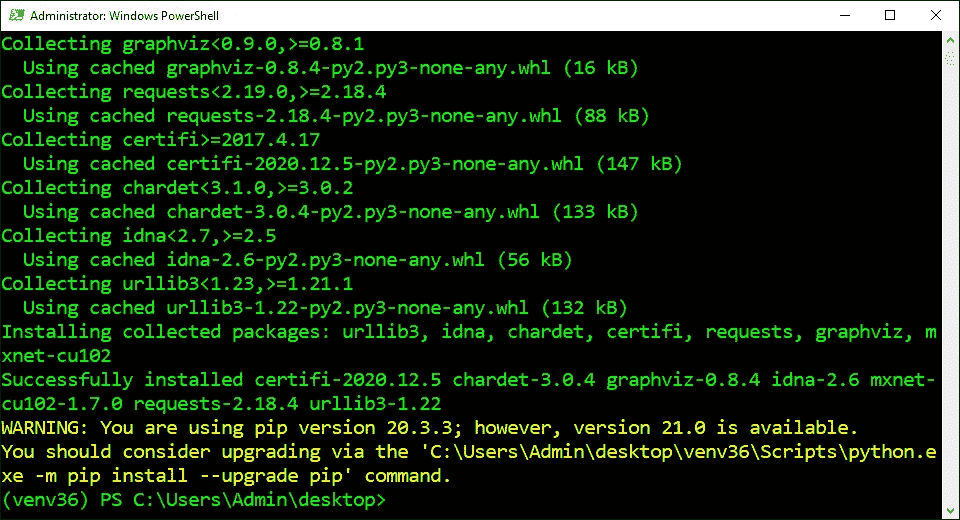

# 如何在 Windows 10 上安装用于 AI 和机器学习的 Python 环境

> 原文：<https://levelup.gitconnected.com/how-to-install-the-python-environment-for-ai-and-machine-learning-on-windows-10-23c34b2baf12>

## 创始人指南:

## 带有简明解释和截图的扩展教程


图片由[凯勒·罗杰斯](https://unsplash.com/photos/SGLh5-clL4E)

> “本文的[精简版](https://medium.com/p/a382ef83f85f)使用复制和粘贴代码来帮助您尽快获得结果，⚡”

## 打开 PowerShell:

*PowerShell* 是一种命令行 [shell](#a76a) 和面向对象的脚本语言，用于自动化管理任务和配置系统设置。它可以用于自动化操作系统中的几乎任何事情。它还取代了命令提示符，成为 Windows 10 的默认系统外壳。

1.  按下“⊞之窗”
2.  在搜索栏中输入“PowerShell”
3.  单击“以管理员身份运行”


## 打开主目录:

*改变目录(cd)* 命令用于将当前工作目录改变到指定目录。它可以导航到分别从根目录和当前工作目录开始的绝对路径和相对路径。它还可以导航到存储在[变量](#eef0)和[环境变量](#ab68)中的路径。

1.  从下面这些指令中复制命令
2.  将命令粘贴到 PowerShell 中
3.  按“回车”

```
cd $HOME\desktop
```



## 安装 Virtualenv:

*Virtualenv* 是 Python 中用来创建和管理虚拟环境的程序。它可以指定使用哪个 Python 版本和目录来创建虚拟环境。它还将所有必需的文件安装到指定的目录中，而不是系统范围的 Python 安装目录中。

1.  从下面这些指令中复制命令
2.  将命令粘贴到 PowerShell 中
3.  按“回车”

```
python -m pip install virtualenv
```



## 创建虚拟环境:

*虚拟环境*是一个独立的 Python 安装目录，它有自己的解释器、[站点包](#4d6f)和脚本。它主要用于防止来自不同项目的[依赖关系](#8686)之间的版本冲突。它还被用来满足来自 GitHub 的不同程序的依赖需求。

1.  从下面这些说明中找到 Python 版本
2.  复制提供的命令
3.  将命令粘贴到 PowerShell 中
4.  按“回车”

```
**Default:**
python -m venv venv**Python 3.5:** python -m virtualenv --python python35 venv35**Python 3.6:**
python -m virtualenv --python python36 venv36**Python 3.7:**
python -m virtualenv --python python37 venv37**Python 3.8:**
python -m virtualenv --python python38 venv38**Python 3.9:**
python -m virtualenv --python python39 venv39
```



## 激活虚拟环境:

*激活*脚本用于启动虚拟环境。它将虚拟环境路径添加到[路径](#584f)环境变量中，该变量将新的 Python 解释器和包管理器设置为默认版本。它还将[包](#48aa)安装在虚拟环境安装目录中。

1.  从下面这些说明中找到 Python 版本
2.  复制提供的命令
3.  将命令粘贴到 PowerShell 中
4.  按“回车”

```
**Default:**
venv/scripts/activate**Python 3.5:**
venv35/scripts/activate**Python 3.6:**
venv36/scripts/activate**Python 3.7:**
venv37/scripts/activate**Python 3.8:**
venv38/scripts/activate**Python 3.9:**
venv39/scripts/activate
```


## 安装 NumPy:

*numeric Python(NumPy)*是一个 C 库，在 Python 中用来处理数组。它提供了一个多维数组对象，比传统的 Python 列表快 50 倍。它还包括在数组上执行的数学函数，如三角函数、统计函数和代数函数。

1.  从下面这些指令中复制命令
2.  将命令粘贴到 PowerShell 中
3.  按“回车”

```
python -m pip install numpy
```



## 安装熊猫:

*Python 数据分析(Pandas)* 是一个用于处理结构化数据的 Python 库。它提供数据结构和操作来操作数字表和时间序列。它还包括从解析多种文件格式到将数据表转换成 NumPy 数组的实用程序。

1.  从下面这些指令中复制命令
2.  将命令粘贴到 PowerShell 中
3.  按“回车”

```
python -m pip install pandas
```



## 安装 SciPy:

*Scientific Python(SciPy)*是一个 Python 库，用于在数学、科学和工程中执行数值计算。它提供了一系列命令来操作和可视化多维数组。它还包括数值例程，如数值积分和优化。

1.  从下面这些指令中复制命令
2.  将命令粘贴到 PowerShell 中
3.  按“回车”

```
python -m pip install scipy 
```



## 安装枕头:

*Pillow* 是一个 Python 库，用于在 Python 解释器中操作图像。它使 Python 能够以大多数图像文件格式打开、操作和保存图像。它还具有图像处理功能，如调整大小、裁剪、旋转、灰度、变换和向图像添加文本。

1.  从下面这些指令中复制命令
2.  将命令粘贴到 PowerShell 中
3.  按“回车”

```
python -m pip install pillow
```


## 安装 Matplotlib:

Matplotlib 是一个 Python 库，用于创建静态、动画和交互式可视化。它以各种格式生成生产质量的图形、图表和数字。它还可以用于 Python 脚本、shells、web 应用服务器和图形用户界面工具包。

1.  从下面这些指令中复制命令
2.  将命令粘贴到 PowerShell 中
3.  按“回车”

```
python -m pip install matplotlib
```


## 安装 OpenCV:

*开源计算机视觉库(OpenCV)* 是一个 C++库，用于在 Python 中构建实时计算机视觉应用。它执行图像处理、视频捕获和分析、人脸检测和对象检测。它还拥有超过 2500 种算法，从经典到最先进

1.  从下面这些指令中复制命令
2.  将命令粘贴到 PowerShell 中
3.  按“回车”

```
python -m pip install opencv-python
```



## 防止依赖性冲突:

将每个软件包安装在同一个安装目录中可能会更容易，但最终会导致依赖性冲突，从而阻止一个或多个软件包工作。最好为每个项目创建一个单独的虚拟环境，并且只安装需要的包。

1.  仅安装以下库之一
2.  单击链接或向下滚动

```
1\. [Scikit-Learn](#e4c3)
2\. [Keras](#b32a)
3\. [TensorFlow](#a9cb)
4\. [PyTorch](#8aa5)
5\. [MxNet](#6b89)
```


## 1.安装 Scikit-Learn:

*Scikit-Learn* 是一个 Python 库，用于构建 train，并为原型开发部署机器学习模型。它提供了回归、聚类和分类的算法。它还包括用于预处理数据、模型拟合以及模型选择和评估的实用程序。

1.  从下面这些指令中复制命令
2.  将命令粘贴到 PowerShell 中
3.  按“回车”

```
python -m pip install scikit-learn
```


## 2.安装 Keras:

*Keras* 是一个 Python 库，用于快速构建、训练和部署用于原型制作和生产的深度学习模型。它运行在 TensorFlow 上，提供了一个快速、高效、模块化且易于使用的用户友好界面。它还被采纳为 TensorFlow 的官方高级接口。

1.  从下面这些指令中复制命令
2.  将命令粘贴到 PowerShell 中
3.  按“回车”

```
python -m pip install keras
```


## 3.安装 TensorFlow:

*TensorFlow* 是一个 C++库，在 Python 中用于构建、训练和部署深度学习模型以用于生产。它提供了快速性能、可伸缩性和可视化工具来帮助检查其[数据流图](#ef96)。它还支持多种语言、编程风格，并部署在大多数平台上。

1.  从下面这些指令中复制命令
2.  将命令粘贴到 PowerShell 中
3.  按“回车”

```
python -m pip install tensorflow tensorflow-gpu
```


## 4.安装 PyTorch:

*PyTorch* 是一个 C++库，在 Python 中用于构建、训练和部署深度学习模型以进行原型开发。它提供了高性能、可用性和灵活性。它还针对 Python 进行了优化，带来了更好的内存和优化、错误消息、模型结构和模型行为。

1.  从下面这些指令中复制命令
2.  将命令粘贴到 PowerShell 中
3.  按“回车”

```
**CUDA 11.0:**
python -m pip install torch===1.7.1+cu110 torchvision===0.8.2+cu110 torchaudio===0.7.2 -f [https://download.pytorch.org/whl/torch_stable.html](https://download.pytorch.org/whl/torch_stable.html)**CUDA 10.2:**
python -m pip install torch===1.7.1 torchvision===0.8.2 torchaudio===0.7.2 -f [https://download.pytorch.org/whl/torch_stable.html](https://download.pytorch.org/whl/torch_stable.html)**CPU:**
python -m pip install torch==1.7.1+cpu torchvision==0.8.2+cpu torchaudio===0.7.2 -f [https://download.pytorch.org/whl/torch_stable.html](https://download.pytorch.org/whl/torch_stable.html)
```



## 5.安装 MxNet:

*MXNet* 是一个 C++库，在 Python 中用于构建、训练和部署深度学习模型，用于原型制作和生产。它提供了非常高的性能、可伸缩性、可用性和资源效率。它还支持多种语言、编程风格，并部署在大多数平台上。

1.  从下面这些指令中复制命令
2.  将命令粘贴到 PowerShell 中
3.  按“回车”

```
**CUDA 10.2**:
python -m pip install mxnet-cu102 -f [https://dist.mxnet.io/python](https://dist.mxnet.io/python)**CPU:** python -m pip install mxnet
```



> *“希望这篇文章能帮助你获得👯‍♀️🏆👯‍♀️，记得订阅获取更多内容🏅"*

## 后续步骤:

这篇文章是一个迷你系列的一部分，帮助读者设置他们开始学习人工智能、机器学习、深度学习和/或数据科学所需的一切。它包括包含复制和粘贴代码的说明和截图的文章，以帮助读者尽快获得结果。它还包括一些文章，包含带有解释和截图的说明，以帮助读者了解正在发生的事情。

```
**Linux:**
01\. [Install and Manage Multiple Python Versions](https://medium.com/p/916990dabe4b)
02\. [Install the NVIDIA CUDA Driver, Toolkit, cuDNN, and TensorRT](https://medium.com/p/cd5b3a4f824)
03\. [Install the Jupyter Notebook Server](https://medium.com/p/b2c14c47b446)
04\. [Install Virtual Environments in Jupyter Notebook](https://medium.com/p/1556c8655506)
05\. [Install the Python Environment for AI and Machine Learning](https://medium.com/p/765678fcb4fb)**WSL2:**
01\. [Install Windows Subsystem for Linux 2](https://medium.com/p/cbdd835612fb)
02\. [Install and Manage Multiple Python Versions](https://medium.com/p/1131c4e50a58)
03\. [Install the NVIDIA CUDA Driver, Toolkit, cuDNN, and TensorRT](https://medium.com/p/9800abd74409) 
04\. [Install the Jupyter Notebook Server](https://medium.com/p/7c96b3705df1)
05\. [Install Virtual Environments in Jupyter Notebook](https://medium.com/p/3e6bf456041b)
06\. [Install the Python Environment for AI and Machine Learning](https://medium.com/p/612240cb8c0c)
07\. [Install Ubuntu Desktop With a Graphical User Interface](https://medium.com/p/95911ee2997f) (Bonus)**Windows 10:**
01\. [Install and Manage Multiple Python Versions](https://medium.com/p/c90098d7ba5a)
02\. [Install the NVIDIA CUDA Driver, Toolkit, cuDNN, and TensorRT](https://medium.com/p/55febc19b58)
03\. [Install the Jupyter Notebook Server](https://medium.com/p/e8f3e9436044)
04\. [Install Virtual Environments in Jupyter Notebook](https://medium.com/p/5c189856479)
05\. [Install the Python Environment for AI and Machine Learning](https://medium.com/p/23c34b2baf12)**Mac:** 01\. [Install and Manage Multiple Python Versions](https://medium.com/p/ca01a5e398d4)
02\. [Install the Jupyter Notebook Server](https://medium.com/p/2a276f679e0)
03\. [Install Virtual Environments in Jupyter Notebook](https://medium.com/p/e3de97491b3a)
04\. [Install the Python Environment for AI and Machine Learning](https://medium.com/p/2b2353d7bcc3)
```

## 词汇表:

*外壳*是一个[解释器](#1809)，它向用户呈现[命令行界面](#5962)，并允许他们与[内核](#fdf4)进行交互。它让他们通过键盘输入命令来控制系统。它还将命令从编程语言翻译成内核的机器语言。
[ [返回](#f17d)

*解释器*是一个程序，它通读以人类可读编程语言编写的指令，并从上到下执行指令。它将每条指令翻译成硬件可以理解的机器语言，执行它，然后继续下一条指令。
[ [返回](#a76a)

*命令行界面(CLI)* 是一个接受用户文本输入以在操作系统上运行命令的程序。它允许他们配置系统、安装软件和访问图形用户界面中不可用的功能。它也被称为终端或控制台。
[返回](#a76a)

内核是操作系统的核心程序，控制着电脑的一切。它简化了内存管理、进程管理、磁盘管理和任务管理。它还有助于程序和硬件之间用机器语言进行交流。
[ [返回](#a76a)

*变量*是用来存储不同类型值的容器。它可以通过在指定的变量名和值之间放置一个等号来赋值或更新一个值。它还可以通过在现有变量名前放置一个美元符号来引用存储的值。
[ [回车](#d0f9)

*环境变量*是由计算机自动创建和维护的变量。它帮助系统知道在哪里安装文件、查找程序以及检查用户和系统设置。它也可以被计算机上任何地方的图形和命令行程序使用。
[返回](#d0f9)

*Site-Packages* 是位于系统级 Python 安装目录中的一个目录。它表示包管理器用来安装 Python 包的默认位置。它还表示 Python 用来导入已经安装的 Python 包的目录。
[回车](#6548)

*依赖关系*是一个额外的二进制包，特定的二进制包需要它才能正常工作。它可能需要多个依赖项来构建几乎所有由包管理器发布的程序。它也会被一些包管理器自动下载和安装。
[ [返回](#6548)

*路径*是一个环境变量，包含计算机用来查找可执行文件的目录列表。它从上到下在列表的每个目录中查找请求的可执行文件。一旦找到匹配的可执行文件并运行程序或命令，它也会停止搜索。
[ [返回](#4855) ]

二进制包是一个存档文件，包含了使其包含的程序正常工作所需的文件和目录。它存储在包含特定 Linux 发行版的所有程序的存储库中。它还需要 Linux 包管理器来访问、提取和安装它。
[ [返回](#4855)

在 TensorFlow 中使用*数据流图*来描述图论语言中的计算。它定义了使用[节点](#20eb)和[边](#33d8)的有向图执行的计算序列。它还使用节点来表示数学运算，并使用边来连接节点，从而允许数据以定向方式从一个节点流向另一个节点。
[回车](#a9cb)

TensorFlow 中使用*节点*来表示数据流图中的数学运算。它引用运算的计算，但是它只在图形执行时产生实际值。它还可以从任意数量的先前节点获取输入，执行计算，并生成单个输出，该输出可以作为输入传递给另一个节点。
[返回](#ef96)

在 TensorFlow 中使用*边*来表示连接数据流图中不同节点的线条之一。它引用了[张量](#83a0)中流经图中不同操作的数据。它还将信息从一个节点传送到另一个节点，其中一个操作的输出成为另一个操作的输入，它们之间的边传送值。
[返回](#ef96)

*张量*是一种数据结构，在机器学习中用于表示神经网络中所有数据类型的输入、输出和转换。它将数学和编程中的概念(如标量、向量、矩阵和数字、数组和二维数组)概括为从零维到 n 维的多维数组。
[ [返回](#33d8)