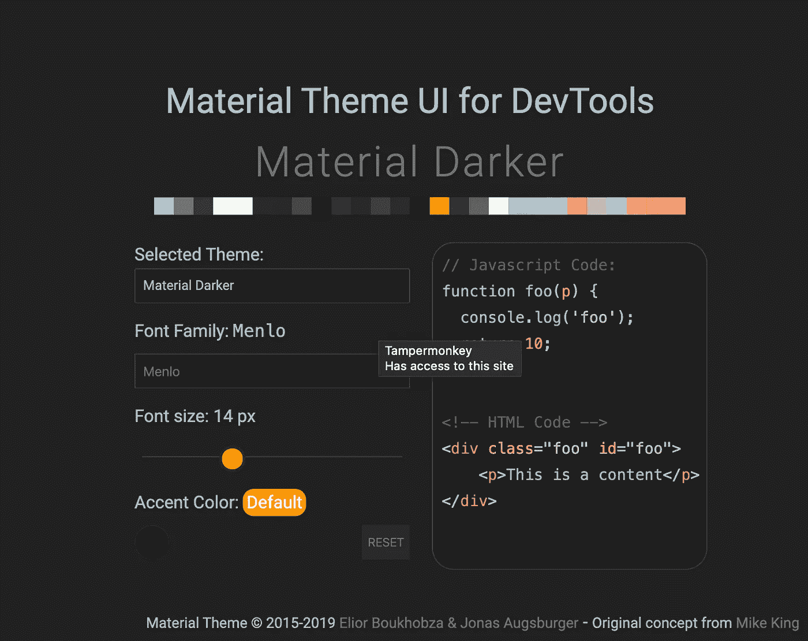

# 如何在 Chrome 开发工具中安装主题——让 Chrome 控制台丰富多彩

> 原文：<https://levelup.gitconnected.com/how-to-install-themes-in-chrome-dev-tools-make-chrome-dev-tools-colorful-2f822bf20965>

## 这篇文章向你展示了如何在你的 Chrome 开发者控制台中添加主题，并让它看起来像你最喜欢的 IDE 或文本编辑器

为了让你的 Chrome 开发工具看起来像你的 IDE，你需要:

*   在你的 Chrome 中启用实验标志`Allow custom UI themes`。
*   从 Chrome 商店安装一个 UI 扩展(材质主题)。

使用`cmd + option + J`打开 Chrome 控制台

转到设置(快捷键→ F1)

导航到设置

在设置>`Preferences`选项卡中，选择主题为`dark`。现在你的开发者工具会变成黑暗模式。如果你想安装一个自定义主题，你需要启用一个名为`Developer Tools experiments`的实验标志。

从 Chrome 商店安装[材料开发工具](https://chrome.google.com/webstore/search/material%20theme)扩展。

一旦安装了上述扩展，再次进入设置。在实验选项卡下的设置中，选择`Allow custom UI themes`。

一旦启用，现在关闭并重新打开开发工具。就是这样！

安装 UI 主题后

您可以通过在“材质开发工具”扩展的可用选项中选择“主题”来更改颜色和主题。

 [## JavaScript 开发人员的控制台备忘单

### 了解如何有效地使用浏览器控制台进行调试

levelup.gitconnected.com](/console-cheat-sheet-for-javascript-developers-21f0c49604d4)  [## 在 JavaScript 中复制对象的不同方法

### 原来复制物体有很多不同的方法

medium.com](https://medium.com/better-programming/different-ways-to-duplicate-objects-in-javascript-c199be34ecb7) 

赞助我一杯[咖啡](https://www.buymeacoffee.com/Jagathish) ☕️。