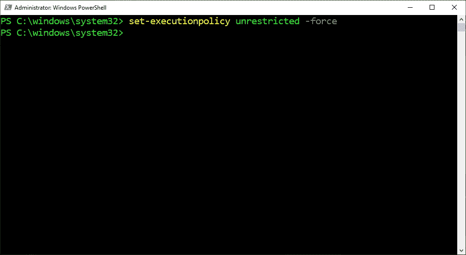
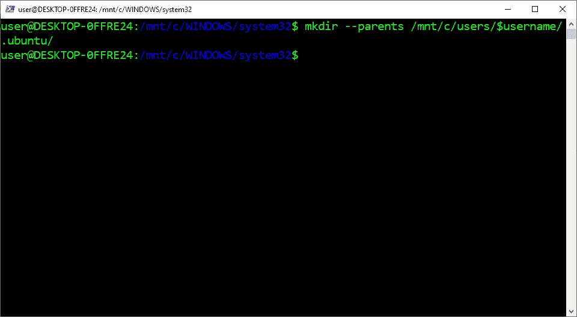
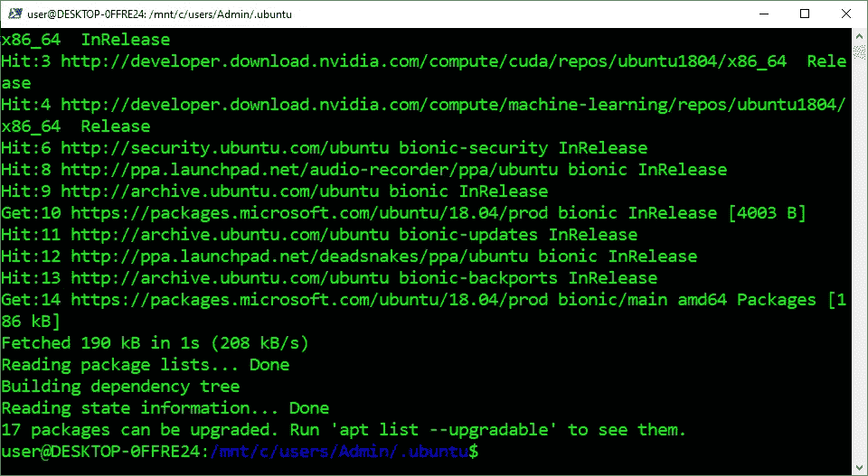
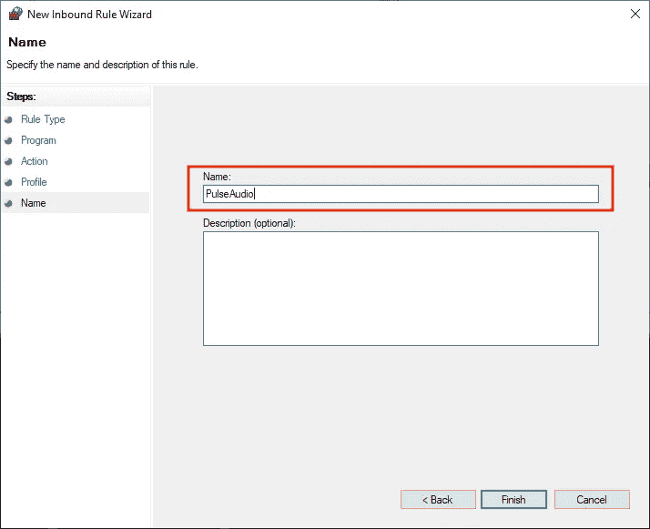

# 如何在 WSL2 上安装带有 GUI 和声音的 Ubuntu 桌面

> 原文：<https://levelup.gitconnected.com/how-to-install-ubuntu-desktop-with-gui-and-sound-on-wsl2-611cdb3dde9d>

## 带有说明和截图的简明指南


图片由[奥尔洛娃·玛利亚](https://unsplash.com/@orlovamaria)

> “注意:本文经过了重新编写，以简化流程并包含流程更新。点击查看[的更新文章](https://medium.com/p/71f4b78431a4/)

他的指南介绍了如何在 WSL2 上安装带有图形用户界面和声音的 Ubuntu 桌面。它包括安装所有必要的软件、创建运行图形用户界面的脚本、安装管理声音的后台服务，以及配置防火墙以允许声音从 WSL2 传播到 Windows。它还被编写为可以复制和粘贴大多数步骤来创建一个桌面图标，该图标可以像普通程序一样运行 Ubuntu 桌面。


## 下载 VcXsrv:

1.  访问[官网](https://sourceforge.net/projects/vcxsrv/)
2.  点击“下载”


## 安装 VcXsrv:

1.  单击“是”
2.  打开“vcx SRV-64 . 1 . 20 . 8 . 1 . installer . exe”
3.  点击“下一步”
4.  点击“安装”
5.  点击“关闭”


## 允许访问 VcXsrv:

1.  检查“专用网络”
2.  单击“允许访问”


## 打开 PowerShell:

1.  按下“⊞之窗”
2.  在搜索栏中输入“PowerShell”
3.  右键单击“Windows PowerShell”
4.  单击“以管理员身份运行”


## 更改执行策略:

1.  从下面这些指令中复制命令
2.  将命令粘贴到 PowerShell 中
3.  按“回车”

```
set-executionpolicy unrestricted -force
```



## 打开 WSL2:

1.  从下面这些指令中复制命令
2.  将命令粘贴到 PowerShell 中
3.  按“回车”

```
wsl
```


## 安装 Ubuntu 桌面:

1.  从下面这些指令中复制命令
2.  将命令粘贴到 PowerShell 中
3.  按“回车”

```
sudo apt --yes install ubuntu-desktop
```


## 设置用户名变量:

1.  从下面这些指令中复制命令
2.  将命令粘贴到 PowerShell 中
3.  按“回车”

```
username=$([wslvar](#8fc7) USERNAME)
```


## 创建 Ubuntu 目录:

1.  从下面这些指令中复制命令
2.  将命令粘贴到 PowerShell 中
3.  按“回车”

```
mkdir --parents /mnt/c/users/$username/.ubuntu/
```



## 打开 Ubuntu 目录:

1.  从下面这些指令中复制命令
2.  将命令粘贴到 PowerShell 中
3.  按“回车”

```
cd /mnt/c/users/$username/.ubuntu
```


## 获取 Microsoft 公钥:

1.  从下面这些指令中复制命令
2.  将命令粘贴到 PowerShell 中
3.  按“回车”

```
sudo apt-key adv --fetch-keys [https://packages.microsoft.com/keys/microsoft.asc](https://packages.microsoft.com/keys/microsoft.asc)
```


## 将 Microsoft 添加到源列表目录:

1.  从下面这些指令中复制命令
2.  将命令粘贴到 PowerShell 中
3.  按“回车”

```
**Ubuntu 20.04:**
sudo sh -c 'echo "deb [arch=amd64] [https://packages.microsoft.com/ubuntu/20.04/prod](https://packages.microsoft.com/ubuntu/18.04/prod) focal main" > /etc/apt/sources.list.d/microsoft-prod.list'**Ubuntu 18.04:**
sudo sh -c 'echo "deb [arch=amd64] [https://packages.microsoft.com/ubuntu/18.04/prod](https://packages.microsoft.com/ubuntu/18.04/prod) bionic main" > /etc/apt/sources.list.d/microsoft-prod.list'
```


## 更新存储库:

1.  从下面这些指令中复制命令
2.  将命令粘贴到 PowerShell 中
3.  按“回车”

```
sudo apt update
```



## 下载。Net 5.0 运行时:

1.  访问[官方网站](https://dotnet.microsoft.com/download/dotnet/5.0/runtime)
2.  单击“下载 x64”


## 安装。Net 5.0 运行时:

1.  单击“windows desktop-runtime-5 . 0 . 5-win-x64 . exe”文件
2.  点击“安装”
3.  单击“是”
4.  点击“下一步”
5.  点击“关闭”


## 以 Root 用户身份输入 Shell:

1.  从下面这些指令中复制命令
2.  将命令粘贴到 PowerShell 中
3.  按“回车”

```
sudo --shell
```


## 安装 Apt 运输 HTTPS:

1.  从下面这些指令中复制命令
2.  将命令粘贴到 PowerShell 中
3.  按“回车”

```
apt install apt-transport-https
```


## 下载 GPG 密钥:

1.  从下面这些指令中复制命令
2.  将命令粘贴到 PowerShell 中
3.  按“回车”

```
wget --output-document /etc/apt/trusted.gpg.d/wsl-transdebian.gpg [https://arkane-systems.github.io/wsl-transdebian/apt/wsl-transdebian.gpg](https://arkane-systems.github.io/wsl-transdebian/apt/wsl-transdebian.gpg)
```


## 更改访问权限:

1.  从下面这些指令中复制命令
2.  将命令粘贴到 PowerShell 中
3.  按“回车”

```
chmod a+r /etc/apt/trusted.gpg.d/wsl-transdebian.gpg
```


## 将 Arkane 系统添加到源列表目录:

1.  从下面这些指令中复制命令
2.  将命令粘贴到 PowerShell 中
3.  按“回车”

```
cat << EOF > /etc/apt/sources.list.d/wsl-transdebian.list
deb https://arkane-systems.github.io/wsl-transdebian/apt/ $(lsb_release -cs) main
deb-src https://arkane-systems.github.io/wsl-transdebian/apt/ $(lsb_release -cs) main
EOF
```


## 更新存储库:

1.  从下面这些指令中复制命令
2.  将命令粘贴到 PowerShell 中
3.  按“回车”

```
apt update
```


## 以 Root 用户身份退出 Shell:

1.  从下面这些指令中复制命令
2.  将命令粘贴到 PowerShell 中
3.  按“回车”

```
exit
```


## 安装精灵:

1.  从下面这些指令中复制命令
2.  将命令粘贴到 PowerShell 中
3.  按“回车”

```
sudo apt install --yes systemd-genie
```


## 创建桌面环境脚本:

1.  从这些指令下面复制代码
2.  将代码粘贴到 PowerShell 中
3.  按“回车”


## 下载 Ubuntu 设计图片:

1.  从下面这些指令中复制命令
2.  将命令粘贴到 PowerShell 中
3.  按“回车”

```
wget [https://assets.ubuntu.com/v1/9fbc8a44-circle-of-friends-web.zip](https://assets.ubuntu.com/v1/9fbc8a44-circle-of-friends-web.zip)
```


## 安装解压缩:

1.  从下面这些指令中复制命令
2.  将命令粘贴到 PowerShell 中
3.  按“回车”

```
sudo apt --yes install unzip
```


## 解压缩 Ubuntu 设计图像:

1.  从下面这些指令中复制命令
2.  将命令粘贴到 PowerShell 中
3.  按“回车”

```
unzip 9fbc8a44-circle-of-friends-web.zip
```


## 安装 ImageMagick:

1.  从下面这些指令中复制命令
2.  将命令粘贴到 PowerShell 中
3.  按“回车”

```
sudo apt --yes install imagemagick
```


## 创建 Ubuntu 图标:

1.  从下面这些指令中复制命令
2.  将命令粘贴到 PowerShell 中
3.  按“回车”

```
convert -resize 64x64 ./circle-of-friends-web/png/cof_orange_hex.png ubuntu.ico
```


## 退出 WSL2:

1.  从下面这些指令中复制命令
2.  将命令粘贴到 PowerShell 中
3.  按“回车”

```
exit
```


## 关闭 WSL2:

1.  从下面这些指令中复制命令
2.  将命令粘贴到 PowerShell 中
3.  按“回车”

```
wsl --shutdown
```


## 创建 VcXsrv 脚本:

1.  从这些指令下面复制代码
2.  将代码粘贴到 PowerShell 中
3.  按“回车”


## 创建 Ubuntu 桌面脚本:

1.  从这些指令下面复制代码
2.  将代码粘贴到 PowerShell 中
3.  按“回车”


## 创建快捷图标:

1.  从这些指令下面复制代码
2.  将代码粘贴到 PowerShell 中
3.  按“回车”


## 打开 WSL:

1.  从下面这些指令中复制命令
2.  将命令粘贴到 PowerShell 中
3.  按“回车”

```
wsl
```


## 设置用户名变量:

1.  从下面这些指令中复制命令
2.  将命令粘贴到终端
3.  按“回车”

```
username=$([wslvar](https://codeburst.io/how-to-install-virtual-environments-in-jupyter-notebook-in-wsl2-3e6bf456041b#32fa) username)
```


## 打开下载目录:

1.  从下面这些指令中复制命令
2.  将命令粘贴到 PowerShell 中
3.  按“回车”

```
cd /mnt/c/users/$username/downloads/
```


## 下载脉冲音频:

desc

1.  访问 X2Go [下载页面](https://code.x2go.org/releases/binary-win32/3rd-party/pulse/)
2.  点击“Pulseaudio-5.0-rev18.zip”


## 解压缩脉冲音频:

1.  从下面这些指令中复制命令
2.  将命令粘贴到 PowerShell 中
3.  按“回车”

```
unzip pulseaudio-5.0-rev18.zip
```


## 移动脉冲音频目录:

desc

1.  从下面这些指令中复制命令
2.  将命令粘贴到 PowerShell 中
3.  按“回车”

```
mv pulse /mnt/c/pulse
```


## 将客户端界面安装到脉冲音频:

1.  从下面这些指令中复制命令
2.  将命令粘贴到 PowerShell 中
3.  按“回车”

```
sudo apt install libpulse0
```


## 打开主目录:

1.  从下面这些指令中复制命令
2.  将命令粘贴到 PowerShell 中
3.  按“回车”

```
cd ~
```


## 打开 Bash 配置文件:

1.  从下面这些指令中复制命令
2.  将命令粘贴到 PowerShell 中
3.  按“回车”

```
notepad .bashrc
```


## 编辑 Bash 配置文件:

1.  从这些指令下面复制代码
2.  将代码粘贴到记事本中
3.  单击“文件”菜单
4.  点击“保存”

```
export HOST_IP="$(ip route |awk '/^default/{print $3}')"
export PULSE_SERVER="tcp:$HOST_IP"
export DISPLAY="$(cat /etc/resolv.conf | grep nameserver | awk '{ print $2 }'):0.0"
```


## 重新加载 Bash 配置文件:

1.  从下面这些指令中复制命令
2.  将命令粘贴到 PowerShell 中
3.  按“回车”

```
source ~/.bashrc
```


## 打开脉冲音频目录:

1.  从下面这些指令中复制命令
2.  将命令粘贴到 PowerShell 中
3.  按“回车”

```
cd /mnt/c/pulse/
```


## 创建默认配置文件:

1.  从下面这些指令中复制命令
2.  将命令粘贴到 PowerShell 中
3.  按“回车”
4.  单击“是”

```
notepad config.pa
```


## 编辑默认配置文件:

1.  从这些指令下面复制命令
2.  将命令粘贴到记事本中
3.  单击“文件”菜单
4.  点击“保存”
5.  单击“文件”菜单
6.  点击“退出”

```
load-module module-native-protocol-tcp auth-ip-acl=127.0.0.1;172.16.0.0/12
load-module module-esound-protocol-tcp auth-ip-acl=127.0.0.1;172.16.0.0/12
load-module module-waveout sink_name=output source_name=input record=0
```


## 打开守护程序配置文件:

1.  从下面这些指令中复制命令
2.  将命令粘贴到 PowerShell 中
3.  按“回车”

```
notepad "default config files/daemon.conf"
```


## 编辑守护程序配置文件:

1.  从这些说明下面复制设置
2.  将设置粘贴到第 39 行的设置上
3.  单击“文件”菜单
4.  点击“保存”

```
; exit-idle-time = -1
```


## 下载 NSSM:

1.  访问[官方网站](https://nssm.cc/download)
2.  单击“Nssm-2.24.zip”


## 打开下载目录:

1.  从下面这些指令中复制命令
2.  将命令粘贴到 PowerShell 中
3.  按“回车”

```
cd /mnt/c/users/$username/downloads
```


## 解压缩 NSSM:

1.  从下面这些指令中复制命令
2.  将命令粘贴到 PowerShell 中
3.  按“回车”

```
unzip nssm-2.24.zip
```


## 移动可执行文件:

1.  从下面这些指令中复制命令
2.  将命令粘贴到 PowerShell 中
3.  按“回车”

```
mv nssm-2.24/win64/nssm.exe /mnt/c/pulse/
```


## 退出 WSL2:

1.  从下面这些指令中复制命令
2.  将命令粘贴到 PowerShell 中
3.  按“回车”

```
exit
```


## 安装脉冲音频服务:

1.  从下面这些指令中复制命令
2.  将命令粘贴到 PowerShell 中
3.  按“回车”

```
c:\pulse\nssm.exe install pulseaudio
```


## 编辑路径:

1.  从下面这些指令中复制路径
2.  将名称粘贴到“路径”文本字段中

```
c:\pulse\pulseaudio.exe
```


## 编辑启动目录:

1.  从下面这些指令中复制路径
2.  将名称粘贴到“启动目录”文本栏中

```
c:\pulse\
```


## 编辑参数:

1.  从这些说明下面抄下名字
2.  将名称粘贴到“显示名称”文本栏中

```
--file c:\pulse\config.pa
```


## 编辑显示名称:

1.  单击“详细信息”选项卡
2.  从这些说明下面抄下名字
3.  将名称粘贴到“显示名称”文本栏中
4.  单击“安装服务”
5.  单击“确定”

```
pulseaudio
```


## 打开任务管理器:

1.  从下面这些指令中复制命令
2.  将命令粘贴到 PowerShell 中
3.  按“回车”

```
taskmgr
```


## 启动脉冲音频服务:

1.  单击“服务”选项卡
2.  滚动至“PulseAudio”
3.  右键单击“脉冲音频”
4.  点击“开始”


## 打开 Windows 防火墙:

1.  从下面这些指令中复制命令
2.  将命令粘贴到 PowerShell 中
3.  按“回车”

```
wf.msc
```


## 创建入站规则:

1.  单击“入站规则”
2.  单击“新建规则”


## 指定程序:

1.  选择“程序”
2.  点击“下一步”
3.  从下面这些指令中复制路径
4.  将路径粘贴到“此程序路径”文本字段中
5.  点击“下一步”

```
%SystemDrive%\pulse\pulseaudio.exe
```


## 允许连接:

1.  选择“允许连接”
2.  点击“下一步”


## 完成入站规则:

1.  检查“域”、“私有”和“公共”
2.  点击“下一步”
3.  从这些说明下面抄下名字
4.  将名称粘贴到“名称”文本框中
5.  点击“完成”

```
PulseAudio
```



## 打开 Ubuntu 目录:

1.  从下面这些指令中复制命令
2.  将命令粘贴到 PowerShell 中
3.  按“回车”

```
cd $HOME\.ubuntu
```


## 启动 Ubuntu 桌面:

1.  从下面这些指令中复制命令
2.  将命令粘贴到 PowerShell 中
3.  按“回车”
4.  双击“Ubuntu”快捷方式
5.  等待 180 秒，让 Ubuntu 桌面启动

```
explorer.exe .\
```


## 完整认证:

1.  在“密码”文本字段中输入 Unix 帐户密码
2.  点击“认证”


## 开放终端:

1.  点击左上角的“活动”
2.  在搜索栏中输入“终端”
3.  点击“终端”


## 安装快照存储:

1.  从下面这些指令中复制命令
2.  将命令粘贴到终端
3.  按“回车”

```
sudo snap install snap-store
```


## 黑屏故障排除:

1.  从这些指令下面复制命令
2.  将命令粘贴到 PowerShell 中
3.  按“回车”
4.  双击 Ubuntu 图标
5.  等待 180 秒，让 Ubuntu 桌面启动

```
wsl --shutdown; wsl
```


> *“希望这篇文章能帮助你获得👯‍♀️🏆👯‍♀️，记得订阅获取更多内容🏅"*

## 后续步骤:

这篇文章是一个迷你系列的一部分，帮助读者设置他们开始学习人工智能、机器学习、深度学习和/或数据科学所需的一切。它包括包含复制和粘贴代码的说明和截图的文章，以帮助读者尽快获得结果。它还包括一些文章，包含带有解释和截图的说明，以帮助读者了解正在发生的事情。

```
**Linux:**
01\. [Install Multiple Python Versions](https://medium.com/p/8bd6d301d78c)
02\. [Install the CUDA Driver and Toolkit](https://medium.com/p/3494a4436d6)
03\. [Install the Jupyter Notebook Server](https://medium.com/p/f5bbc07e184a)
04\. [Install Virtual Environments in Jupyter Notebook](https://medium.com/p/c93fd8d07ca0)
05\. [Install the Python Environment for AI](https://medium.com/p/d2937ce641b7)**WSL2:**
01\. [Install Windows Subsystem for Linux 2](https://medium.com/p/e01f92e98cc0)
02\. [Install Multiple Python Versions](https://medium.com/p/ba81f21109d6)
03\. [Install the CUDA Driver and Toolkit](https://medium.com/p/be38703fed5c)
04\. [Install the Jupyter Notebook Server](https://medium.com/p/3ea9bc06a0e5)
05\. [Install Virtual Environments in Jupyter Notebook](https://medium.com/p/d99de1d79fd4)
06\. [Install the Python Environment for AI](https://medium.com/p/6d73735b546)
07\. [Install Ubuntu Desktop With GUI and Sound (Bonus)](https://medium.com/p/611cdb3dde9d)**Windows 10:**
01\. [Install Multiple Python Versions](https://medium.com/p/15a8685ec99d)
02\. [Install the CUDA Driver and Toolkit](https://medium.com/p/f103ea5eae4b)
03\. [Install the Jupyter Notebook Server](https://medium.com/p/c2ca45793e3b)
04\. [Install Virtual Environments in Jupyter Notebook](https://medium.com/p/a307b6524715)
05\. [Install the Python Environment for AI](https://medium.com/p/604168afbd6e)**Mac:** 01\. [Install Multiple Python Versions](https://medium.com/p/a58b1966825f)
02\. [Install the Jupyter Notebook Server](https://medium.com/p/7b42d371ac21)
03\. [Install Virtual Environments in Jupyter Notebook](https://medium.com/p/557f23e55f99)
04\. [Install the Python Environment for AI](https://medium.com/p/ed5c93639301)
```

## 其他资源:

本文是帮助您从头到尾设置完成 Fast.ai 课程所需的一切的系列文章的一部分。它包含在教科书每章末尾提供问卷答案的指南。它还包含使用术语和命令的定义、说明和屏幕截图一步一步地浏览代码的指南。

```
**Linux:**
01\. [Install the Fastai Requirements](https://medium.com/p/116415a9df22)
02\. [Fastai Course Chapter 1 Q&A](https://medium.com/p/735f932def0a)
03\. [Fastai Course Chapter 1](https://medium.com/p/d69df3db69a7)
04\. [Fastai Course Chapter 2 Q&A](https://medium.com/p/af9dab3ce8c6)
05\. [Fastai Course Chapter 2](https://medium.com/p/42d7a406349)
06\. [Fastai Course Chapter 3 Q&A](https://medium.com/p/2df7f3a9711)
07\. Fastai Course Chapter 3
08\. [Fastai Course Chapter 4 Q&A](https://medium.com/p/90d2ccb6eaa9)**WSL2:**
01\. [Install the Fastai Requirements](https://medium.com/p/15a77fc7e301)
02\. [Fastai Course Chapter 1 Q&A](https://medium.com/p/22e0478e9f70)
03\. [Fastai Course Chapter 1](https://medium.com/p/3dbee2e4f23c) 04\. [Fastai Course Chapter 2 Q&A](https://medium.com/p/32290be44822)
05\. [Fastai Course Chapter 2](https://medium.com/p/23eedadd304f)
06\. [Fastai Course Chapter 3 Q&A](https://medium.com/p/9e5f0f2a6c1a)
07\. Fastai Course Chapter 3
08\. [Fastai Course Chapter 4 Q&A](https://medium.com/p/9cb0a3bb4fb7)**Windows 10:** 01\. [Install the Fastai Requirements](https://medium.com/p/90236724f881)
02\. [Fastai Course Chapter 1 Q&A](https://medium.com/p/d54e30e4ecdb)
03\. [Fastai Course Chapter 1](https://medium.com/p/71cee967f8c8)
04\. [Fastai Course Chapter 2 Q&A](https://medium.com/p/59b240c033f1)
05\. [Fastai Course Chapter 2](https://medium.com/p/6ee427c1d2d7)
06\. [Fastai Course Chapter 3 Q&A](https://medium.com/p/3cf2e9ff71ac)
07\. Fastai Course Chapter 3
08\. [Fastai Course Chapter 4 Q&A](https://medium.com/p/637a07243964)**Mac:** 01\. [Install the Fastai Requirements](https://medium.com/p/90fdd524bc82)
02\. [Fastai Course Chapter 1 Q&A](https://medium.com/p/ffe665e7f5b5)
03\. [Fastai Course Chapter 1](https://medium.com/p/faf0c9ee738b)
04\. [Fastai Course Chapter 2 Q&A](https://medium.com/p/c7bed4469dff)
05\. [Fastai Course Chapter 2](https://medium.com/p/f10f9da60073)
06\. [Fastai Course Chapter 3 Q&A](https://medium.com/p/8aaab80f11a6)
07\. Fastai Course Chapter 3
08\. [Fastai Course Chapter 4 Q&A](https://medium.com/p/14f7f4a718de)
```