# 如何在 Windows 10 中的 Jupyter 笔记本中安装虚拟环境

> 原文：<https://levelup.gitconnected.com/how-to-install-virtual-environments-in-jupyter-notebook-in-windows-10-5c189856479>

## 创始人指南:

## 带有简明解释和截图的扩展教程

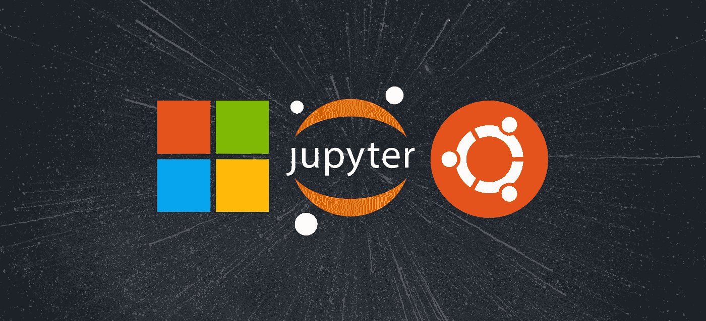

凯西·霍纳的图片

> “本文的[精简版](https://medium.com/p/8d454d56cf02)使用复制和粘贴代码来帮助您尽快获得结果，⚡”

## 开放终端:

*终端*是 Jupyter Notebook 中使用的一个仿真器，用于从远程计算机访问服务器的文件系统。它运行在托管服务器的同一台计算机上，并授予用户管理权限。它也可以与大多数[外壳](#4379)一起工作，并且具有相同的功能。

1.  打开 web 浏览器
2.  输入 Jupyter 笔记本电脑服务器的 IP 地址
3.  按“回车”
4.  点击“新建”
5.  点击“终端”

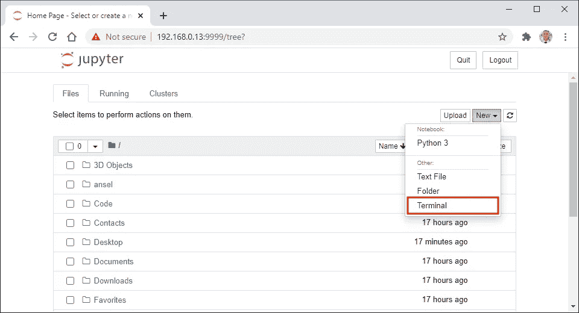

## 打开桌面目录:

*改变目录(cd)* 命令用于将当前工作目录改变到指定目录。它可以导航到分别从根目录和当前工作目录开始的绝对路径和相对路径。它还可以导航到存储在[变量](#02dd)和[环境变量](#506d)中的路径。

1.  从下面这些指令中复制命令
2.  将命令粘贴到终端
3.  按“回车”

```
cd $home/desktop/
```


## 克隆存储库:

在 [Git](#3805) 中使用 *Clone* 命令从 GitHub 下载指定的存储库。它复制存储库整个历史中的所有文件、子目录、分支和提交。它还可以与递归标志结合使用，以复制存储库用作依赖项的[子模块](#29f7)。

1.  从下面这些指令中复制命令
2.  将命令粘贴到终端
3.  按“回车”

```
git clone --recursive [https://github.com/zzh8829/yolov3-tf2.git](https://github.com/zzh8829/yolov3-tf2.git)
```

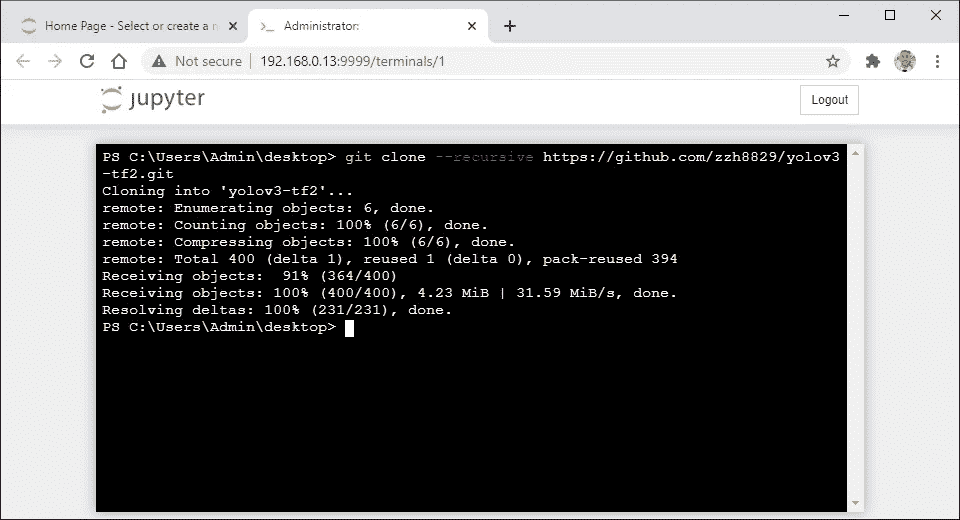

## 打开 YoloV3-Tf2 目录:

*改变目录(cd)* 命令用于将当前工作目录改变到指定目录。它可以导航到分别从根目录和当前工作目录开始的绝对路径和相对路径。它还可以导航到存储在变量和环境变量中的路径。

1.  从下面这些指令中复制命令
2.  将命令粘贴到终端
3.  按“回车”

```
cd yolov3-tf2
```


## 创建虚拟环境:

*虚拟环境*是一个独立的 Python 安装目录，它有自己的解释器、[站点包](#5059)和脚本。它主要用于防止来自不同项目的[依赖关系](#7a63)之间的版本冲突。它还被用来满足来自 GitHub 的不同程序的依赖需求。

1.  从下面这些说明中找到 Python 版本
2.  复制提供的命令
3.  将命令粘贴到终端
4.  按“回车”

```
**Python 3.5:** python35 -m venv venv35**Python 3.6: <----------**
python36 -m venv venv36**Python 3.7:**
python37 -m venv venv37**Python 3.8:**
python38 -m venv venv38
```


## 激活虚拟环境:

*激活*脚本用于启动虚拟环境。它将虚拟环境路径添加到 [PATH](#d21d) 环境变量中，该变量将新的 Python 解释器和包管理器设置为默认版本。它还将[包](#71a0)设置为安装在虚拟环境安装目录中。

1.  从下面这些说明中找到 Python 版本
2.  复制提供的命令
3.  将命令粘贴到终端
4.  按“回车”

```
**Python 3.5:**
venv35/scripts/activate**Python 3.6: <----------**
venv36/scripts/activate**Python 3.7:**
venv37/scripts/activate**Python 3.8:**
venv38/scripts/activate
```


## 升级 Pip:

虚拟环境中的包管理器需要升级，以便从需求文件安装二进制包。这是因为默认版本是 18.1，但其中一个需求是根据许多 Linux 2010 规范构建的，直到 pip 19.0 才支持这些规范。

1.  从下面这些指令中复制命令
2.  将命令粘贴到终端
3.  按“回车”

```
python -m pip install --[upgrade](#8027) pip
```


## 安装要求:

*需求* *(r)* 命令用于安装包含在指定需求文件中的包。无论是否提供版本号，它都可以安装软件包。它还可以使用来自计算机、通过互联网或在不同的[需求**文件**中指定的文件来安装软件包。](#bf16)

1.  从下面这些指令中复制命令
2.  将命令粘贴到终端
3.  按“回车”

```
python -m pip install --requirement requirements-gpu.txt
```

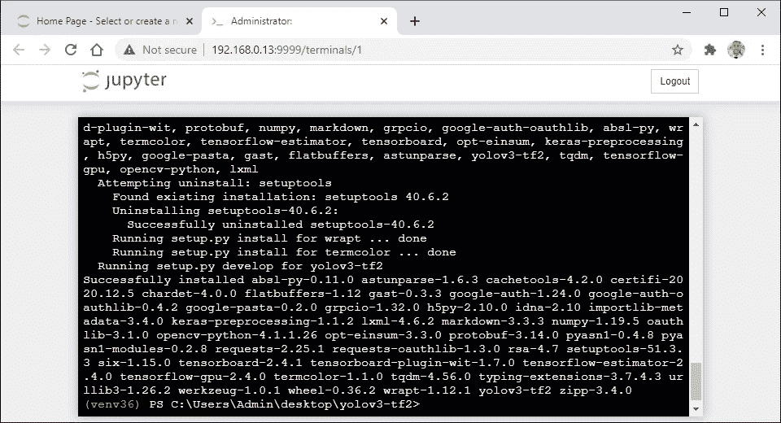

## 下载重量:

*权重文件*是一个二进制文件，包含来自训练模型的所有数字[权重](#87ab)值。它可以被保存并加载到与原始模型具有相同架构的新模型中。这使得新模型可以根据新数据进行预测，而无需重新训练。

1.  从下面这些指令中复制命令
2.  将命令粘贴到终端
3.  按“回车”

```
wget [https://pjreddie.com/media/files/yolov3.weights](https://pjreddie.com/media/files/yolov3.weights) -O data/yolov3.weights
```


## 转换重量:

通过从配置文件解析模型架构并从头开始重建整个模型，权重文件可以在不同的框架之间转换。它通常包括重建层、重建模型、加载权重以及以新的文件格式保存权重。

1.  从下面这些指令中复制命令
2.  将命令粘贴到终端
3.  按“回车”

```
python convert.py --weights ./data/yolov3.weights --output ./checkpoints/yolov3.tf
```

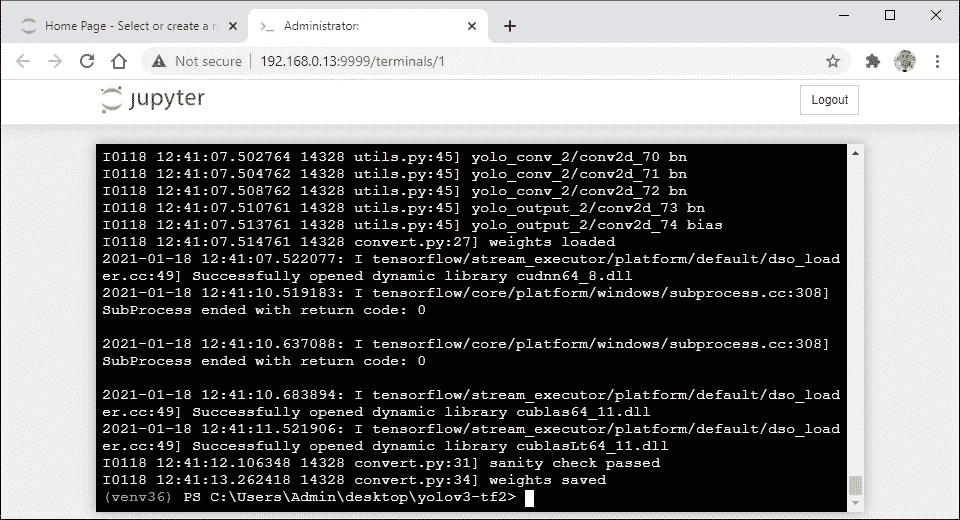

## 使用存储库:

*You Only Look Once (YOLOv3)* 是一种开源的对象检测算法，在其发布期间提供了与其他最先进的检测系统相当的准确性和更快的速度。它引入了一些增量改进，包括多尺度检测、更强的特征检测、边界框预测和多标签分类。

1.  从下面这些指令中复制命令
2.  将命令粘贴到终端
3.  按“回车”

```
python detect.py --image ./data/meme.jpg
```

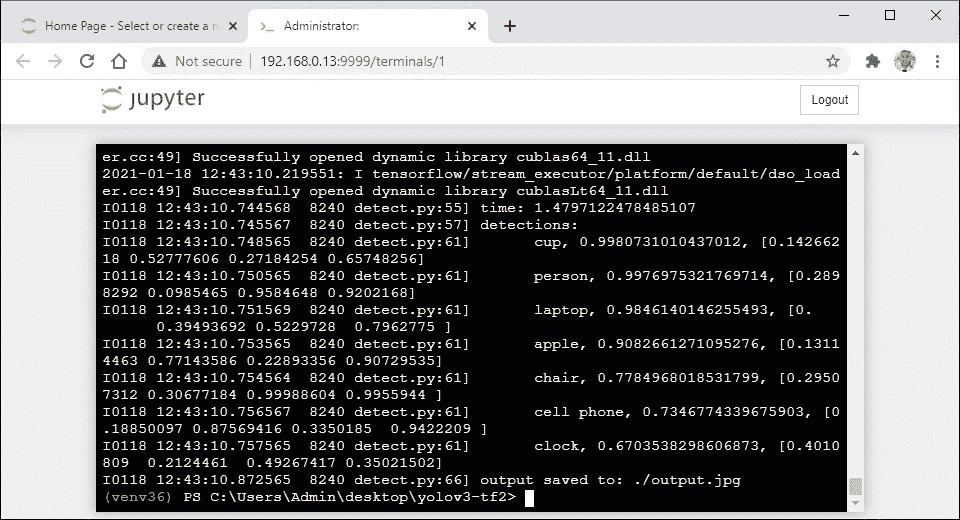

## 安装 IPython 内核:

*交互式 Python (IPython)* 是 Jupyter Notebook 中使用的交互式外壳和默认内核。它运行包含在 Jupyter 笔记本文件中的 Python 代码。它还增加了新的功能，如自省、并行计算、富媒体、shell 语法、制表符结束和历史。

1.  从下面这些指令中复制命令
2.  将命令粘贴到终端
3.  按“回车”

```
python -m pip install ipykernel
```

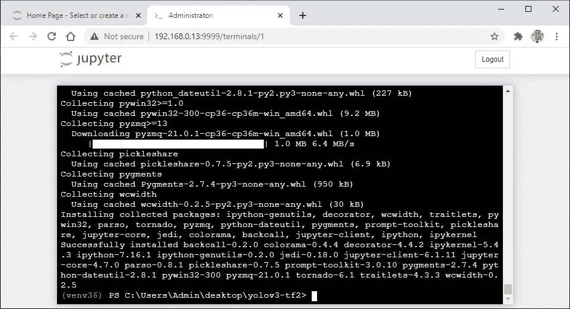

## 安装虚拟环境:

在 IPython 内核中使用 *Install* 命令将指定的虚拟环境添加到 Jupyter Notebook 的内核中。它指定了用于引用虚拟环境的目录名。它还指定了用于在文件菜单中引用虚拟环境的显示名称。

1.  从下面这些指令中复制命令
2.  将命令粘贴到终端
3.  按“回车”

```
**Python 3.5:**
python -m ipykernel install --name "yolov3-tf2" --display-name "yolov3-tf2"**Python 3.6: <----------**
python -m ipykernel install --name "yolov3-tf2" --display-name "yolov3-tf2"**Python 3.7:**
python -m ipykernel install --name "yolov3-tf2" --display-name "yolov3-tf2"**Python 3.8:**
python -m ipykernel install --name "yolov3-tf2" --display-name "yolov3-tf2"
```

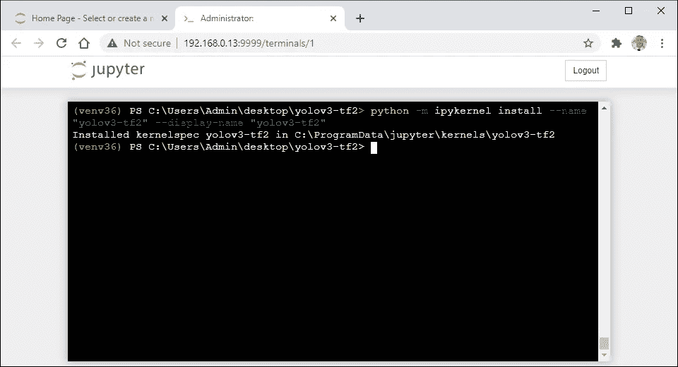

## 打开 YoloV3-Tf2 目录:

Jupyter Notebook 中的*仪表板*是显示服务器启动目录中的笔记本、文件和子目录的用户界面。它可以在文件系统中导航并与文件交互。它还可以上传文件和创建新的文件，子目录和笔记本。

1.  重新打开 Jupyter 笔记本
2.  单击“桌面”文件夹
3.  单击“YoloV3-Tf2”文件夹


## 使用虚拟环境:

Jupyter Notebook 中的 *Notebook* 是一个独立的文档，用于表示 web 应用程序中的可视内容。它包括计算、降价文本、等式和富媒体的输入和输出。它也有自己的[内核](#9211)，用单一的编程语言运行代码。

1.  点击“新建”
2.  点击“yolov3-tf2”

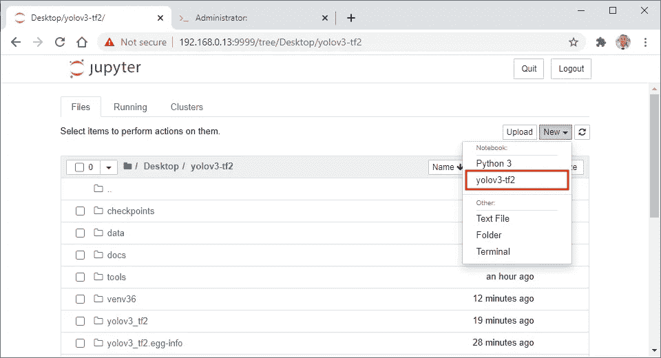

## 运行代码单元格:

*运行*快捷键用于执行键盘上所选代码单元中的代码。它执行代码，选择下一个代码单元格，并在代码单元格下面显示输出。它还在单元格左侧的方括号中显示一个数字，指示代码单元格的运行顺序。

1.  从这些指令下面复制代码
2.  单击 Jupyter 笔记本中的空白单元格
3.  将代码粘贴到空单元格中
4.  按“Shift”+“Enter”

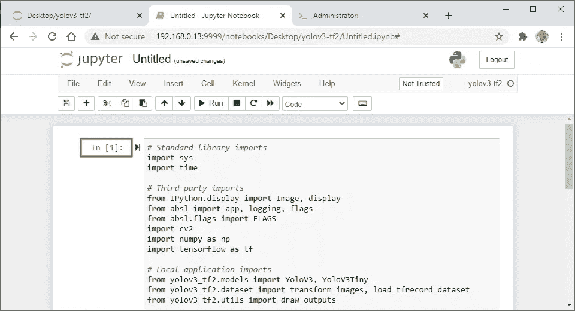

## 运行代码单元格:

*Run* 快捷键用于从键盘执行所选代码单元中的代码。它执行代码，选择下一个代码单元格，并在代码单元格下面显示输出。它还在单元格左侧的方括号中显示一个数字，指示代码单元格的运行顺序。

1.  从这些指令下面复制代码
2.  单击 Jupyter 笔记本中的空白单元格
3.  将代码粘贴到空单元格中
4.  按“Shift”+“Enter”

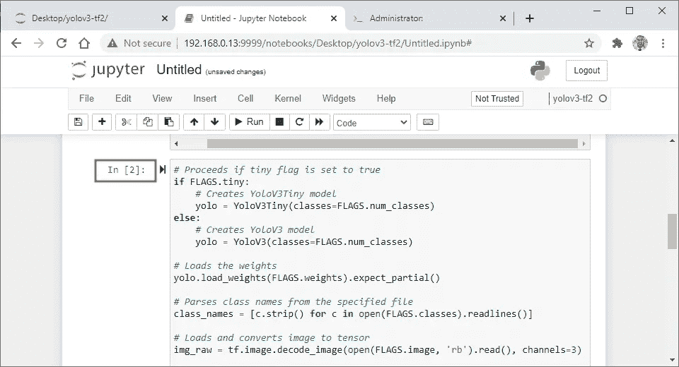

## 停用虚拟环境:

*停用*命令用于停止虚拟环境。它从 path 环境变量中删除了虚拟环境路径，该变量将最后一个 Python 解释器和包管理器设置为默认版本。它还设置要安装在系统 Python 安装目录中的包。

1.  从下面这些指令中复制命令
2.  将命令粘贴到终端
3.  按“回车”

```
deactivate
```


## 列出已安装的虚拟环境:

在 IPython 内核中使用 *List* 命令来查看 Jupyter Notebook 的内核列表中当前安装了哪些虚拟环境。它为在每个操作系统上使用不同路径的虚拟环境打印目录名和位置。

1.  从下面这些指令中复制命令
2.  将命令粘贴到终端
3.  按“回车”

```
jupyter kernelspec list
```


## 卸载虚拟环境:

在 IPython 内核中使用 *Uninstall* 命令从 Jupyter Notebook 的内核中删除指定的虚拟环境。它指定了用于查找和删除虚拟环境的目录名。它也不能删除 Python 的默认内核，因为这是一个要求。

1.  从下面这些指令中复制命令
2.  将命令粘贴到终端
3.  按“回车”
4.  输入“Y”
5.  按“回车”

```
jupyter kernelspec uninstall yolov3-tf2
```


> 希望这篇文章能帮助您获得👯‍♀️🏆👯‍♀️，记得订阅获取更多内容🏅"

## 后续步骤:

这篇文章是一个迷你系列的一部分，帮助读者设置他们开始学习人工智能、机器学习、深度学习和/或数据科学所需的一切。它包括包含复制和粘贴代码的说明和截图的文章，以帮助读者尽快获得结果。它还包括一些文章，包含带有解释和截图的说明，以帮助读者了解正在发生的事情。

```
**Linux:**
01\. [Install and Manage Multiple Python Versions](https://medium.com/p/916990dabe4b)
02\. [Install the NVIDIA CUDA Driver, Toolkit, cuDNN, and TensorRT](https://medium.com/p/cd5b3a4f824)
03\. [Install the Jupyter Notebook Server](https://medium.com/p/b2c14c47b446)
04\. [Install Virtual Environments in Jupyter Notebook](https://medium.com/p/1556c8655506)
05\. [Install the Python Environment for AI and Machine Learning](https://medium.com/p/765678fcb4fb)**WSL2:**
01\. [Install Windows Subsystem for Linux 2](https://medium.com/p/cbdd835612fb)
02\. [Install and Manage Multiple Python Versions](https://medium.com/p/1131c4e50a58)
03\. [Install the NVIDIA CUDA Driver, Toolkit, cuDNN, and TensorRT](https://medium.com/p/9800abd74409) 
04\. [Install the Jupyter Notebook Server](https://medium.com/p/7c96b3705df1)
05\. [Install Virtual Environments in Jupyter Notebook](https://medium.com/p/3e6bf456041b)
06\. [Install the Python Environment for AI and Machine Learning](https://medium.com/p/612240cb8c0c)
07\. [Install Ubuntu Desktop With a Graphical User Interface](https://medium.com/p/95911ee2997f) (Bonus)**Windows 10:**
01\. [Install and Manage Multiple Python Versions](https://medium.com/p/c90098d7ba5a)
02\. [Install the NVIDIA CUDA Driver, Toolkit, cuDNN, and TensorRT](https://medium.com/p/55febc19b58)
03\. [Install the Jupyter Notebook Server](https://medium.com/p/e8f3e9436044)
04\. [Install Virtual Environments in Jupyter Notebook](https://medium.com/p/5c189856479)
05\. [Install the Python Environment for AI and Machine Learning](https://medium.com/p/23c34b2baf12)**Mac:** 01\. [Install and Manage Multiple Python Versions](https://medium.com/p/ca01a5e398d4)
02\. [Install the Jupyter Notebook Server](https://medium.com/p/2a276f679e0)
03\. [Install Virtual Environments in Jupyter Notebook](https://medium.com/p/e3de97491b3a)
04\. [Install the Python Environment for AI and Machine Learning](https://medium.com/p/2b2353d7bcc3)
```

## 词汇表:

*Shell* 是一个[解释器](#07f9)，它向用户呈现[命令行界面](#1281)，并允许用户与[内核](#5418)进行交互。它让他们通过键盘输入命令来控制系统。它还将命令从编程语言翻译成内核的机器语言。
[ [返回](#75aa)

*解释器*是一个程序，它通读以人类可读编程语言编写的指令，并从上到下执行这些指令。它将每条指令翻译成硬件可以理解的机器语言，执行它，然后继续下一条指令。
[返回](#4379)

*命令行界面(CLI)* 是一个接受用户文本输入以在操作系统上运行命令的程序。它允许他们配置系统、安装软件和访问图形用户界面中不可用的功能。它也被称为终端或控制台。
[回车](#4379)

内核是操作系统的核心程序，控制着电脑的一切。它简化了内存管理、进程管理、磁盘管理和任务管理。它还有助于程序和硬件之间用机器语言进行交流。
[ [返回](#4379)

*变量*是用来存储不同类型值的容器。它可以通过在指定的变量名和值之间放置一个等号来赋值或更新一个值。它还可以通过在现有变量名前放置一个美元符号来引用存储的值。
[ [返回](#c9c2) ]

环境变量是一个由计算机自动创建和维护的变量。它帮助系统知道在哪里安装文件、查找程序以及检查用户和系统设置。它也可以被计算机上任何地方的图形和命令行程序使用。
[ [返回](#c9c2)

Git 是一个用来跟踪源代码随时间变化的程序。它可以处理各种规模的项目，并允许多个团队和人员对同一个存储库进行更改。它还可以从存储库的整个历史中将源代码恢复到以前的版本。
[返回](#9b46)

*子模块*是一个存储库，它嵌套在另一个存储库的子目录中。它包含特定版本的存储库在特定时间点的所有文件的副本。它还包含存储库中被视为其依赖项的所有子模块的副本。
[回车](#9b46)

*Site-Packages* 是一个位于系统级 Python 安装目录中的目录。它表示包管理器用来安装 Python 包的默认位置。它还表示 Python 用来导入已经安装的 Python 包的目录。
[返回](#2669)

依赖项是一个附加的二进制包，特定的二进制包需要它才能正常工作。它可能需要多个依赖项来构建几乎所有由包管理器发布的程序。它也会被一些包管理器自动下载和安装。
[返回](#2669)

*路径*是一个环境变量，包含计算机用来查找可执行文件的目录列表。它从上到下在列表的每个目录中查找请求的可执行文件。一旦找到匹配的可执行文件并运行程序或命令，它也会停止搜索。
[ [返回](#74b3)

*二进制包*是一个存档文件，包含使其包含的程序正常工作所需的文件和目录。它存储在包含特定 Linux 发行版的所有程序的存储库中。它还需要 Linux 包管理器来访问、提取和安装它。
[ [返回](#74b3)

在 pip 中使用*升级(U)* 选项来更新已经安装在计算机上的指定软件包。它可用于从 Python 包索引下载和安装最新版本的包。它也可以用来下载和安装最新版本的 pip 软件包管理器。
[返回](#62fa)

*需求文件*是一个文本文件，在 pip 中用来自动安装具有不同版本号的依赖项。它使用包名、双等号和版本号在单独的行上指定每个包。也可以使用不同的文件名和位置来引用它。
[ [返回](#dd00)

*权重*是一个随机数，乘以一个输入来转换在人工神经网络的隐藏层中的两个节点之间传递的数据。它是指一个可学习的参数，用于确定某个特征对预测的影响程度。它还在训练期间进行更新和优化，以提高其未来预测的准确性。
[ [回车](#2430)

*内核*是一个从代码单元执行代码并在 Jupyter Notebook 中显示输出的程序。它跨时间、在代码单元之间维护状态，而不考虑代码单元运行的顺序。它也可以用来安装不同的编程语言到 Jupyter 笔记本。
[返回](#0e0a)