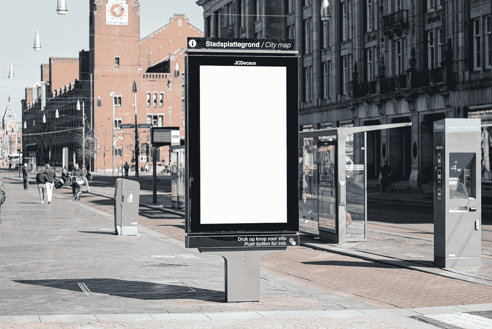
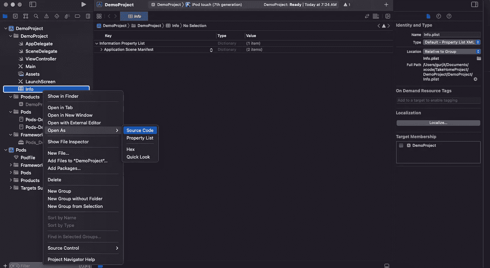
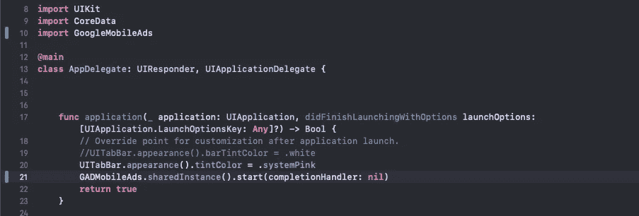

# 如何将 AdMob 集成到 iOS 应用程序中

> 原文：<https://levelup.gitconnected.com/how-to-integrate-admob-to-an-ios-app-458129f5e10d>



照片由 [Bram Naus](https://unsplash.com/@bramnaus?utm_source=medium&utm_medium=referral) 在 [Unsplash](https://unsplash.com?utm_source=medium&utm_medium=referral) 上拍摄

您成功创建了一个应用并将其上传到 app store。你想最终收获工作的回报。你有多种方法来赚钱，包括付费模式和免费增值。

在付费模式中，你可以通过应用内购买或基于订阅的商业模式来创收，这种模式可以向用户收取更多功能的额外费用。客户可以在免费增值模式下下载应用程序，但你可以通过加入广告来赚钱。

有许多公司提供应用程序广告。但是，我们正在将 Admob 集成到 iOS 应用程序中。但是，下面列出了一些先决条件，因此在我们深入了解更多细节之前，请阅读这些先决条件:

您必须拥有 Google AdMob 帐户并注册您的应用程序。

Xcode 13.2.1 或更高版本

目标 iOS 10.0 或更高版本

在创建 AdMob 帐户并注册我们的应用程序后，我们将按照这些步骤将 AdMob 集成到我们的应用程序中。

*   导入移动广告 SDK
*   更新 Info.plist
*   更新 AppDelegate.m

**导入移动广告 SDK**

有几种方法可以将移动广告 SDK 集成到您的应用程序中。然而，我们正在通过 CocoaPods 将 SDK 导入应用程序。请检查您的计算机上是否已经安装了 CocoaPods 如果没有，请先这样做。

转到终端并运行以下命令

```
sudo gem install cocoapods
```

在你的 Mac 上安装 CocoaPods 只需要很短的时间。安装完成后，浏览到项目目录。我的项目在这个命令中的名字是 *DemoProject* 。

```
cd /Users/singh/Documents/Projects/DemoProject
```

您的项目可以有不同的目录。您可以从项目位置拷贝项目文件夹，并将其粘贴到终端中。之后，运行项目中 pod 的初始化命令。

```
pod init
```

现在转到项目目录，在那里您会发现一个看起来像他的 pod 文件。

```
# Uncomment the next line to define a global platform for your project
# platform :ios, '9.0'target 'DemoProject' do
  # Comment the next line if you don't want to use dynamic frameworks
  use_frameworks!# Pods for DemoProjectend
```

在您的 pod 文件中，包括这一行。

```
pod 'Google-Mobile-Ads-SDK'
```

接下来执行这个命令

```
pod install
```

恭喜你！您已经完成了将 AdMob 集成到项目中的第一阶段。

现在你必须从你的项目目录中打开以`.xcworkspace`结尾的项目。

**更新信息列表**

打开`Info.plist`文件作为源代码，并将以下两个键添加到您的文件中。



1.  一个带有应用程序 id 字符串值的`GADApplicationIdentifier`键。要创建应用 id，请在您的 AdMob 帐户中转到`Apps > Add App`应用。
2.  带有`SKAdNetworkIdentifier`值的`SKAdNetworkItems`键。

您的 Info.plist 文件应该如下所示。

**更新 AppDelegate**

要在应用启动期间初始化 SDK，请在您的`AppDelegate`文件中更新两行。

1.  `import GoogleMobileAds`
2.  并调用`GADMobileAds.sharedInstance`上的完成处理程序

```
GADMobileAds.sharedInstance().start(completionHandler: nil)
```



恭喜你！您已经完成了将 AdMob 集成到您的应用程序所需的所有困难工作。我们的下一步是根据我们的应用程序风格选择广告格式。

**选择广告形式**

下一步是决定要使用的广告格式。有四种格式可供使用:

*   横幅——当用户与应用程序交互时，它总是显示在屏幕的底部或顶部。
*   interstitial—这是一个全屏广告，将一直运行，直到用户关闭它。当一个关卡完成时，是实施填隙式游戏的理想时机。
*   原生-这是一个可定制的广告，可以定制以匹配应用程序的外观和感觉。
*   奖励-用户可以因为观看短视频或使用它完成调查而获得奖励。

在本文中，我们将重点讨论如何实现间隙广告。

**更新 ViewController**

整合插播广告的主要步骤是:

1.  为插播广告创建变量
2.  加载带有广告单元 id 的 add。在下面的代码中，我们使用谷歌提供的测试单元广告。在测试 ad 单元时，您应该始终使用测试单元 id。
3.  为`GADFullScreenContentDelegate`协议注册回调，该协议在广告显示成功、加载失败或关闭时处理回调。
4.  显示广告

**结论**

你应该根据你的应用程序的设计选择合适的广告形式。在展示广告时，你应该始终牢记用户体验。广告不应过度展示，只应在自然过渡时展示。