# 如何将现有的 Android 应用程序与 React Native 集成

> 原文：<https://levelup.gitconnected.com/how-to-integrate-an-existing-android-app-with-react-native-6403ac4724f3>

在本指南中，我将介绍如何将现有的 Android 应用程序与 React Native 集成。如果您已经有一个现有的 Android 应用程序，并且希望使用 React Native，同时仍然保留一些您已经创建的 Android 模块，这可能会很有用。

React Native 有关于如何集成它的文档，但它并不真正适合我的用例。[反应原生文件](https://reactnative.dev/docs/integration-with-existing-apps)。

如果你曾经遇到过，[自动链接功能](https://github.com/react-native-community/cli/blob/master/docs/autolinking.md)可能会有问题。

这个项目的代码可以在[https://github . com/danial 968/React-Native-Android-Integration](https://github.com/Danial968/React-Native-Android-Integration)找到。

我将处理的用例是，当有人想要启动一个 React 原生应用程序并转到他们的旧 Android 模块时。

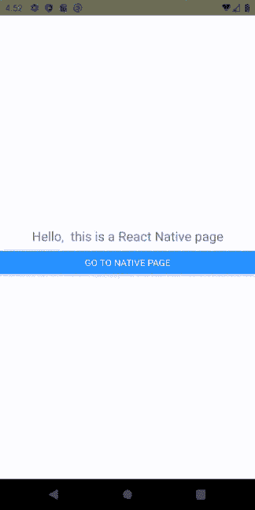

混合 React 原生和安卓应用

# **原生 App**

我目前有一个简单的 android 应用程序，它有 2 个活动和一个导致第二个活动的按钮。我将把这个应用程序与 React Native 集成。

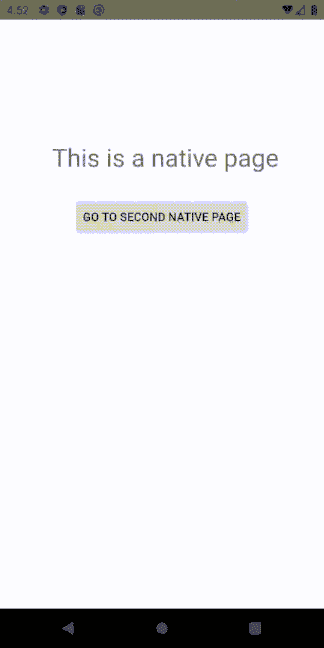

原生应用

# **Package.json**

首先，创建一个名为“android”的文件夹，并将您现有的原生应用程序放在该文件夹中。

现在在根文件夹中创建一个‘package . JSON ’(不是在你刚刚创建的 android 文件夹中)。根据您的用例编辑文件。

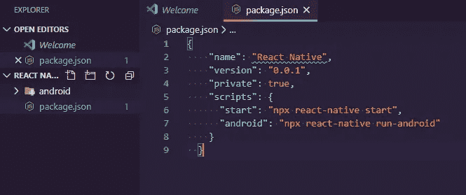

package.json 文件

```
{ "name": "React Native", "version": "0.0.1", "private": true, "scripts": { "start": "npx react-native start", "android": "npx react-native run-android" }}
```

一旦创建了“package.json”文件，打开终端并运行以下命令。这将安装 react-native 依赖项和运行应用程序所需的其他依赖项。

```
npm add react-native
npm add react
npm add hermesvm
npm add jsc-android
```

# **build.gradle**

现在打开 android studio，进入你的应用程序的‘build . grad le’。找到依赖项部分。

在 dependencies 部分的上方，添加以下代码行。

```
project.ext.react = [
        entryFile: "index.js" ,
        enableHermes: false,
]

def jscFlavor = 'org.webkit:android-jsc:+'
def enableHermes = project.ext.react.get("enableHermes", false);
```

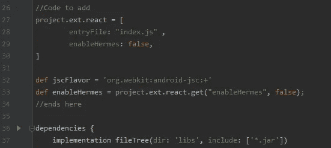

在依赖项部分的上方。

在依赖项部分中，添加以下代码行。

```
implementation 'com.android.support:appcompat-v7:28.0.0'
implementation "com.facebook.react:react-native:+" // React Native

if (enableHermes) {
    def hermesPath = "../../node_modules/hermes-engine/android/";

    debugImplementation files(hermesPath + "hermes-debug.aar")
    releaseImplementation files(hermesPath + "hermes-release.aar")
}
else { implementation jscFlavor }

debugImplementation("com.facebook.flipper:flipper:$**{**FLIPPER_VERSION**}**") **{** exclude group:'com.facebook.fbjni'
**}** debugImplementation("com.facebook.flipper:flipper-network-plugin:$**{**FLIPPER_VERSION**}**") **{** exclude group:'com.facebook.flipper'
**}** debugImplementation("com.facebook.flipper:flipper-fresco-plugin:$**{**FLIPPER_VERSION**}**") **{** exclude group:'com.facebook.flipper'
**}**
```

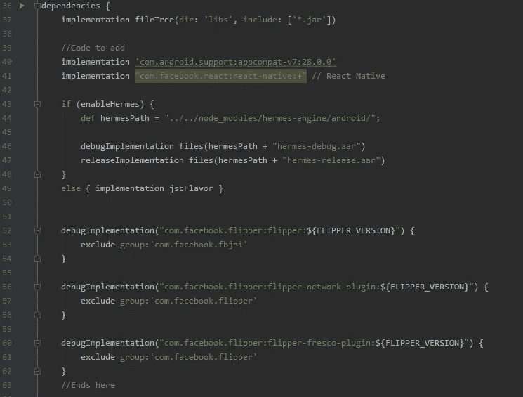

要添加到依赖项部分的代码。

最后，在同一个“build.gradle”文件的底部添加这行代码

```
apply from: file("../../node_modules/@react-native-community/cli-platform-android/native_modules.gradle"); applyNativeModulesAppBuildGradle(project)
```

现在转到项目文件夹中的“build.gradle”文件。在 gradle 脚本中，它通常在 gradle 文件旁边有(Project)。


build.gradle with(项目)

找到“allprojects”部分并添加以下代码行。确保代码在所有其他 maven 仓库之上。

```
maven **{** // All of React Native (JS, Android binaries) is installed from npm
    url ("$rootDir/../node_modules/react-native/android")
**}** maven **{** // Android JSC is installed from npm
    url("$rootDir/../node_modules/jsc-android/dist")
**}**
```

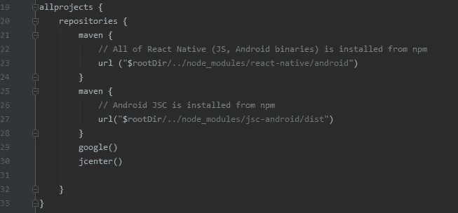

本地 React 本机 maven 目录。

在 gradle.properties 中定义您的 FLIPPER_VERSION

```
FLIPPER_VERSION=0.33.1
```

转到 settings.gradle 并添加以下代码行以允许自动链接

```
apply from: file("../node_modules/@react-native-community/cli-platform-android/native_modules.gradle"); applyNativeModulesSettingsGradle(settings)
```

同步您的梯度变化。

# **AndroidManifest.xml**

请转到 AndroidManifest.xml 以允许 internet 权限。

```
<uses-permission android:name="android.permission.INTERNET" />
```

添加 DevSettingsActivity。

```
<activity android:name="com.facebook.react.devsupport.DevSettingsActivity" />
```

应用明文流量。从 API 级别 28 开始，默认情况下它是禁用的，这将阻止您连接到 Metro bundler。

```
android:usesCleartextTraffic="${clearText}"  tools:targetApi="28"
```

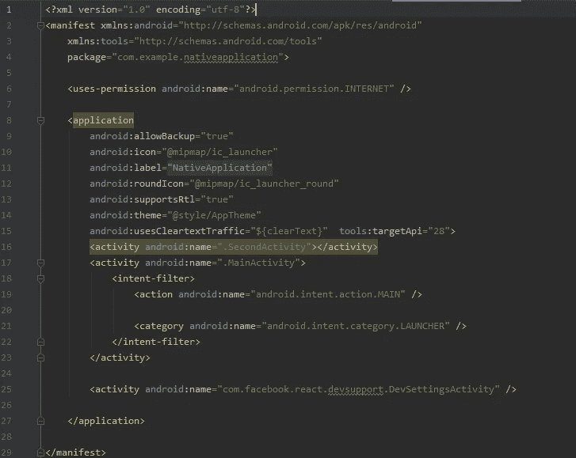

AndroidManifest.xml

# **主应用**

现在，在您的 android 应用程序中创建一个“MainApplication.java”文件。粘贴下面的代码。

```
import android.app.Application;
import android.content.Context;

import com.facebook.react.PackageList;
import com.facebook.react.ReactApplication;
import com.facebook.react.ReactInstanceManager;
import com.facebook.react.ReactNativeHost;
import com.facebook.react.ReactPackage;
import com.facebook.soloader.SoLoader;

import java.lang.reflect.InvocationTargetException;
import java.util.List;

public class MainApplication extends Application implements ReactApplication {
    private final ReactNativeHost mReactNativeHost =
            new ReactNativeHost(this) {
                @Override
                public boolean getUseDeveloperSupport() {
                    return BuildConfig.*DEBUG*;
                }

                @Override
                protected List<ReactPackage> getPackages() {
                    @SuppressWarnings("UnnecessaryLocalVariable")
                    List<ReactPackage> packages = new PackageList(this).getPackages();
                    // Packages that cannot be autolinked yet can be added manually here, for example:
                    // packages.add(new MyReactNativePackage());
                    return packages;
                }

                @Override
                protected String getJSMainModuleName() {
                    return "index";
                }
            };

    @Override
    public ReactNativeHost getReactNativeHost() {
        return mReactNativeHost;
    }

    @Override
    public void onCreate() {
        super.onCreate();
        SoLoader.*init*(this, /* native exopackage */ false);
        *initializeFlipper*(this, getReactNativeHost().getReactInstanceManager());
    }
    private static void initializeFlipper(
            Context context, ReactInstanceManager reactInstanceManager) {
        if (BuildConfig.*DEBUG*) {
            try {
        /*
         We use reflection here to pick up the class that initializes Flipper,
        since Flipper library is not available in release mode
        */
                Class<?> aClass = Class.*forName*("sg.gov.tech.onemobileapp.ReactNativeFlipper");
                aClass
                        .getMethod("initializeFlipper", Context.class, ReactInstanceManager.class)
                        .invoke(null, context, reactInstanceManager);
            } catch (ClassNotFoundException e) {
                e.printStackTrace();
            } catch (NoSuchMethodException e) {
                e.printStackTrace();
            } catch (IllegalAccessException e) {
                e.printStackTrace();
            } catch (InvocationTargetException e) {
                e.printStackTrace();
            }
        }
    }
}
```

# **主要活动**

现在，您必须创建一个“MainActivity.java”。如果你已经有了一个，我建议给它重新命名。

创建好“MainActivity.java”后，粘贴下面的代码。这扩展了 ReactActivity，并且当在“AndroidManifest.xml”中调用该类时，它搜索 React 本机组件以启动。

get 'MainComponentName()'中的 return 语句是 React 本机组件的名称，您将在稍后创建的' index.js '文件中的 AppRegistry 中导出该组件。

```
import com.facebook.react.ReactActivity;

public class MainActivity extends ReactActivity {

    @Override
    protected String getMainComponentName() { return "MainScreen"; } // Name of the RN component that was exported by AppRegistry.registercomponent()
}
```

在我的例子中，我希望 React 本机代码在启动的开始，所以我确保 MainActivity 的活动仍然是 Launcher 和 Main。

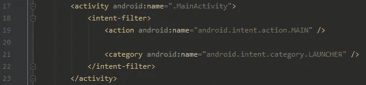

Android manifest . XML main activity 设置

在应用程序部分中，添加以下代码片段。

```
android:name=".MainApplication"
android:theme="@style/Theme.AppCompat.Light.NoActionBar" // This removes the header on the Android app
```

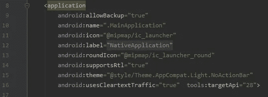

androidManifest.xml 改变 Android:名称和主题

# **反应鳍**

创建一个名为 debug 的文件夹，路径为 android/app/src/java。在调试文件夹中，使用以下代码创建一个“AndroidManifest.xml”。

```
<?xml version="1.0" encoding="utf-8"?><manifest xmlns:android="http://schemas.android.com/apk/res/android"xmlns:tools="http://schemas.android.com/tools"><uses-permission android:name="android.permission.SYSTEM_ALERT_WINDOW"/><application android:usesCleartextTraffic="true" tools:targetApi="28" tools:ignore="GoogleAppIndexingWarning" /></manifest>
```

在 AndroidManifest.xml 的同一个文件夹中创建一个 java 文件夹，并遵循您的包名。

在文件夹中创建一个 ReactNativeFlipper.java 文件。


ReactNativeFlipper 的文件目录可能与您的不同，请将其与您的主应用程序进行比较以找出答案。

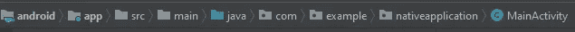

MainActivity 具有相同的文件结构，但是位于“main”文件夹中，而不是 debug 文件夹中。

```
import android.content.Context;
import com.facebook.flipper.android.AndroidFlipperClient;
import com.facebook.flipper.android.utils.FlipperUtils;
import com.facebook.flipper.core.FlipperClient;
import com.facebook.flipper.plugins.crashreporter.CrashReporterPlugin;
import com.facebook.flipper.plugins.databases.DatabasesFlipperPlugin;
import com.facebook.flipper.plugins.fresco.FrescoFlipperPlugin;
import com.facebook.flipper.plugins.inspector.DescriptorMapping;
import com.facebook.flipper.plugins.inspector.InspectorFlipperPlugin;
import com.facebook.flipper.plugins.network.FlipperOkhttpInterceptor;
import com.facebook.flipper.plugins.network.NetworkFlipperPlugin;
import com.facebook.flipper.plugins.react.ReactFlipperPlugin;
import com.facebook.flipper.plugins.sharedpreferences.SharedPreferencesFlipperPlugin;
import com.facebook.react.ReactInstanceManager;
import com.facebook.react.bridge.ReactContext;
import com.facebook.react.modules.network.NetworkingModule;
import okhttp3.OkHttpClient;

public class ReactNativeFlipper {
  public static void initializeFlipper(Context context, ReactInstanceManager reactInstanceManager) {
    if (FlipperUtils.shouldEnableFlipper(context)) {
      final FlipperClient client = AndroidFlipperClient.getInstance(context);

      client.addPlugin(new InspectorFlipperPlugin(context, DescriptorMapping.withDefaults()));
      client.addPlugin(new ReactFlipperPlugin());
      client.addPlugin(new DatabasesFlipperPlugin(context));
      client.addPlugin(new SharedPreferencesFlipperPlugin(context));
      client.addPlugin(CrashReporterPlugin.getInstance());

      NetworkFlipperPlugin networkFlipperPlugin = new NetworkFlipperPlugin();
      NetworkingModule.setCustomClientBuilder(
          new NetworkingModule.CustomClientBuilder() {
            @Override
            public void apply(OkHttpClient.Builder builder) {
              builder.addNetworkInterceptor(new FlipperOkhttpInterceptor(networkFlipperPlugin));
            }
          });
      client.addPlugin(networkFlipperPlugin);
      client.start();

      // Fresco Plugin needs to ensure that ImagePipelineFactory is initialized
      // Hence we run if after all native modules have been initialized
      ReactContext reactContext = reactInstanceManager.getCurrentReactContext();
      if (reactContext == null) {
        reactInstanceManager.addReactInstanceEventListener(
            new ReactInstanceManager.ReactInstanceEventListener() {
              @Override
              public void onReactContextInitialized(ReactContext reactContext) {
                reactInstanceManager.removeReactInstanceEventListener(this);
                reactContext.runOnNativeModulesQueueThread(
                    new Runnable() {
                      @Override
                      public void run() {
                        client.addPlugin(new FrescoFlipperPlugin());
                      }
                    });
              }
            });
      } else {
        client.addPlugin(new FrescoFlipperPlugin());
      }
    }
  }
}
```

# **Index.js**

现在，我们将创建一个名为“index.js”的简单 React 本地文件。

```
import React from 'react';
import {
  AppRegistry,
  StyleSheet,
  Text,
  View,
  Button,
  NativeModules
} from 'react-native';

class MainScreen extends React.Component {
  render() {

    console.log('The React Native app is running')

    return (
      <View style={styles.container}>
        <Text style={styles.hello}>Hello,  this is a React Native page</Text>
      </View>
    );
  }
}
var styles = StyleSheet.create({
  container: {
    flex: 1,
    justifyContent: 'center',
  },
  hello: {
    fontSize: 20,
    textAlign: 'center',
    margin: 10
  }
});

AppRegistry.registerComponent(
  'MainScreen', // Name of the component for the Android side to pick up
  () => MainScreen 
);
```

请注意，AppRegistry.registerComponent 注册的名称 MainScreen 与“MainActivity.java”中的名称相同。

# **运行应用程序**

进入文件目录，使用 npm run android 命令运行应用程序。如果这有一些问题，您可以在 android studio 中构建应用程序，并运行 npm run start 来单独启动 metro bundler。

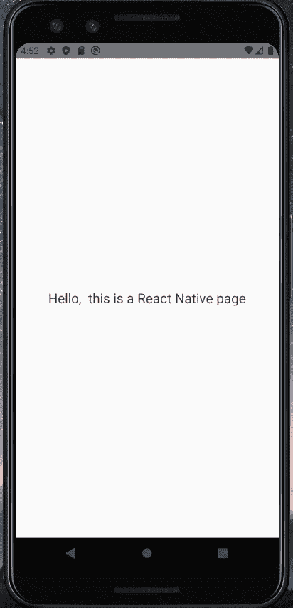

启动时对本机页面作出反应

现在，我们能够以 React 本地页面作为入口点来启动我们的应用程序。然而，我们仍然无法在 React 本机代码中调用本机模块。

# **导航模块**

在 android 文件夹中创建一个名为 NavigationModule 的新类，该类将扩展 ReactContextBaseJavaModule。

```
import android.content.Intent;

import androidx.annotation.NonNull;

import com.facebook.react.bridge.ReactApplicationContext;
import com.facebook.react.bridge.ReactContextBaseJavaModule;
import com.facebook.react.bridge.ReactMethod;

public class NavigationModule  extends ReactContextBaseJavaModule {
    private static ReactApplicationContext *reactContext*;
    private Intent intent;

    NavigationModule(ReactApplicationContext context) {
        super(context);
        *reactContext* = context;
    }

    @NonNull
    @Override
    public String getName() {
        return "NavigationModule";
    } //The name of the component when it is called in the RN code

    @ReactMethod
    public void navigateToNative(){
        ReactApplicationContext context = getReactApplicationContext();
        intent = new Intent(context,App.class);

        if (intent.resolveActivity(context.getPackageManager()) != null) {
            intent.setFlags((Intent.*FLAG_ACTIVITY_NEW_TASK*));
            context.startActivity(intent);
        }
    }
}
```

在类中，有两个方法。第一个方法 getName()在 React 本机代码中被调用时将引用该类的名称。在本例中，它将被称为 NavigationModule。

第二个方法 NavigateToNative()是我创建的方法，是一个 ReactMethod。在这种情况下，当方法被执行时，我想去我的 App 类，这是我的原生 android 活动。

# **导航包**

现在创建一个名为 NavigationPackage.java 的新类，它实现了 ReactPackage。

```
import com.facebook.react.ReactPackage;
import com.facebook.react.bridge.NativeModule;
import com.facebook.react.bridge.ReactApplicationContext;
import com.facebook.react.uimanager.ViewManager;

import java.util.ArrayList;
import java.util.Collections;
import java.util.List;

public class NavigationPackage implements ReactPackage {
    private ReactApplicationContext reactContext;

    @Override
    public List<ViewManager> createViewManagers(ReactApplicationContext reactContext) {
        return Collections.*emptyList*();
    }

    @Override
    public List<NativeModule> createNativeModules(ReactApplicationContext reactContext) {
        List<NativeModule> modules = new ArrayList<>();

        modules.add(new NavigationModule(reactContext)); // Add the module that you would like to call to from RN

        return modules;
    }

}
```

在 createNativeModules 方法中添加要从 React Native 调用的模块。对于这种情况，我将添加 NavigationModule。

然后，必须将此包添加到“MainApplication.java”中的 getPackages()函数中。该函数是 React 本机代码的桥梁

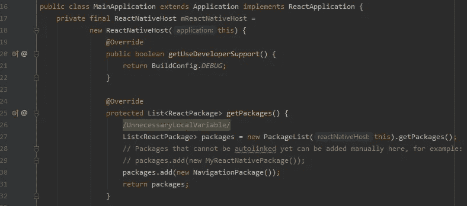

MainApplication.java 文件

# **反应原生**

要调用这些方法，我首先必须从 react-native 导入 NativeModules。

```
import { NativeModules } from 'react-native'
const Navigation = NavativeModules.Navigation
```

我可以调用我在‘navigation module . Java’中创建的函数，方法是将它作为 onPress 事件中的函数。

```
import React from 'react';
import {
  AppRegistry,
  StyleSheet,
  Text,
  View,
  Button,
  NativeModules
} from 'react-native';

const Navigation = NativeModules.NavigationModuleclass MainScreen extends React.Component {
  render() {

    console.log('The React Native app is running')

    return (
      <View style={styles.container}>
        <Text style={styles.hello}>Hello,  this is a React Native page</Text> <Button title="Go to native page" onPress={() => Navigation.navigateToNative()} /> </View>
    );
  }
}
var styles = StyleSheet.create({
  container: {
    flex: 1,
    justifyContent: 'center',
  },
  hello: {
    fontSize: 20,
    textAlign: 'center',
    margin: 10
  }
});

AppRegistry.registerComponent(
  'MainScreen', // Name of the component for the Android side to pick up
  () => MainScreen 
);
```

# **运行 App**

现在，应用程序应该能够从 React Native 调用本机页面。


React 原生应用

虽然这个过程花了我几天的反复试验。我希望这篇文章足以帮助您的项目。如果你被卡住了，你可能想创建一个空的 React 原生应用程序，并与你的进行比较，看看你在一个基本的 React 原生应用程序中缺少什么。