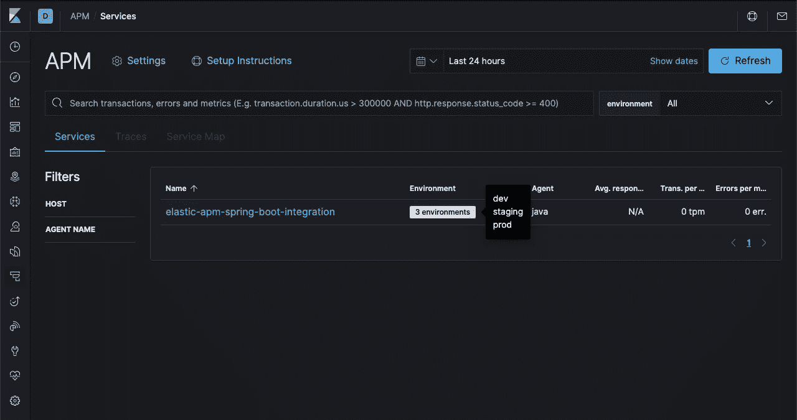
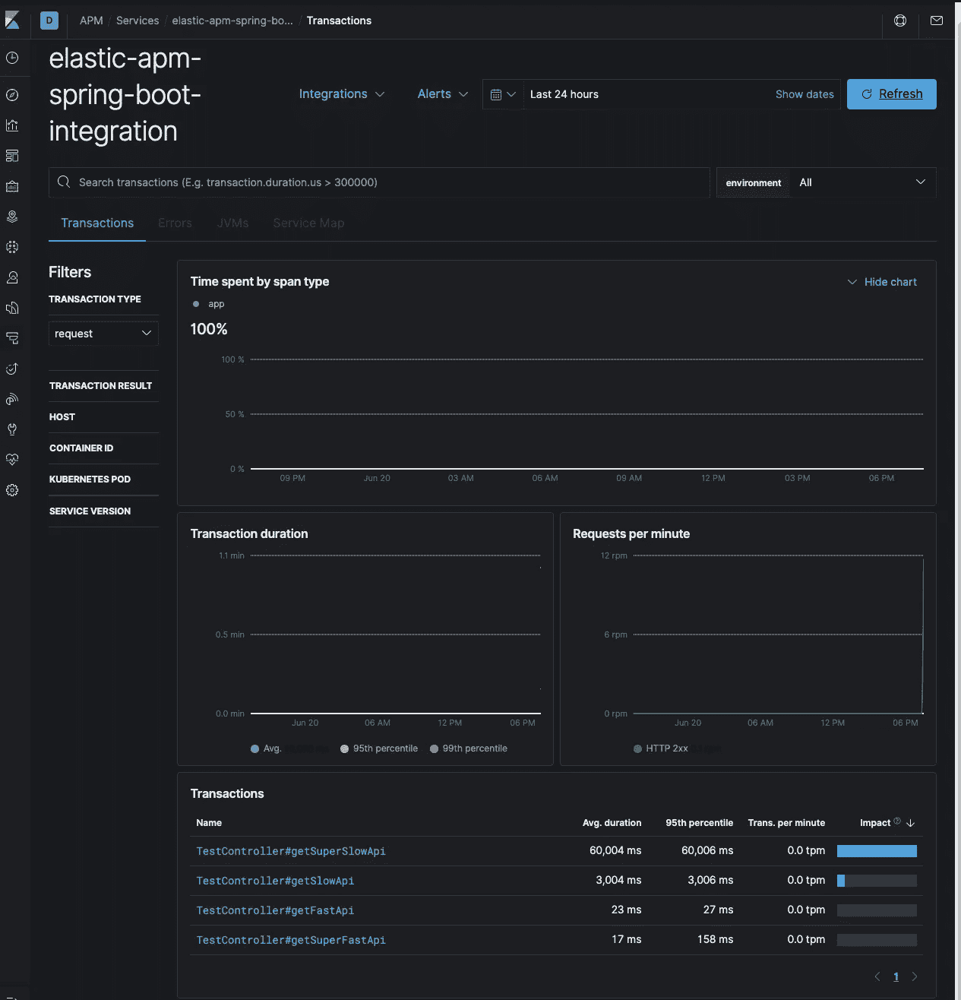
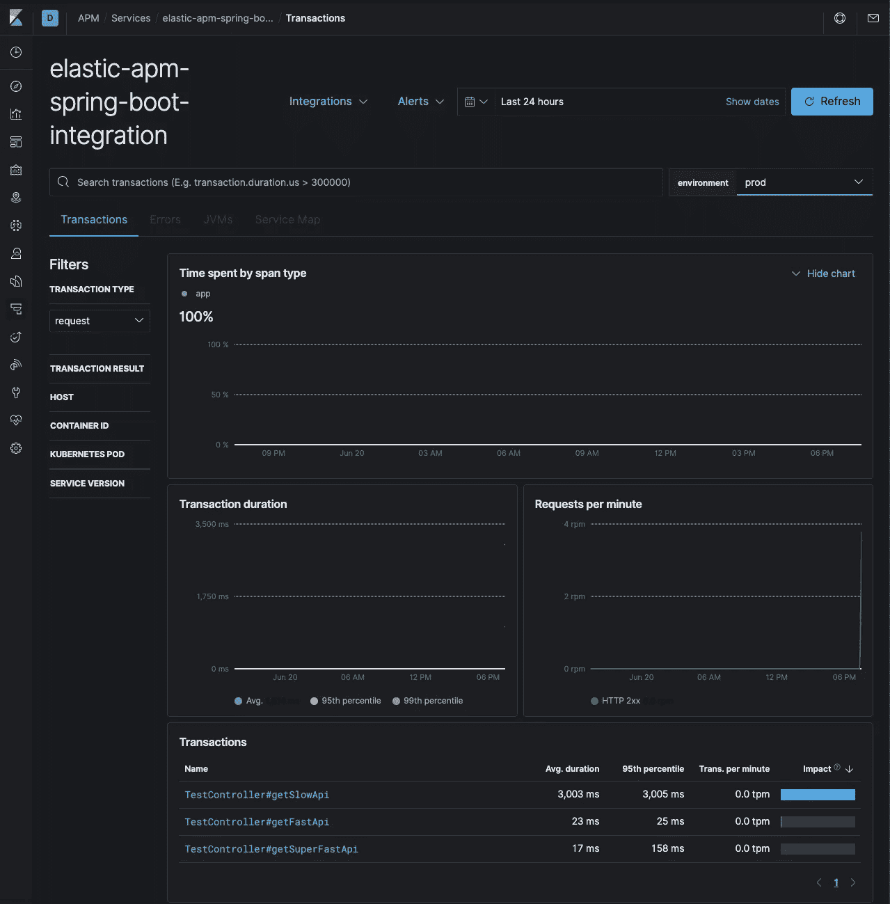
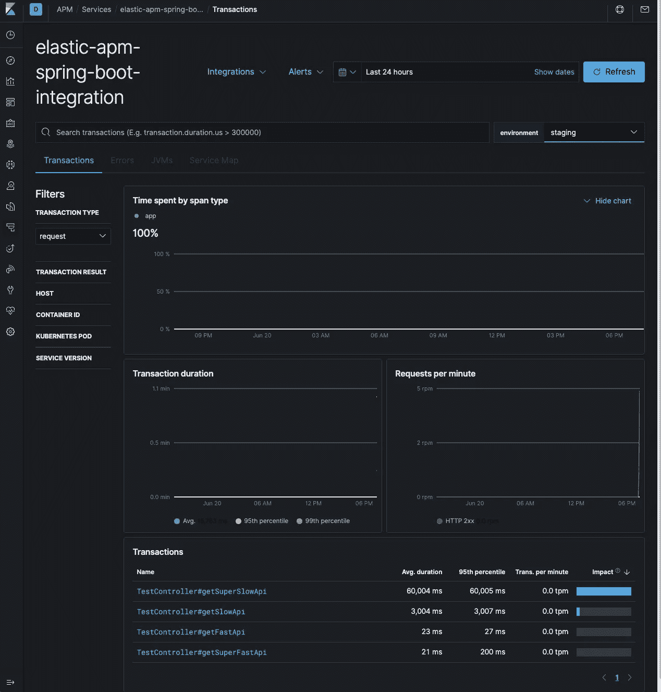

# 如何将弹性 APM Java 代理与 Spring Boot 集成

> 原文：<https://levelup.gitconnected.com/how-to-integrate-elastic-apm-java-agent-with-spring-boot-7ce8388a206e>

## 春天的路


照片由[亚历山大·波波夫](https://unsplash.com/@5tep5?utm_source=unsplash&utm_medium=referral&utm_content=creditCopyText)在 [Unsplash](https://unsplash.com/s/photos/performance?utm_source=unsplash&utm_medium=referral&utm_content=creditCopyText) 上拍摄

# 介绍

应用程序性能监控(APM)可以让您深入了解应用程序在速度和错误方面的表现。在 Spring 上下文中，这围绕着事务(API 调用或预定事件)和错误或异常。

虽然不是唯一可用的 APM 解决方案，但 Elastic APM 提供了一种相当方便的方式来集成一些最流行的框架和技术，如 Spring、React 和 Angular。另一方面，APM 服务器与弹性堆栈的其余部分配合良好；它直接提供给 Elasticsearch，Kibana 的仪表盘在`Observability -> APM`下显示出良好的开箱即用的可视化效果。

让我们来看一种用弹性 APM Java 代理检测 Spring 应用程序的方法。

# 先决条件

在这篇文章中，我主要关注集成部分，而不是基础设施。所以，我假设您已经安装了 Elasticsearch、Kibana 和 APM 服务器，或者能够轻松运行提供的`docker-compose`文件。

更具体地说，从 APM 服务器，您将需要它的 URL 和一个秘密令牌来授权到它的连接。

# 不同的整合方式

从历史上看，你可以将代理作为自己的`jar`单独运行。当运行你的主应用程序时，你也可以通过 APM `jar`作为`javaagent`参数。在容器上下文中，您可以将代理作为主容器旁边的副容器来运行。

也就是说，我发现将代理添加为依赖项并通过 Spring 的配置来配置它是一种更好、更“有弹性”的方法。它也不需要改变您的`Dockerfile`或部署配置和脚本。这种自连接方法仍处于测试阶段，但到目前为止还没有遇到任何问题。关于 [Elastic 文档](https://www.elastic.co/guide/en/apm/agent/java/current/setup-attach-api.html)的更多详情。

# 春天的路

那么，如何以 Spring 方式添加弹性 APM Java 代理呢？简单地说，通过执行这三个步骤:

1-添加依赖关系:

```
<!--Elastic APM -->
<dependency>
    <groupId>co.elastic.apm</groupId>
    <artifactId>apm-agent-attach</artifactId>
    <version>1.20.0</version>
</dependency>
```

2-当 Spring 应用程序启动时，添加`@Configuration`类来“附加”代理:

```
package io.sayadi.elasticapmspringbootintegration;

import co.elastic.apm.attach.ElasticApmAttacher;
import lombok.Setter;
import org.springframework.boot.autoconfigure.condition.ConditionalOnProperty;
import org.springframework.boot.context.properties.ConfigurationProperties;
import org.springframework.context.annotation.Configuration;

import javax.annotation.PostConstruct;
import java.util.HashMap;
import java.util.Map;

@Setter
@Configuration
@ConfigurationProperties(prefix = "elastic.apm")
@ConditionalOnProperty(value = "elastic.apm.enabled", havingValue = "true")
public class ElasticApmConfig {

    private static final String *SERVER_URL_KEY* = "server_url";
    private String serverUrl;

    private static final String *SERVICE_NAME_KEY* = "service_name";
    private String serviceName;

    private static final String *SECRET_TOKEN_KEY* = "secret_token";
    private String secretToken;

    private static final String *ENVIRONMENT_KEY* = "environment";
    private String environment;

    private static final String *APPLICATION_PACKAGES_KEY* = "application_packages";
    private String applicationPackages;

    private static final String *LOG_LEVEL_KEY* = "log_level";
    private String logLevel;

    @PostConstruct
    public void init() {

        Map<String, String> apmProps = new HashMap<>(6);
        apmProps.put(*SERVER_URL_KEY*, serverUrl);
        apmProps.put(*SERVICE_NAME_KEY*, serviceName);
        apmProps.put(*SECRET_TOKEN_KEY*, secretToken);
        apmProps.put(*ENVIRONMENT_KEY*, environment);
        apmProps.put(*APPLICATION_PACKAGES_KEY*, applicationPackages);
        apmProps.put(*LOG_LEVEL_KEY*, logLevel);

        ElasticApmAttacher.*attach*(apmProps);
    }
}
```

3-将值添加到您希望代理运行的所有概要文件的`properties`文件中:

```
# Elastic APM
elastic.apm.enabled=true
elastic.apm.server-url=http://localhost:8200
elastic.apm.service-name=elastic-apm-spring-boot-integration
elastic.apm.secret-token=xxVpmQB2HMzCL9PgBHVrnxjNXXw5J7bd79DFm6sjBJR5HPXDhcF8MSb3vv4bpg44
elastic.apm.environment=dev
elastic.apm.application-packages=io.sayadi.elasticapmspringbootintegration
elastic.apm.log-level=DEBUG
```

# 逐步演练

按照下面的步骤创建将在下一节中运行的代码库。**或者，您可以克隆与本文**关联的 [**GitHub 资源库**](https://github.com/sayadi/elastic-apm-spring-boot-integration) **。**

1-从一个来自 [Spring Initializer](https://start.spring.io) 的全新 Spring Boot 应用程序开始，至少带有`Spring Web`依赖项。

2-将`Elastic APM`的依赖关系添加到`pom.xml`:

```
<!--Elastic APM-->
<dependency>
   <groupId>co.elastic.apm</groupId>
   <artifactId>apm-agent-attach</artifactId>
   <version>1.20.0</version>
</dependency>
```

3-添加`@Configuration`类:

```
package io.sayadi.elasticapmspringbootintegration;

import co.elastic.apm.attach.ElasticApmAttacher;
import lombok.Setter;
import org.springframework.boot.autoconfigure.condition.ConditionalOnProperty;
import org.springframework.boot.context.properties.ConfigurationProperties;
import org.springframework.context.annotation.Configuration;

import javax.annotation.PostConstruct;
import java.util.HashMap;
import java.util.Map;

@Setter
@Configuration
@ConfigurationProperties(prefix = "elastic.apm")
@ConditionalOnProperty(value = "elastic.apm.enabled", havingValue = "true")
public class ElasticApmConfig {

    private static final String *SERVER_URL_KEY* = "server_url";
    private String serverUrl;

    private static final String *SERVICE_NAME_KEY* = "service_name";
    private String serviceName;

    private static final String *SECRET_TOKEN_KEY* = "secret_token";
    private String secretToken;

    private static final String *ENVIRONMENT_KEY* = "environment";
    private String environment;

    private static final String *APPLICATION_PACKAGES_KEY* = "application_packages";
    private String applicationPackages;

    private static final String *LOG_LEVEL_KEY* = "log_level";
    private String logLevel;

    @PostConstruct
    public void init() {

        Map<String, String> apmProps = new HashMap<>(6);
        apmProps.put(*SERVER_URL_KEY*, serverUrl);
        apmProps.put(*SERVICE_NAME_KEY*, serviceName);
        apmProps.put(*SECRET_TOKEN_KEY*, secretToken);
        apmProps.put(*ENVIRONMENT_KEY*, environment);
        apmProps.put(*APPLICATION_PACKAGES_KEY*, applicationPackages);
        apmProps.put(*LOG_LEVEL_KEY*, logLevel);

        ElasticApmAttacher.*attach*(apmProps);
    }
}
```

4-添加`TestController`以通过各种性能模拟展示一些端点:

```
package io.sayadi.elasticapmspringbootintegration;

import org.springframework.context.annotation.Profile;
import org.springframework.web.bind.annotation.GetMapping;
import org.springframework.web.bind.annotation.RestController;

@RestController
public class TestController {

    @GetMapping("/super-fast")
    public String getSuperFastApi() {

        return "I'm super fast.";
    }

    @GetMapping("/fast")
    public String getFastApi() throws InterruptedException {

        Thread.*sleep*(20); // sleep for 20 milliseconds
        return "I'm fast!";
    }

    @GetMapping("/slow")
    public String getSlowApi() throws InterruptedException {

        Thread.*sleep*(3000); // sleep for 3 seconds
        return "I'm slow :(";
    }

    @GetMapping("/super-slow")
    @Profile({"predev", "dev", "staging"})
    public String getSuperSlowApi() throws InterruptedException {

        Thread.*sleep*(60000); // sleep for 1 minute!
        return "I'm super slow. Refactor me before moving to production!! :)";
    }
}
```

5-创建`application-predev.properties`文件:

```
server.port=8081

# Elastic APM
elastic.apm.enabled=false
```

6-创建`application-dev.properties`文件:

```
server.port=8082

# Elastic APM
elastic.apm.enabled=true
elastic.apm.server-url=http://localhost:8200
elastic.apm.service-name=elastic-apm-spring-boot-integration
elastic.apm.secret-token=xxVpmQB2HMzCL9PgBHVrnxjNXXw5J7bd79DFm6sjBJR5HPXDhcF8MSb3vv4bpg44
elastic.apm.environment=dev
elastic.apm.application-packages=io.sayadi.elasticapmspringbootintegration
elastic.apm.log-level=DEBUG
```

7-创建`application-staging.properties`文件:

```
server.port=8082

# Elastic APM
elastic.apm.enabled=true
elastic.apm.server-url=http://localhost:8200
elastic.apm.service-name=elastic-apm-spring-boot-integration
elastic.apm.secret-token=xxVpmQB2HMzCL9PgBHVrnxjNXXw5J7bd79DFm6sjBJR5HPXDhcF8MSb3vv4bpg44
elastic.apm.environment=staging
elastic.apm.application-packages=io.sayadi.elasticapmspringbootintegration
elastic.apm.log-level=INFO
```

8-创建`application-prod.properties`文件:

```
server.port=8083

# Elastic APM
elastic.apm.enabled=true
elastic.apm.server-url=http://localhost:8200
elastic.apm.service-name=elastic-apm-spring-boot-integration
elastic.apm.secret-token=xxVpmQB2HMzCL9PgBHVrnxjNXXw5J7bd79DFm6sjBJR5HPXDhcF8MSb3vv4bpg44
elastic.apm.environment=prod
elastic.apm.application-packages=io.sayadi.elasticapmspringbootintegration
elastic.apm.log-level=ERROR
```

9-创建`docker-compose.yaml`文件:

```
version: '2.2'

services:
  elasticsearch:
    image: docker.elastic.co/elasticsearch/elasticsearch:7.7.1
    environment:
    - "cluster.routing.allocation.disk.threshold_enabled=false"
    - "discovery.type=single-node"
    - xpack.security.enabled=false
    - ES_JAVA_OPTS=-Xms512m -Xmx512m
    ports:
    - 9200:9200
    healthcheck:
      test: ['CMD', 'curl', '-f', 'http://localhost:9200']
      interval: 10s
      timeout: 5s
      retries: 3

  kibana:
    image: docker.elastic.co/kibana/kibana:7.7.1
    environment:
    - "SERVER_HOST=0.0.0.0"
    ports:
    - 5601:5601
    healthcheck:
      test: ['CMD', 'curl', '-f', 'http://localhost:5601']
      interval: 10s
      timeout: 5s
      retries: 3
    depends_on:
      elasticsearch:
        condition: service_healthy

  apm-server:
    image: docker.elastic.co/apm/apm-server:7.7.1
    ports:
    - 8200:8200
    environment:
    - output.elasticsearch.hosts=['http://elasticsearch:9200']
    - apm-server.host="0.0.0.0:8200"
    - apm-server.secret_token="xxVpmQB2HMzCL9PgBHVrnxjNXXw5J7bd79DFm6sjBJR5HPXDhcF8MSb3vv4bpg44"
    - setup.kibana.host="kibana:5601"
    - setup.template.enabled=true
    - logging.to_files=false
    depends_on:
      elasticsearch:
        condition: service_healthy
      kibana:
        condition: service_healthy
```

10-创建`test-apis.sh`脚本:

```
**#!/bin/bash** api_base_url_predev=http://localhost:8081
api_base_url_dev=http://localhost:8082
api_base_url_staging=http://localhost:8083
api_base_url_prod=http://localhost:8084

for i in {0..10}
  do
    printf "Iteration # %s...\n" "${i}"
    curl "${api_base_url_predev}/super-fast"
    curl "${api_base_url_dev}/super-fast"
    curl "${api_base_url_staging}/super-fast"
    curl "${api_base_url_prod}/super-fast"
    printf "\n"
    curl "${api_base_url_predev}/fast"
    curl "${api_base_url_dev}/fast"
    curl "${api_base_url_staging}/fast"
    curl "${api_base_url_prod}/fast"
    printf "\n"
    curl "${api_base_url_predev}/slow"
    curl "${api_base_url_dev}/slow"
    curl "${api_base_url_staging}/slow"
    curl "${api_base_url_prod}/slow"
    printf "\n"
    curl "${api_base_url_predev}/super-slow" &
    curl "${api_base_url_dev}/super-slow" &
    curl "${api_base_url_staging}/super-slow" &
    # The super-slow api is not on prod
    printf "\n\n"
done
```

# 运行演示

1-启动`predev`环境【终端 1】:

```
mvn spring-boot:run -Dspring-boot.run.profiles=predev
```

由于`predev`环境的`elastic.apm.enabled`属性被设置为`false`并且`ElasticApmConfig`被注释为`@ConditionalOnProperty(value = “elastic.apm.enabled”, havingValue = “true”)`，所以这个`@Config`类不会被注入到 Spring 的上下文中，并且弹性 APM 代理也不会被附加。注意，我们甚至还没有运行弹性 APM 服务器。

2-启动 Elasticsearch、Kibana 和 Elastic APM 服务器[终端 2]:

```
docker compose up
```

一旦下载了所有的图像，并且启动了容器，在浏览器中导航到`http://localhost:5601`以访问 Kibana。

3-启动`dev`环境【终端 3】:

```
mvn spring-boot:run -Dspring-boot.run.profiles=dev
```

请注意这个环境中日志的详细程度，因为我们已经将 Elastic 的代理日志级别设置为`DEBUG`。

4-启动`staging`环境【端子 4】:

```
mvn spring-boot:run -Dspring-boot.run.profiles=staging
```

在这种环境中，日志级别被设置为`INFO`，并且明显不那么详细。

5-启动`prod`环境【终端 5】:

```
mvn spring-boot:run -Dspring-boot.run.profiles=prod
```

至此，如果您前往 Kibana 上的 APM 仪表板，您应该会发现一个名为`[elastic-apm-spring-boot-integration](http://localhost:5601/app/apm#/services/elastic-apm-spring-boot-integration/transactions?rangeFrom=now-24h&rangeTo=now&refreshPaused=true&refreshInterval=0)`的服务，它有三个环境:`dev`、`staging`和`prod`，如下图所示。



APM 仪表板图 1

6-使用`test-apis.sh`脚本在不同的环境中生成一些流量。该脚本将在每个环境中调用`TestController` ( `/super-fast`、`/fast`、`/slow`和`/super-slow`)中定义的每个端点十次。注意，`prod`环境没有公开`/super-slow`端点。这是为了模拟一个场景，在这个场景中，一个新特性正在被测试，还没有被部署到生产中。

```
chmod +x test-apis.sh
./test-apis.sh
```

等待脚本记录`Iteration 10`，然后再等待大约几分钟，直到`super-slow`API 返回。

再次前往 Kibana 上的 APM 仪表板，点击`elastic-apm-spring-boot-integration`服务以获得更多详细信息:



APM 仪表板图 2

在`prod`和`staging`之间来回过滤:



APM 仪表板图 3



APM 仪表板图 4

平均花费`60,000 ms`返回的一个 API 在`staging`上的出现应该引起注意。

7-清理干净！回到这五个终端，停止所有这些进程。不然你的电脑会不高兴的！

# GitHub 知识库

如上所述，运行这个演示所需的所有代码和配置都在这个 [GitHub 库](https://github.com/sayadi/elastic-apm-spring-boot-integration)中。

# 最后的想法

感谢你的阅读，请在评论中告诉我你对这个设置的想法。特别是，我对这种 beta 附件方法可能不起作用的场景以及可以使用的任何缓解措施感兴趣。