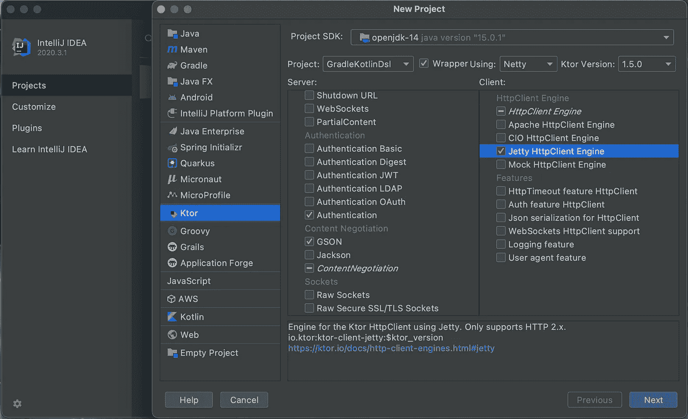
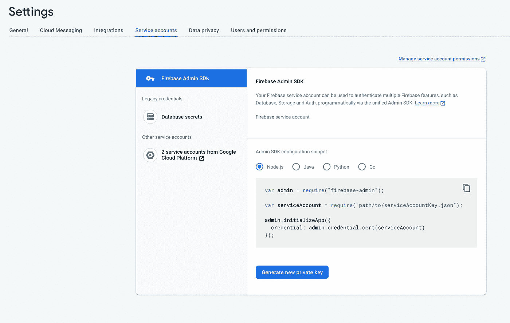
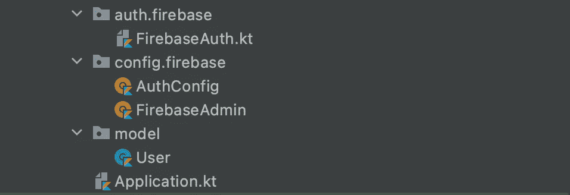

# 如何将 Firebase 身份验证与 Ktor 身份验证功能集成在一起

> 原文：<https://levelup.gitconnected.com/how-to-integrate-firebase-authentication-with-ktors-auth-feature-dc2c3893a0cc>

## 为什么不让专家来处理你的用户管理呢？

如果你像我一样，当开发一个应用程序时，你知道安全需要是优先考虑的；您还知道，开发一个足以抵御当今攻击的可靠身份验证系统需要深入的安全知识。这就是为什么通常最好让专家来开发这类系统——像谷歌的那些专家已经构建了 [Firebase 的认证](https://firebase.google.com/docs/auth)系统，该系统对于大多数中小型应用程序来说都易于实现和维护……无论它们是 web 还是移动应用程序。

我是 Kotlin 编程语言的超级粉丝，所以我最近开始使用开源的 Jetbrains 开发框架 [Ktor](https://ktor.io/) 构建后端应用程序。在本文中，我将向您展示如何将 Firebase 身份验证与 Ktor 框架已经提供的 Auth 特性集成在一起。

我们都知道，重新创建轮子通常只是浪费开发人员的时间，所以我使用当前的 [JWT 功能](https://github.com/ktorio/ktor/tree/master/ktor-features/ktor-auth-jwt)代码作为起点，并编辑它以使用 Firebase 而不是自定义的 JWT 实现，所以我必须感谢 Jetbrains 的出色开发人员，他们编写了原始代码……谢谢大家！:)

本文假设您对 Ktor 框架有基本的了解——如果您想学习更多的基础知识，网上有很多关于这些主题的教程！最近刚入门的时候用了不少。

首先，我们将使用 IntelliJ IDEA Ktor 插件创建一个新的 Ktor 项目。我们将选择我们想要使用的特性，并且我们将告诉插件我们想要使用 Kotlin Gradle DSL。你可以选择如何处理内容协商，我用的是 GSON。对于 HTTPClient 引擎，我使用的是 Jetty，当然我们还需要勾选认证。我还勾选了通话记录，这样我就可以看到我呼叫了哪些端点。

一旦你完成选择功能，按照提示，直到你有一个初始化的项目。要完成 Ktor 安装，请用下面的文件替换当前的 build.gradle.kts 文件，并加载更改。

现在让我们设置我们的 Firebase 项目，并为 Firebase 管理设置生成一个新的私钥。Firebase 文档非常好，所以如果你不确定如何创建一个 Firebase 项目，点击[这里](https://firebase.google.com/docs)寻找答案。有了新项目后，导航到项目设置，然后导航到服务帐户。在那里，您可以单击“生成新的私钥”按钮。

这将下载一个 json 文件，然后将它放在项目的 resources 目录中，记住，如果您计划发布一个公共 repo，请将它添加到您的。gitignore 文件！

太好了，我们设置好了，可以开始看代码了:)

首先，让我们再添加几个 Kotlin 文件。从你的根目录，创建文件`auth/firebase/FirebaseAuth.kt`，然后创建目标文件`config/firebase/AuthConfig`和`config/firebase/FirebaseAdmin`，最后创建数据类文件`model/User`。完成后，你的文件夹结构应该如下图所示。

让我们从 Firebase 管理代码开始。在`FirebaseAdmin`文件中粘贴下面的代码(记得把 json 文件的名字改成你下载的那个)，

然后在您的`Application.kt`文件中的特性安装代码上方添加一行`FirebaseAdmin.init()`。这将使用您下载的凭证来初始化您的 Firebase 应用程序。

接下来将下面的代码添加到您的`FirebaseAuth.kt`文件中，

上面的代码提供了一个`AuthenticationProvider`，然后用嵌套的`Configuration`类构建它。这个配置类提供对令牌和 lambda 函数(我们将在后面设置)的访问，以提供`Principle`(即`User`)。

接下来我们有了`Authentication.Configuration.firebase`扩展函数，它将为我们做所有的实际工作。这里我们构建了`AuthenticationProvider`，然后我们用它来设置一个拦截器；在这个拦截器中，我们获取令牌并检查令牌是否有效。最后，我们调用 lambda 来获取我们的`Principle`，当然，我们在 try/catch 中这样做，以便我们可以捕捉和处理任何可能发生的错误。

现在让我们转到`AuthConfig`和`User`文件。`AuthConfig`将为我们的`Configuration`提供 lambda 函数，这样我们就可以获取我们的`Principle`并且`User`文件将成为我们的数据模型。

注意，我们上面的`User`数据类实现了`Principle`接口。这是因为我们的`Configuration`期待那种类型。一旦添加了`User`数据类代码，将下面的代码添加到您的`AuthConfig`文件中。

上面的代码为我们的`Configuration`类提供了一个扩展函数，正如我前面提到的，它提供了 lambda 来获取我们的`Principle`。最后，我们将编辑我们的`Application.kt`文件，以使用我们添加的所有代码。

在上面的代码中，你可以看到当安装了`Authentication`特性时，我们使用了我们的`firebase`扩展函数，并把我们的`configure`扩展函数交给了它。现在，当我们对经过身份验证的端点进行任何调用时，我们的应用程序将在请求头中查找令牌，如果找到，令牌将被验证，最后我们的`User`数据将被添加到调用中，并可以通过调用`call.principle<User>()`进行检索。

有了所有这些，我们现在可以在前端注册/登录 Firebase，并在对后端进行安全调用时获得一个不记名令牌。我们可以让 Firebase 负责诸如刷新令牌、发送电子邮件地址验证电子邮件以及更新用户的电子邮件或密码之类的事情。

我希望这是有用的:)如果你想要完整的项目代码，可以在我的 GitHub:[https://github.com/Yukigeshiki/ktor-firebase-auth](https://github.com/Yukigeshiki/ktor-firebase-auth)上找到，如果你发现任何可以改进的地方，请在评论中告诉我！