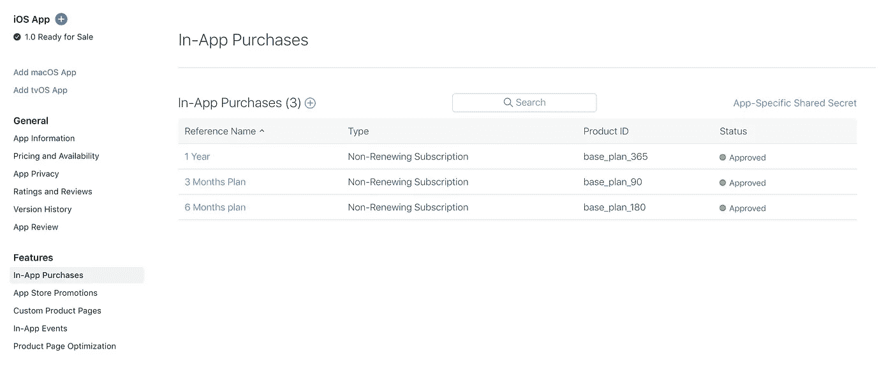

# 如何在 Flutter (iOS)中整合应用内购买

> 原文：<https://levelup.gitconnected.com/how-to-integrate-in-app-purchase-in-flutter-ios-54a66b7eff0b>


作者图片

大家好！太久了，我还没有写过任何关于 Flutter 的东西。这是因为我在 Flutter 中制作了一个 OTT (Over The Top)平台，我很高兴地分享，该应用程序已成功上传到 Play store 和 App store。Android 部分非常顺利，我的应用上传到 play store 也很顺利。但是当我把配置稍有不同的同一个应用上传到苹果应用商店时，我遇到了很多问题。我面临的一个主要问题是整合应用内购买。我将在本文中详细讨论这一点，我将为您提供一个解决方案，其中包含代码和解释。所以，没有任何进一步的麻烦，让我们开始吧。

P.S .我做的应用程序是给我的客户的。

# 问题

我已经集成了第三方支付服务来销售我在 Android 和 iOS 中的数字内容，我知道苹果不会允许第三方支付服务，除非有商品或服务的物理交换。所以，这是我犯的错误。我整合了 Apple Pay 来销售我的数字内容，结果是👇🏻👇🏻


作者图片:应用程序拒绝问题 1


作者图片:应用被拒绝第 2 期

简而言之，苹果希望我整合应用内购买(IAP)以符合其指导方针。我参考了大量关于如何在 Flutter 中集成“**应用内购买”**的教程，但是没有人为我工作。要么他们有一些问题，要么他们错过了一些不适合我的东西。所以，我不希望你像我一样陷入困境。以下是将 IAP 集成到您的应用程序中的逐步过程，以便您的应用程序发布过程在 Apple App Store 上顺利进行。

# 配置应用内购买的工作流程

**第一步:** **签订付费申请协议**

你必须做的第一件事就是接受协议。*进入* [*app store 连接*](https://appstoreconnect.apple.com/) *- >协议、税务、银行。*

您将看到两个协议。一个是免费应用，另一个是付费应用。

**免费应用程序:**如果您想在 App Store 上免费上传您的应用程序，请接受此协议。

**付费应用:**如果你想在 App Store 上销售你的应用，或者你的应用提供应用内购买，那么这个协议是必要的。

免费应用程序协议不要求你添加银行账户和填写税务信息，但付费应用程序需要。我们需要接受付费应用协议。一旦您接受了协议并填写了必要的信息，您的协议状态将是活动的。就像这样👇🏻👇🏻👇🏻


作者图片:协议、税收和银行

**第二步:** **在 App Store Connect 中配置应用内购买**

现在，我假设你已经成功地填写了所需的应用程序信息，如在 App Store 上创建一个应用程序，并填写版本信息、应用程序隐私信息、添加你的应用程序截图以及所有这些东西。我将主要关注应用内购买。

*前往* [*app store 连接*](https://appstoreconnect.apple.com/) *- > MyApps - >您的应用名称- >功能- >应用内购买- >点击加号按钮创建 IAP*



作者图片:应用内购买页面

现在，您将被提示四个不同的选项。就像这样👇🏻👇🏻👇🏻


作者图片:应用内购买计划

相应地选择您的选项。单击创建，您将被重定向到新的网页，在那里您必须填写以下详细信息👇🏻👇🏻👇🏻


作者图片:创建新的应用内购买

**参考名称:**顾名思义只是供大家参考。你可以给它起任何名字。例如，我的应用程序提供了季度、半个月和一年三种订阅计划。我照原样给它们取了名字。

**产品 ID:** 主要的、重要的东西。您必须提供一个不同于您添加的任何其他 IAP 的唯一产品 ID。该产品 ID 将用于我们的颤振代码。

**定价:**


作者图片:应用内购买定价

苹果不提供定制定价。你必须从他们提供的价格选项中进行选择。根据您的需要选择。

**应用商店信息:**


作者图片:应用商店信息

这些信息也是你必须正确填写的重要内容，因为这些信息将显示在我们的应用程序中。填写显示名称(如季度计划)和描述(如享受我们三个月的数字内容)

**复习资料:**


作者图片:评论信息

添加带有 dimension (640x920)的应用程序截图、应用程序的任何活动/页面，以及一点点说明(复习笔记)，您可以在其中描述您的 IAP 计划。如果你不填写这些信息，你的应用程序将被拒绝(相信我，这发生在我身上)。如果您已经填写了所有详细信息，请单击“保存”按钮。点击保存按钮后，IAP 的状态将变为**“准备提交”**


作者图片:应用内购买已成功创建

如果您未能提供任何信息，您的状态将为**“缺少元数据”**


作者图片:应用内购买创建失败！

如果你遵循了我上面提到的同样的事情，你很可能不会在你的应用审查中遇到任何问题。在您的 IAP 页面上，您将看到您创建的所有 IAP 计划，如下所示👇🏻👇🏻👇🏻


作者图片:应用内购买已创建

**第三步:** **在 Xcode 中启用应用内购买**

下一步是在你的 Flutter 代码中添加应用内购买功能。在你的 **Xcode 里面打开 **Runner.xcworkspace** (可以在 ios 文件夹下找到)。**(确保你打开的是 **Runner.xcworkspace** 而不是 **Runner.xcodeproj** )。

在 Xcode 中打开 Runner 文件后，请遵循以下流程:

*跑者- >目标- >跑者- >签约&能力- >添加能力(+能力)- >搜索应用内购买- >添加。*

**注意:**确保您为所有人添加了 IAP，而不仅仅是调试或发布。

**步骤 4:将 IAP 添加到我们的颤振代码中**

头疼了这么多，真正的头疼现在要开始了。但是不要担心，Jiten 会告诉你所有你需要的东西，这样你就不会头疼了🤯🤯🤯我拿到了。

我们将在 _app_purchase 中使用一个名为[的插件。将这个插件添加到您的 pubsec.yaml 文件中。你可以从下面的链接中找到代码👇🏻👇🏻👇🏻](https://pub.dev/packages/in_app_purchase)

[](https://github.com/TheBoy-WhoCode/iap_example) [## GitHub-the boy-who code/IAP _ example

### 此时您不能执行该操作。您已使用另一个标签页或窗口登录。您已在另一个选项卡中注销，或者…

GitHub.c](https://github.com/TheBoy-WhoCode/iap_example) 

在上面的 [**Github repo**](https://github.com/TheBoy-WhoCode/iap_example) 中，你会得到两个 dart 文件。我们要参考的是 **main.dart**

在 **main.dart** 中，您想要做的主要更改是，像我一样替换产品 id。将**“您的计划 ID(产品 ID)”**替换为您在步骤 2 中创建的产品 ID。

```
const String threeMontsPlanID = 'Your Plan ID (Product ID)';const String halfYearPlan = 'Your Plan ID (Product ID)';const String yearlyPlan = 'Your Plan ID (Product ID)';const List<String> _kProductIds = <String>[threeMontsPlanID,halfYearPlan,yearlyPlan];
```

**main.dart** 中的代码有点长，在一整篇文章中解释每一点都很困难，但好处是，代码是不言自明的。您需要做的唯一更改是我上面提到的代码。剩下的都搞定了。但是…

如何验证我的采购订单？

在 **main.dart** 里面，你会得到***_ verify purchase()***方法。使用这种方法，您可以调用 API 向服务器验证您的购买是否完成，并相应地更新您的数据库。由于保密，我不能分享确切的代码，但我会给你提供一个例子，这样你的工作就完成了。

我创建了 Map 来共享我的购买数据，我还创建了一个名为 ***iapService()*** 的函数，它接受 Map 作为参数。这个函数向我的 Node.js API 发出一个 POST 请求，它向我发送我的付款状态。根据我的状态，我相应地通知我的用户。

你要知道的重要的一点是，PurchaseDetails 为你提供了两种不同的数据，服务器和本地验证数据。这两个数据是 base64 编码的。

它还会返回 purchaseID 和 productID。purchaseID 将是唯一的，由 Apple 和用户选择的产品 ID(您创建的产品 ID 和用户选择的产品 id)提供给您。返回 ***未来<布尔>。*值(真)**相应地(重要)。

现在，您已经将 IAP 集成到您的应用程序中，最后一步是测试您的 IAP

**第五步:测试 IAP**

为了测试您的 IAP，您需要创建一个沙盒测试帐户。

*进入* [*app store 连接*](https://appstoreconnect.apple.com/) *- >用户并访问，*点击沙箱下的测试仪。


作者图片:沙盒

添加测试人员的电子邮件 ID。确保您添加了 Apple ID。只需运行您的应用程序，从您已经创建的计划中进行选择，当出现提示时，您可以添加测试人员的电子邮件 ID(沙盒电子邮件 ID)和密码来测试您的 IAP。

**注意:**您不能在模拟环境(iOS 模拟器)中测试 IAP，您需要一个物理设备来进行测试。

加油🤩！我们已经成功实现了应用内购买，并进行了测试。

这里有一个 IAP 的快速演示，我把它集成到了我的应用程序中。我希望我可以分享我的应用程序链接，但由于个人原因，我不会。很抱歉。


作者 GIF:应用内购买演示

我的应用程序被拒绝了将近五次🤯但是最后，我一个接一个地解决了问题，最后，这个应用程序出现在了应用商店。拥有 1K 下载量和 400 活跃用户。🤩🥳

最后但同样重要的是，我还创建了一个名为[floating _ frosted _ bottom _ bar](https://pub.dev/packages/floating_frosted_bottom_bar)的抖动包(文章即将发布),敬请关注😉😉😉

一如既往，如果你有任何疑问，任何问题，都可以在[**LinkedIn**](https://www.linkedin.com/in/jiten-patel-jp/)**[**Twitter**](https://twitter.com/thejitenpatel)**&[**insta gram**](https://www.instagram.com/thejitenpatel/)**上联系我。如果我的文章对你有帮助，你可以随时******

****[](https://www.buymeacoffee.com/jitenpatel)****