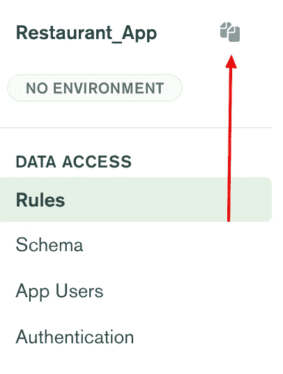

# 如何将 MongoDB 领域与 React 集成:第 1 部分

> 原文：<https://levelup.gitconnected.com/how-to-integrate-mongodb-realm-with-react-part-1-ca21dd99d996>


*本文原载于* [*我的个人博客*](https://blog.shahednasser.com/how-to-integrate-mongo-realm-with-react-part-1/) *。*

MongoDB Realm 是一个无服务器的后端，它不仅允许您轻松地写入和读取数据，而且还提供了简单的方法来验证用户，保持您的数据在多个设备之间同步，等等。

在本教程中，我们将学习如何创建一个 MongoDB Realm 应用程序，向其中添加示例数据，基于用户角色限制数据访问，然后如何将该应用程序与 React 集成。我们将创建一个网站，显示餐馆评论，并允许用户创建一个帐户，并添加他们自己的评论。

你可以在这里找到这个教程[的代码](https://github.com/shahednasser/mongodb-realm-tutorial)。

## 创建一个 MongoDB 领域应用程序

**创建一个 MongoDB 集群**

在创建 MongoDB Realm 应用程序之前，我们需要创建一个 MongoDB 集群。为此，请访问 [Atlas 门户网站](https://cloud.mongodb.com/)。如果您没有帐户或尚未登录，您需要先登录。

如果您没有被重定向到项目页面，请单击左上角的徽标。


进入项目页面后，点击右边的新建项目按钮。


然后会要求您输入项目名称。你想叫它什么都可以。之后，如果需要的话，会要求您添加成员。完成后，点击创建项目。

创建项目后，您将被重定向到 Clusters 页面。点击“构建集群”


您将被要求选择一个集群计划。对于本教程，您可以选择免费计划。


然后，您只需点击“创建集群”


此后，您的集群将需要一些时间来部署。您需要等到它被创建和部署，这可能需要几分钟。

下一步是向我们的集群添加一个样本数据集。如果已经有数据集，可以添加自己的数据。

要开始添加数据，请单击您创建的集群中的集合。


然后，点击加载样本数据集。


将打开一个弹出窗口要求确认。确认后，示例数据集将安装在您的集群中。这个数据集包含一堆有用的数据库和集合，用于不同的用例。

完成示例数据集的安装需要一两分钟的时间。完成后，您会看到现在您已经有了几个数据库。


我们将只使用`sample_restaurants`数据库，所以您可以通过点击当您将鼠标悬停在一个数据库名称上时出现的垃圾桶图标来删除其余的。

现在我们的 MongoDB 集群已经准备好了，让我们继续创建一个 MongoDB Realm 应用程序。

**创建一个 MongoDB 领域应用**

要进入 MongoDB 领域，点击“Atlas”旁边标签栏中的“领域”


一个对话框将显示开始创建 MongoDB 领域应用程序。您需要为领域应用程序输入一个名称，可以是您想要的任何名称。然后，您需要选择一个集群来链接 Realm 应用程序。您需要选择我们刚刚创建的集群。完成后，单击创建领域应用程序。

接下来，我们需要从集群中选择一个集合，以便从 Realm 应用程序添加访问权限。为此，请单击仪表板上“添加收藏”下的“开始”。


您必须选择数据库，即`sample_restaurants`。然后选一个集合，会是`restaurants`。

接下来，我们需要选择一个权限模板。权限模板允许根据需要轻松限制读写访问。

在我们正在创建的网站中，所有用户都可以阅读关于餐馆的所有数据，他们可以在自己的账户中写评论。

现在，我们只需从下拉列表中选择“用户只能读取所有数据”。完成后，点按“添加收藏”接下来，点击侧边栏中的`neighborhoods`，选择相同的模板，然后添加收藏。

每次您对 Realm 应用程序进行更改时，您都必须部署它以使更改生效。要部署我们刚刚做出的更改，请单击顶部蓝色横幅中的“审阅草稿和部署”。


就是这样！我们创建了一个 Realm 应用程序，它链接到我们的集群和集群中的集合。这将提供一个无服务器的后端，使我们能够轻松地检索和写入数据到我们的集群。

## 生成模式

为了能够查询我们的集合和文档，并且能够应用某些角色、权限和限制，我们需要为每个集合生成模式定义。为此，单击侧边栏中的 Schema。

然后，单击生成模式按钮。这将基于集合中已经存在的数据生成模式。

在“Generate schema(s) for:”下，选择“all unconfigured collections”并在“20”中选择“Sample type”，因为考虑到我们的数据很简单，我们不需要对这么多文档进行采样。然后，单击生成模式。

完成后，您将看到生成的模式包含所有字段及其各自的类型。


## 在领域应用程序中设置验证

在我们的 Realm 应用程序中，我们将使用两个身份验证提供者:

1.  匿名登录:允许用户在不实际登录的情况下查看所有数据。
2.  电子邮件和密码登录:用户必须用电子邮件和密码登录才能写评论。

这意味着用户有权读取所有数据，但只能写入自己的数据。

在 Realm Portal 中，单击侧栏中的 Authentication。您将看到几个身份验证提供程序都被禁用了。

我们将首先启用“允许用户匿名登录”点击这个的编辑按钮，然后打开它。

然后返回到身份验证页面。我们现在将单击第二个选项“电子邮件/密码”的编辑

首先，启用提供者。接下来，对于“用户确认方法”，选择“自动确认用户”MongoDB Realm 为您的应用程序提供了用户确认工作流，但在我们的情况下，我们不需要它。

接下来是“密码重置方法”MongoDB 领域还为您的用户提供了密码重置方法。我们不会实现它，但是因为我们需要输入配置，只需在“密码重置 URL”中输入`http://example.com/reset`

完成后，单击保存。我们的用户现在可以使用电子邮件和密码登录。

设置身份验证的最后一步是允许使用电子邮件和密码登录的用户撰写自己的评论。为此，转到侧边栏中的 rules，然后选择`restaurants`集合，然后单击表格中的“New Role”。


将会打开一个弹出窗口。您首先需要输入角色名称。我们将其命名为“用户”

接下来，我们需要输入“Apply When”条件，这意味着何时应该将用户视为该角色的一部分。我们希望使用电子邮件和密码登录的用户能够撰写评论。输入以下内容:

```
{
  "%%user.data.email": {
    "%exists": true
  }
}
```

然后，对于“文档级权限”，选择“插入文档”完成后，点按“完成编辑”

然后，在表格中单击“添加字段”并键入“成绩”,然后单击复选标记。然后检查用户角色的读和写。这增加了双重限制，即用户只能写成绩，不能写其他。至于 Read，您可以检查所有字段。然后，单击“用户”角色名称下的左箭头，在将登录用户与正确的角色匹配时，为用户角色赋予更高的优先级。完成后，点击保存。该表应该如下所示:


完成后，我们现在可以匿名，登录用户可以读取所有数据，但只有登录用户可以写自己的评论。

最后要做的一件事是，确保单击“审阅草稿和部署”以使所有更改生效。

现在，我们的 MongoDB Realm 应用程序已经准备好与 React 集成。接下来，我们将讨论如何将其与 React 集成，并使用我们已经设置好的所有功能。

## 反应设置

如果您还没有准备好 React 项目，请运行以下命令来创建一个:

```
npx create-react-app restaurants-reviews
cd restaurants-reviews
```

接下来，我们将安装 MongoDB Realm Web SDK:

```
npm install --save realm-web
```

这就是我们开始使用 React Realm 所需的全部内容。我们还将安装[反应引导](https://react-bootstrap.github.io/)使造型更容易:

```
npm install react-bootstrap bootstrap@4.6.0
```

和 [React 路由器](https://reactrouter.com/web/guides/quick-start)添加不同页面:

```
npm install react-router-dom
```

**首页**

让我们首先修改创建将成为主页的`Home`组件。主页将只显示餐馆及其评级的列表。

创建文件`src/pages/Home.js`和以下基本组件:

```
function Home () {
	return (
    	<div></div>
    )
}

export default Home
```

目前，它只是一个显示了`&lt;div&gt;`元素的组件。我们需要让它显示一个餐馆列表。

因为我们稍后将从 MongoDB Realm 应用程序中获取餐馆，所以我们将为餐馆使用一个州:

```
function Home () {
	const [restaurants, setRestaurants] = useState([])
    //...
}
```

然后，我们将遍历餐馆并显示它们:

```
<div className="mt-3">
    {restaurants.map((restaurant) => (
        <RestaurantCard key={restaurant._id} restaurant={restaurant} />
        ))
	}
</div>
```

让我们用以下内容创建`src/components/RestaurantCard.js`:

```
import { Badge } from 'react-bootstrap'
import Card from 'react-bootstrap/Card'

function RestaurantCard ({restaurant}) {
    //get average of grades
    let sum = 0;
    restaurant.grades.forEach(element => {
        sum += element.score
    });
    const avg = Math.round(sum / (restaurant.grades.length))
    return (
        <Card className="m-3">
            <Card.Body>
                <Card.Title>{restaurant.name} <Badge variant="warning">{avg}</Badge></Card.Title>
            </Card.Body>
        </Card>
    )
}

export default RestaurantCard
```

我们首先计算餐馆的平均分数，然后展示一张写有餐馆名称和平均分数的卡片。

因此，我们的主页应该显示一个带有餐馆名称和等级的卡片列表。剩下的就是将它实际链接到我们 Realm 应用程序中的数据。

让我们先来看看如何连接到 Realm 应用程序。你首先需要一个应用 ID。你可以在仪表盘上找到应用 ID，也可以点击边栏中的复制图标。



然后，在根目录下创建一个`.env`文件，内容如下:

```
REACT_APP_REALM_APP_ID=<YOUR_APP_ID>
```

确保将`&lt;YOUR_APP_ID&gt;`替换为您复制的应用 ID。这有助于轻松更改应用 id，只需在`.env`中更改即可。

回到`src/pages/Home.js`，我们首先需要导入 SDK:

```
import * as Realm from 'realm-web'
```

然后，初始化领域应用程序:

```
const app = new Realm.App({id: process.env.REACT_APP_REALM_APP_ID})
```

请注意，我们使用了之前设置的环境变量。

然后在`Home`组件中，我们将使用`useEffect`在第一次渲染时获取数据:

```
useEffect(() => {

}, [])
```

在内部，我们将匿名登录用户，然后获取`restaurants`数据。从以前开始，我们允许所有用户读取所有数据，甚至没有登录的用户也可以读取数据。

要匿名登录用户:

```
useEffect(() => {
	async function getData () {
    	const user = await app.logIn(Realm.Credentials.anonymous())
    }

    getData();
}, [])
```

之后，我们将使用刚刚登录的用户为我们的集合获取 MongoDB 客户端:

```
const client = app.currentUser.mongoClient('mongodb-atlas')
```

正如您所看到的，通过使用`app.currentUser`，我们指的是当前登录的用户。然后，我们获得该用户的 MongoDB 客户端。这意味着对数据的访问是基于登录的用户来限制的，就像我们上面定义的那样。

下一步是从`restaurants`集合中获取餐馆并设置餐馆状态:

```
const rests = client.db('sample_restaurants').collection('restaurants')
setRestaurants((await rests.find()).slice(0, 10))
```

这样，一旦我们从 MongoDB Realm 应用程序中检索到餐馆，我们的代码就会显示它们。我们还将添加一些负载，以确保我们可以看到负载:

```
const [restaurants, setRestaurants] = useState([])
const [loading, setLoading] = useState(true)

useEffect(() => {
	async function getData () {
    	//...
        const rests = client.db('sample_restaurants').collection('restaurants')
        setRestaurants((await rests.find()).slice(0, 10))
        setLoading(false)
    }

    if (loading) {
        getData();
    }
}, [loading])

return (
    <div className="mt-3">
            {loading && (
                <div className="text-center">
                    <Loading />
                </div>
            )}
            {restaurants.map((restaurant) => (
                <RestaurantCard key={restaurant._id} restaurant={restaurant} />
            ))}
        </div>
);
```

我们还将创建`src/components/Loading.js`:

```
import { Spinner } from "react-bootstrap";

function Loading () {
    return (
        <Spinner animation="border" variant="primary">
            <span className="sr-only">Loading...</span>
        </Spinner>
    )
}

export default Loading
```

就是这样！主页现在已经准备好了。唯一剩下的就是在`src/App.js`中使用`react-router`来确保多页:

```
import {
  BrowserRouter as Router,
  Switch,
  Route,
} from "react-router-dom"
import Home from "./pages/Home"
import 'bootstrap/dist/css/bootstrap.min.css'
import { Container } from "react-bootstrap"

function App() {

  return (
    <Router>
        <Container>
          <Switch>
            <Route path="/" component={Home} />
          </Switch>
        </Container>
    </Router>
  );
}

export default App;
```

现在让我们运行服务器:

```
npm start
```

加载后，您将看到餐馆的平均等级:


接下来，我们将创建身份验证表单，以允许用户创建帐户和登录。

**认证页面**

由于用户只需要输入电子邮件和密码来注册和登录，我们将只创建一个身份验证组件，它根据`type`属性来改变行为，该属性确定表单是用于创建帐户还是用于登录。

在我们开始之前，让我们安装 [Formik](https://formik.org/) 和 [Yup](https://github.com/jquense/yup) 以便更容易地创建表单:

```
npm i formik yup
```

然后，用以下内容创建`src/pages/Authentication.js`:

```
import { Formik } from 'formik'
import { Button, Form } from 'react-bootstrap'
import * as yup from 'yup'
import { useState } from 'react'
import Loading from '../components/Loading'

const userSchema = yup.object().shape({
    email: yup.string().email().required(),
    password: yup.string().required().min(8)
})

function Authentication ({type = 'login'}) {
    const [loading, setLoading] = useState(false)

    async function submitHandler (values) {
        setLoading(true)
        //TODO handle login/create
    }

    return (
        <Formik 
            initialValues={{
                email: '',
                password: ''
            }}

            validationSchema={userSchema}

            onSubmit={submitHandler}
        >
            {({errors, touched, handleSubmit, values, handleChange}) => (
                <Form noValidate onSubmit={handleSubmit}>
                    {loading && <Loading />}
                    {!loading && (<div>
                        <h1>{type === 'login' ? 'Login' : 'Sign Up'}</h1>
                        <Form.Row>
                            <Form.Label>Email</Form.Label>
                            <Form.Control type="email" name="email" value={values.email} onChange={handleChange} 
                            isValid={touched.email && !errors.email} />
                            <Form.Control.Feedback>{errors.email}</Form.Control.Feedback>
                        </Form.Row>
                        <Form.Row>
                            <Form.Label>Password</Form.Label>
                            <Form.Control type="password" name="password" value={values.password} onChange={handleChange} 
                            isValid={touched.password && !errors.password} />
                            <Form.Control.Feedback>{errors.password}</Form.Control.Feedback>
                        </Form.Row>
                        <div className="text-center mt-2">
                            <Button variant="primary" type="submit">Submit</Button>
                        </div>
                    </div>)}
                </Form>
            )}
        </Formik>
    )
}

export default Authentication
```

我们使用 Formik 创建一个包含两个字段的表单，电子邮件和密码。我们还使用`yup` it 来创建一个验证模式。在表单提交时，如果一切都有效，函数`submitHandler`将运行并接受`values`对象。

在`submitHandler`里面，我们需要检查`type`道具。如果它等于`create`，那么我们需要创建一个新用户，然后登录该用户。如果是`login`，那么我们只需要登录用户。

但是在我们开始之前，因为使用`user`对象、MongoDB `client`和领域`app`会很麻烦，所以让我们创建一个[上下文](https://reactjs.org/docs/context.html)，它允许我们轻松地在所有组件中使用相同的数据。

用以下内容创建`src/MongoContext.js`:

```
import React from 'react'

const MongoContext = React.createContext({
    app: null,
    client: null,
    user: null,
    setApp: () => {},
    setClient: () => {},
    setUser: () => {}
})

export default MongoContext
```

我们正在创建一个包含对象`app`、`client`和`user`及其设置函数`setApp`、`setClient`和`setUser`的上下文。

接下来，让我们将`Home`中的`user`、`app`和`client`的声明和初始化移到`App`:

```
const [client, setClient] = useState(null)
  const [user, setUser] = useState(null)
  const [app, setApp] = useState(new Realm.App({id: process.env.REACT_APP_REALM_APP_ID}))

  useEffect(() => {
    async function init () {
      if (!user) {
        setUser(app.currentUser ? app.currentUser : await app.logIn(Realm.Credentials.anonymous()))
      }

      if (!client) {
        setClient(app.currentUser.mongoClient('mongodb-atlas'))
      }
    }

    init();
  }, [app, client, user])
```

如您所见，我们正在为它们中的每一个创建状态，并将它们设置在`App`中。然后，我们将使用`MongoContext.Provider`结束我们的路线:

```
return (
    <Router>
      <MongoContext.Provider value={{app, client, user, setClient, setUser, setApp}}>
      	<Container>
          <Switch>
            <Route path="/" component={Home} />
          </Switch>
        </Container>
      </MongoContext.Provider>
     </Router>
  );
```

现在，我们需要使用`MongoContext.Consumer`将上下文传递给每个组件。为了避免重复，让我们在`App`中创建一个函数来做这件事:

```
function renderComponent (Component, additionalProps = {}) {
    return <MongoContext.Consumer>{(mongoContext) => <Component mongoContext={mongoContext} {...additionalProps} />}</MongoContext.Consumer>
  }
```

这将用`MongoContext.Consumer`包装一个组件，然后传递给它`mongoContext` prop，它将保存我们存储在上下文中的所有对象及其设置器。

回到`App`中的 return 语句，我们将传递一个渲染函数，而不是将`component={Home}`传递给 route:

```
<Route path="/" render={() => renderComponent(Home)} />
```

现在，我们有了一个包含所有对象及其 setters 的上下文，然后我们将它传递给 route 的组件。

让我们在`src/pages/Home.js`中做些改变，不再使用`app`、`user`和`client`的首字母，而是将它们作为道具接收:

```
import { useEffect, useState } from 'react'
import RestaurantCard from '../components/RestaurantCard'
import Loading from '../components/Loading'

function Home ({mongoContext: {client, user}}) {
    const [restaurants, setRestaurants] = useState([])
    const [loading, setLoading] = useState(true)

    useEffect(() => {
        async function getData () {
            const rests = client.db('sample_restaurants').collection('restaurants')
            setRestaurants((await rests.find()).slice(0, 10))
            setLoading(false)
        }

        if (loading && user && client) {
            getData()
        }
    }, [client, loading, user])

    return (
        <div className="mt-3">
            {loading && (
                <div className="text-center">
                    <Loading />
                </div>
            )}
            {restaurants.map((restaurant) => (
                <RestaurantCard key={restaurant._id} restaurant={restaurant} />
            ))}
        </div>
    )
}

export default Home
```

如果你试着运行服务器并访问网站，你会发现一切都和以前一样完美。

回到`Authentication`组件，我们现在将把`mongoContext`道具传递给它:

```
function Authentication ({mongoContext: {app, user, setUser}, type = 'login'})
```

在`submitHandler`中，如果`type`是 create，我们将注册一个新用户，那么对于这两种类型，我们将使用用户的凭据登录用户:

```
async function submitHandler (values) {
        setLoading(true)
        if (type === 'create') {
            //create
            await app.emailPasswordAuth.registerUser(values.email, values.password);
        }

        //login user and redirect to home
        const credentials = Realm.Credentials.emailPassword(values.email, values.password);
        setUser(await app.logIn(credentials))
        setLoading(false)
    }
```

如你所见，我们在上下文中使用了`app`和`setUser`。当我们使用`setUser`时，用户将使用上下文更新所有组件。

我们需要添加的最后一件事是，如果用户已经登录，就重定向用户。为此，首先创建`src/utils.js`，它将保存函数`isAnon`以确定用户是否登录:

```
module.exports = {
    isAnon: function (user) {
        return !user || user.identities[0].providerType === 'anon-user'
    }
}
```

如果用户没有登录，这里的`providerType`将是`anon-user`。

然后，在`Authentication`中，我们将从`react-router`中使用`useHistory`得到一个`history`实例:

```
const history = useHistory()
```

然后，每当上下文中的`user`改变时，我们将检查用户是否登录，如果是，我们将重定向到 home。

```
useEffect(() => {	
	if (!isAnon(user)) {
		history.push('/')
	}
}, [history, user])
```

我们的`Authentication`组件现在完成了！让我们在`src/App.js`中添加`signin`和`signup`路线:

```
<Route path="/signup" render={() => renderComponent(Authentication, {type: 'create'})} />
<Route path="/signin" render={() => renderComponent(Authentication)} />
<Route path="/" render={() => renderComponent(Home)} />
```

我们还需要一个`LogOut`页面，因此创建包含以下内容的`src/pages/Logout.js`:

```
import { useEffect } from "react"
import Loading from "../components/Loading"
import * as Realm from 'realm-web'
import { useHistory } from "react-router"
import { isAnon } from "../utils"

function LogOut ({mongoContext: {app, setUser, setClient}}) {
    const history = useHistory()

    if (isAnon()) {
        history.push('/')
    }

    useEffect(() => {
        async function logout () {
            await app.currentUser.logOut()
            //login anon user
            setUser(await app.logIn(Realm.Credentials.anonymous()))
            //set new client
            setClient(app.currentUser.mongoClient('mongodb-atlas'))
        }

        logout()
    }, [app, setClient, setUser])

    return (
        <Loading />
    )
}

export default LogOut
```

我们首先检查用户是否还没有登录，如果是这样，我们会将他们重定向到主页。然后，我们显示加载组件，在`useEffect`中，我们使用以下命令注销用户:

```
await app.currentUser.logOut()
```

之后，我们再次将用户设置为匿名用户，并重新初始化 MongoDB 客户端:

```
//login anon user
setUser(await app.logIn(Realm.Credentials.anonymous()))
//set new client
setClient(app.currentUser.mongoClient('mongodb-atlas'))
```

这样，我们就有了注销页面。我们只需要将它添加到`src/App.js`中的路线:

```
<Route path="/signup" render={() => renderComponent(Authentication, {type: 'create'})} />
<Route path="/signin" render={() => renderComponent(Authentication)} />
<Route path="/logout" render={() => renderComponent(LogOut)} />
<Route path="/" render={() => renderComponent(Home)} />
```

最后，我们将创建一个`src/components/Navigation.js`组件来显示带有链接的导航栏:

```
import { Nav, Navbar } from "react-bootstrap"
import { Link } from "react-router-dom"
import { isAnon } from "../utils"

function Navigation ({user}) {
    const loggedIn = !isAnon(user)
    return (
        <Navbar bg="light" expand="lg">
            <Navbar.Brand href="#home">Restaurant Reviews</Navbar.Brand>
            <Navbar.Toggle aria-controls="basic-navbar-nav" />
            <Navbar.Collapse id="basic-navbar-nav">
                <Nav className="mr-auto">
                    <Link to="/" className="mx-2">Home</Link>
                    {!loggedIn && <Link to="/signup" className="mx-2">Sign Up</Link>}
                    {!loggedIn && <Link to="/signin" className="mx-2">Sign In</Link>}
                    {loggedIn && <Link to="/logout" className="mx-2">Log out</Link>}
                </Nav>
            </Navbar.Collapse>
        </Navbar>
    )
}

export default Navigation
```

我们将用户属性传递给它，然后检查用户是否登录，我们将显示注销链接。如果没有，我们将显示登录和注册链接。

在`src/App.js`中增加`Navigation`组件:

```
return (
    <Router>
      <Navigation user={user} />
      <MongoContext.Provider value={{app, client, user, setClient, setUser, setApp}}>
      //...
)
```

我们完了！如果尚未运行服务器，请运行服务器:

```
npm start
```

您会看到我们有一个导航栏，在我们未登录时显示登录和注册链接。试着注册，注销，签名，做不同的事情。要检查用户是否真的被创建，在 Realm 平台上，点击侧边栏中的“应用用户”。您将看到用户类型为匿名或电子邮件/密码的用户列表。

# 结论

在下一部分中，我们将为用户添加一个表单来创建他们自己的评论。我们将能够测试我们之前添加的权限，并了解如何根据我们创建的角色来限制用户。

*如果您想联系并讨论更多关于本文或编程的内容，您可以在我的 twitter 帐户上找到我*[*@ shahednasserr*](https://twitter.com/shahednasserr)