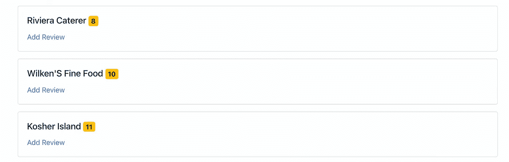
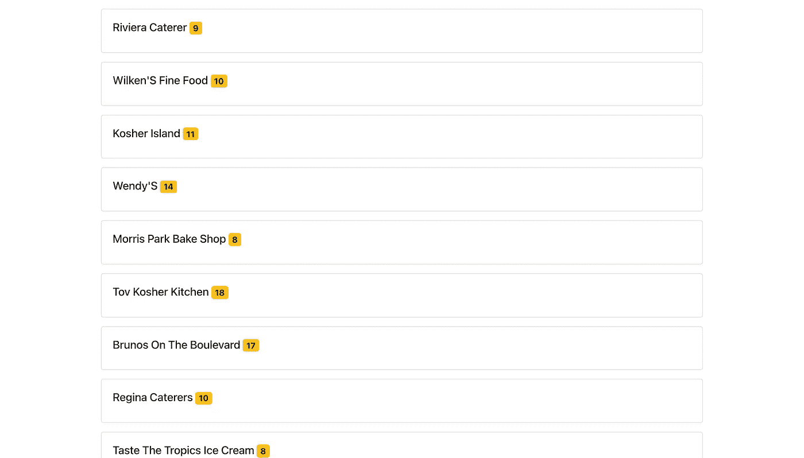
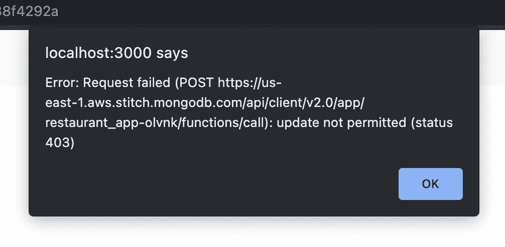
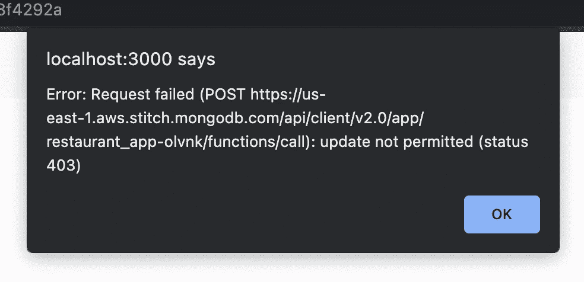

# 如何将 MongoDB 领域与 React 集成:第 2 部分

> 原文：<https://levelup.gitconnected.com/how-to-integrate-mongodb-realm-with-react-part-2-569f56df5388>


*本文原载于* [*我的个人博客*](https://blog.shahednasser.com/how-to-integrate-mongodb-realm-with-react-part-2/) *。*

*请参与* [*本次调查*](https://yiro6gzu369.typeform.com/to/M2TFz504) *为即将发布的文章发表你作为开发者的看法！*

在本教程的第一部分中，我们介绍了如何使用示例数据设置 MongoDB Realm 应用程序，生成模式，创建和限制角色，然后将其与 React 应用程序集成，实现身份验证系统。

在本教程中，我们将介绍如何确保只有通过电子邮件和密码登录的用户才能添加评论，并且我们将测试由未登录的用户添加评论，以查看 MongoDB 领域角色和数据访问规则的运行情况。

你可以在这里找到这个教程[的代码](https://github.com/shahednasser/mongodb-realm-tutorial)。

## 添加评论表单

我们将从添加评论表单开始。该表单将通过主页上显示的餐馆卡片中的链接来访问。餐馆 ID 将作为 URL 参数传递，然后用户输入的任何评论都将保存到该餐馆。首先，我们将允许所有用户访问页面，以测试登录用户和匿名用户之间的差异，然后我们将限制只有登录用户才能访问页面。

用以下内容创建组件`src/pages/AddReview.js`:

```
function AddReview() {

}

export default AddReview
```

就像在认证表单中一样，我们将使用`yup`进行验证，使用`formik`来简化表单的创建:

```
const reviewSchema = yup.object().shape({
    review: yup.number().required()
})

function AddReview() {
    const [loading, setLoading] = useState(false)

    function submitHandler (values) {
     	//TODO add review   
    }

    return (
        <Formik
            initialValues={{
                review: 0
            }}

            validationSchema={reviewSchema}
            onSubmit={submitHandler}>

            {({errors, touched, handleSubmit, values, handleChange}) => (
                <Form noValidate onSubmit={handleSubmit}>
                    {loading && <Loading />}
                    {!loading && (<div>
                        <h1>Submit Review</h1>
                        <Form.Row>
                            <Form.Label>Review Score</Form.Label>
                            <Form.Control type="number" name="review" value={values.review} onChange={handleChange} 
                            isValid={touched.review && !errors.review} />
                            <Form.Control.Feedback>{errors.review}</Form.Control.Feedback>
                        </Form.Row>
                        <div className="text-center mt-2">
                            <Button variant="primary" type="submit">Submit</Button>
                        </div>
                    </div>)}
                </Form>
            )}

        </Formik>
    )
}
```

我们只是创建了一个表单，其中有一个数字输入用于审查，为了验证，我们使用了`reviewSchema`，它只是检查审查是否已填写并且是一个数字。

接下来，我们需要添加登录用户将评论添加到餐馆的逻辑。为此，首先，我们需要将`mongoContext`属性传递给具有 MongoDB `client`和 Realm `app`实例的组件:

```
function AddReview({mongoContext: {client, app}}) {
	//...
}
```

接下来，我们将使用 [useParam](https://reactrouter.com/web/api/Hooks/useparams) 从 URL 参数中获取餐馆的`id`:

```
const { id } = useParams()
```

我们将获得`history`实例，稍后用于重定向回主页:

```
const history = useHistory()
```

我们现在可以添加逻辑来更新被传递的`id`的`restaurant`文档，添加用户的`grade`。为此，我们将首先从我们的`sample_restaurants`数据库中获取`restaurants`集合:

```
function submitHandler(values){
    const rests = client.db('sample_restaurants').collection('restaurants')
}
```

接下来，我们将使用方法 [updateOne](https://docs.mongodb.com/realm/mongodb/update-documents/#update-a-single-document) ，该方法通过查询选择要更新的文档，然后接受更改。对我们来说，查询将是具有作为 URL 参数传递的 id 的餐馆，更改将把一个新条目推入到`restaurant`文档内的`grades`数组中:

```
rests.updateOne({"_id": BSON.ObjectID(id)}, {"$push": {"grades": {
      date: new Date(),
      score: values.review,
      user_id: BSON.ObjectID(app.currentUser.id)
}}}).then (() => history.push('/'))
    .catch ((err) => {
    	alert(err)
    	setLoading(false)
    })
```

请注意:

1.  为了查询`_id`字段，我们需要使用`BSON.ObjectID`来正确传递对象 id。确保在文件的开头添加`import { BSON } from 'realm-web'`。
2.  `grades`数组保存有`date`、`score`和`user_id`的对象。通过这种方式，我们将等级与适当的用户联系起来。
3.  `updateOne`返回一个承诺，所以一旦它解决了，我们就使用`history.push('/')`重定向到主页。

这样，我们的`AddReview`组件就准备好了。接下来，我们需要在`src/App.js`中的路线中添加新页面:

```
return (
    <Router>
      <Navigation user={user} />
      <MongoContext.Provider value={{app, client, user, setClient, setUser, setApp}}>
        <Container>
          <Switch>
            <Route path="/signup" render={() => renderComponent(Authentication, {type: 'create'})} />
            <Route path="/signin" render={() => renderComponent(Authentication)} />
            <Route path="/logout" render={() => renderComponent(LogOut)} />
            <Route path="/review/:id" render={() => renderComponent(AddReview)} />
            <Route path="/" render={() => renderComponent(Home)} />
          </Switch>
        </Container>
      </MongoContext.Provider>
    </Router>
  );
```

然后，我们需要将链接添加到每张餐馆卡的页面中。为此，编辑`src/components/RestaurantCard.js`组件的返回语句:

```
return (
        <Card className="m-3">
            <Card.Body>
                <Card.Title>{restaurant.name} <Badge variant="warning">{avg}</Badge></Card.Title>
                <Link to={`/review/${restaurant._id}`} className="card-link">Add Review</Link>
            </Card.Body>
        </Card>
)
```

注意，我们将餐馆 id 作为参数传递给链接。

让我们现在运行服务器:

```
npm start
```

如果您还没有登录，请务必登录。我们稍后将测试它作为一个来宾是如何工作的。

现在，您应该可以在主页上看到每个餐厅的新链接。



点击任意餐厅的“添加评论”。您将看到一个数字输入字段，输入任意数字，然后单击“提交”。如果您登录了，您应该会看到一个加载器，然后您会被重定向到主页。可以看到餐厅的点评已经改了。



## 测试 MongoDB 领域授权角色

如果您还记得第 1 部分中的内容，我们添加了一个新的用户角色。该用户角色允许拥有电子邮件的用户只插入或更新餐馆的`grades`字段。对于“属于”用户角色的用户，他们需要有一个电子邮件，这是我们在“应用时间”字段中声明的:

```
{
  "%%user.data.email": {
    "%exists": true
  }
}
```

因此，匿名用户没有权限对`grades`字段或`restaurants`集合的任何字段进行任何更改。

让我们测试一下。从当前用户注销。您应该仍然能够看到 Add Review 链接，并且能够访问该页面，因为我们仍然没有添加用户身份验证的条件。

尝试给任何餐厅添加评论。由于您没有登录，您将收到一个错误提示，不会添加任何内容。



如你所见，错误显示“不允许更新”。该用户不属于我们创建的“用户”角色，因此不允许他们添加评论。

现在让我们隐藏`src/components/RestaurantCard.js`中匿名用户的“添加评论”链接:

```
{!isAnon(user) && <Link to={`/review/${restaurant._id}`} className="card-link">Add Review</Link>}
```

将`user`添加到`RestaurantCard`的道具列表中:

```
function RestaurantCard ({restaurant, user}) {
	//...
}
```

将`user`支柱传递到`src/pages/Home.js`中的`RestaurantCard`:

```
<RestaurantCard key={restaurant._id} restaurant={restaurant} user={user} />
```

让我们在`src/pages/AddReview.js`中添加一个条件，以便在用户未登录时重定向到主页:

```
function AddReview({mongoContext: {client, app, user}}) {
    const [loading, setLoading] = useState(false)
    const { id } = useParams()
    const history = useHistory()

    if (isAnon(user)) {
        history.push('/')
    }
    //...
}
```

现在，如果您没有登录，您将无法看到评论，如果您试图直接访问评论页面，您将被重定向到主页。

让我们测试我们创建的角色的另一个方面。正如我们所说的，我们创建的角色允许登录用户更新`grades`字段。但是，他们不能编辑任何其他字段。

让我们改变`AddReview`中`updateOne`的参数来改变名称:

```
rests.updateOne({"_id": BSON.ObjectID(id)}, {"name": "test"})
```

这只是为了方便测试这种限制。现在，登录并转到“添加评论”并单击提交。您将看到与之前相同的“不允许更新”消息。



这展示了我们如何通过 MongoDB Realm 轻松管理我们的用户、他们的角色和数据访问。

## 结论

使用 MongoDB Realm 允许我们轻松地创建无服务器应用程序，同时管理数据访问、角色和身份验证。它也可以在网络上使用(就像本教程中一样)，在移动应用程序上使用，等等。在本教程中，我们涵盖了大多数用例中可能需要的基础知识。如果你深入研究，你肯定会发现更多对你的无服务器应用有帮助的特性。

*如果你想联系并谈论更多关于这篇文章或编程的内容，你可以在我的推特账号*[*@ shahednasserr*](https://twitter.com/shahednasserr)上找到我