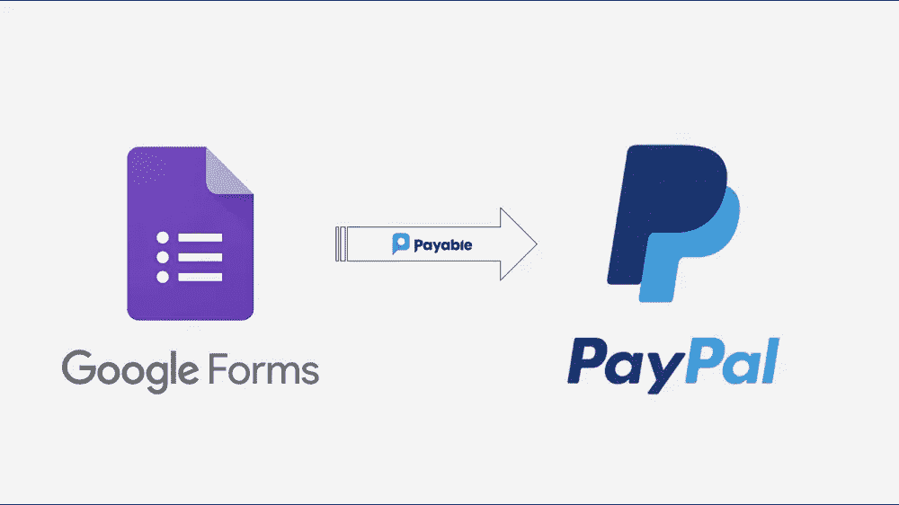
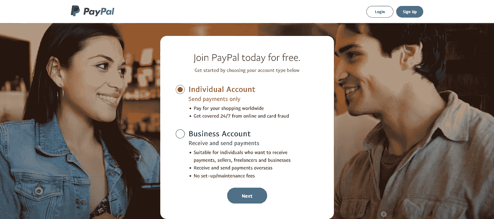
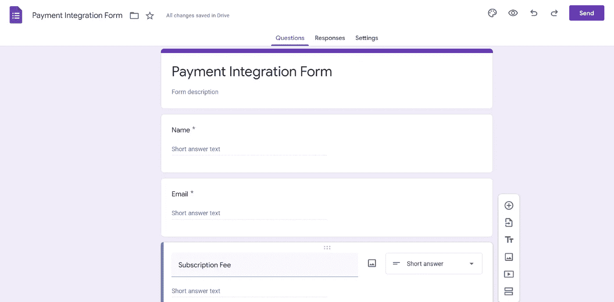
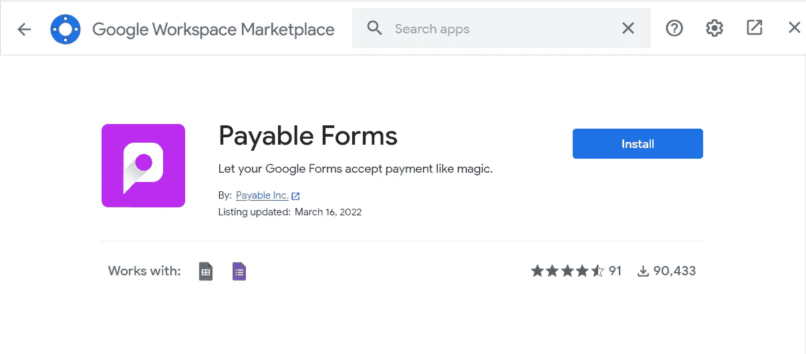
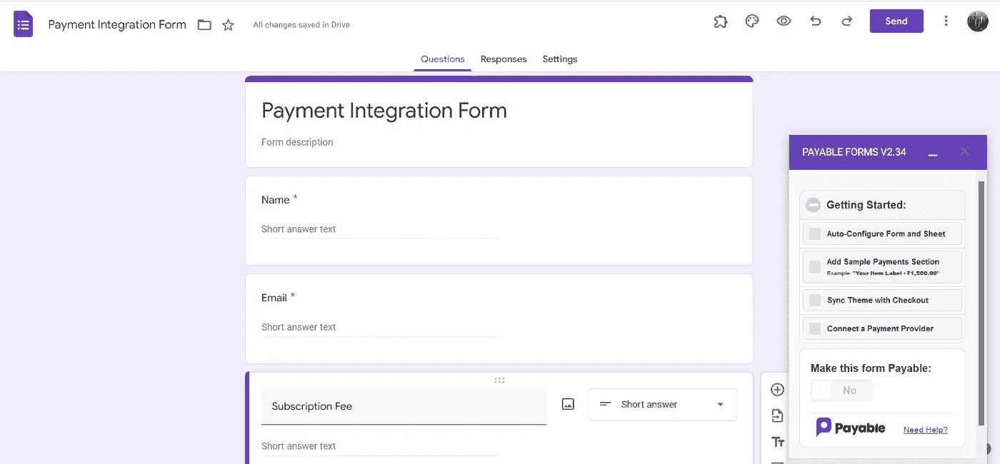
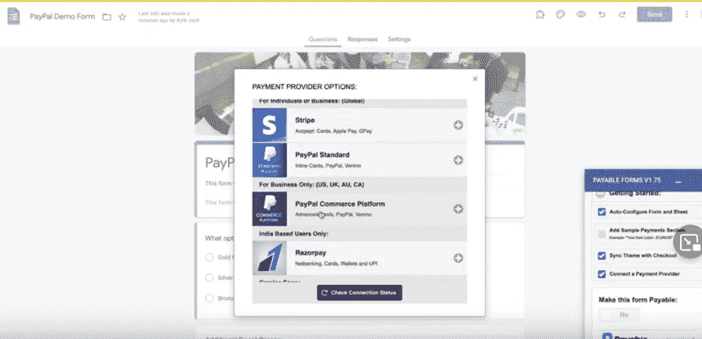

# 如何整合贝宝支付网关与谷歌表单

> 原文：<https://levelup.gitconnected.com/how-to-integrate-paypal-payment-gateway-with-google-form-da05a3a52f6a>

图片来源:Youtube

今天，我们将在本文中了解如何将支付网关系统与 Google Forms 集成。前面我们已经读到了——《[**razor pay 支付网关与 Google 整合形成**](/razorpay-payment-integration-with-google-form-3b5802d5dc0d)**的文章。如果你想将 Razorpay 支付网关与谷歌表单集成，你可以查看一下。**

**如果你想通过谷歌表单拓展业务并收取费用，你来对地方了。**

**要做到这一点，你只需要遵循这些简单的步骤。**

1.  **要收取付款，您需要一个 **PayPal** 支付网关账户。**
2.  **带有必填字段的谷歌表单。**
3.  **一个谷歌表单插件，集成了 PayPal 和谷歌表单。**

****第一步:创建 PayPal 账户** —要创建 **PayPal** 账户，请 [**点击此处**](https://www.paypal.com/in/home) 并填写所需的详细信息。您也可以使用您的 google mail 帐户来创建帐户。**

****

**图片来源:PayPal**

**第二步:创建谷歌表单 —创建一个带有必填字段的谷歌表单。参考截图，以供参考。**

****

****第三步:安装用于集成的附加组件**——为了将您的 **PayPal** 支付账户与您的谷歌表单相集成，一旦您创建了包含必填字段的谷歌表单，您只需在上面安装**支付表单**附加组件。请参考下面的截图以获得帮助。**

**一旦你点击附加选项，附加屏幕将出现，只需输入**应付表格**并点击回车。附加组件会过来安装它。请找到截图供参考。**

****

**在你安装了可支付表单附加组件后，它会询问你一些基本的权限；只要允许它们，你的 Google 表单上就会出现 Payable Forms 设置窗口，如下图截图所示。**

****

**让我们一步一步详细了解每个设置:**

1.  ****自动配置表单:**Payable add-on 根据您的 Google 表单输入字段生成一个 Google 电子表格，包括付款 id 和状态列。这只不过是你的回应表。**
2.  ****添加样本付款部分:**这个选项基本上是添加一些输入字段的样本部分到您的谷歌表单，以便可以接受付款。您可以从这些字段中选择最适合您的业务需求的字段，并删除其余的字段。**
3.  ****同步主题和结帐:**没有什么比设计你的结帐表单更重要的了。如果你已经为你的谷歌表单选择了一个主题，Payable 将为结帐页面使用一个相似的主题。**
4.  ****连接支付提供商:**这是支付集成的重要组成部分。您将看到各种支付网关的列表，您需要选择 **PayPal** 选项，并填写一些 **PayPal** 帐户凭证，以便与谷歌表单集成。**

****第 4 步:PayPal 集成**:要将应付款连接到 PayPal 账户，请转到应付款设置并勾选“**连接支付提供商**”框，然后输入所需信息。**

****

**耶！我们已经完成了**贝宝**与谷歌表单的整合。现在有一个按钮叫做**使这个表单成为应付款**。启用它，您的集成就完成了。支付可以在测试模式下测试，也可以在**应付表单**设置下实时处理。您可以启用测试模式，开始填写表单，测试流程直到结帐，然后在您的 Google 回应表中检查回应。**

**如果你有兴趣学习 Google Apps 脚本和自动化你的 Google Workspace？一定要试试这本**电子书**上的 [**Google Apps 脚本:初学者指南**](https://www.amazon.com/dp/B0BTJC9X5R)**

**我希望这篇文章对你使用 Google form 设置支付系统有所帮助。非常感谢，祝你学习愉快！**

**有关本文的任何疑问或任何其他技术建议，您可以发送电子邮件至—**dilipkashyap.sd@gmail.com**。**