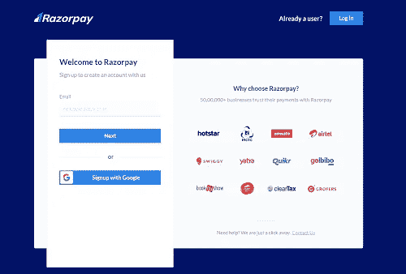

# 如何整合 Razorpay 支付网关和 WordPress 网站

> 原文：<https://levelup.gitconnected.com/how-to-integrate-razorpay-payment-gateway-with-wordpress-website-ff77586728a8>

图片来源:fluentforms.com

在这篇文章中，我们将学习如何将支付网关与 WordPress 网站集成。如果你想在网上销售产品或服务？建立一个应用程序或网站可能是一项艰巨而昂贵的任务。有许多在线论坛可以帮助你创建一个免费的网站。

其中之一就是 WordPress。有了 WordPress，你可以免费创建一个网站。如果你希望有一个自定义域名，你也可以用 WordPress 来获得。一旦你的 WordPress 网站建立起来，你所要做的就是连接支付网关，然后开始卖你的东西。

凭借最简单的集成、完全在线的乘坐、完整的功能特性和出色的课堂表现，您可以使用 [**Razorpay**](https://rzp.io/i/2wiHeXb3dt) 支付网关立即上线，享受未来的支付。

以下是我们需要的东西，以支付与网站整合。

1.  带有 WooCommerce 插件的 WordPress 网站。
2.  要收取付款，您需要一个 [**Razorpay**](https://rzp.io/i/2wiHeXb3dt) 支付网关账户。

下面一步步来看完整流程。

**步骤 1: Razorpay 账户创建** —要创建 [**Razorpay**](https://rzp.io/i/2wiHeXb3dt) 账户，请 [**点击此处**](https://rzp.io/i/b8FhSlD) 并填写所需的详细信息。您也可以使用您的 google mail 帐户来创建帐户。

Razorpay 注册屏幕

**第二步:API 密钥生成—** 当您拥有 [**Razorpay**](https://rzp.io/i/2wiHeXb3dt) 账户时，请转到仪表板并创建 API 密钥，为此，请转到:**设置= > API 密钥**

API 密钥生成的导航屏幕

在上面的屏幕中，您需要为**测试**和**实时**模式生成 **API 密钥**，并保存**密钥 Id** 和**密钥秘密**。下面你会找到每种模式的导航。

测试和实时模式 API 密钥生成屏幕

现在我们已经完成了第一部分，我们将继续第二部分，这将是 WooCommerce 插件安装和 [**Razorpay**](https://rzp.io/i/2wiHeXb3dt) 支付网关集成。以下是步骤。

**第三步:** **WooCommerce 插件安装—** 请转到链接，将插件[**razor pay for woo commerce**](https://razorpay.com/docs/ecommerce-plugins/woocommerce/)**安装到你的 WordPress 网站。**

****

**WooCommerce 插件安装屏幕**

**现在，您几乎完成了支付集成，只需遵循以下步骤。**

1.  **使用我们在创建 [**Razorpay**](https://rzp.io/i/2wiHeXb3dt) 账户时保存的 API 密钥，并将其粘贴到你的 WooCommerce 插件中的支付设置下。**

**你已经准备好接受来自你的 WordPress 网站的付款，它现在是活的！**

**我希望这篇文章对你在 WordPress 网站上设置支付系统有所帮助。**

**如果你有任何疑问和建议，你可以写在评论区。非常感谢，祝你学习愉快！**

**有关本文的任何疑问或任何其他技术建议，我们可以在**C**C[t【19】lueby hereT21 上聊天。](https://clueby.com/dilipk)**