# 如何使用 AWS Data Wrangler 与 AWS 交互

> 原文：<https://levelup.gitconnected.com/how-to-interact-with-aws-using-aws-data-wrangler-a439ff625437>

## 一个如何使用 AWS Data Wrangler 与 S3、Glue 和 Athena 进行交互的演示示例


[Unsplash](https://images.unsplash.com/photo-1558403871-bb6e8113a32e?ixid=MnwxMjA3fDB8MHxwaG90by1wYWdlfHx8fGVufDB8fHx8&ixlib=rb-1.2.1&auto=format&fit=crop&w=2389&q=80) 上的图像

[](https://jorgepit-14189.medium.com/membership) [## 用我的推荐链接加入媒体-乔治皮皮斯

### 阅读乔治·皮皮斯(以及媒体上成千上万的其他作家)的每一个故事。您的会员费直接支持…

jorgepit-14189.medium.com](https://jorgepit-14189.medium.com/membership) 

在之前的帖子中，我们已经提供了[如何使用 Boto3](https://predictivehacks.com/a-basic-introduction-to-boto3/) 与 AWS 交互、[如何使用 AWS CLI](https://predictivehacks.com/how-to-interact-with-s3-using-aws-cli/) 与 S3 交互、[如何使用 GLUE](https://predictivehacks.com/aws-glue-tutorial/) 以及[如何使用 AWS Athena](https://predictivehacks.com/how-to-run-sql-in-s3-files-with-aws-athena/) 在 S3 文件上运行 SQL 的示例。

您知道我们可以使用 [AWS 数据管理器](https://github.com/awslabs/aws-data-wrangler)来完成上面提到的所有事情吗？让我们提供一些演示示例。

# AWS 数据辩论者

AWS Data Wrangler 是 AWS 专业服务开源 python 计划，将 Pandas 库的功能扩展到 AWS，连接数据帧和 AWS 数据相关服务。您可以使用 pip 命令轻松安装`awswrangler`包:

```
pip install awswrangler
```

如果您喜欢 conda 安装:

```
conda install -c conda-forge awswrangler
```

## 如何从 S3 获取数据作为熊猫数据框

首先，我们假设您已经在本地机器上设置了 AWS 凭证。如果您有多个配置文件，您需要使用 Boto3，尤其是使用`Boto3.Session()`，例如:

```
**import** awswrangler as wr
**import** boto3my_session **=** boto3.Session(region_name**=**"us-east-2")
```

让我们看看如何将 S3 的数据作为熊猫数据框传输到 Python。我有一个包含`iris.csv`数据的 S3 桶。

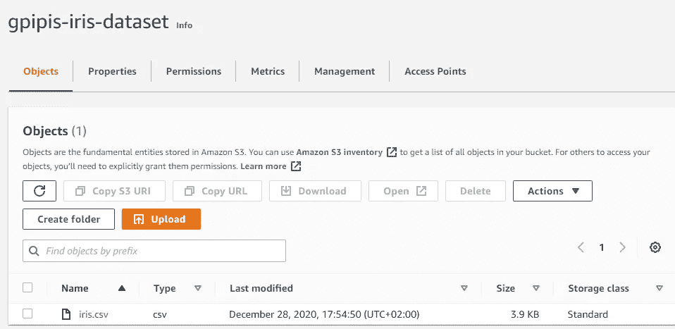

通过运行以下命令，我将能够以熊猫数据框的形式获取数据:

```
import awswrangler as wrdf = wr.s3.read_csv(path="s3://gpipis-iris-dataset/iris.csv")df
```

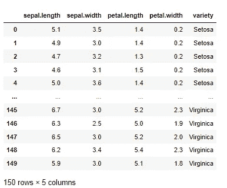

## 如何将数据写入 S3

我已经创建了一个空的 S3 桶调用`gpipis_wrangler-example`，我将在那里存储一些数据。

```
import awswrangler as wr
import pandas as pddf1 = pd.DataFrame({
    "id": [1, 2],
    "name": ["foo", "boo"]
})df2 = pd.DataFrame({
    "id": [3],
    "name": ["bar"]
})bucket = 'gpipis-wrangler-example'path1 = f"s3://{bucket}/file1.csv"
path2 = f"s3://{bucket}/file2.csv"wr.s3.to_csv(df1, path1, index=False)
wr.s3.to_csv(df2, path2, index=False)
```

如我们所见，file1.csv 和 file2.csv 都已写入 S3。

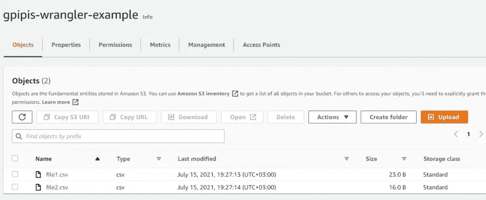

为了确保我们上传的数据是正确的，让我们从 S3 下载。

```
wr.s3.read_csv([path1])
```

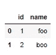

我们可以读取多个 CSV 文件，如下所示:

```
wr.s3.read_csv([path1, path2])
```

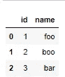

您可以通过前缀读取数据。

```
wr.s3.read_csv(f"s3://{bucket}/")
```

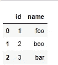

## 如何创建 AWS 胶水目录数据库

[**AWS Glue** 在您的数据目录中使用 AWS Glue crawlers，您可以遍历存储在亚马逊 S3 中的数据，并构建在您的数据目录中定义的元数据表。让我们创建一个名为“ **my_wrangler_db** 的新数据库](https://predictivehacks.com/aws-glue-tutorial/)

```
wr.catalog.create_database(
    name='my_wrangler_db',
    exist_ok=True
)
```

如果我转到 AWS Glue，在数据目录下和数据库中，我会看到“ **my_wrangler_db** ”。

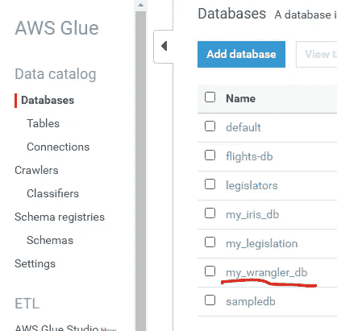

我可以使用 wrangler 以编程方式获取所有数据库，如下所示:

```
dbs = wr.catalog.get_databases()for db in dbs:
    print("Database name: " + db['Name'])
```

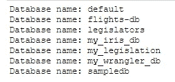

## 如何用 AWS 胶水目录注册数据

让我们看看如何注册数据。

```
wr.catalog.create_csv_table(

    database='my_wrangler_db', 
    path='s3://{}/'.format(bucket), 
    table="foo",    
    columns_types={
        'id': 'int',        
        'name': 'string' 
    },
    mode='overwrite',
    skip_header_line_count=1,
    sep=','
)
```

如果你去 AWS Glue，在" **my_wrangler_db** "数据库下有" **foo"** 表。

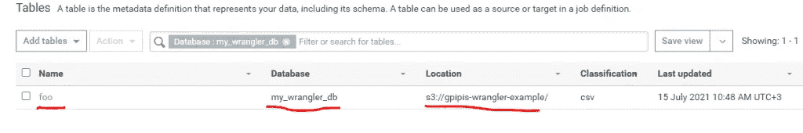

## 如何查看表格形状

我们可以得到“ **foo** ”表的元数据信息如下:

```
table = wr.catalog.table(database='my_wrangler_db',
                         table='foo')
table
```

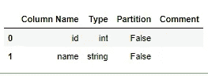

## 在 AWS Athena 中运行查询

我们将看到如何从数据库中查询 Athena 中的数据。请注意，如果没有 Athena 的存储桶，您需要创建一个，如下所示:

```
# S3 bucket name
wr.athena.create_athena_bucket()
```

现在，我们准备好查询我们的数据库。该查询将是“ *select * from foo* ”。

```
my_query_results = wr.athena.read_sql_query(
    sql="""select * from foo""",
    database='my_wrangler_db'
)print(my_query_results)
```

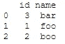

正如我们所看到的，查询返回了预期的结果。注意，我们的 bucket 包含两个 csv 文件，但是，catalog 能够合并这两个文件，而无需为第二个文件的列名添加额外的行。

# 外卖

AWS Wrangler 使我们能够与 AWS 生态系统高效互动。它非常用户友好，我们可以自动化许多 ETL 过程。

最初发布于[预测黑客](https://predictivehacks.com/how-to-interact-with-aws-using-aws-data-wrangler/)