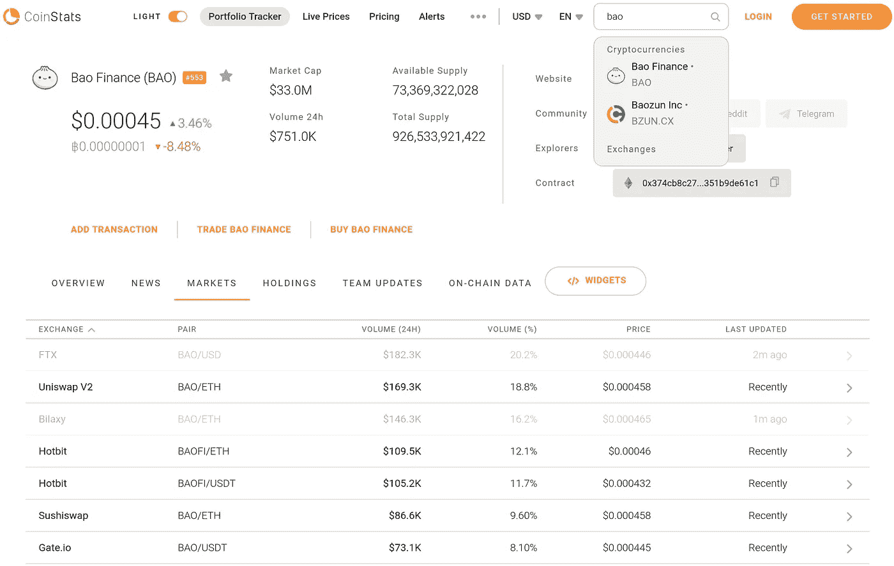

# 第 9 部分:用菲亚特购买密码

> 原文：<https://levelup.gitconnected.com/how-to-invest-in-cryptocurrencies-and-decentralized-finance-defi-buy-crypto-with-fiat-4bdb9c0eccc9>

## [如何投资加密货币和分散金融(DeFi)](https://medium.datadriveninvestor.com/how-to-invest-in-cryptocurrencies-and-decentralized-finance-defi-crypto-and-defi-for-dummies-b63609ce2c3a)

如果我附近没有比特币 ATM 机，如何用菲亚特或信用卡购买比特币

[Bermix 工作室](https://unsplash.com/@bermixstudio?utm_source=medium&utm_medium=referral)在 [Unsplash](https://unsplash.com?utm_source=medium&utm_medium=referral) 拍摄的照片

这是关于投资加密货币和 DeFi 的介绍性系列的第 9 部分。要导航回目录，请点击[此处](https://medium.datadriveninvestor.com/how-to-invest-in-cryptocurrencies-and-decentralized-finance-defi-crypto-and-defi-for-dummies-b63609ce2c3a)。

**免责声明:我在本文中包含了一些集中交易和投资组合跟踪的参考链接。这些链接包含我的推荐 ID，如果你用我的链接开了一个账户，我会收到一份注册奖金，通过一些交流，你也可以。**

在第 8 部分[中，我们讨论了如何设置您的冷钱包和热钱包。如果你已经按顺序阅读了该系列，现在你应该能够打开 Ledger Live 或任何热门钱包应用程序，并找到可以开始接收代币的地址。](https://medium.com/geekculture/how-to-invest-in-cryptocurrencies-and-decentralized-finance-defi-wallet-apps-and-hardware-fa9f2b2892fe)

现在是时候学习如何用美元或欧元等法定货币购买比特币和其他受欢迎的代币了。

## 集中交易所

由于我身边没有比特币 ATM 机，所以我使用集中交易所将比特币兑换成美元和其他法定货币，反之亦然。

你可以把集中交易所想象成私有的代币市场，在这里你可以开立账户，交易他们提供的市场对。有些银行接受固定存款，所以你可以把美元和欧元兑换成不同的代币。大多数集中式交易所提供不同交易和取款限额的账户等级。

类似于你可以使用许多热门钱包应用程序来管理你的代币，也有数百个集中的交易所，你可以使用菲亚特购买你的代币。

有些交易所只在某些国家运营，由相应的政府监管。其中大多数要求您在购买代币之前验证您的身份。

一些有许多交易对，而另一些只提供流行代币和法定货币之间的几对。在大多数接受美元存款的交易所中，比特币美元和以太坊美元交易对很常见。

有些允许你用信用卡购买代币，你甚至可以找到一些提供杠杆头寸的代币，这意味着你可以从他们那里借钱，用不同的代币进行[保证金交易](https://www.investopedia.com/terms/m/margin.asp)。

有些有简单的用户友好的应用程序，而另一些则很复杂，充满了高级功能，就像有些网上银行界面比其他的更容易使用和理解。

使用集中交易所向菲亚特购买代币的过程通常是这样的:

1.  开户
2.  通过提交您的照片/视频以及某种形式的身份证明来验证您的身份
3.  通过提交文件证明你住在那里来核实你的地址
4.  将你想投资的法定金额转入交易所的银行账户
5.  使用交易所的网络/移动应用程序来查找您需要购买您想要的代币的交易对
6.  下单购买您的代币

在大多数情况下，一旦您下了订单并且订单被满足，您的代币就被存储在属于交易所私钥的地址中，并且与您在交易所的账户相关联。

但是记住你在[第五部分](https://medium.com/geekculture/how-to-invest-in-cryptocurrencies-and-decentralized-finance-defi-crypto-wallet-vs-wallet-app-6f5ae40bbab3) : **中学到的不是你的钥匙，不是你的密码！**

如果你把代币放在属于交易所私钥的地址，如果交易所发生任何事情，导致他们不再允许从钱包中取款，你可能会丢失代币。

我曾听人说过，他们会更信任一个受监管的中央交易所来管理他们的投资，而不是让他们自己负责保管自己的私钥。

如上所述，有许多集中的交易所具有广泛的安全措施来保护其客户的资本。例如，一些交易所将用户的部分资金安全地存放在冷钱包中，并有保险政策来保证他们的安全。

虽然我同意一些交易所宣传的安全措施听起来相当安全，但我个人已经从他们的错误中失去了足够多的东西，我宁愿自己保留和控制我的存款。我看过太多保险索赔失败的案例，也读过太多无能的管理团队把盈利的公司搞砸的故事。

除此之外，我投资 crypto 和 DeFi 的主要原因之一是从中央集权的腐败实体(如银行和交易所)手中控制我的资金。

在任何情况下，在决定将大量令牌放在属于其私钥的地址中之前，您都应该自己研究一下要使用的交换的安全和保险策略。

正如我在第 8 部分中对热门钱包的调查一样，我无法在本文中涵盖所有可用的集中交易所，但我会回顾一下我使用过的、我发现容易上手的交易所。

**免责声明:在撰写本文时，我发现以下功能可用于以下交流。这不是交易所功能的官方最新说明。**

## Crypto.com

我最喜欢的集中交易所之一是 Crypto.com 的 T4。

优点:

*   用户友好的移动应用程序。
*   通过移动应用程序聊天界面提供响应支持。
*   你可以用信用卡购买代币。
*   他们提供不同层次的 Visa 借记卡，以其 ERC20 token (CRO)向您支付返现，以及其他优惠，用于合格的购买。
*   推荐计划，如果您和您的朋友通过您的邀请链接注册，他们将获得注册奖金。
*   如果您想每个月投资一定数量的代币，您可以设置定期自动购买。

缺点:

*   他们只提供移动应用程序，所以你不能从你的电脑上进行交易或管理你的资金。

2020 年底，我赌了足够多的 CRO 代币，获得了一张 Crypto.com 签证借记卡。

首先，很高兴收到他们给我的 50 美元，因为我当时使用了我朋友的邀请链接。

其次，尽管我的卡过了几个月才到，但我对他们的服务非常满意，并尽可能多地用卡购物。

自从我买下并押上 CRO 后，它的价值不仅增加了。我用返现作为我的旅行基金，并支付我每年旅行费用的很大一部分，只是因为我以前用不同的卡购买相同的东西。

如果您想使用我的邀请链接并获得注册奖金，请点击[此处](https://crypto.com/app/b3usk8ck3p)。

## CoinBase

[CoinBase](http://coinbase.com/join/arriet_2ar?src=ios-link) 是世界上最大、监管最好的交易所之一，也是第一家在证券交易所上市的中央加密交易所。

优点:

*   用户友好的移动和浏览器应用。
*   你可以用信用卡购买代币。
*   推荐计划，如果您和您的朋友通过您的邀请链接注册，他们将获得注册奖金。
*   高度监管，意味着强有力的安全措施来保护您的资本。

缺点:

*   交易和取款费不是最便宜的。
*   标准用户无法通过应用程序获得实时支持。

如果您想使用我的邀请链接并获得注册奖励，请点击此处的。

## 蔓延

[Ramp](https://ramp.network/buy/) 是我能找到的唯一一个允许我轻松购买 xDai 并将其直接电汇到我钱包的交易所。

优点:

*   有竞争力的价格和收费表。
*   你可以买 xDai，在 xDai 链上直接电汇到你的钱包里。
*   简单快速的验证过程。
*   通过他们的网络应用提供实时支持。

缺点:

*   不提供移动应用程序。
*   没有推荐计划。

这只是众多集中交易所中的三个。我提到它们是因为它们很容易上手，我经常使用 Crypto.com 和[斜坡](https://ramp.network/buy/)中的[。它们中没有一个在地球上的每个国家都可用，但这三个在一长串国家中都可用。你也不会在这些交易所找到所有可用的代币，但你肯定会找到最受欢迎的，如 BTC、瑞士联邦理工学院等。](https://crypto.com/app/b3usk8ck3p)

如果你想购买一个新的代币，并且还没有被添加到你拥有账户的任何一个集中交易所，你可能不得不等到他们添加它们或者在另一个交易所购买代币。

## 投资组合跟踪器

既然你已经开始建立你的代币投资组合，那么开始使用一些工具会是一个好主意，这些工具可以让你更容易地跟踪你的成长，跟踪你的交易和表现。

有许多应用程序具有不同的功能来跟踪你的投资组合。我用过一些，我最喜欢的是[硬币统计](https://coinstats.app.link/2JSzXwgn5gb)。您可以免费使用基本版，如果您的朋友使用您的推荐链接注册，您可以每次推荐获得 3 个月的专业功能。

如果您想了解更多信息，您也可以使用硬币统计来搜索代币和兑换。

硬币统计市场标签

如果您想知道可以在哪里购买某种代币的交易所，您可以在顶部的搜索栏中键入代币符号，从小框中的搜索结果中选择它，然后单击*市场*选项卡。

硬币统计将会显示一个你可以购买代币的交易所列表(见上图)。

但是不要忘了做一些关于交换的可靠性的研究，以及找出他们的交易和取款费的时间表，然后再开一个账户，把你的钱汇给他们。

Coin Stats 还允许专业用户在一些交易所将他们的个人资料与他们的账户联系起来，如这里的[所解释的](https://help.coinstats.app/en/articles/3807847-how-to-trade-on-your-exchanges-using-coinstats-app)。如果你使用这个功能，你将能够通过同一个应用程序在多个交易所进行交易。

如果你想看到 Coin Stats 跟踪的所有交易所，你也可以在这里导航到他们的交易所页面[，并按交易量、交易对数量或推出日期对列表进行排序。](https://coinstats.app/en/exchanges/)

你终于有了开始购买你最喜欢的代币所需的所有工具。

在第 12 部分中，我讨论了投资 crypto 和 DeFi 的风险，以及如何应对在动荡的市场中交易的心理困难。

现在，我只会提醒你一个事实，即加密市场是年轻的，非常不稳定。这意味着，无论你买什么或什么时候买，你的投资组合的价值都会上下波动。

也就是说，我强烈建议不要进行保证金交易和任何类型的杠杆交易，除非你有这方面的经验，并确切知道自己在做什么。此外，我建议你从未来 5 年内不需要的钱开始，这些钱你可以放心地一起失去。

随着你对投资的技术和价值越来越熟悉，你将有机地发展你的投资策略，建立技术和心理框架来增加你的仓位。

我非常感谢您花时间阅读我的文章，并邀请您分享您的想法，提出问题，或在下面的评论中向我提供任何反馈。

在[系列的第 10 部分](/how-to-invest-in-cryptocurrencies-and-decentralized-finance-defi-decentralized-exchanges-ac81b90c155e)中，我们将讨论分散式交换。要导航回目录，请点击[此处](https://medium.datadriveninvestor.com/how-to-invest-in-cryptocurrencies-and-decentralized-finance-defi-crypto-and-defi-for-dummies-b63609ce2c3a)。