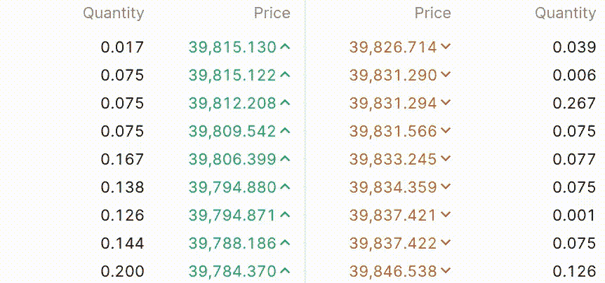
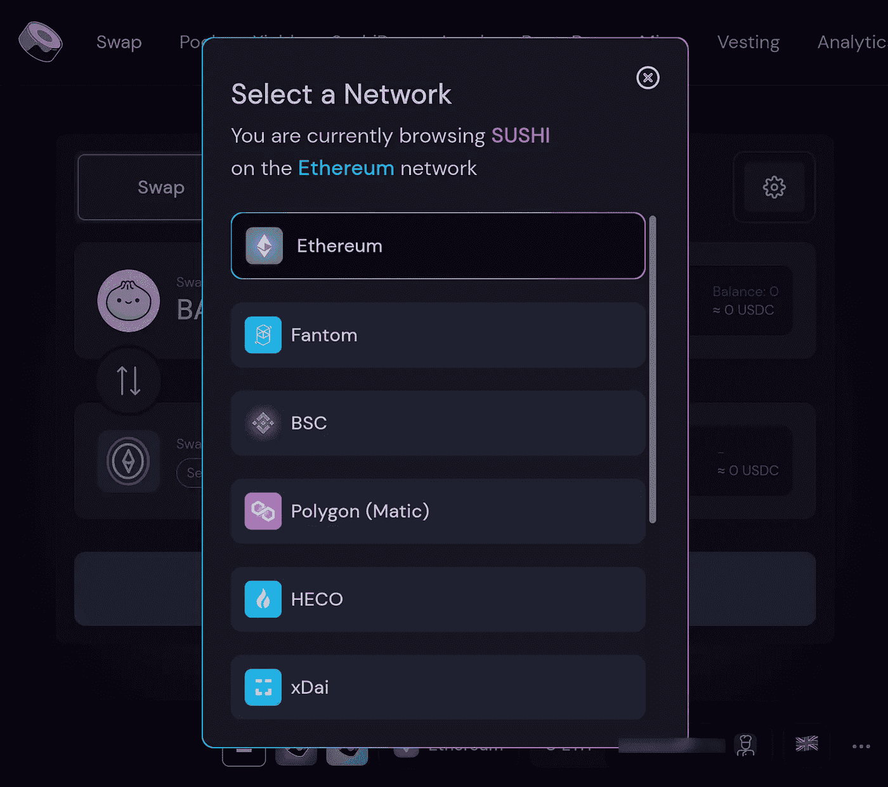

# 第 10 部分:分散式交易所

> 原文：<https://levelup.gitconnected.com/how-to-invest-in-cryptocurrencies-and-decentralized-finance-defi-decentralized-exchanges-ac81b90c155e>

## [如何投资加密货币和分散金融(DeFi)](https://medium.datadriveninvestor.com/how-to-invest-in-cryptocurrencies-and-decentralized-finance-defi-crypto-and-defi-for-dummies-b63609ce2c3a)

如何在不开户或验证身份的情况下购买比特币或任何其他加密货币

照片由[克里斯杨](https://unsplash.com/@chrisyangchrisfilm?utm_source=medium&utm_medium=referral)在 [Unsplash](https://unsplash.com?utm_source=medium&utm_medium=referral) 上拍摄

这是关于投资加密货币和 DeFi 的介绍性系列的第 10 部分。要导航回目录，请点击[此处](https://medium.datadriveninvestor.com/how-to-invest-in-cryptocurrencies-and-decentralized-finance-defi-crypto-and-defi-for-dummies-b63609ce2c3a)。

**免责声明:我在本文中包含了一些交易所的推荐链接。这些链接包含我的推荐 ID，如果您使用我的链接开户，我将收到注册奖金。**

在[第一部分](https://medium.com/geekculture/how-to-invest-in-cryptocurrencies-and-decentralized-finance-defi-an-introduction-part-1-bb287907c0e)中，我们讨论了什么是比特币，比特币是如何工作的，我们得出结论，它是分散的数字现金，因为你可以用 20 美元钞票做的一切，你也可以用比特币做，所有交易都存储在一个名为*区块链*的分散账本中。

在[第 2 部分](https://medium.com/geekculture/how-to-invest-in-cryptocurrencies-and-decentralized-finance-defi-ethereum-smart-contracts-a7519678869)中，我们讨论了什么是以太坊，什么是 DeFi，以及以太坊如何成为第一个 DeFi 环境，除了现金之外，其他去中心化的金融产品可以在这个环境上开发。

在[第 9 部分](/how-to-invest-in-cryptocurrencies-and-decentralized-finance-defi-buy-crypto-with-fiat-4bdb9c0eccc9)中，我们介绍了如何在接受法定存款的集中交易所将比特币兑换成美元，反之亦然。

现在我们将讨论等同于集中交换的 DeFi。

分散交易所是 DeFi 应用程序，提供比比特币简单的接收、存储和转移令牌更复杂的功能。它们之于集中交易所，就像比特币之于现金和提供支票账户的银行。

分散式交易所是使用各种智能合约的应用程序，允许在没有集中中介的情况下进行代币交易。

但是在我继续谈论分散式交易所之前，让我们快速回顾一下集中式交易所是如何工作的。

## 订单簿模型

诸如纽约证券交易所(NYSE)、纳斯达克或我们在[第 9 部分](/how-to-invest-in-cryptocurrencies-and-decentralized-finance-defi-buy-crypto-with-fiat-4bdb9c0eccc9)中提到的加密交易所之类的集中交易所使用[订单簿模型](https://en.wikipedia.org/wiki/Order_book)。

订单簿模型通过以订单的形式登记买卖双方的利益，将买卖双方聚集在一起。集中交易提供了一个平台，买家和卖家可以在这个平台上下单，并在交易发生时收取佣金。

比特币美元订单簿

上图是集中交易所的比特币美元订单簿顶部。

买家的订单，即订单簿的**出价**面，在表格的左侧以绿色价格显示，卖家的订单，即订单簿的**要价**面，在表格的右侧以红色价格显示。

正如你所料，买家想低买，卖家想高卖。当买家和卖家在价格上达成一致时，订单就会被执行，从而完成一次成功的交易。我所说的价格趋同是指要么买方出价高于买卖价差，要么卖方要价低于此价差。

在交易所，比特币对美元的价格由买方和卖方最后一次商定价格并完成交易的时间决定。

从上图中比特币美元订单的实时动画快照中可以看出，订单的数量和价格经常变化。这些变化中的每一个都代表了对集中交易所的数据库中的订单簿数据的修改。

在中央系统中跟踪订单簿的变化并不昂贵，因为在标准数据库中交易是免费的。然而，在权力下放的区块链，情况并非如此。正如您在第 [1](https://medium.com/geekculture/how-to-invest-in-cryptocurrencies-and-decentralized-finance-defi-an-introduction-part-1-bb287907c0e) 和 [3](https://medium.com/geekculture/how-to-invest-in-cryptocurrencies-and-decentralized-finance-defi-consensus-mechanisms-e261c5fb1200) 部分所了解到的，在区块链的交易要求请求交易的一方支付交易费，以确认其进入区块链的区块。

因此，如果我们想要分散订单簿模型，我们将不得不请求许多交易来跟踪订单簿的状态，而没有任何保证买方和卖方将同意满足订单和完成交易的价格。正如你可能已经预料到的，这将花费一大笔钱，因为我们将不得不支付大量的交易费用，即使没有交易发生。

为了让集中交易所提供的功能以分散的方式提供，必须发明一种新的做市商形式。

## 流动性池

分散交易所中的交易对不是提供一个跟踪买卖双方订单的平台，而是以流动性池的形式存在。

流动性池是两个令牌的集合，其中第一个令牌的金额与第二个令牌的金额具有相同的市场价值。

BTC -联邦储蓄银行流动性池只是 BTC 和联邦储蓄银行代币的集合。池中每种股票的数量由它们的市场价格决定。

因此，为了简单起见，我们假设 1 BTC = 10 ETH 的当前市场价格。这将意味着，BTC -联邦储蓄银行流动性池包含的联邦储蓄银行代币将是 BTC 代币的 10 倍。然后，如果价格变为 1 BTC = 5 ETH，流动性池将自动出售 ETH，直到池中 ETH 的数量是 BTC 数量的 5 倍。

分散式交易所只是流动性池的集合，交易者可以将池中的一种代币换成另一种代币。

对于小额交易，交易者获得的汇率从池中令牌的比率开始，并根据设定的函数增加，以便池能够满足任何规模的交易，即使池中的令牌供应有限。

让我们回到 BTC - ETH 池的例子，其中池包含 100 万个 ETH 和 1 千个 BTC，因为 1 个 BTC 的当前市场价格= 1000 个 ETH。在这种情况下，如果你想用 BTC 购买 3 ETH，你必须支付接近 0.003 BTC，因为与资金池中的代币数量(300 万到 100 万)相比，交易规模很小。相反，如果你想购买 300，000 ETH，你将支付比 300 BTC 多得多的钱，因为与池中的代币数量相比，交易规模很大(30%)。

由于资金池只有 1000 万 BTC 和 100 万 ETH 可供出售，因此资金池满足大额订单且不会因其他交易而耗尽流动性的唯一方法是随着交易规模的增加而提高 ETH 的价格。因此，随着你想购买的 ETH 或 BTC 数量的增加，汇率也会上升。

什么是流动性池

## 分散交易所

第一个去中心化的交易所是 UniSwap。它作为 ETH 和 ERC20 代币的分散交易平台推出，使用流动性池作为市场对。

UniSwap 最初提供与 Metamask 等钱包应用程序的简单连接，使 ERC20 令牌之间的交换变得简单而匿名，就像用一个按钮连接你的钱包应用程序，然后点击几次。

他们通过激励向他们提供流动性的用户，为他们的资金池吸引了大量资本。我将在一篇关于流动性开采和农业的文章中详细阐述这种激励机制。

UniSwap 是一个开源项目，这意味着它的[代码库](https://github.com/Uniswap)是公开的，就像[比特币的](https://github.com/bitcoin/bitcoin)和[以太坊的](https://github.com/ethereum/go-ethereum)一样。

在第 2 部分的[中，我们讨论了 DeFi 项目如何拥有一个 ERC20 令牌来代表它们。UniSwap 的令牌由首字母缩写词 UNI 标识。](https://medium.com/geekculture/how-to-invest-in-cryptocurrencies-and-decentralized-finance-defi-ethereum-smart-contracts-a7519678869)

在 UniSwap 突然大获成功后，他们的令牌价格暴涨，其他项目开始复制他们的代码并在其上添加功能。

什么是 UniSwap

其中一个项目是 [Sushi](https://sushi.com/) ，其 ERC20 令牌由符号 Sushi 标识。

寿司是什么

UniSwap 和 Sushi 的出现推动了一系列项目，这些项目致力于为不同的连锁店提供分散的交换，并具有广泛的附加功能。

以太坊侧链交易费用较低，拥有一系列分散的交易所，在那里你可以交易包装好的 ERC20 代币，交易费用只是以太坊主网上 UniSwap 或寿司交易费用的一小部分。

Sushi 的 exchange 允许用户在多个以太坊侧链中交易代币。

SushiSwap 应用程序栏

当你访问 [Sushi 的网络应用](https://app.sushi.com/swap)时，你可以点击网络按钮(在上图中用橙色方块突出显示)并选择你想要交换代币的侧链网络。

SushiSwap 链网络选择

[宝金融](https://www.bao.finance/)也在其他侧链上发布了类似 UniSwap 的交易所特许经营权。你可以使用 [BaoSwap](https://www.baoswap.xyz/#/swap) 在 xDai 链上进行廉价交易，或者使用 [PandaSwap](https://www.pandaswap.xyz/#/swap) 在币安智能链上进行廉价交易。

ParaSwap 在其交换功能中提出了一个有趣的价值主张。正如他们在这里描述的，

> ParaSwap 提供了一种简单、快速和安全的方式来交换以太坊本地令牌，通过**将来自许多分散服务的流动性集中在一个独特的界面**。
> 
> 因此，当你在 ParaSwap 上查看一个给定的 ETH/ERC20 令牌的价格时，ParaSwap 会搜索它支持的所有提供这一对令牌的交易所，以找到最佳价格。

在撰写本文时，您可以使用 Paraswap 在以太坊主网、币安智能链(BSC)和 Polygon 中交易代币。

如果你想在 ParaSwap 支持的任何侧链中找到提供特定互换的分散交易所，你可以访问 [ParaSwap](https://paraswap.io) ，选择你选择的链网络，键入你想要进行的互换，ParaSwap 将向你显示提供它的分散交易所。

## 包装的代币

包装令牌是智能合约，用作原始版本令牌的优惠券。尽管比特币是一种属于自己区块链的代币，但你可以购买包装好的比特币(WBTC)，这是一种 ERC20 优惠券，可以用来兑换好的 ol' BTC。

同样的原理被用于在另一个区块链交易代币。例如，您可以通过 xDai 链上的 BaoSwap 交易 ERC20 令牌的桥接版本。将一个代币从一个链桥接到另一个链也类似于获得一张优惠券，您可以用它在以后赎回(桥接回)原始代币。

你可以跟随[这些](https://www.xdaichain.com/for-users/bridges)文档来了解如何在以太坊 mainnet、xDai 和 BSC 之间桥接令牌。

要桥接以太坊主网和多边形侧链之间的令牌，您可以使用 [POS bridge](https://wallet.matic.network/bridge/) 。

## 混合交易所

有些交易所只允许加密对加密交易，并要求用户遵守不同级别的反洗钱(AML)和了解您的客户(KYC)法规。

为了在这些交易所进行交易，你必须用你的电子邮件地址开一个账户，根据你想进行的交易的类型和规模，他们可能会要求额外的验证文件。

这些交易所更像是各种各样的第三方托管服务，它们提供有竞争力的利率，运营方式类似于分散式交易所，在某种意义上说，你不会将你的资本长时间存放在它们的私人密钥中。

、和[changely](https://changelly.com?from=btc&to=eth&amount=0.1&ref_id=1xwzztvfgsnl6xy9)是这类交易中最受欢迎的一些。

在[第 9 部分](/how-to-invest-in-cryptocurrencies-and-decentralized-finance-defi-buy-crypto-with-fiat-4bdb9c0eccc9)中，您学习了如何使用集中交易所购买菲亚特代币，现在您也知道了如何使用分散交易所购买新的 DeFi 代币或匿名转移您的资金，而无需与集中中介打交道。

我非常感谢您花时间阅读我的文章，并邀请您分享您的想法，提出问题，或在下面的评论中向我提供任何反馈。

在本系列的第 11 部分中，我们将讨论自由市场动态和投机。要导航回目录，请点击此处的。