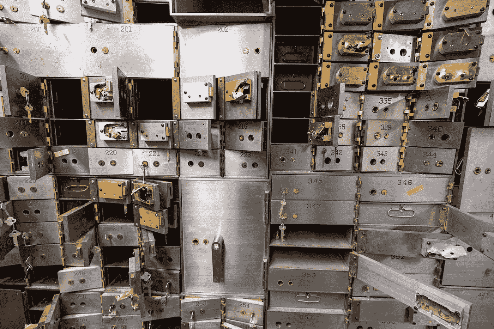

# 第十一部分:自由市场和投机

> 原文：<https://levelup.gitconnected.com/how-to-invest-in-cryptocurrencies-and-decentralized-finance-defi-free-markets-and-speculation-1c31948e4f6e>

## [如何投资加密货币和分散金融(DeFi)](https://medium.datadriveninvestor.com/how-to-invest-in-cryptocurrencies-and-decentralized-finance-defi-crypto-and-defi-for-dummies-b63609ce2c3a)

## 什么是自由市场，为什么总会有市场崩盘？

照片由[杰森·波法尔](https://unsplash.com/@jasonpofahlphotography?utm_source=medium&utm_medium=referral)在 [Unsplash](https://unsplash.com?utm_source=medium&utm_medium=referral) 上拍摄

这是关于投资加密货币和 DeFi 的介绍性系列的第 11 部分。要导航回目录，请点击[此处](https://medium.datadriveninvestor.com/how-to-invest-in-cryptocurrencies-and-decentralized-finance-defi-crypto-and-defi-for-dummies-b63609ce2c3a)。

如果你按顺序阅读了该系列，并一直遵循这些步骤，希望你的冷钱包和热钱包已经准备好接收代币，并且你已经在受监管的集中交易所开设了账户，在那里你可以用你的菲亚特购买一些受欢迎的产品，如比特币和以太坊。

现在，您已经了解了购买第一批代币所需的所有知识。

但是购买代币和从交易代币中获利是两码事。就像你必须尽可能多的阅读来学习如何购买代币一样，你可能也应该花一些时间来了解当你的第一笔订单被满足时你将进入的市场。

投机市场是一个残酷无情的丛林，如果你毫无准备地跳入，你会受伤。你不会不带防晒霜、驱虫剂和一把刀就走进亚马逊森林，对吧？

好吧，让我们退后一步，理解自由投机市场如何运作的基础，以及是什么驱动了它们疯狂的动态。

## 自由市场经济

在[自由市场](https://www.investopedia.com/terms/f/freemarket.asp)，就像加密市场一样，只有当双方同意以新的价格完成交易时，资产的价格才会改变。

也就是说，当价格下跌时，总会有一个买方对资产出价较低，而一个悲观的交易方愿意接受这一出价并以更低的价格卖出。相反，当价格上涨时，总会有卖者要求更多，而乐观的交易者愿意以更高的价格购买。

熊市是因为卖家愿意接受更低的出价，牛市是因为买家愿意支付更高的要价。

但是，再一次，资产价格的变动必须有一个买方为资产的转移向卖方支付一个商定的价格。

买方同意多付而卖方同意少收的原因推动了市场的价格波动，这些原因因市场而异。

大多数市场都受到某种程度的[投机](https://en.wikipedia.org/wiki/Speculation)的影响，这意味着买家和卖家对资产的实际目的或价值兴趣不大，只是为了从价格波动中获利而交易。

## 动荡的投机市场

加密市场是一个高度投机的市场，因此也是一个极其不稳定的市场。

绝大多数购买加密资产的人不知道他们在购买什么，也不知道他们期望所述资产价格上涨的原因是什么。在许多情况下，他们购买代币是因为他们听到或读到了最近的价格上涨，他们会自动假设，因为它之前上涨过，它将无限期地继续上涨。

这助长了自我实现的投机泡沫，因为许多资产的价格脱离了它们的内在价值，导致市场上非常剧烈的价格波动。

当越来越多的买家寻求一种供应有限的资产时，该资产的价格就会上涨。

现在，如果买家寻求该资产的唯一原因是其不断上涨的价格，那么该资产是什么、做什么或背后是谁都无关紧要，因为只要围绕它的情绪保持积极，人们就会继续购买它。从来没有。

然后，当恐慌不可避免地袭来，因为一些有影响力的人写了一条推文，或者一些国家就与资产相关的限制性政策进行了辩论，就会引发抛售连锁反应，导致市场剧烈崩盘。

发生这种情况是因为数百万人购买这种资产的唯一原因是它的价格在上涨。自然地，当他们持有资产的理由不再成立时，他们会被自己投资的价值淹没，其价值只相当于几天前的一小部分。

我可以告诉你，当一项投资下跌时，要坚持下去并不容易。即使你有一千个很好的理由持有它，因为它是一个每个人都在购买、使用和喜爱的伟大产品。在熊市中，当你被关于以后会发生什么的悲观消息轰炸时，尤其如此。

当你持有一项资产的唯一原因是它的价格在炒作期间上涨时，这就困难多了。因此，大多数对该资产知之甚少的此类买家开始像无头鸡一样四处奔跑，不考虑价格或不知道保持该资产的内在价值是否有意义，就不足为奇了。

你大概能猜到接下来总会发生什么。数百万恐慌的投机者急于卖出，从他们现在认为会消失的投资中抢救出他们能抢救的东西，因为他们不再有理由相信它不会消失。当他们跑向出口，卖出他们贬值的头寸时，无论出价多低，价格继续下跌，触发更多自动止损单，加速下跌进入自由落体。

但是，虽然市场崩溃的触发因素有时可能是产品设计中的根本缺陷，这可能会真正影响产品的采用和整体成功，但在高度投机的市场中往往不是这样。如上所述，许多崩溃都是由于一些有影响力的人在推特上发布他们的个人观点或关于政策会谈的新闻稿，而这些政策会谈远非结论性或永久性的。

投机市场中的熊市和牛市周期往往更多地与无知大众的集体情绪起伏有关，他们天真地参与了投机游戏，而不是与对正在买卖的产品和服务的真正担忧有关。

## 自由市场游戏的赢家

请记住，投资自由市场是一个[零和游戏](https://en.wikipedia.org/wiki/Zero-sum_game)。正如我在上面谈到自由市场时所说的，对于价格的涨跌，买卖双方必须达成一致。这意味着，那些没有经验、不知情的投机者损失的所有资本最终都落入了别人的口袋。

为了弄清楚是谁保留了所有的现金，以及如何加入他们的行列，让我们来分析一下那些失去现金的人做错了什么。

昂贵的东西通常花费很多是有原因的，它们的昂贵不是原因。虽然高价确实会让购买者觉得某个产品优于价格较低的竞争产品，但没有多少人会仅仅因为它比其他同类产品贵而购买它。

你不会仅仅因为价格昂贵就买昂贵的东西。通常，你会考虑品牌的声誉、其他消费者的反馈、同一家公司提供的其他产品的质量等等。

尽管这些考虑听起来更适用于你作为消费者购买的产品和服务，而不是投资于投机性的自由市场，但你应该记住，所有投资的长期价值都不可避免地与消费者购买和使用的产品和服务密切相关。令牌也不例外。

你越了解 DeFi 项目及其代币如何为消费者提供价值，你就能在投资时更好地保护自己，盈利的机会也就越高。

我也想在一无所知的情况下买东西，然后一夜暴富，但这种情况发生的几率就像是从天而降的金色水滴，而不是水。

许多人认为沃伦·巴菲特是有史以来最伟大的投资者。他出生于 1930 年，大半辈子都是世界上最富有的 10 个人之一。他的职业是购买企业，并在它们变得更有价值时持有它们。

巴菲特经常重复说，他的投资哲学的一个基本支柱是“永远不要投资你不了解的业务。”

你可能会觉得讽刺的是，我引用沃伦·巴菲特的话，因为他以说他不投资技术而闻名，并多次反对投资比特币和加密货币。

我还应该在这里说明，他还说过，他放弃技术投资的原因是因为他对这些投资不够了解，并重新评估了他在这个问题上的立场，让苹果和亚马逊股票成为他庞大投资组合的重要组成部分。

我有一种感觉，如果他花更多的时间去了解分散的区块链技术，他可能会看好几个 DeFi 项目。我想时间会证明一切。

无论如何，虽然巴菲特仍然极度看空加密市场，但在撰写本文时，他的每一条投资原则和与购买公司股票相关的建议仍然有效，完全适用于投资 DeFi projects 的令牌。

沃伦·巴菲特的投资致富秘诀

## [基本面](https://www.investopedia.com/terms/f/fundamentalanalysis.asp) vs [技术分析](https://www.investopedia.com/terms/t/technicalanalysis.asp)

在自由市场中，在最低点买入，在最高点卖出，这几乎是不可能的。正如 Buffet 在上面的视频中所说，试图把握市场时机是一个错误！

据我所知，没有人能持续不断地实现它，并因此而变得富有。

另一方面，我确实认识像他这样的成功投资者，他们不指望抓住每一次波动，但仍能获得疯狂的利润，因为他们知道自己投资的基本面价值，并有能力承受投资组合市值下跌的时期。

市场波动混乱。当我攻读航空航天工程博士学位时，我花了数千美元购买不同市场的各种价格数据，并花了数年时间编写程序来分析价格和交易量模式，试图根据过去的波动预测未来的价格。

虽然有些模型在某些年份表现很好，但在其他时期它们都损失惨重。最后，事实证明，如果我购买了具有高内在价值的股票，并在市场下跌时持有我的头寸，我会节省大量的交易费用，以及无价的安心，并且表现得更好。

你在网上找到的很多建议都是关于利用技术分析来预测未来价格，轻松地让你的投资增值。但是，如果这真的有效，为什么你在福布斯排行榜上看不到这些技术分析师呢？如果这种投资方式真的像一些人声称的那样创造了奇迹，为什么他们要出售昂贵的球场，而不是用他们的秘密来投资和增加自己的资金？

思考的食粮…

你不仅准备好安全地购买你的第一批代币，而且你现在也明白购买代币意味着进入一个复杂的市场，如果你不小心的话，这个市场可能会伤害你。

当你继续学习并为投资旅程中的好时光和坏时光做计划时，你就增加了长期成功的机会。

感谢您花时间阅读我的文章，并邀请您分享您的想法，提出问题，或在下面的评论中向我提供任何反馈。

在本系列的第 12 部分中，我们将谈到在动荡的市场中投资的心理副作用，以及可以帮助你获得更成功旅程的策略。要返回目录，请点击此处的。