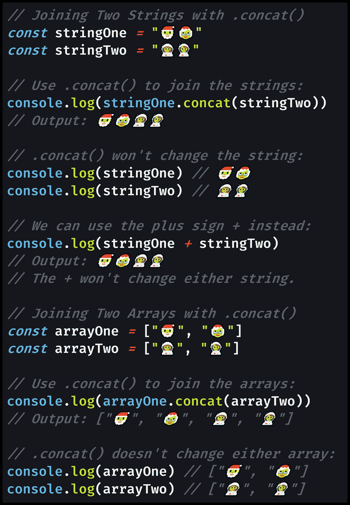
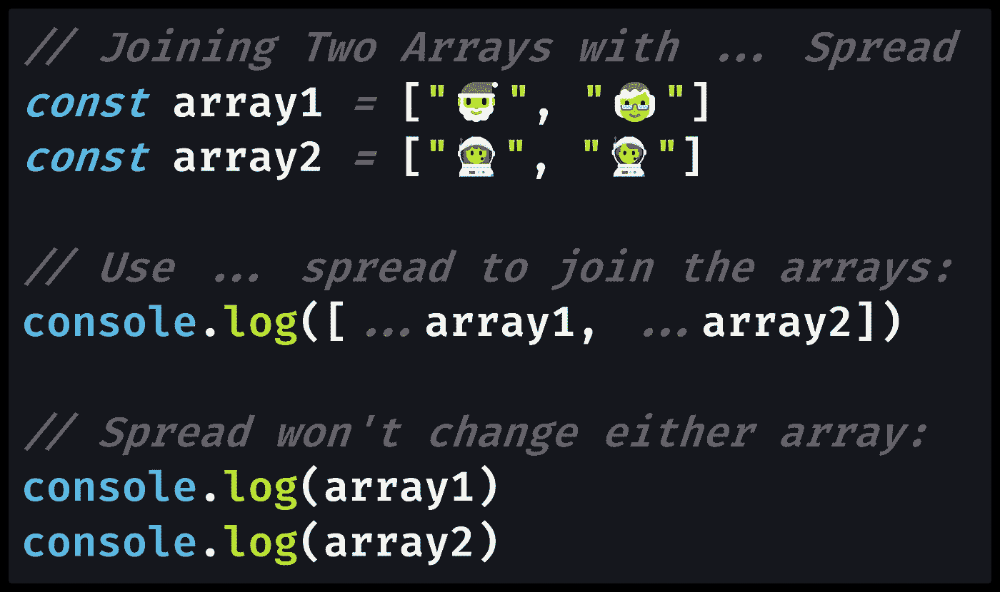

# 如何在 JavaScript 中将两个数组连接在一起

> 原文：<https://levelup.gitconnected.com/how-to-join-two-arrays-together-in-javascript-fb0707d20d12>

## 需要把两个数组合并成一个数组？以下是在 JavaScript 中将数组连接在一起的方法，正式名称是“数组串联”

[兰斯·格兰达尔](https://unsplash.com/@lg17?utm_source=medium&utm_medium=referral)在 [Unsplash](https://unsplash.com?utm_source=medium&utm_medium=referral) 上的照片

# 在 JavaScript 中将数组连接在一起

当您使用两个或更多的 JavaScript 数组时，您会经常遇到这样的问题，您希望只使用一个数组。

例如，我们可能有一个注册了免费服务的用户列表，也有一个单独的注册了付费服务的用户列表。

如果我们想在所有这些用户中找到唯一的电子邮件地址，我们需要在[找到唯一的属性值](/how-to-find-unique-values-by-property-in-an-array-of-objects-in-javascript-50ca23db8ccc)之前组合数组。

为了继续这个比喻，我们希望创建一个单独的`users`数组，它将`freeUsers`和`paidUsers`数组组合在一起。然后，我们可以在所有这些`user`对象中搜索`email`属性的唯一值。

为了连接两个数组`freeUsers`和`paidUsers`，我们可以使用`.concat()`或`...`扩展操作符。这两种方法将获得相同的结果，但是两者之间的语法有很大的不同。

# 方法 1 — `Array.prototype.concat()`

JavaScript 数组有一个内置的`.concat()`方法(`[Array.prototype.concat()](https://developer.mozilla.org/en-US/docs/Web/JavaScript/Reference/Global_Objects/Array/concat)`),该方法*将一个数组*连接到另一个数组。

串联是一个 10 美元的词，意思是连接在一起或首尾相连。

您可能听说过字符串连接，这意味着将两个或多个字符串连接在一起。对于字符串，我们可以使用`.concat()`方法(`[String.prototype.concat()](https://developer.mozilla.org/en-US/docs/Web/JavaScript/Reference/Global_Objects/String/concat)`)或者加号(`+`、[加法运算符](https://developer.mozilla.org/en-US/docs/Web/JavaScript/Reference/Global_Objects/String/concat))。

数组串联的工作方式基本上与字符串相同，只是不能使用加号(`+`)进行数组串联。

不像数组“ [mutator 方法](https://developer.mozilla.org/en-US/docs/Web/JavaScript/Reference/Global_Objects/Array/prototype#Mutator_methods)”如`[Array.prototype.push()](https://developer.mozilla.org/en-US/docs/Web/JavaScript/Reference/Global_Objects/Array/push)`、`[Array.prototype.reverse()](https://developer.mozilla.org/en-US/docs/Web/JavaScript/Reference/Global_Objects/Array/reverse)`或`[Array.prototype.sort()](https://developer.mozilla.org/en-US/docs/Web/JavaScript/Reference/Global_Objects/Array/sort)`，两个`.concat()`方法都不改变原始数组或字符串。

让我们来看一些连接两个数组的 JavaScript 代码:

[查看原始代码](https://gist.github.com/DoctorDerek/79ef16fd54cd4b5b542503debff66cdc)作为 GitHub 要点

你调用的`.concat()`的字符串或数组将首先出现，你作为参数传递给`.concat()`的字符串或数组将紧随其后。

当`.concat()`方法返回更新的数组时，它不直接改变数组。我将介绍的连接数组的下一种方法是`...` spread 语法，它也不会改变(或“变异”)任何一个数组。

# 方法 2—`...`扩展运算符

虽然我们不能使用加号(`+`)将数组连接在一起，但是仍然有一个方便的语法，这要感谢[ES6 扩展操作符](https://medium.com/coding-at-dawn/how-to-use-the-spread-operator-in-javascript-b9e4a8b06fab) ( `...`)。

我们可以使用带有方括号`[]` : `[...array]`的`...`扩展操作符来创建一个名为`array`的数组的[浅层副本](/how-to-copy-an-array-in-javascript-with-array-from-298c7e66eebc)(而不是[深层副本](https://medium.com/javascript-in-plain-english/how-to-deep-copy-objects-and-arrays-in-javascript-7c911359b089))。

要用 spread 组合两个数组，我们写:`[...arrayOne, ...arrayTwo]`。同样，spread 操作符不会改变任何一个数组，就像`.concat()`一样。

让我们看一个用`...` spread 连接数组的例子:

[查看原始代码](https://gist.github.com/DoctorDerek/a9b8d36bb623d6b7712521eeb85a16e6)作为 GitHub 要点

用`...` spread 语法放在第一位的数组将排在第一位，在放在第二位的数组之前。

当您的目标是将两个数组连接成一个新的数组时，请确保包含两个数组的**展开语法中的三个点(`...`)。否则，您可能会意外地将一个或两个数组嵌套在新数组中。**

# Spread 如何连接两个数组

更详细地讨论一下`...`展开语法是值得的。当我们使用方括号调用一个新数组时，比如`[1,2,3]`，我们用这些参数调用数组构造函数(`[Array()](https://developer.mozilla.org/en-US/docs/Web/JavaScript/Reference/Global_Objects/Array/Array)`):`Array(1,2,3)`。

更具体地说，我们实际上使用了`[Array.of()](https://developer.mozilla.org/en-US/docs/Web/JavaScript/Reference/Global_Objects/Array/of)`——因为`Array()`构造函数在传递一个整数(`Array(2)`)时会创建一个包含该数量元素的空数组(`[empty,empty]`)，而`Array.of(2)`会创建一个只有一个元素的数组(`[2]`)，这与编写`[2]`相同。

由于`...` spread 操作符将整个数组作为参数展开，我们可以开始看看`Array.of(...array)`实际上是如何工作的:它是将每个数组元素作为单独的参数手工输入的简写。使用方括号`[...array]`只是一种更简洁的写法。

希望您可以开始看到如何使用 spread 操作符来组合任意数量的数组:`[...array1, ...array2, ...array3]`。

# 结论:`.concat()`和`...`可以连接两个数组

将两个数组连接在一起称为数组串联，您可以使用与字符串串联相同的`.concat()`方法。

用于数组和字符串的`.concat()`方法将返回将两个数组或字符串连接在一起的结果。请记住。`concat()`用于数组和字符串的方法不是“赋值方法”:它不改变(或“赋值”)原始数组或字符串。

虽然我们可以使用`+`加号来连接两个字符串，但这对两个数组来说是无效的。相反，我们的速记语法是使用带方括号的`...` spread 操作符`[]`。和`.concat()`一样，`...`不会变异任何一个数组。

关于使用`.concat()`和`...` spread 操作符向 React 中的数组添加一个项目的真实例子，请参考我的文章:

 [## 如何使用钩子在反应状态下添加到数组中

### 的。push()函数将不起作用，但是。当状态是一个数组时，concat()函数可以更新 React 状态——就像…

medium.com](https://medium.com/javascript-in-plain-english/how-to-add-to-an-array-in-react-state-3d08ddb2e1dc) 

综上所述，您现在知道如何在 JavaScript 中通过用`.concat()`或`...` spread 语法连接数组来连接两个数组。

**编码快乐！🎅🤶💯👩‍🚀👨‍🚀**

[Derek Austin](https://www.linkedin.com/in/derek-austin/)博士是《职业规划 [*:如何在 6 个月内成为 6 位数成功程序员*](https://www.amazon.com/dp/B0BRJDLJ43) 的作者，现在亚马逊上有售。