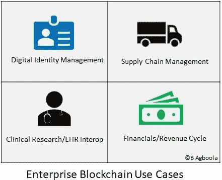

# 如何快速启动企业区块链应用

> 原文：<https://levelup.gitconnected.com/how-to-jumpstart-your-enterprise-blockchain-adoption-744f53d4fd68>

自从十多年前引入区块链技术以来，人们对该技术在企业中的前景既有悲观情绪，也有适度的热情。一些商界领袖继续对区块链不屑一顾，认为它是一种短暂的时尚，而越来越多的人主张企业采用它。该系统是一种分散的交易分类账，交易记录在点对点网络上，并以加密方式进行保护。

根据德勤(Deloitte)的 2020 年全球区块链调查，许多商业领袖将区块链列为五大战略重点，并越来越多地向其投入资源。越来越多的全球企业(55%，高于 2019 年的 53%和 2018 年的 43%)现在将区块链视为企业的优先事项。尽管对该技术的承诺有所上升，但 54%的领导者还认为该技术被夸大了。这并不罕见，也许标志着许多领导人对这项技术的谨慎乐观。

企业区块链试点项目和生产实施继续在全球涌现，最常见的使用案例分为以下几类:

**数字身份管理**:区块链可以用来解决围绕身份管理的几个挑战，包括将身份数据的更多控制权或所有权从身份提供商转移到身份的个人所有者(即 [***【自我主权身份】***](https://medium.com/swlh/solving-digital-identity-management-with-blockchain-d365a16917ac) ***)。*** 还有一些正在进行的项目使用区块链来解决医疗保健行业的提供商数据管理问题。

**供应链管理:**区块链可用于货物的实时/多方跟踪，具有不可变的审计线索。这已经在物流和零售(例如，用于产品召回)以及制药(例如，用于药品可追溯性)中得到应用。

**金融:**金融行业是探索区块链企业应用的领导者，积极的试点用例包括银行业的外汇结算。医疗保健行业也一直在探索使用区块链来促进收入周期管理。

**临床研究/EHR 互操作性:**生命科学和医疗保健也有有趣的区块链使用案例，包括管理临床试验中的患者同意书，以及解决长期存在的电子健康记录互操作性问题。

尽管企业区块链计划越来越多，但在企业寻求采用区块链技术的道路上仍然存在许多障碍。这些包括对技术本质的根本混淆。许多企业还努力为该技术确定可行的业务用例，并确定区块链在哪些方面比现有技术提供更好的价值。缺乏必要的技能也使得技术的探索变得困难。此外，就区块链而言，广泛采用任何技术所需的监管和技术标准仍在不断发展。

**一条成熟的前进道路**

解决上述区块链采用挑战的一个行之有效的方法是使用区块链联盟来加速企业采用。这在某种程度上反映了其他行业联盟在新兴技术发展中的成功(例如，万维网联盟— W3C)。联合体成员资格允许企业利用联合体的集体技术技能，并有助于分配与技术开发相关的成本和风险。它还促进了标准、关键基础设施和用例的开发，以及技术目的的伙伴关系。它还可以提供获取市场情报的途径。区块链联盟是私有/许可的，需要会员才能参与。这有助于缓解与参与公共区块链相关的隐私和安全问题。他们的重点是界定区块链财团的活动。

**以商业为中心的**区块链财团由具有相似、互补甚至竞争商业利益的商业实体组成。这种类型的联盟专注于开发区块链用例以及采用该技术的标准，并创建合作伙伴生态系统。例如，一些医疗保健行业的领导者成立了突触健康联盟，以“探索如何利用区块链技术来应对准确高效的提供商数据管理和共享的挑战。”另一个例子是 IBM Food Trust，它通过一个许可的、永久的和共享的食品系统数据记录将“食品供应的参与者”联系起来。

**专注于技术的**区块链财团专注于开发区块链的核心技术和相关标准。这方面最著名的例子是 Hyperledger，这是一个全球合作项目，“专注于为企业级区块链部署开发一套稳定的框架、工具和库。”

另一方面，区块链财团致力于为区块链开发核心技术以及商业应用和用例。R3 就是一个例子，它是由几家全球领先的银行在 2016 年创立的。R3 现在由 300 家参与的全球企业组成，已经发展成为一家企业软件公司。

今天，有几十个全球财团，许多领先的全球公司都参与其中。任何希望探索区块链的组织都应该考虑加入一个财团是否有利于其努力，而不是一开始就试图单干。他们可以首先确定所在行业的区块链财团，并根据下述四个成功标准对其进行评估，以确定加入一个团体是否可以加快他们对区块链技术的学习和采用。一个组织也可以考虑与其他企业组成一个新的联合体。

财团的成功和有效性取决于几个关键因素:

**治理:**拥有定义明确、结构良好的治理模型是任何财团成功的关键。这有助于定义成员的角色和参与，其中许多成员可能是竞争对手。

**成员资格:**组成联盟的实体定义了它能完成什么，以及行业和监管机构对它的重视程度。在一个财团中拥有关键的行业中坚力量，可以让它一开始就具有很高的可信度和合法性。

**领导力:**联盟的领导层可以帮助设定和推动其使命和愿景，并使组织保持在正确的轨道上。财团的主要成员通常为财团贡献大量的知识产权和技术能力。让有声望的组织在联盟中担任领导角色可以增加联盟成功的机会。

资金来源:任何可行的财团都需要一个良好的活动资金来源。拥有在财务上致力于联盟使命的成员对联盟的成功至关重要。

区块链可能会在未来几年成为一项战略要务，企业领导者最适合让他们的组织了解和探索其潜在优势。加入一个联盟可能是许多组织实现这一目标的最简单的方法。