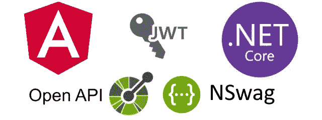
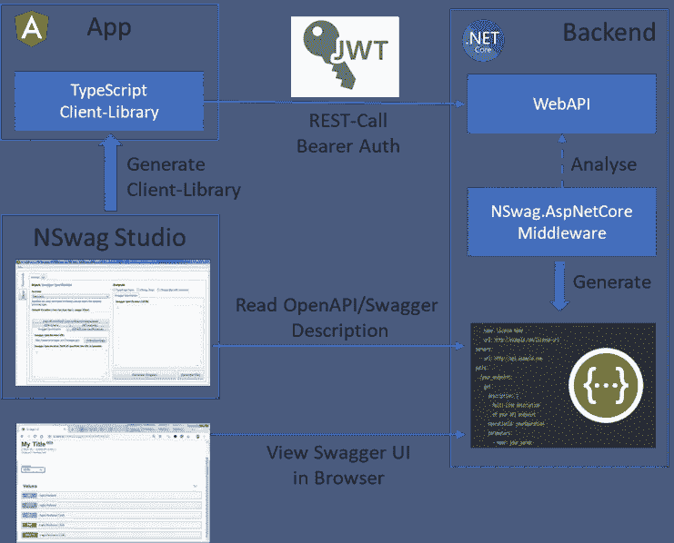
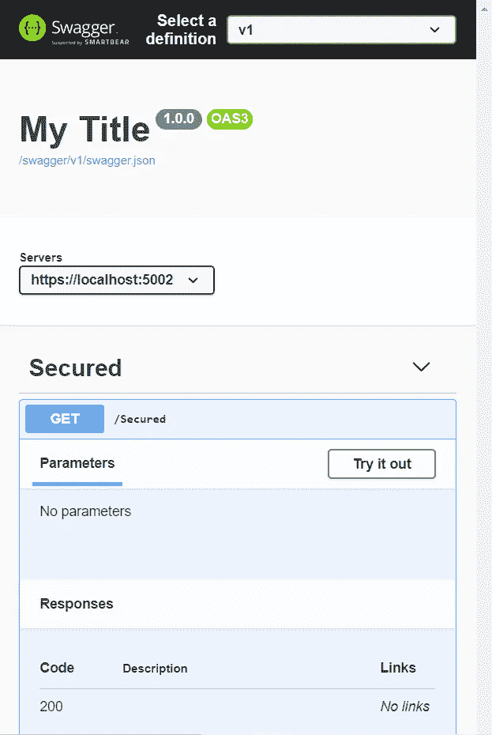
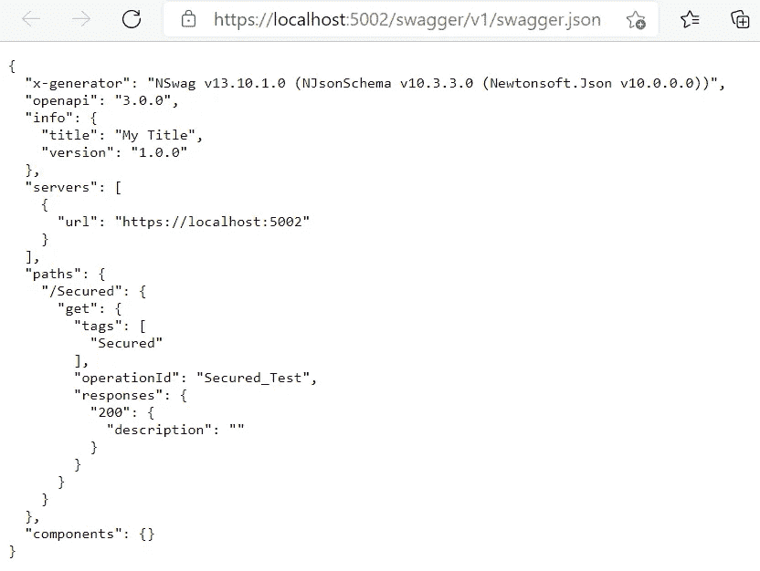
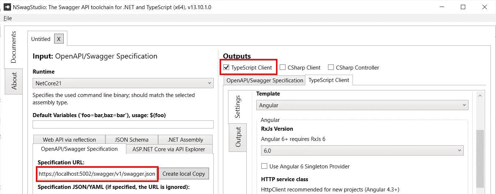
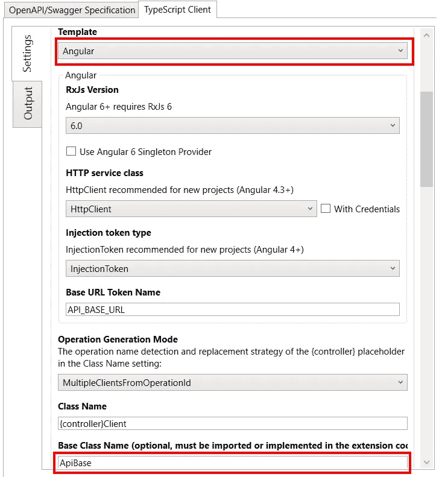
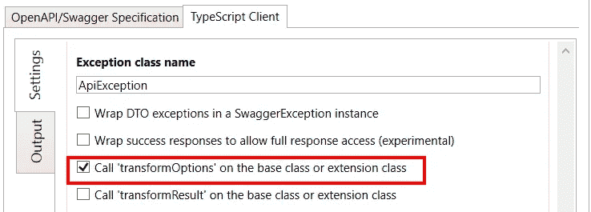
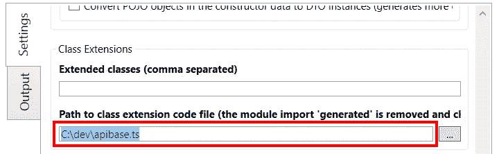
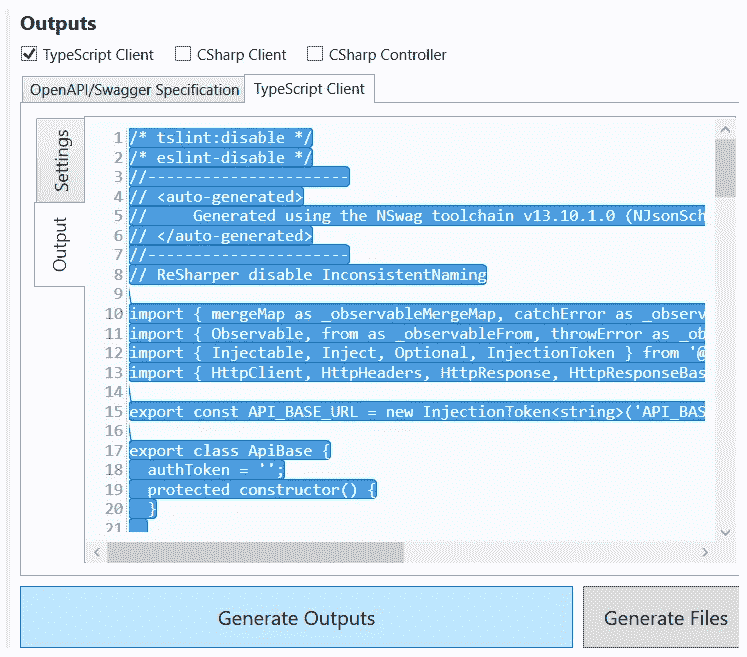
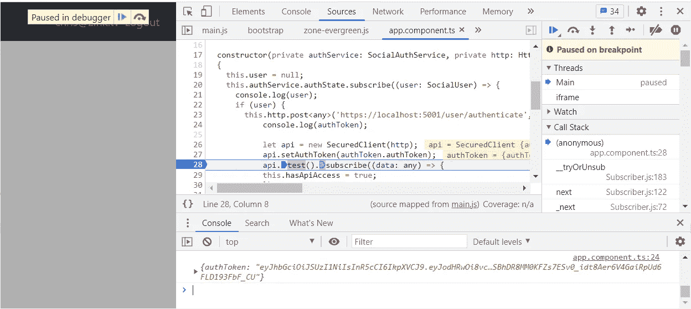

# 如何使用 NSwag 类型脚本通过 Angular 对 ASP.NET 核心 C# API (OpenAPI/Swagger)进行 JWT 认证

> 原文：<https://levelup.gitconnected.com/how-to-jwt-authenticate-with-angular-to-an-asp-net-4cfab5298d08>



本指南向您展示了如何使用 [NSwag](https://github.com/RicoSuter/NSwag) 自动将 OpenAPI 规范添加到 ASP.NET 核心 C# REST-API 中。它还为浏览器提供了 Swagger UI。您将使用 NSwag Studio 生成一个 TypeScript 客户端。然后将强类型客户端添加到 Angular 应用程序中。最后，您通过 JWT 不记名令牌向后端进行身份验证。

*工作流程及涉及组件:*



# 本指南的背景和结构

当我想创建这种工作流时，我发现描述显示了它的一部分。本指南将各部分汇集在一起。

本指南侧重于关键方面。我链接到其他文章以获得详细信息和工具的下载位置。我使用 [Visual Studio 社区](https://visualstudio.microsoft.com/en/vs/community/)进行 ASP.NET 核心 3.1 开发。

该指南使用了我上一篇文章[“如何在 Angular 中登录 Google 并使用基于 JWT 的。NET 核心 API 认证(RSA)"](/how-to-sign-in-with-google-in-angular-and-use-jwt-based-net-core-api-authentication-rsa-6635719fb86c) 。通过 ASP.NET 核心后端，你可以很容易地将它应用到你自己的 Angular 项目中。

## 内容

1.  在 ASP.NET 核心后端使用 NSwag
2.  用 NSwag Studio 生成 TypeScript 客户端
3.  从 Angular 认证和访问 API
4.  最后的想法和展望

# 1.在 ASP.NET 核心后端使用 NSwag

使用 Visual Studio 包管理器为 API 项目安装 NSwag 中间件:
`Install-Package NSwag.AspNetCore`

编辑 Startup.cs(第 18、34、35 行)并配置 NSwag 以创建 Swagger UI 和 OpenAPI 规范:

## 在浏览器中测试结果

启动 API 项目，并在浏览器中打开 Swagger UI。在我的项目中，这是 https://localhost:5002/swagger:



我的 API 有点无聊。因为它只用于测试身份验证，所以它没有参数，也没有返回值。

## 加载 OpenAPI 规范

您还可以访问 OpenAPI 规范(在下一步中，您将需要 NSwag Studio 的 URL):



*本指南本步骤和下一步骤的进一步阅读:* [使用 NSwag 为 ASP.NET 核心 3 API](https://elanderson.net/2019/12/using-nswag-to-generate-angular-client-for-an-asp-net-core-3-api/) *生成 Angular 客户端由* [*埃里克·安德森*](https://medium.com/u/1bb03e70026c?source=post_page-----4cfab5298d08--------------------------------)

# 2.用 NSwag Studio 生成 TypeScript 客户端

[下载 NSwag Studio](https://rsuter.com/Projects/NSwagStudio/installer.php) 并安装。

启动 NSwag Studio 并输入本指南上一步中的“规范 URL”(例如“[”https://localhost:5002/swagger/v1/swagger . JSON](https://localhost:5002/swagger/v1/swagger.json))。选择“TypeScript 客户端”作为“输出”:



> 确保上一步中的 API 项目正在运行。NSwag Studio 需要访问 OpenAPI 规范。

选择“Angular”模板并添加“ApiBase”作为“基类名称”:



选择“transformOptions ”,以便以后可以在基类中添加验证头:



创建 apibase.ts 文件(例如，位于“C:\dev\apibase.ts”)。该代码设置身份验证头。ApiBase 是 NSwag 将为您生成的文件的基类:

然后在 NSwag Studio 中将 apibase.ts 配置为扩展代码文件:



点击“生成输出”按钮，复制输出:



# 3.从 Angular 认证和访问 API

在 app 文件夹中创建 api.ts 文件，并粘贴本指南上一步的输出:

使用 app.component.ts 中生成的代码来访问 API。导入文件(第 4 行)并调用 API(第 24–26 行):

## 启动应用程序

```
c:\dev>ng serve
```

登录并使用调试器，并登录 chrome 浏览器，以验证后端的调用和验证工作正常:



# 4.最后的想法和展望

您使用 NSwag 为您的 API 自动创建了 OpenAPI/Swagger 规范。然后 NSwag Studio 创建了 TypeScript 客户端，你在 Angular 中使用了它。

该应用程序完全正常工作！但这只是一个示例应用程序，您必须清理代码并使其安全。使用角度和。NET 核心设计模式、错误处理等。在生产中使用。

您需要处理注销和超时。也许你想要不需要认证的 API 路径，等等。您可以使用 NSwag 命令行工具来自动化构建管道。

另见我的**后续故事** : [如何**部署。NET Core API 和 Angular App 作为微服务使用 **Ingress** 对 Kubernetes** 和使用 **Docker Desktop**](https://dev.to/christianzink/how-to-build-an-asp-net-core-kubernetes-microservices-architecture-with-angular-on-local-docker-desktop-using-ingress-395n) 对 local 进行开发

如果您有任何问题、想法或建议，请联系我。