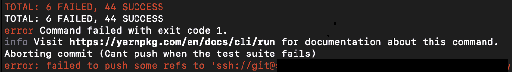

# 如何使用 Git-Hooks 防止构建管道中断

> 原文：<https://levelup.gitconnected.com/how-to-keep-your-build-pipeline-from-breaking-using-git-hooks-f30c1d7086cc>

照片由 [JJ 英](https://unsplash.com/@jjying?utm_source=unsplash&utm_medium=referral&utm_content=creditCopyText)在 [Unsplash](https://unsplash.com/?utm_source=unsplash&utm_medium=referral&utm_content=creditCopyText)

在持续集成和部署的世界中，理想的情况是软件可以在任何时候部署到生产环境中，供用户查看。

然而，如果你的管道破裂，这是不可能实现的。

管道破裂有许多不同的原因。这可能是在检查 Kubernetes Pod 准备情况的冒烟测试期间的超时。由于 REST 端点返回了错误的响应代码，用另一个团队的服务对您的服务进行端到端测试可能会失败。甚至有可能是有人故意中止了构建。然而，正如大多数开发人员所知，管道中断的主要原因是因为测试中断。

这可以通过采取一些预防措施来补救，例如进行测试驱动的开发，并在推送任何代码之前运行测试套件，以确保更改没有任何破坏性的副作用，并且所有测试都是绿色的…即使更改只是文本更改，您也不会知道。

不幸的是，我们都是人，我们认为我们知道什么时候我们的改变会导致任何事情发生。我们有时会在没有运行测试的情况下进行回购，或者更可能的是，我们忘记了运行测试。

输入 [Git-hooks](https://githooks.com/)

Git Hooks 是一个工具，允许您在 Git 工作流的各个步骤之前自动运行某些命令或任务。可用的选项有提交前、推送前、拉取前、提交后、拉取后等等。

我和我的团队使用这个工具来确保我们不会在推送之前，通过在本地运行我们的两个主要管道任务(运行测试套件和林挺代码)而意外地破坏构建。

它的工作方式是每个 Git 存储库都有一个. git/hooks 目录。默认情况下，此目录中有多个。您可以编写的各种钩子的示例文件。您只需要创建您的文件，添加正确的执行权限，并将您的文件以正确的名称放入这个目录。

下面是一个在 Django 项目中运行单元测试的预推送 git 挂钩示例:

Kotlin-Spring 服务运行测试和 lints 代码的另一个例子:

在您的测试套件运行和您的林挺运行并通过几分钟后，您的代码将被推送。

万一失败，您的代码将不会被推送，您将能够修复您的代码并重试。

如果你真的真的真的真的确定你的代码很好，不会破坏任何东西，因为你做了测试驱动开发，并且在提交前 1 分钟刚刚运行了测试套件，你总是可以做一个`**git push --no-verify**`，git 钩子将被跳过。

感谢阅读，并享受永远不再打破构建！